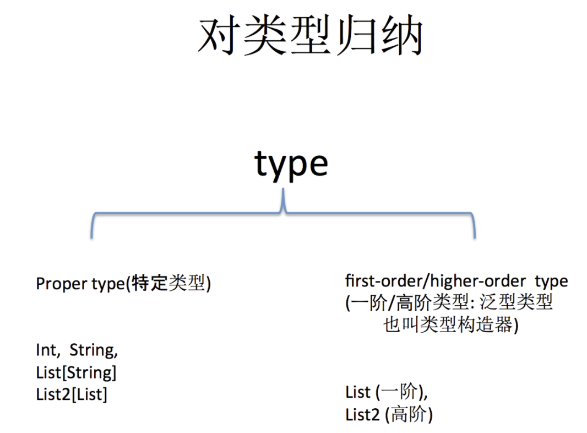

[原文](https://hongjiang.info/scala-type-and-class/)

> 在Java里，一直到jdk1.5之前，我们说一个对象的类型(`type`)，都与它的`class`是一一映射的，通过获取它们的`class`对象，比如 `String.class`, `int.class`, `obj.getClass()` 等，就可以判断它们的类型(`type`)是不是一致的。
>
> 而到了jdk1.5之后，因为引入了泛型的概念，类型系统变得复杂了，并且因为jvm选择了在运行时采用类型擦拭的做法(兼容性考虑)，类型已经不能单纯的用`class`来区分了，比如 `List<String>` 和 `List<Integer>` 的`class` 都是 `Class<List>`，然而两者类型(type)却是不同的。泛型类型的信息要通过反射的技巧来获取，同时java里增加了`Type`接口来表达更泛的类型，这样对于 `List<String>`这样由**类型构造器**和**类型参数**组成的类型，可以通过 `Type` 来描述；
>
> ```scala
> import scala.reflect.runtime.universe._
> 
> class A
> 
> scala> typeOf[A]
> res0: reflect.runtime.universe.Type = A
> ```
> 
>同样scala里获取类(`Class`)信息也很便捷，类似:
> 
>```scala
> scala> classOf[A]
> res1: Class[A] = class A
> ```
> 
>

**Type**: 类型

> 类型是所有编程语言都有的概念，一切数据都有类型。

**Class:**类

> 类更多存在于面向对象语言，非面向对象语言也有“结构体”等与之相似的概念；类是对数据的抽象，而类型则是对数据的”分类”，类型比类更“具体”，更“细”一些。

类型(`type`)比类(`class`)更”具体”，任何数据都有类型。类是面向对象系统里对同一类数据的抽象，在没有泛型之前，类型系统不存在高阶概念，直接与类一一映射，而泛型出现之后，就不在一一映射了。比如定义`class List[T] {}`, 可以有`List[Int]` 和 `List[String]`等具体类型，它们的类是同一个`List`，但类型则根据不同的构造参数类型而不同。

类型一致的对象它们的类也是一致的，

```java
scala> classOf[List[Int]] == classOf[List[String]]
res2: Boolean = true
```

反过来，类一致的，其类型不一定一致。

```java
scala> typeOf[List[Int]] == typeOf[List[String]]
res3: Boolean = false
```

---

[**classOf 和 getClass 方法的差异**](https://hongjiang.info/scala-type-system-classof-and-getclass/)

```scala
scala> class A
defined class A

scala> val a= new A
a: A = A@39ed3c8d

scala> a.getClass // 获得的是 Class[A] 的子类
res0: Class[_ <: A] = class A

scala> class
classManifest   classOf

scala> classOf[A] // 得到是正确的 Class[A]
res1: Class[A] = class A
```

----

[内部类和路径依赖、类型投影](https://hongjiang.info/scala-type-system-inner-type-and-type-projection/)

先回顾一下java的内部类

```scala
class Outter{

    public class Inner {}

    public void foo(Inner c){
        System.out.println(c);
    }
}

public class Main {
    public static void main(String[] args)throws Exception{
        Outter o1 = new Outter();
        Outter o2 = new Outter();
        Outter.Inner i1 = o1.new Inner();
        Outter.Inner i2 = o2.new Inner();
        o1.foo(i2);
    }
}
```

上面在Outter类内部定义了Inner类，在后边main里创建了两个Inner实例，注意创建内部类的时候

```scala
Outter.Inner i1 = o1.new Inner();scala
```

在用new创建内部类时，前边必须限定外部对象(内部类实例必须要访问到外部对象引用)：o1；如果是在 Outter类内部这个外部引用可以省略，它默认会用传递外部this引用。

```scala
class Outter {

    public class Inner{}

    public void test() {
        new Inner(); // 相当于this.new Inner(); 也可以写为Outter.this.new Inner();
    }
} 
```

同样的事情翻译为scala代码：

```scala
scala> class A { 
            class B; 
            def foo(b:B) = println(b) 
        }

scala> val a1 = new A
scala> val a2 = new A

scala> val b1 = new a1.B
scala> val b2 = new a2.B
```

在创建内部类的时候，语法上与java有所不同，不是 `outter.new Inner()` 而是 `new outter.Inner()`，看上去只是表象不同么？实际上，scala有很大差异，不同于java里 i1 和 i2 类型是相同的，否则 `o1.foo(i2)` 就不能执行了，scala里的 b1 和 b2 是不同的类型：

```scala
scala> a1.foo(b2)
<console>:12: error: type mismatch;
 found   : a2.B
 required: a1.B 
```

按照方法的提示: a1.foo方法接受的参数类型为：`a1.B`，而传入的b2 类型是 `a2.B`，两者不匹配。
验证一下：

```scala
scala> typeOf[a1.B] == typeOf[a2.B]
res2: Boolean = false
```

确实是不一样的类型，它跟外部的实例相关，那个foo方法参数类型B的写法是缩写，省略了路径

```scala
def foo(b: B) // 相当于 this.B 或 A.this.B
```

这里要引入一个概念：**路径依赖类型**；比如上面的 `A.this.B` 就是一个路径依赖类型，B 前面的路径 `A.this` 随着不同的实例而不同，比如 a1 和 a2 就是两个不同的路径，所以`a1.B` 与 `a2.B`也是不同的类型。路径依赖类型的路径完整写法：

那现在的问题来了，怎么让 a1.foo 方法可以接收 b2 参数 ？

```scala
class A { 
    class B; 
    def foo(b:B)  
    // 接收所有的B类型实例，而不只是foo的调用者实例(a1)路径下B类型的对象
         println(b) 
}
```

这又引出一个概念：**类型投影(type projection)**

在scala里，内部类型(排除定义在object内部的)，想要表达所有的外部类A实例路径下的B类型，即对 `a1.B` 和 `a2.B`及所有的 `an.B`类型找一个共同的父类型，这就是类型投影，用 `A#B`的形式表示。

```
      	A#B
        / \
       /   \
     a1.B  a2.B
```

这样，我们只要修改一下 foo 方法里的参数类型

```scala
def foo(b: A#B)
```

就可以调用 `a1.foo(b2)` 了。

我们回头来对比一下scala里的类型投影与java里的内部类型的概念，java里的内部类型在写法上是 Outter.Inner 它其实等同于scala里的投影类型 Outter#Inner，java里没有路径依赖类型的概念，比较简化。

---

Type 关键字

> 给类型起一个别名

```scala
scala> type S = String
defined type alias S
```

---

[this 别名 & 自身类型](https://hongjiang.info/scala-type-system-self-type/)

```scala
scala> class A {
     | self => // 定义 self 是 this 的别名
     | val x=3
     | def foo = self.x + this.x}
defined class A

scala> val a = new A
a: A = A@396f2724

scala> a
res5: A = A@396f2724

scala> a.foo
res6: Int = 6
```

给 this 起一个别名的用于在内外部类的时候会有用到

```scala
class Outer{
     | outer =>
     | val v1="here"
     | class Inner{println(outer.v1)}}
defined class Outer

scala> val a = new Outer
a: Outer = Outer@8aa3013

scala> val b = new a.Inner
here
b: a.Inner = Outer$Inner@6202f8bf
```

在没有申明别名的情况下，不允许使用 this 做this 的别名

```scala
class C {this =>} // 不允许使用 this 做this 的别名
<console>:1: error: not a legal formal parameter.
```

但当给 `this` 声明了类型的时候，就不是别名的用途了，这个时候表示**`自身类型`**，比如：

```scala
scala> trait X
defined trait X

scala> class C{this:X=>}
defined class C
```

`this:X =>` 要求C在实例化时或定义C的子类时，必须混入指定的`X`类型，这个`X`类型也可以指定为当前类型

```scala
scala> new C // 出错必须混入指定的类型 X
<console>:17: error: class C cannot be instantiated
```

```scala
scala> val x = new C with X
x: C with X = $anon$1@4fc1eee5

// 以下的情况也是可以的
scala> class D extends C with X
defined class D

scala> new D
res8: D = D@386d41cb
```

---

[类型的上界和下界](https://hongjiang.info/scala-upper-bounds-and-lower-bounds/)

在Java泛型里表示某个类型是Test类型的子类型，使用extends关键字：\

```java
<T extends Test>

//或用通配符的形式：
<? extends Test>
```

这种形式也叫`upper bounds`(中文为上限或上界)，同样的意思在scala的写法为：

```scala
[T <: Test]

//或用通配符:
[_ <: Test]
```

在`Java`泛型里表示某个类型是`Test`类型的父类型，使用`super`关键字：

```java
<T super Test>

//或用通配符的形式：
<? super Test>
```

这种形式也叫`lower bounds`(中文为下限或下界)，同样的意思在scala的写法为：

```scala
[T >: Test]

//或用通配符:
[_ >: Test]
```

[协变与逆变](https://hongjiang.info/scala-covariance-and-contravariance/)

如果对`A`及其子类型`B`，满足 `List[B]`也符合 `List[A]`的子类型，那么就称为**covariance(协变)**，如果 `List[A]`是 `List[B]`的子类型，即与原来的父子关系正相反，则称为**contravariance(逆变)**

协变：

```scala
 _____               _____________ 
|     |             |             |
|  A  |             |  List[ A ]  |
|_____|             |_____________|
   ^                       ^ 
   |                       | 
 _____               _____________ 
|     |             |             |
|  B  |             |  List[ B ]  |
|_____|             |_____________|  
```

逆变：

```scala
 _____               _____________ 
|     |             |             |
|  A  |             |  List[ B ]  |
|_____|             |_____________|
   ^                       ^ 
   |                       | 
 _____               _____________ 
|     |             |             |
|  B  |             |  List[ A ]  |
|_____|             |_____________|  
```

如果一个类型支持协变或逆变，则称这个类型为**variance(翻译为可变的或变型)**，否则称为**invariant(不可变的)**

在Java里，泛型类型都是invariant，比如 `List<String>` 并不是 `List<Object>` 的子类型。而scala支持，可以在定义类型时声明(用加号表示为协变，减号表示逆变)，如:

```scala
trait List[+T] // 在类型定义时(declaration-site)声明为协变 
```

---

[函数类型](https://hongjiang.info/scala-function-type/)

Scala 的函数最多能有22个参数，函数也是一种类型，可以完成赋值，传参，返回参数等。

---

[higher-kind-list](https://hongjiang.info/scala-higher-kinded-type/)

首先我们从最基本的泛型来看：


现在我们对上面泛型中的类型参数再进一步，也是个泛型会如何呢？

可以看到，java中不支持类型参数也是泛型类型的情况，而scala支持。这是一个很重要的区别，scala在类型系统上要比java强大。我们现在简单对类型归纳一下，可以分为两类:

> ```
> 1）特定类型(proper type)
>     比如 Int, String, List[Int], List2[List] 等类型
> 
> 2) 泛型类型：用于构造特定类型(proper type)的类型
>     比如 List, List2 等类型
> ```



现在我们来看 **higher-kinded-type** ，先要理解 **kind** 是什么意思，如果说类型(type)是对数据的抽象，比如1,2,3等抽象为Int类型，”hello”,”wolrd”等可抽象为String类型。那么kind则是对类型的抽象。

*熟知类型和类的区别，在本篇另外一个段中*


**proper type 用 * 号表示：**


泛型类型(用于构造proper type的类型)则可以用下面的方式表示，比如 Set[T], List[T].

> ```
> Set 和 List 都是通过传递一个特定类型(proper type)然后构造出一个特定类型(proper type)，用kind表示为：* -> *
> ```
>
> 再如 Pair[K,V] 泛型类型
>
> ```
> Pair 通过传递2个特定类型(proper type)然后构造出一个特定类型(proper type), 用kind表示为：
> (*,*) -> *
> ```


如果泛型类型中的参数类型又是一个泛型，比如前边的 `List2`

> ```
> List2 通过传递一个泛型类型(类型构造器)，然后构造出一个特定类型，用kind表示为：
> (*->*) -> *
> ```


这种类型参数也是泛型类型的类型，称之为高阶(higher)kind，是不是很像高阶函数？借用这张图做个汇总。


```scala
List    // type constructor, takes one parameter
List[A] // type, produced using a type parameter

// n Scala we declare type constructors using underscores. 
// Declare F using underscores:
def myMethod[F[_]] = {
  // Reference F without underscores:
  val functor = Functor.apply[F]
  // ...
}
```

在`scala` 中我们有这样的语法，在使用的时候，需要

`import scala.language.higherKinds`

---

[复合类型与with 关键字](https://hongjiang.info/scala-type-system-compund-type/)

```scala
class A extends B with C with D with E 
```

应做类似如下形式解读：

```scala
class A extends (B with C with D with E)
```

