集合宏观结构

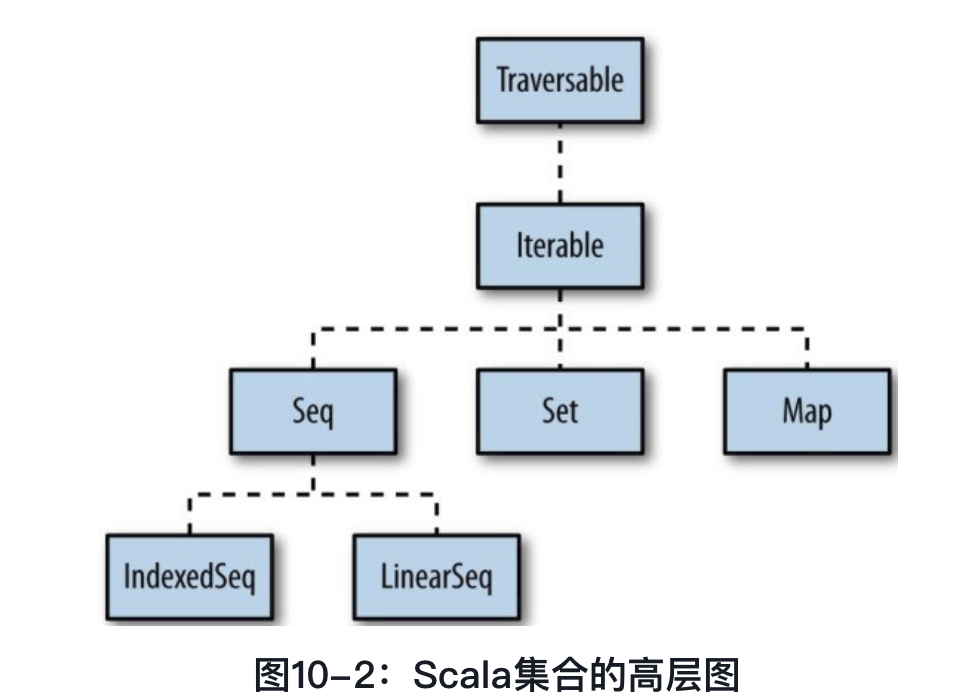

> ``Traversable``: 特质遍历整个集合
>
> ``Iterable``:  定义一个迭代器，可以一次性循环一个集合元素的方式。

**Seq（序列）**

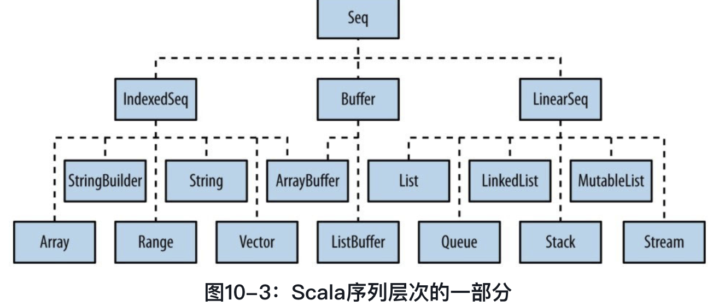


> 序列分为两部分
>
> * 索引序列(``IndexdSeq``)
>
>   可以按照索引随机读取，读取效率非常高
>
> * 线性序列(链表``LinearSeq``)
>
>   集合可以很方便的被分为头尾部分，并且使用head， tail 等方法很常见。

**Map 类**

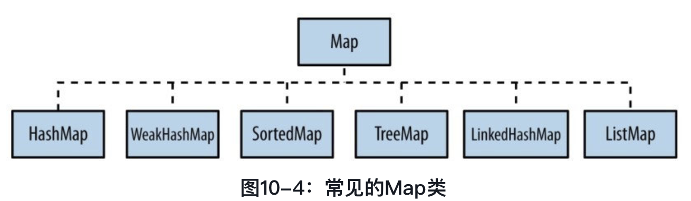

**Set**

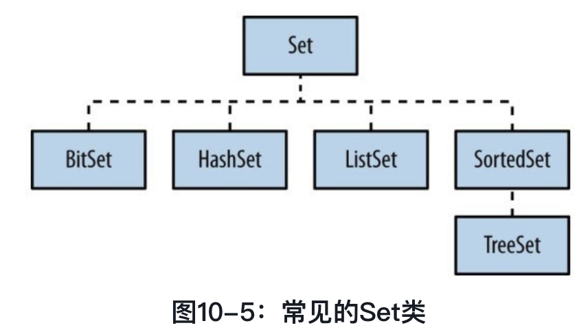

---

**选择一个集合**

> 当选择一个集合去解决特定的问题，这里主要有3中集合类供选择

* Sequence
* Map
* Set

> ``Sequence`` 是一种线程元素的集合，可能是索引或者线性(链表)的
>
> ``Map``: 是包含键值对的集合
>
> ·``Set``: 包含无重复元素的集合

**选择Sequence**

> 当选择``Sequence`` 的时候，主要考虑2点
>
> * 这个序列是否应该被索引，允许快速访问，或者是否应该使用链表实现
> * 想要可变的还是不可变的
>
> ``scala`` 推荐通用的集合

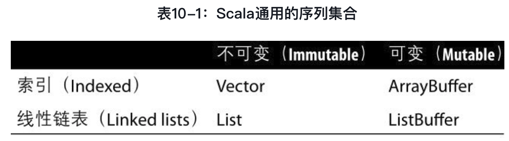

如果想要一个不可变的索引集合，那么一般会使用Vector；如果想要可变索引集合，就用ArrayBuffer

除此之外，还可以使用的选择有

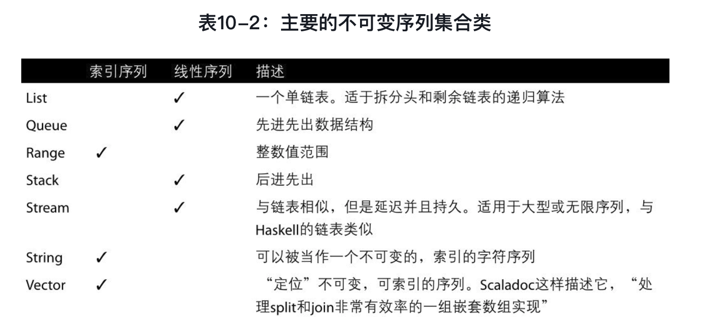

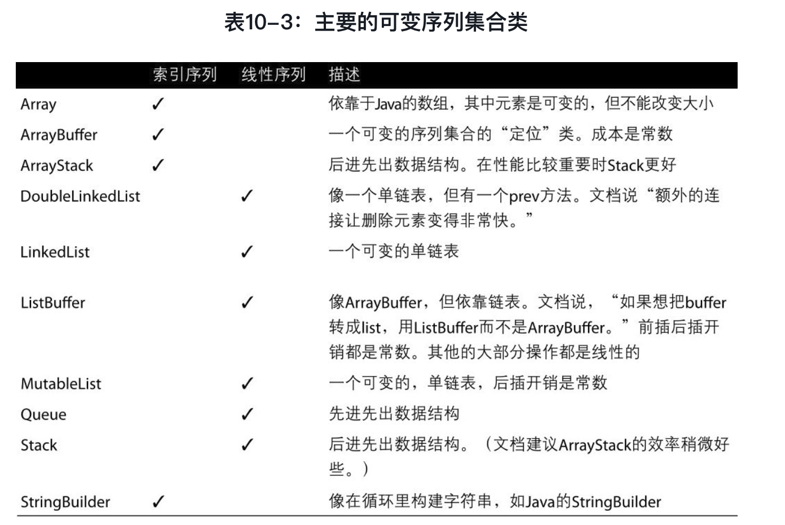

当定义一个Iterable 或者Traversable的时候相当于是使用Java 中的Collection类。

---

**Map**

> Map 比sequence 简单，有基本的可变和不可变类型

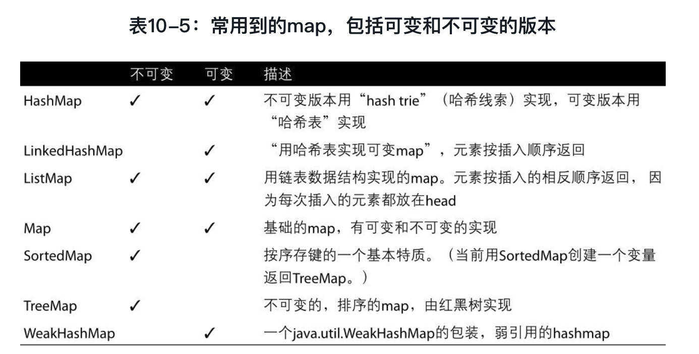

**Set**

> 用set和用map很相近。有基本的可变和不可变的set，返回按键排序的SortedSet，按插入顺序存储的LinkedHashSet以及一些其他特殊用途的set

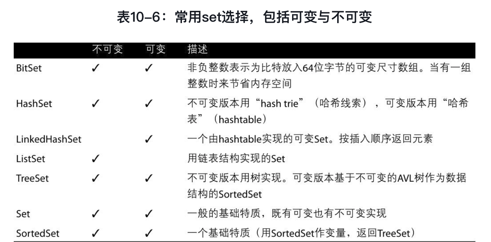

---

上面的集合中提供了大量的方法：

* 过滤方法

> collect, diff, distinct, drop, dropWhile, filter, filterNot,find, foldLeft, foldRight, head, headOption, init, intersect, last, lastOption, reduceLeft,reduceRight, remove, slice, tail, take, takeWhile和union

* 转换方法

> 转换方法最少有一个集合作为输入然后通过提供的一个算法创建一个新的集合作为输出
>
> +, ++, -, --, diff, distinct, collect, flatMap, map, reverse, sortWith, takeWhile, zip和zipWithIndex

* 分组方法

> 根据一个已有的集合创建多个分组。这些方法包括groupBy, partition, sliding,span, splitAt和unzip。

* 可变的集合方法

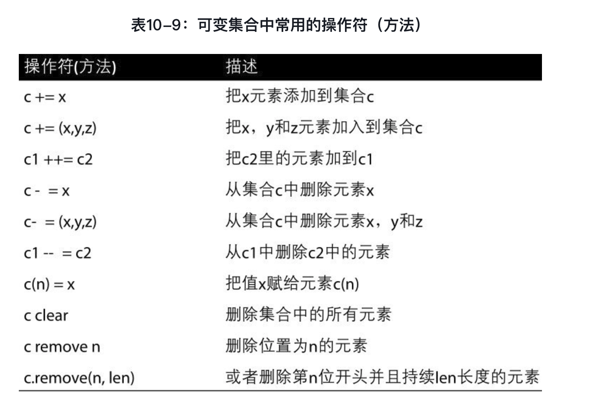

* 不可变集合操作符

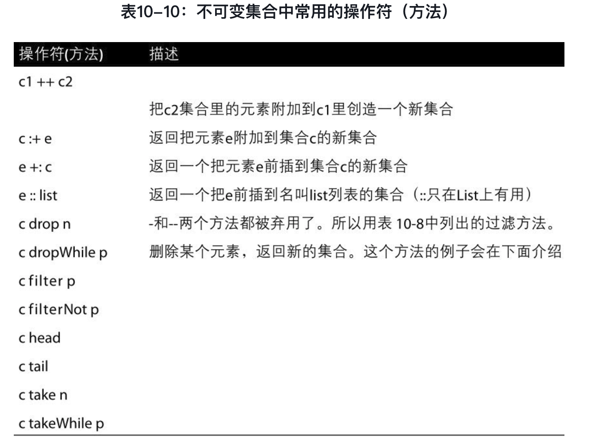

* 可变和不可变map中常用的方法

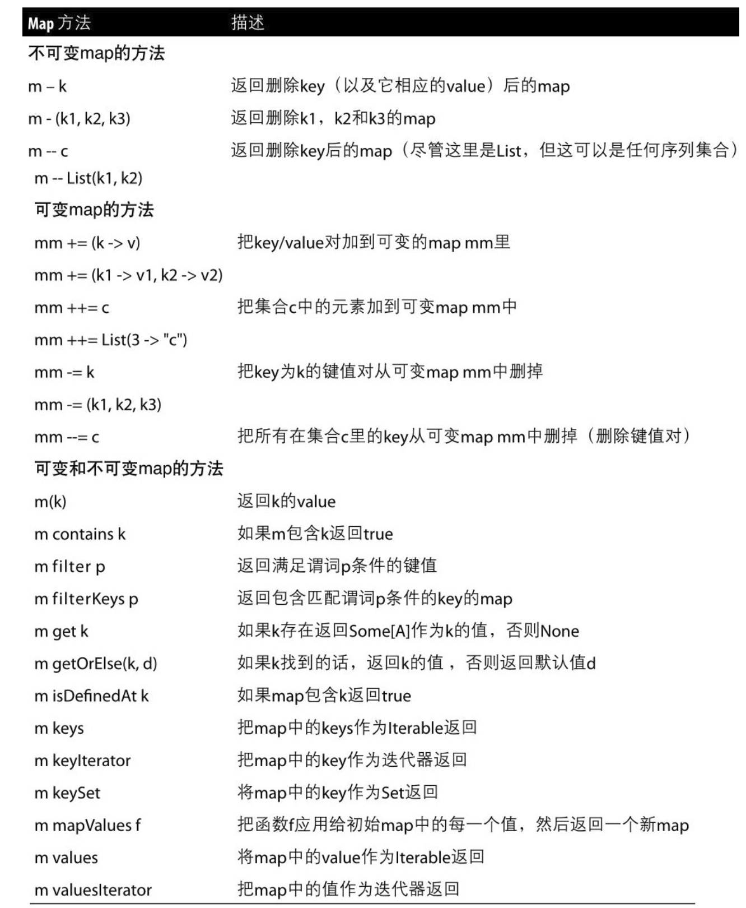

---

**在Scala应用里想要一个快速的，通用的，不可变的序列集合类型。首选Vector**

> Vector类在Scala 2.8中被引入，现在是通用的不可变数据结构的第一选择。
>
> 如果想用一个线性的不可变序列集合那么就用List
>
> Vector是一个解决了在列表里随机访问效率低下的集合类型（Scala 2.8引入）。Vector可以在固定的时间内高效地访问列表中的任意元素。因为Vector在快速随机选取和快速随机更新方面做了很好的平衡，它们现在是不可变索引序列的默认实现。
>
> 《Scala In Depth》中有这样一条规则，“当有疑问时，用Vector”他写到，“在Scala集合类库中Vector是最灵活高效的集合。”

**把ArrayBuffer作为可变序列的第一选择**

> ArrayBuffer类被推荐为可变序列集合的通用类。（ArrayBuffer是一个索引序列集合，如果想用一个可变的线性序列集合，那么就用ListBuffer，

**想要（或需要）在Scala程序中使用一个迭代器。**

> 尽管使用迭代器的hasNext()和next()方法来遍历Java中的集合是很常见的方式，但它们在Scala中并不常用。因为Scala集合有像map和foreach这种让你更精简的实现算法。

**用for/yield实现集合间的转换**

> 把现有集合中的元素通过一种算法转换为一个新的集合。可以将yield 理解为生成器，返回 的元素是生成的结果，如果计算生成的结果逻辑比较复杂，那么可以将这些计算 逻辑放到yield 后面的{} 代码块中。

```scala
val fruits = Vector("apple","banan","lime")
val res = for (i <- 0 until fruits.length) yield (i, fruits(i))
```

> 如果刚开始接触for/yield结构，可以认为它另外还有一个存储区或者临时存放区。由于原始集合的每个元素都会被yield和算法处理，然后放到存储区。接着，当for循环遍历完整个集合时，存储区的所有元素会被表达式返回（生成）。

> 似乎map 操作和 for/yield 操作能完成相互替换的功能。

**展平列表的列表与扁平化问题**

> 使用flatten方法把一个包含列表的列表转变为一个单列表。flatten是名副其实地把包含列表的列表展平为一个结果列表。虽然这里用了“列表”这个词，但flatten方法不仅限于列表，还可以用于其他序列（Array、ArrayBuffer、Vector等）

**map, flatten和flatMap的组合**

> 当在map后需要使用flatten时使用flatMap，具体情况如下：
>
> * 在使用map方法（或者for/yield表达式）根据一个已有的集合创建一个新的集合。
> * 结果集合是一个列表的列表。
> * 可以在map（或者一个for/yield表达式）后立刻调用flatten。
>
> ```scala
> def toInt(it: String):Option[Int] = {
>   try{
>     Some(Integer.parseInt(it.trim))
>   } catch {
>     case e: Exception => None
>   }
> }
> 
> scala> val bag = List("1","3","3","obe","rdsfsafsa")
> bag: List[String] = List(1, 3, 3, obe, rdsfsafsa)
> 
> 
> scala> bag.map(toInt)
> res13: List[Option[Int]] = List(Some(1), Some(3), Some(3), None, None)
> 
> 
> scala> bag.flatMap(toInt).sum
> res14: Int = 7
> 
> flatMap == Map flat 操作
> flatten 操作会将Some[Int] => Int, 当时None 的时候回将其忽略，不返回。
> ```

---

**ReduceLeft / FoldLeft**

> FoldLeft: 需要给一个初值，作为计算的第一个输入，而ReduceLeft 不需要传入初值，集合中的第一个值作为初值。

---

**列表**

> Scala 和 Java 的列表(ArrayList)是除了名字完全不同的类型，Scala的List类是不可变的，大小及其中元素都不能修改。它由链表实现，包含常用的head, tail和isEmpty方法。因此，大多数在List上的操作都会涉及递归算法，将列表切分为头部和尾部。
>
> **Scala 2.10. x版本推荐使用Vector类作为不可变、有序的序列类，ArrayBuffer作为可变、有序的序列**

Java ArrayList转换为Scala list

```scala
scala> val list =  new java.util.ArrayList[Int]()
list: java.util.ArrayList[Int] = []

scala> list.add(1);list.add(2)
res16: Boolean = true

scala> list.foreach(println)
<console>:13: error: value foreach is not a member of java.util.ArrayList[Int]
       list.foreach(println)
            ^

scala> import scala.collection.JavaConver
JavaConversions   JavaConverters

scala> import scala.collection.JavaConversions
import scala.collection.JavaConversions

scala> import scala.collection.JavaConversions._
import scala.collection.JavaConversions._

scala> list.foreach(println)
1
2
```

**注意** ： 任何以：号结尾的Scala方法，都是从右向左执行。这意味着方法由右操作符调用

*  **Stream 和 List**

Stream和List很像，不同之处在于它的元素是惰性计算的，

