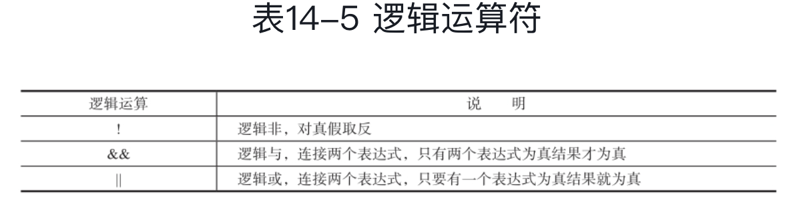

* 位置变量

> `terminal` 传递给脚本的变量可以通过 `$0`： 脚本本身， `S1`： 传给的第一个参数..获取到
>
> 当参数超过10个的时候需要 `${12}` 大于号括起来
>
> `$@ 或者 $*` 表示脚本的所有参数个数。
>
> ```shell
> #! /bin/bash
> echo "this is scrip's name:$0"
> echo "this is first param :$1"
> echo "this is sencond :$2"
> echo "how many param send: $#"
> echo "all param $*"
> 
> this is scrip's name:./position.sh
> this is first param :1
> this is sencond :2
> how many param send: 2
> all param 1 2
> ```

* 脚本/命令返回值

> 当执行一个脚本/命令的时候，会返回一个结果，表示这个脚本/命令是否执行成功
>
> ```shell
> ~/Ifoods/devOps/shell » echo $?                                                                                                                                                               
> 0
> ```
>
> `$?` 始终表示上一个命令的执行结果，返回0，表示执行成功，否则执行失败。
>
> ```shel
> ~/Ifoods/devOps/shell » ifconf                                                                                                                                                               
> zsh: command not found: ifconf
> ~/Ifoods/devOps/shell » echo $?                                                                                                                     
> 127
> ```

* 数组

> shell 是弱类型语言，所以可以放多重不同的类型的元素，但是shell 数组值支持一维的数组。
>
> ```shell
> name=(1,2,3,"a")
> ~/Ifoods/devOps/shell » echo $name                                                                                                                                                           
> 1 2 3 4
> ~/Ifoods/devOps/shell » name[2]=9                                                                                                                                                            
> ~/Ifoods/devOps/shell » echo $name
> ```
>
> 取数
>
> ```she
> ~/Ifoods/devOps/shell » echo $name[0]                                                                                                                                                         
> ~/Ifoods/devOps/shell » echo $name[1]                                                                 
> 1
> ~/Ifoods/devOps/shell » echo $name[2]                                                                 
> 9
> ~/Ifoods/devOps/shell » echo $name[4]
> 4
> 取出所有的数
> ~/Ifoods/devOps/shell » echo $name[*] # 输出一整个字符串或者
> ~/Ifoods/devOps/shell » echo $name[@] # 输出以空格隔开的元素值
> 1 9 3 4
> 
> 获取数组长度
> ~/Ifoods/devOps/shell » echo ${#name[@]}
> 4
> 
> 数组拼接
> ~/Ifoods/devOps/shell » con=($name[@] $name[@])
> ~/Ifoods/devOps/shell » echo $con[@]
> 1 9 3 4 1 9 3 4
> ```
>
> 下标是从0开始的。

* 只读变量

> ```shell
> readonly r=0
> 
> ~/Ifoods/devOps/shell » readonly a=9
> ~/Ifoods/devOps/shell » a=foo
> zsh: read-only variable: a
> ```

* 变量作用域

> `Shell` 默认以进程`ID` 作为一个命名空间，所以即便是在 `shell` 的函数中定义了变量，该变量也会是在全局生效
>
> 使用 `local` 修饰符号，可以将在函数内部定义的变量只在函数内部生效。

* 转义

> `\`
>
> ```shell
> ~/Ifoods/devOps/shell » echo \$con
> $con
> 
> ~/Ifoods/devOps/shell » echo 2*3
> zsh: no matches found: 2*3
> 
> ~/Ifoods/devOps/shell » echo 2\*3
> 2*3
> ```

* 引用

> * 双引号: 部分/弱引用，可以引用除 `$、反引号 转义符`
> * 单引号: 全/强引用，可以用用全部字符， 
> * 反引号： 将内容解释为系统命令
> * 转义符
>
> ```shell
> 双引号引用
> ~/Ifoods/devOps/shell » var3=100
> ~/Ifoods/devOps/shell » echo $var3
> 100 这里返回了100，而不是 $100
> 
> 单引号
> ~/Ifoods/devOps/shell » echo '$var3'
> $var3
> 
> 单引号中出现了单引号
> ~/Ifoods/devOps/shell » echo 'It's your name'                                                                                                                                                 xuxliu@CNxuxliu-2
> \无法识别结束
> 
> ~/Ifoods/devOps/shell » echo 'It'\''s your name'
> It's your name
> 
> ~/Ifoods/devOps/shell » echo "curent path $PWD"
> curent path /Users/xuxliu/Ifoods/devOps/shell
> 
> ~/Ifoods/devOps/shell » echo 'curent path $PWD'
> curent path $PWD
> ```

* 命令替换

> 命令替换就是将命令的输出作为值赋给某个变量
>
> ```shell
> ~/Ifoods/devOps/shell » path=`date`
> ~/Ifoods/devOps/shell » echo $path
> Thu Aug  6 00:06:18 CST 2020
> 
> ~/Ifoods/devOps/shell » path=`pwd`
> ~/Ifoods/devOps/shell » echo $path
> /Users/xuxliu/Ifoods/devOps/shell
> ```
>
> 使用 $(命令) 也是可以的
>
> ```shell
> ~/Ifoods » LS=$(ls)
> ~/Ifoods » echo "$LS"                                                                                                                                                                         
> BUCode.png
> God-Of-BigData
> Java
> ML
> MyProfile
> Spark_Delta_Lake
> TimeCoder.jpeg
> confusiongMetrix.ipynb
> devOps
> scala
> ```
>
> 使用反引号和$() 
>
> 是等价的，二者可以进行相互替换，使用 $()
>
> 更加的清晰，而且使用$()
>
> 支持嵌套
>
> 但是 $()
>
> 值在Bash shell 中可以使用

* 运算符号

> 运算符号有：
>
> * +
> * -
> * *
> * / 除
> * % 余
> * ** 幂 2 ** 3 = 8
> * +=
> * -=
> * *=
> * /=
> * %=
> * ++x
> * x++
> * --x
> * x--
>
> ```shell
> ~/Ifoods » a=10
> /Ifoods » let "c=(++a)" 这里需要有双引号引用，否则失败
> ~/Ifoods » echo ${c}
> 11
> ~/Ifoods » echo ${a} 执行let "c=(++a)"的时候，a先自增，然后将a复制给c，所以a和c都是11
> 11
> 如果是：
> 
> ~/Ifoods » let "c=(a++)"
> ~/Ifoods » echo ${a}
> 12
> ~/Ifoods » echo ${c} c=(a++) 将a赋值给c，然后a在自增，所以c为11，而a变为12
> 11
> ```

* **使用 $[] 做运算**

> ```shell
> ~/Ifoods » echo $[1+1]
> 2
> ```
>
> 也可以使用 `expr 2 * 2` 这里注意需要使用空格隔开

* 算术表达式

> `$((算术表达式))`
>
> ```shell
> ~/Ifoods » i=2
> ~/Ifoods » echo $((2*i+1))
> 5
> ```

* 特殊字符

> * 通配符: *： 任意长度的字符串(点和斜号除外)。？: 匹配任意单个字符、[abc]： 匹配a或b或c，[a-z]匹配a到z任意一个字符。

* 测试操作符号

> 就是根据某个结果执行不同的操作，一般有2中方式
>
> * test expression
> * [ expression ] 注意前后都需要有空格
>
> ```shell
> ~ » test -e /Users/xuxliu/Ifoods # -e 测试文件或者目录存在
> ~ » echo $?
> 0 # 返回0说明测试成功
> 
> [ -e /Users/xuxliu/Ifoods ]
> ~ » echo $?
> 0
> ```
>
> 一些文件测试参数
>
> 
>
> 一个列子测试测试文件的读写可执行（这里注意逻辑非的使用，和后面的参数空格隔开）
>
> ```shell
> #! /bin/bash
> 
> read -p "file do you want to test ? " filename
> 
> if [ ! -e "$filename" ];then
>    echo "The file does not exist"
>    exit 1
> fi
> 
> if [ -r "$filename" ];then
>     echo "the file is not readable."
> fi
> 
> if [ -w "$filename" ];then
>     echo "$filename is writable"
> fi
> 
> if [ -x "$filename" ];then
>     echo "$filename is executable"
> fi
> ```
>
> * 字符串比较
>
> 
>
> ```shell
> ~/Ifoods/devOps/shell » str1=""
> ~/Ifoods/devOps/shell » test -z "$str1"
> ~/Ifoods/devOps/shell » echo $?
> 0
> ```
>
> 在书中提到在使用 < 和 > 的时候，需要转义，但是测试的时候，发现转义反倒不能正常计算了。
>
> * 整数比较
>
> 
>
> * 逻辑测试
>
> 
>
> 注意上式子中 -a 和 -o 的左右都是表达式
>
> 
>
> 使用逻辑与和非可以连等比较多个表达式子

* **判断**

> ```shell
> if expression; then
> 	command
> fi
> ```
>
> 一个列子
>
> ```shell
> #!/bin/bash
> 
> echo -n "please input a score: "
> 
> read SCORE
> 
> if [ "$SCORE" -lt 60 ]; then
> 	echo "C"
> fi
> 
> if [ "$SCORE" -lt 80 -a "$SCORE" -ge 60 ];then
> 	echo "B"
> fi
> 
> if [ "$SCORE" -ge 80 ];then
> 	echo "A"
> fi
> ```
>
> * **if else**
>
> ```shell
> if expression; then
> 	command
> else
> 	command
> fi
> ```
>
> 列子
>
> ```shell
> #!/bin/bash
> file=/Users/xuxliu/Ifoods/devOps/shell/position.sh
> if [ -e $file ];then
> 	echo "$file exist"
> else
> 	echo "$file not exist"
> fi
> ```
>
> * **if/elif/else**
>
> ```shell
> if expression1;then
> 	command
> else
> 	if expression; then
> 		command2
> 	else
> 		command3
> 	fi
> fi
> ```
>
> 以上的语法是正确没有问题的，但是在较深的且套 **if / else** 之后，可读性就会下降很多，所以使用
>
> ```shell
> if expression1; then
> 	command1
> elif expression2; then
> 	command2
> elif expression3; then
> ...
> fi
> ```
>
> * **case**
>
> ```shell
> case VAR in
> var1) command1;;
> var2) command2;;
> var3) command3;;
> ...
> 
> *) command;; # 以上没有匹配上最终指向的默认命令
> esac
> ```
>
> **匹配常量的例子**
>
> ```shell
> #!/bin/bash
> 
> os=$(uname -s)
> echo $os
> 
> case "$os" in
> FreeBSD) echo "This is Freebsd";;
> CYGMWIN_NT-5.1) echo "this is Cygwin";;
> SunOS)  echo "this is Mac OSX";;
> Darwin) echo "this is Darwin";;
> *) echo "this is nothing";;
> 
> esac
> ```
>
> **匹配正则表达式**
>
> ```shell
> #!/bin/bash
> 
> read -p "Given me a word: " input
> echo -en "You gave me some "
> 
> case $input in
> *[[:lower:]]*) echo -en "lowercase";;
> *[[:upper:]]*) echo -en "uppercase";;
> *[[:digit:]]*) echo -en "numerical";;
> *) echo "unknown input.";;
> esac
> ```
>
> 

