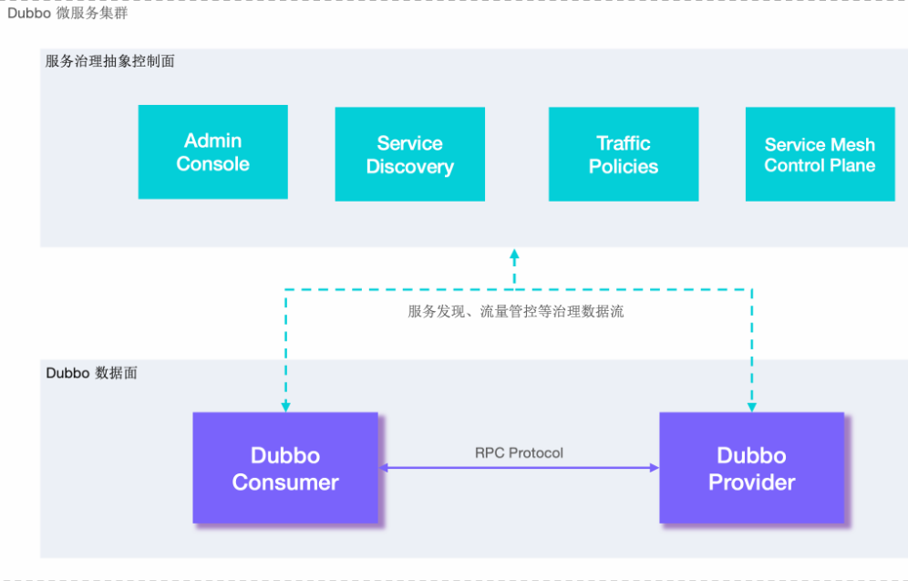
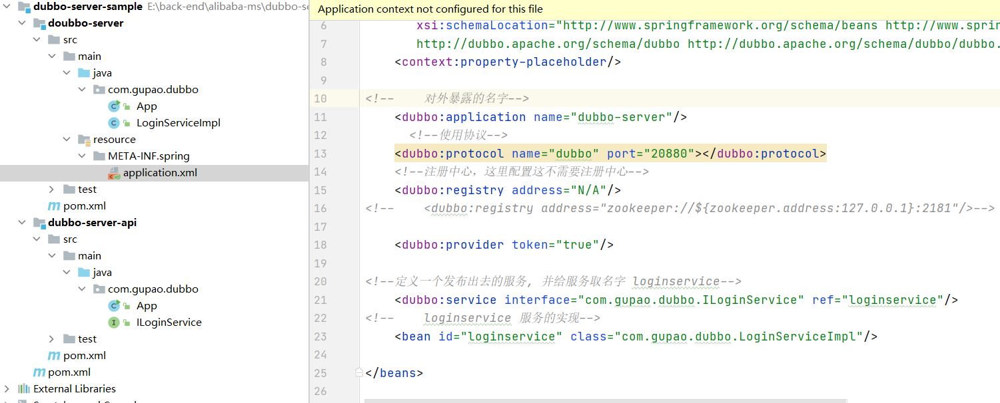
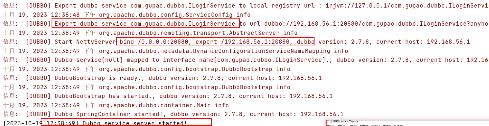
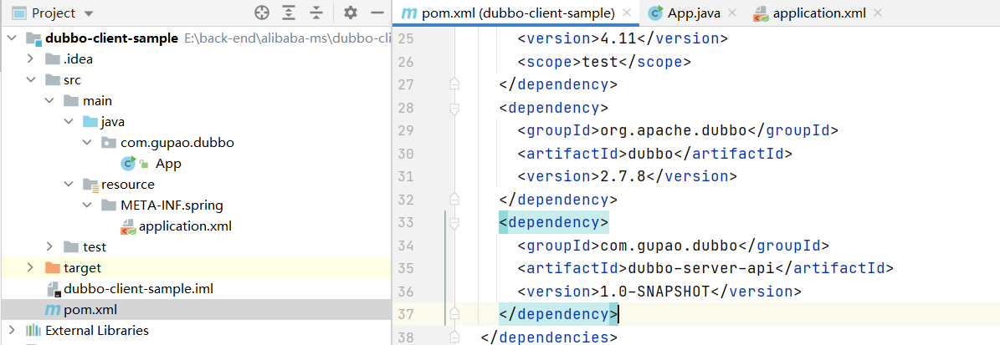
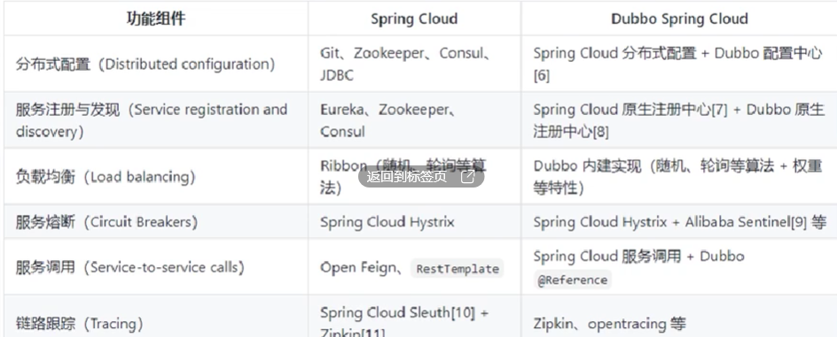

### 为什么用Dubbo

服务治理框架，解决特定问题：

1. 服务链路的监控，监控服务调用链路，服务的吞吐量
2. 服务注册和发现
3. 服务之间通信
4. 服务通信过程中的容错
5. 服务的负载均衡

很多企业也有自己内部的组件，如阿里内部的`HSF`,  京东的`JSF`等，实现企业内部的定制化组件。

SpringCloudAlibaba 是阿里开源的生态，基于SpringCloud基础上提供的微服务治理方案，主要的组件有：Nacos、Sentinel、RabbitMQ、Seata、Dubbo-RPC

---

#### 架构



#### 了解Dubbo

新建dubbo-server，简单对外提供一个服务，它的工程项目如下：



此时是没有集成spring 的，启动的时候直接使用dubbo 的Main方法

```java
public class App 
{
    public static void main( String[] args )
    {
        System.out.println( "Hello World!" );
        Main.main(args);
    }
}
```

都是一些最最简单的样例代码

```java
public interface ILoginService {
    String login(String userName, String password);
}

public class LoginServiceImpl implements ILoginService{
    @Override
    public String login(String userName, String password) {
        System.out.println("start 业务逻辑userName: " + userName + " password:" + password);
        System.out.println("----------------");
        System.out.println("----------------");
        System.out.println("end 业务逻辑userName: " + userName + " password:" + password);
        return "";
    }
}
```

在启动日志也可以看到一些服务暴露的信息



上面日志截图看到，采用dubbo协议发布出去一个服务ILoginService，这个服务所在的ip:port.

调用方侧如何调用的呢？在调用方侧的工程代码中需要将`api` 的依赖导入



注意在`API`的模块中需要执行下`mvn:install`  否则在`client` 侧是拿不到这个包的。client 侧的`App` 中执行远程调用`login` 方法

```java
public static void main(String[] args) {
        // 当前应用配置
        ApplicationConfig application = new ApplicationConfig();
        application.setName("dongshidaddy-consumer");
        application.setOwner("dongshidaddy");

        // 连接注册中心配置
        RegistryConfig registry = new RegistryConfig();
//        registry.setAddress("zookeeper://192.168.10.119:2181");
        registry.setAddress("N/A");
        RpcContext.getContext().setAttachment("token", "12345678");

        // 注意：ReferenceConfig为重对象，内部封装了与注册中心的连接，以及与服务提供方的连接

        ILoginService loginService;
        // 引用远程服务
        ReferenceConfig<ILoginService> reference = new ReferenceConfig<ILoginService>(); // 此实例很重，封装了与注册中心的连接以及与提供者的连接，请自行缓存，否则可能造成内存和连接泄漏
        reference.setApplication(application);
        reference.setRegistry(registry); // 多个注册中心可以用setRegistries()
        reference.setInterface(ILoginService.class);
//        dubbo://192.168.56.1:20880/com.gupao.dubbo.ILoginService
        reference.setUrl("dubbo://192.168.56.1:20880");

        // 和本地bean一样使用xxxService
        ILoginService myProviderTokenService = reference.get(); // 注意：此代理对象内部封装了所有通讯细节，对象较重，请缓存复用
        String s = myProviderTokenService.login("hello", "dubbo1");
        System.out.println(s);
    }
```

注意这里的调用方式是直接远程调用的方式，没有使用注册中心，`dubbo` 的不经过注册中心直接远程调用方式有`token` 的保护机制

在服务提供端的配置

```xml
<dubbo:service interface="com.gupao.dubbo.ILoginService" ref="loginservice" token="12345678"/>
```

这里写死`token` ，可以配置为`token='true'` 这由每次都会生成不同的token。

#### 使用注册中心

Dubbo 可以支持的注册中心

* consul
* zookeeper
* eureka
* etcd
* nacos

记住主流的都可以支持，使用起来也很简单，例如要使用`zk`, 需要在配置文件中修改

```xml
服务提供者/消费者都增加配置
<dubbo:registry address="zookeeper://${zookeeper.address:127.0.0.1}:2181"/ timeout="10000">
```

`pom` 中增加依赖

```xml
<dependency>
      <groupId>org.apache.dubbo</groupId>
      <artifactId>dubbo-dependencies-zookeeper</artifactId>
      <version>2.7.8</version>
</dependency>
```

在注册中心中会存储和接口相关的所有信息，这些信息的key就是服务接口`interface="com.gupao.dubbo.ILoginService"`，按照这个key获取到接口的所有信息，然后就可以进行远程调用了。

#### Dubbo Spring Cloud

本质上SpringCloud 是一个微服务治理标准，Dubbo去实现这些标准，包括SpringCloudAlibaba，所以Dubbo 是和Spring 的全家桶都可以很好的集成的。

Dubbo 不仅仅是做RPC




#### Dubbo 生态


#### Dubbo 多注册中心

可以支持将一些服务注册到A注册中心，另外一些服务注册到B服务注册中心

#### Dubbo 多协议支持


