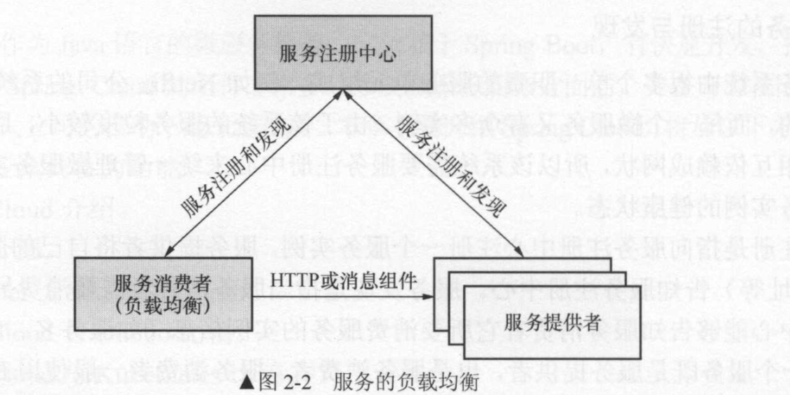
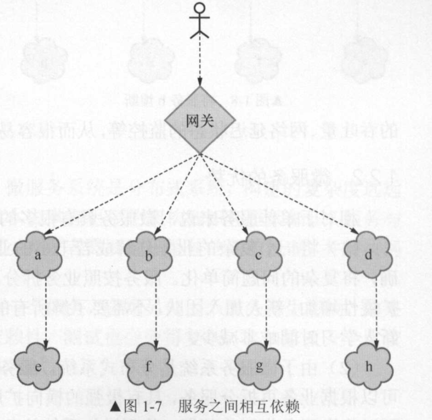
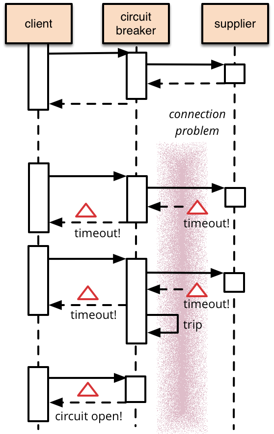
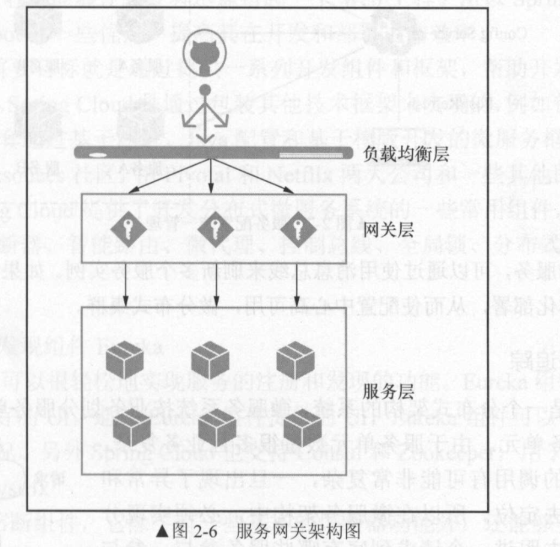
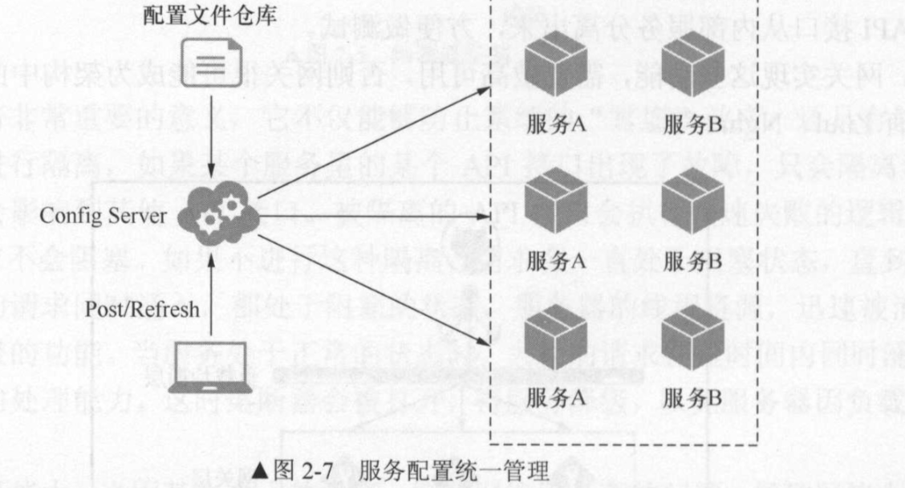
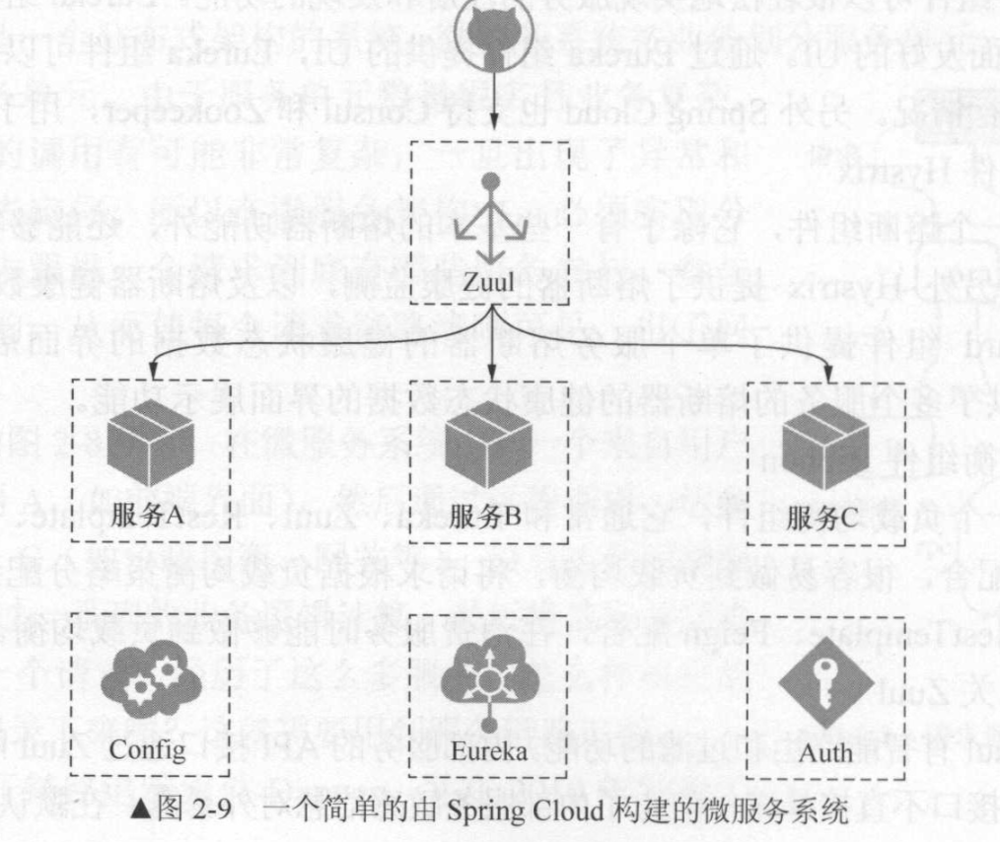
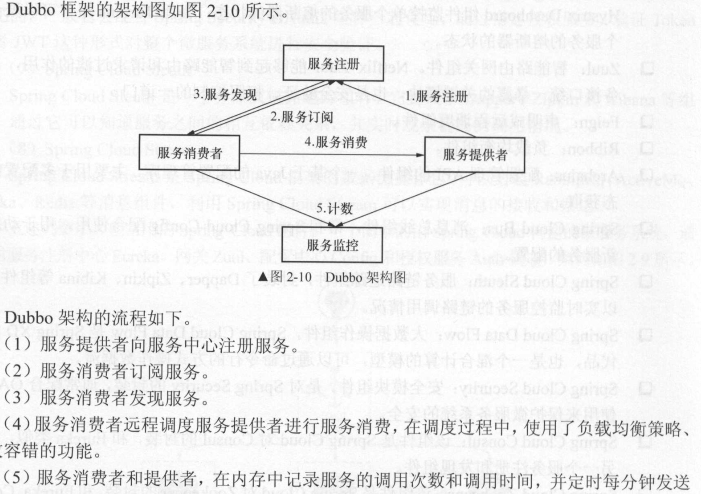

SpringCloud

---

###  微服务

> 以前设计方式：单体架构**All in One**， 所有的模块都耦合在一起。如果小应用，那么这种方式很适合，且在应用程序的初始阶段，这种架构性价比也是很高的，开发速度也快，成本低。
>
> 但是随着业务的复杂(代码量越来越多，代码可读性越来越差，维护性和可扩展性下降)。
>
> 用户越来越多，承担的并发性越来越高。
>
> 测试的难度越来越大。
>
> 持续交付能力差、修改和添加代码需要时间长，新人熟悉代码的时间长、成本高
>
> -------------------------------------------------------------------------------------------------------------------------------------------------
>
> 分布式系统：各个模块服务各自独立出来，各个微小的模型是一个进程，服务和我服务之间使用`RESTFul`风格的`API` 访问。
>
> 微服务：微服务就是将传统的一站式应用，根据业务拆分为一个一个的服务，彻底去耦合，每一个微服务提供单个业务功能的服务，一个服务做一件事情，从技术的角度看就是一种独立的处理过程，类似独立进程概念，能够单独启动或者销毁，拥有自己独立的数据库。

**微服务和微服务架构**

> **微服务**  强调服务的大小，关注的是某一个点，具体解决某一个问题。
>
> **微服务架构** 是一种架构模式，提倡将单一应用程序划分为一组小的服务，每个服务运行正在其`独立的进程中`   ,服务之间使用轻量级的通信机制协作(通常为 HTTP协议的 `RESTFull` API) ,每个服务都围绕着具体业务进行架构，并且能够被独立的部署到生成环境，类生产环境等，应该避免统一的，集中式的服务管理机制，对一个具体的服务而言，应根据上下文，选择合适的语言，工具构建构建。
>
> 1. 按照业务划分为一个独立运行的程序。
> 2. 服务之间通过HTTP协议通信
> 3. 自动化部署
> 4. 可以使用不同的编程语言
> 5. 服务集中化管理
> 6. 服务是一个分布式系统。

**微服务有点**

> 1. 每个服务足够内聚，足够小，代码容易理解这样能聚焦一个指定的业务功能或者业务需求。
> 2. 开发简单，效率高，一个服务可能就是专一的只干一件事情
> 3. 微服务能够被小团队开发
> 4. 松耦合，卡法阶段和部署阶段都是独立的
> 5. 可以使用不同的语言开发
> 6. 只是业务的逻辑不会和 `html` `css` 等耦合

**如何按照业务来划分微服务呢**

> 这是一个很难界定的概念，可以从一下三个方面来界定
>
> 1. 代码量来定义
> 2. 根据开发时间长短判断
> 3. 业务的大小判断

**微服务的好处**

> 若干小服务，服务的边界好确认，代码的可读性增加，新人容易上手，而不需要阅读全部的代码
>
> 微服务之间的独立性，整个应用可以横向扩展，也就是可以讲微服务继续拆成更细的服务
>
> 微服务之间可以使用不同的语言开发
>
> 每个服务都可以独立部署

**微服务的不足**

> 复杂度高，开发人员需要一定的架构知识和框架知识，服务之间传输http有依赖，需要约定接口及传递参数
>
> 分布式事务 CAP 理论，不能同时满足 『一致性、可用性、分区容错』 需要做出三者之间的权衡
>
>  	1. 一致性 consistency 数据的强一致性，如果写入某个数据成功，之后读取的都是新写入的数据，如果写入失败，则读取到的不是写入失败的数据
>  	2. 可用性 acailability 
>  	3. 分区容错 partition-tolerance 如何保证数据的一致性，也就是分布式事务的管理，有些非关系型数据库中并不具备 实物处理能力。
>
> 服务的部署

**微服务的难题**

> 1. 故障的传播学  ->  熔断机制
> 2. 服务的划分
> 3. 分布式事务

**微服务技术栈有哪些**

> 微服务技术栈 是多重技术集合体，
>
> 分布式的微服务架构，需要哪些维度：
>
>  	1. 服务治理
>  	2. 服务注册
>  	3. 服务负载均衡
>  	4. 服务监控

|   微服务条目   |       落地技术       | 备注 |
| :------------: | :------------------: | :--: |
|    服务开发    | SpringBoot/SpringMVC |      |
| 服务配置与管理 |      Diamond等       |      |
| 服务注册与发现 |   Eureka/Zookeeper   |      |
|    服务调用    |    Rest/RPC/gRPC     |      |
|   服务熔断器   |       Hystrix        |      |
|    负载均衡    |     Ribbon/Nginx     |      |
|  服务接口调用  |        Feign         |      |
|    消息队列    |       Kafka等        |      |
|    服务路由    |         Zuul         |      |
|    服务监控    |    Zabbix、Zagios    |      |
|   全链路追踪   |        Zipkin        |      |
|    服务部署    |     Docker、k8s      |      |
|   数据量操作   |  SpringCloudStream   |      |
|      ...       |                      |      |

---

---

#### Spring Cloud 的介绍

微服务的功能主要体现在一下几个方面：

> 1. 服务的注册和发现
> 2. 服务的负载均衡
> 3. 服务的容错
> 4. 服务的网关
> 5. 服务配置的统一管理
> 6. 链路追踪
> 7. 实时日志

---

**服务的注册与发现**： 统一管理微服务实例

> 服务注册： 服务提供者将自己的服务信息告知服务注册中心，
>
> 服务发现：服务消费者需要消费另外一个服务时候，服务注册中心能够告知服务消费者它所要消费的那台服务器的实例信息。通常情况下一个服务即使服务的提供者，也会是服务的消费者
>
> 服务注册中心：会提供服务的健康检查方案，检查被注册的服务是否可用，通常一个服务注册之后会定期给服务注册中心定期发送心跳，表明自己还是处理可使用状态，如果一段时间没有发送心跳，那么服务注册中心会任务这个服务不可用的了，那么服务注册中心会将这个服务踢出，如果一段时候后该服务又给服务注册中心发送了心跳，那么这个服务又会注册到注册中心。每个服务也可以获取注册终止的注册列表

---

**服务的负载均衡**

> 在集群化部署的时候，一个服务可以有多个实例，这些实例都是注册到注册中心了的，负载均衡就是，负责均衡组件会将服务消费者发来的请求经过一定的策略选择一个合适的服务提供者实例，这样就防止了在高并发时候，所有请求都发送到了同一个服务提供者的实例。

服务注册中心不但需要定时接受每个服务的心跳，检查是否可用，每个服务业会定时获取服务注册列表的信息，当服务非常多的时候，服务注册中心承担了非常大的负载，所以服务注册中心必须要实现高可用，一般的做法也是将辅助注册中心集群化，没个注册中心的数据同步跟新。

---

**服务的容错**

者网络延迟的时候，大量的请求会在b服务器阻塞，可能会在很短的时间内将线程内资源消耗完，导致b服务不可用，如果b服务是较为底层的服务，那么会影响到其它的服务一直等待b的处理，进而会影响到整个系统。

未来解决这个问题，微服务引入了熔断机制，当b服务出现故障，请求十班的此时超过了预设的阈值，那么服务b就会开启熔断器，之后服务b不尽兴任何业务的逻辑操作，返回失败响应，其它服务就不会受影响，同时熔断器也会检查是否正常，会将熔断器处理半打开状态，检查一部分请求时否正常，如果不正常则继续打开熔断器，否则就可以关闭熔断器。

熔断器有三种状态：

> 关闭： 服务正常
>
> 打开： 服务失败
>
> 半打开：检查服务是否继续可用

熔断器的重要意义：

> 1. 资源隔离，隔离之后请求不会被阻塞
> 2. 服务降级。
> 3. 自我修复。

---

**服务网关**

在微服务的系统中，API 接口资源通常统一由服务网关统一暴露，内部服务器不直接对外提供API资源的暴露，好处是将内存服务隐藏，对外而言可以视为是一个服务在提供服务，一定程度上保护系统的安全。网关的工作：

> 1. 请求转发，负责一定的安全验证，判断某个请求是否合法，请求对资源是否有权限
> 2. 将请求转发到具体的服务。

意义：

> 1. API 接口的资源统一聚合，对外统一暴露，微服务和外界隔离，防止服务内部对外暴露
> 2. 网关可以做一些用户身份验证，权限认证、防止非法操作API接口。
> 3. 实现监控功能，实时日志输出
> 4. 流量监控
> 5. API接口从内部服务分离出来，方便做测试

网关实现这些功能需要做高可用的配置，网关一般使用的组件有 `Zuul` `Nginx`

 

---

**服务配置的统一管理**

没个服务都会有配置，而且也会出现配置不同的情况，如果服务很多，且配置不同，那么配置将会很复杂，`SpringCloud Config` 提供了统一管理配置。

>1. `Config Server` 配置服务会读取仓库中的配置信息，其中配置文件仓库可以存在在配置服务的本地仓库，可以课放在 `Git` 仓库，
>2. 配置服务启动之后，读取配置文件中的信息，然后放到配置服务的内存中。
>3. 当服务启动A,B时，由于服务 A,B 指定了向配置服务读取配置信息，服务A,B 向配置服务读取配置信息
>4. 当读物的配置信息需要修改且修改完成之后，向配置服务发送post 请求进行刷新，这时候服务A,B会向配置服务重写读取配置文件。

---

**服务链路追踪**

一个微服务会有很多的服务之间的请求，当一个请求出现错误，那么如何最终到这个错误，当这错误出现的时候，这个请求都经过了那些服务，链路追踪就是用于记录这些信息的。

---

---

**Double**

> 阿里的分布式服务框架
>
> SpringCloud 要比 Dubbo 的功能模块更多，
>
> SpringCloud 要比 Dubbo 的更新速度更快，
>
> Dubbo 文档完善，趋于稳定

---

**Dubbo VS SpringCloud**

---

---

**K8s**

容器集群管理系统，为容器化的应用程序提供部署运行、维护、扩展、资源调度、服务发现等功能。具有如下的特点：

> 1. 大容量，运行数十亿个容器
> 2. 永不过时，稳定的提供提供服务
> 3. 随时随地运行，k8s是开源的，
> 4. 自动包装
> 5. 自我修复
> 6. 横向扩展
> 7. 服务发现负载均衡
> 8. 自动部署或回滚
> 9. 配置管理
> 10. 存储编排
> 11. 批量处理

---

**SpringCloud && K8s**

**SpringCloud** 是一个构建微服务的框架，而k8s是通过对运行的容器的编排来实现构建微服务的，两者从构建微服务的角度和实现方式有很大的不同，但是他们提供了构建微服务所需要的全部功能，

