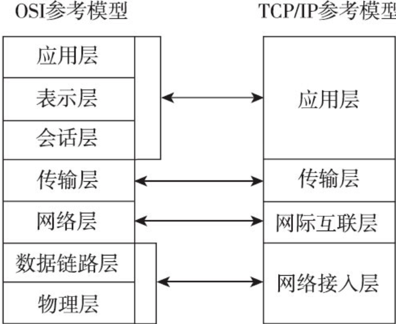
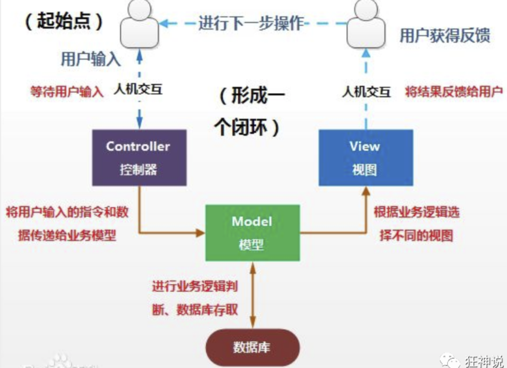
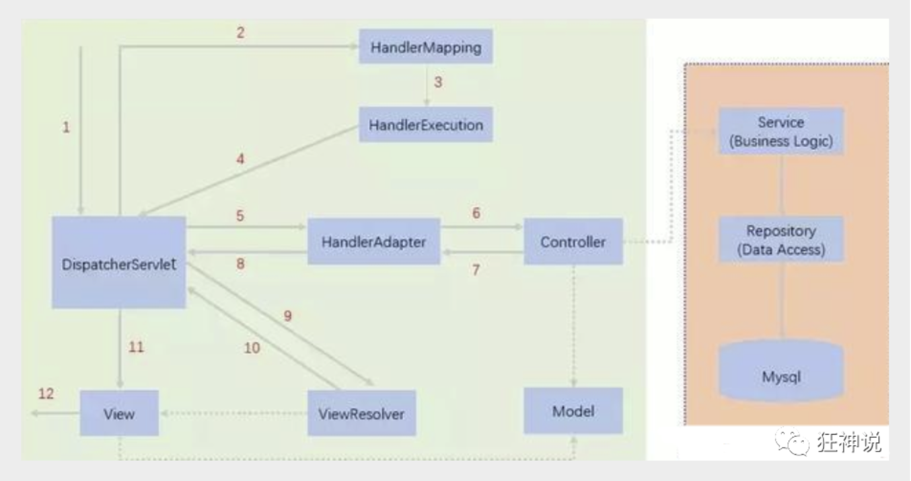
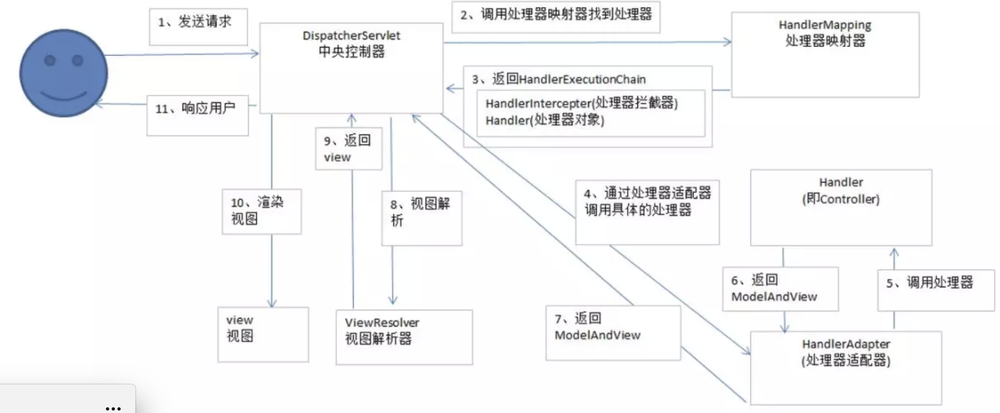
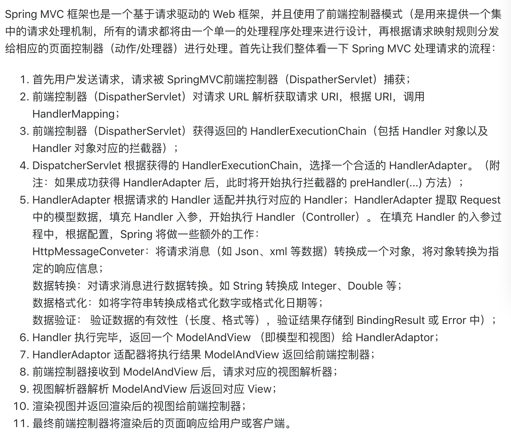

#### 基础

* TCP/IP 协议

> 
>
> TCP 和 IP 是2个不同的协议，作用不同
>
> **IP协议**是用来查找地址的，对应着网际互连层
>
> **TCP协议**是用来规范传输规则的，对印着传输层
>
> `IP 负责找地址，具体的传输的工作交给TCP 完成， 可以和寄送快递比较，IP 阶段是寄送快递之前填的那个规范地址，而TCP 是在地址填写完成之后，开始寄送`
>
> * TCP 2个序号饿三个标志位
>
>   > seq: sequence number 所传数据的序号，TCP 传输时候每一个字节都有一个序号，接收方按照序号检查是否将数据接收完整
>   >
>   > ack:  确认号，接收端用它来给发送端反馈已经成功接收到数据，表示该序号之前的数据已经全部接收到了
>   >
>   > ACK 确认位， ACK=1 ack 才起作用
>   >
>   > SYN: 同步位，发送和接收端建立连接之后SYN=1，才开始接收报文
>   >
>   > FIN：终止位，传输完成之后，释放连接
>
> * 三次握手、四次挥手
>
> * TCP的传输是双全工模式，也就是说传输的双方是对等的，可以同时传输数据，所以无论连接还是关闭都需要对双方同时进行
>
> **TCP 和 UDP**
>
> > TCP 是需要连接的，建立连接之后才能通信，好比电话
> >
> > UDP 是不需要连接的，拿到地址之后之间就通信了，好比对讲机
>
> HTTP 协议底层传输默认使用TCP 协议
>
> **HTTP**
>
> > HTTP 是应用层的东西，TCP/IP 接收到数据之后，需要使用HTTP 协议才可以使用
> >
> > * HTTP 中的请求和响应报文
> >
> >   > 都包含三部分, 首行、头部、主体
> >
> >   

---

#### 什么是MVC

spring mvc 是只是spring 处理web层请求的一个模块

> **Model: 模型**，提供需要展示的数据，可以认为是领域模型或JavaBean组件（包含数据和行为），不过现在一般都分离开来：Value Object（数据Dao） 和 服务层（行为Service）。也就是模型提供了模型数据查询和模型数据的状态更新等功能，包括数据和业务。
>
> **View（视图）**： 负责进行模型的展示，一般就是我们见到的用户界面，客户想看到的东西。
>
> **Controller（控制器）：**接收用户请求，委托给模型进行处理（状态改变），处理完毕后把返回的模型数据返回给视图，由视图负责展示。也就是说控制器做了个调度员的工作。
>
> 
>
> 这样不仅提高的代码的复用率与项目的扩展性，且大大降低了项目的维护成本。

**回顾下Servlet**

编写一个Servlet类，用来处理用户的请求

> ```java
> //实现Servlet接口
> public class HelloServlet extends HttpServlet {
>    @Override
>    protected void doGet(HttpServletRequest req, HttpServletResponse resp) throws ServletException, IOException {
>        //取得参数
>        String method = req.getParameter("method");
>        if (method.equals("add")){
>            req.getSession().setAttribute("msg","执行了add方法");
>       }
>        if (method.equals("delete")){
>            req.getSession().setAttribute("msg","执行了delete方法");
>       }
>        //业务逻辑
>        //视图跳转
>        req.getRequestDispatcher("/WEB-INF/jsp/hello.jsp").forward(req,resp);
>   }
> 
>    @Override
>    protected void doPost(HttpServletRequest req, HttpServletResponse resp) throws ServletException, IOException {
>        doGet(req,resp);
>   }
> }
> ```
>
> 编写Hello.jsp，在WEB-INF目录下新建一个jsp的文件夹，新建hello.jsp
>
> ```html
> <%@ page contentType="text/html;charset=UTF-8" language="java" %>
> <html>
> <head>
>    <title>Kuangshen</title>
> </head>
> <body>
> ${msg}
> </body>
> </html>
> ```
>
> 在web.xml中注册Servlet
>
> ```xml
> <?xml version="1.0" encoding="UTF-8"?>
> <web-app xmlns="http://xmlns.jcp.org/xml/ns/javaee"
>         xmlns:xsi="http://www.w3.org/2001/XMLSchema-instance"
>         xsi:schemaLocation="http://xmlns.jcp.org/xml/ns/javaee http://xmlns.jcp.org/xml/ns/javaee/web-app_4_0.xsd"
>         version="4.0">
>    <servlet>
>        <servlet-name>HelloServlet</servlet-name>
>        <servlet-class>com.kuang.servlet.HelloServlet</servlet-class>
>    </servlet>
>    <servlet-mapping>
>        <servlet-name>HelloServlet</servlet-name>
>        <url-pattern>/user</url-pattern>
>    </servlet-mapping>
> </web-app>
> ```
>
> **MVC框架要做哪些事情**
>
> 1. 将url映射到java类或java类的方法 .
> 2. 封装用户提交的数据 .
> 3. 处理请求--调用相关的业务处理--封装响应数据 .
> 4. 将响应的数据进行渲染 . jsp / html 等表示层数据 .

---

#### SpringMVC

> Spring MVC的特点：
>
> 1. 轻量级，简单易学
> 2. 高效 , 基于请求响应的MVC框架
> 3. 与Spring兼容性好，无缝结合
> 4. 约定优于配置
> 5. 功能强大：RESTful、数据验证、格式化、本地化、主题等
> 6. 简洁灵活
>
> Spring的web框架围绕**DispatcherServlet** [ 调度Servlet ] 设计。
>
> DispatcherServlet的作用是将请求分发到不同的处理器。

### 中心控制器

Spring的web框架围绕DispatcherServlet设计。DispatcherServlet的作用是将请求分发到不同的处理器。**以请求为驱动** , **围绕一个中心Servlet分派请求及提供其他功能**，**DispatcherServlet是一个实际的Servlet (它继承自HttpServlet 基类)**。

SpringMVC的原理如下图所示：

当发起请求时被前置的控制器拦截到请求，根据请求参数生成代理请求，找到请求对应的实际控制器，控制器处理请求，创建数据模型，访问数据库，将模型响应给中心控制器，控制器使用模型与视图渲染视图结果，将结果返回给中心控制器，再将结果返回给请求者。



图为SpringMVC的一个较完整的流程图，实线表示SpringMVC框架提供的技术，不需要开发者实现，虚线表示需要开发者实现。

1. DispatcherServlet表示前置控制器，是整个SpringMVC的控制中心。用户发出请求，DispatcherServlet接收请求并拦截请求。

   我们假设请求的url为 : http://localhost:8080/SpringMVC/hello

   **如上url拆分成三部分：**

   http://localhost:8080服务器域名

   SpringMVC部署在服务器上的web站点

   hello表示控制器

   通过分析，如上url表示为：请求位于服务器localhost:8080上的SpringMVC站点的hello控制器。

2. HandlerMapping为处理器映射。DispatcherServlet调用HandlerMapping,HandlerMapping根据请求url查找Handler。

3. HandlerExecution表示具体的Handler,其主要作用是根据url查找控制器，如上url被查找控制器为：hello。

4. HandlerExecution将解析后的信息传递给DispatcherServlet,如解析控制器映射等。

5. HandlerAdapter表示处理器适配器，其按照特定的规则去执行Handler。

6. Handler让具体的Controller执行。

7. Controller将具体的执行信息返回给HandlerAdapter,如ModelAndView。

8. HandlerAdapter将视图逻辑名或模型传递给DispatcherServlet。

9. DispatcherServlet调用视图解析器(ViewResolver)来解析HandlerAdapter传递的逻辑视图名。

10. 视图解析器将解析的逻辑视图名传给DispatcherServlet。

11. DispatcherServlet根据视图解析器解析的视图结果，调用具体的视图。

12. 最终视图呈现给用户。

写代码实现上述的过程

### 配置版

新建一个Moudle ， springmvc-02-hello ， 添加web的支持！

2、确定导入了SpringMVC 的依赖！

3、配置web.xml  ， 注册DispatcherServlet

```xml
<?xml version="1.0" encoding="UTF-8"?>
<web-app xmlns="http://xmlns.jcp.org/xml/ns/javaee"
        xmlns:xsi="http://www.w3.org/2001/XMLSchema-instance"
        xsi:schemaLocation="http://xmlns.jcp.org/xml/ns/javaee http://xmlns.jcp.org/xml/ns/javaee/web-app_4_0.xsd"
        version="4.0">

   <!--1.注册DispatcherServlet-->
   <servlet>
       <servlet-name>springmvc</servlet-name>
       <servlet-class>org.springframework.web.servlet.DispatcherServlet</servlet-class>
       <!--关联一个springmvc的配置文件:【servlet-name】-servlet.xml-->
       <init-param>
           <param-name>contextConfigLocation</param-name>
           <param-value>classpath:springmvc-servlet.xml</param-value>
       </init-param>
       <!--启动级别-1-->
       <load-on-startup>1</load-on-startup>
   </servlet>

   <!--/ 匹配所有的请求；（不包括.jsp）-->
   <!--/* 匹配所有的请求；（包括.jsp）-->
   <servlet-mapping>
       <servlet-name>springmvc</servlet-name>
       <url-pattern>/</url-pattern>
   </servlet-mapping>
</web-app>
```

4、编写SpringMVC 的 配置文件！名称：springmvc-servlet.xml  : [servletname]-servlet.xml

说明，这里的名称要求是按照官方来的

```xml
<?xml version="1.0" encoding="UTF-8"?>
<beans xmlns="http://www.springframework.org/schema/beans"
      xmlns:xsi="http://www.w3.org/2001/XMLSchema-instance"
      xsi:schemaLocation="http://www.springframework.org/schema/beans
       http://www.springframework.org/schema/beans/spring-beans.xsd">

</beans>
```

5、添加 处理映射器

```xml
<bean class="org.springframework.web.servlet.handler.BeanNameUrlHandlerMapping"/>
```

6、添加 处理器适配器

 ```xml
<bean class="org.springframework.web.servlet.mvc.SimpleControllerHandlerAdapter"/>
 ```

7、添加 视图解析器

```xml
<!--视图解析器:DispatcherServlet给他的ModelAndView-->
<bean class="org.springframework.web.servlet.view.InternalResourceViewResolver" id="InternalResourceViewResolver">
   <!--前缀-->
   <property name="prefix" value="/WEB-INF/jsp/"/>
   <!--后缀-->
   <property name="suffix" value=".jsp"/>
</bean>
```

8、编写我们要操作业务Controller ，要么实现Controller接口，要么增加注解；需要返回一个ModelAndView，装数据，封视图

```java
package com.kuang.controller;

import org.springframework.web.servlet.ModelAndView;
import org.springframework.web.servlet.mvc.Controller;

import javax.servlet.http.HttpServletRequest;
import javax.servlet.http.HttpServletResponse;

//注意：这里我们先导入Controller接口
public class HelloController implements Controller {

   public ModelAndView handleRequest(HttpServletRequest request, HttpServletResponse response) throws Exception {
       //ModelAndView 模型和视图
       ModelAndView mv = new ModelAndView();

       //封装对象，放在ModelAndView中。Model
       mv.addObject("msg","HelloSpringMVC!");
       //封装要跳转的视图，放在ModelAndView中
       mv.setViewName("hello"); //: /WEB-INF/jsp/hello.jsp
       return mv;
  }
}
```

9、将自己的类交给SpringIOC容器，注册bean

```java
<bean id="/hello" class="com.kuang.controller.HelloController"/>
```

10、写要跳转的jsp页面，显示ModelandView存放的数据，以及我们的正常页面；

 ```html

<%@ page contentType="text/html;charset=UTF-8" language="java" %>
<html>
<head>
   <title>Kuangshen</title>
</head>
<body>
${msg}
</body>
</html>
 ```

### 注解版

**1、新建一个Moudle，springmvc-03-hello-annotation 。添加web支持！**

2、由于Maven可能存在资源过滤的问题，我们将配置完善

```xml
<build>
   <resources>
       <resource>
           <directory>src/main/java</directory>
           <includes>
               <include>**/*.properties</include>
               <include>**/*.xml</include>
           </includes>
           <filtering>false</filtering>
       </resource>
       <resource>
           <directory>src/main/resources</directory>
           <includes>
               <include>**/*.properties</include>
               <include>**/*.xml</include>
           </includes>
           <filtering>false</filtering>
       </resource>
   </resources>
</build>
```

3、在pom.xml文件引入相关的依赖：主要有Spring框架核心库、Spring MVC、servlet , JSTL等。我们在父依赖中已经引入了！

**4、配置web.xml**

注意点：

```xml
<?xml version="1.0" encoding="UTF-8"?>
<web-app xmlns="http://xmlns.jcp.org/xml/ns/javaee"
        xmlns:xsi="http://www.w3.org/2001/XMLSchema-instance"
        xsi:schemaLocation="http://xmlns.jcp.org/xml/ns/javaee http://xmlns.jcp.org/xml/ns/javaee/web-app_4_0.xsd"
        version="4.0">

   <!--1.注册servlet-->
   <servlet>
       <servlet-name>SpringMVC</servlet-name>
       <servlet-class>org.springframework.web.servlet.DispatcherServlet</servlet-class>
       <!--通过初始化参数指定SpringMVC配置文件的位置，进行关联-->
       <init-param>
           <param-name>contextConfigLocation</param-name>
           <param-value>classpath:springmvc-servlet.xml</param-value>
       </init-param>
       <!-- 启动顺序，数字越小，启动越早 -->
       <load-on-startup>1</load-on-startup>
   </servlet>

   <!--所有请求都会被springmvc拦截 -->
   <servlet-mapping>
       <servlet-name>SpringMVC</servlet-name>
       <url-pattern>/</url-pattern>
   </servlet-mapping>

</web-app>
```

1. **5、添加Spring MVC配置文件**

2. 在resource目录下添加springmvc-servlet.xml配置文件，配置的形式与Spring容器配置基本类似，为了支持基于注解的IOC，设置了自动扫描包的功能，具体配置信息如下：

3. ```xml
   
   <?xml version="1.0" encoding="UTF-8"?>
   <beans xmlns="http://www.springframework.org/schema/beans"
         xmlns:xsi="http://www.w3.org/2001/XMLSchema-instance"
         xmlns:context="http://www.springframework.org/schema/context"
         xmlns:mvc="http://www.springframework.org/schema/mvc"
         xsi:schemaLocation="http://www.springframework.org/schema/beans
          http://www.springframework.org/schema/beans/spring-beans.xsd
          http://www.springframework.org/schema/context
          https://www.springframework.org/schema/context/spring-context.xsd
          http://www.springframework.org/schema/mvc
          https://www.springframework.org/schema/mvc/spring-mvc.xsd">
   
      <!-- 自动扫描包，让指定包下的注解生效,由IOC容器统一管理 -->
      <context:component-scan base-package="com.kuang.controller"/>
      <!-- 让Spring MVC不处理静态资源 -->
      <mvc:default-servlet-handler />
      <!--
      支持mvc注解驱动
          在spring中一般采用@RequestMapping注解来完成映射关系
          要想使@RequestMapping注解生效
          必须向上下文中注册DefaultAnnotationHandlerMapping
          和一个AnnotationMethodHandlerAdapter实例
          这两个实例分别在类级别和方法级别处理。
          而annotation-driven配置帮助我们自动完成上述两个实例的注入。
       -->
      <mvc:annotation-driven />
   
      <!-- 视图解析器 -->
      <bean class="org.springframework.web.servlet.view.InternalResourceViewResolver"
            id="internalResourceViewResolver">
          <!-- 前缀 -->
          <property name="prefix" value="/WEB-INF/jsp/" />
          <!-- 后缀 -->
          <property name="suffix" value=".jsp" />
      </bean>
   </beans>
   ```

4. 1. - 在视图解析器中我们把所有的视图都存放在/WEB-INF/目录下，这样可以保证视图安全，因为这个目录下的文件，客户端不能直接访问。
        - 让IOC的注解生效
        - 静态资源过滤 ：HTML . JS . CSS . 图片 ， 视频 .....
        - MVC的注解驱动
        - 配置视图解析器

1. **6、创建Controller**

2. 编写一个Java控制类：com.kuang.controller.HelloController , 注意编码规范

3. ```java
   package com.kuang.controller;
   
   import org.springframework.stereotype.Controller;
   import org.springframework.ui.Model;
   import org.springframework.web.bind.annotation.RequestMapping;
   
   @Controller
   @RequestMapping("/HelloController")
   public class HelloController {
   
      //真实访问地址 : 项目名/HelloController/hello
      @RequestMapping("/hello")
      public String sayHello(Model model){
          //向模型中添加属性msg与值，可以在JSP页面中取出并渲染
          model.addAttribute("msg","hello,SpringMVC");
          //web-inf/jsp/hello.jsp
          return "hello";
     }
   }
   ```

4. - @Controller是为了让Spring IOC容器初始化时自动扫描到；
   - @RequestMapping是为了映射请求路径，这里因为类与方法上都有映射所以访问时应该是/HelloController/hello；
   - 方法中声明Model类型的参数是为了把Action中的数据带到视图中；
   - 方法返回的结果是视图的名称hello，加上配置文件中的前后缀变成WEB-INF/jsp/**hello**.jsp。


1. 7、**创建视图层**

2. 在WEB-INF/ jsp目录中创建hello.jsp ， 视图可以直接取出并展示从Controller带回的信息；

3. 可以通过EL表示取出Model中存放的值，或者对象

4. ```java
   
   <%@ page contentType="text/html;charset=UTF-8" language="java" %>
   <html>
   <head>
      <title>SpringMVC</title>
   </head>
   <body>
   ${msg}
   </body>
   </html>
   ```

5. 使用springMVC必须配置的三大件：

6. **处理器映射器、处理器适配器、视图解析器**

7. 通常，我们只需要**手动配置视图解析器**，而**处理器映射器**和**处理器适配器**只需要开启**注解驱动**即可，而省去了大段的xml配置


---





