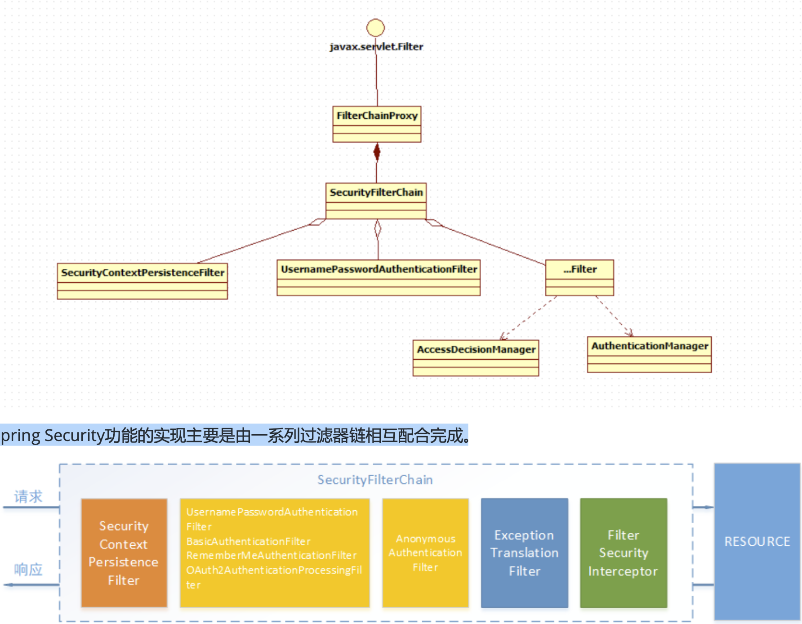
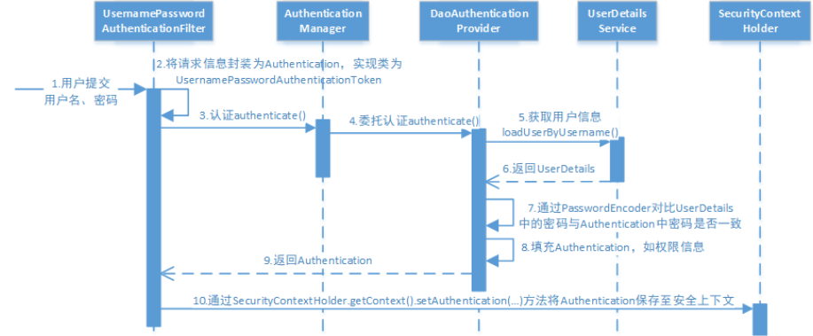

#### SpringSecurity && Jwt

`ss` 对`web` 资源的保护主要是靠 `Filter` 实现的，所以从这个 `Filter` 来入手，桌布深入`SS` 原理， 当初始化`Spring Security`时，会创建一个名为 `SpringSecurityFilterChain` 的`Servlet`过滤器，类型为 `org.springframework.security.web.FilterChainProxy`，它实现了`javax.servlet.Filter`，因此外部的请求会经过此 类，下图是`Spring Security`过虑器链结构图:


`FilterChainProxy`是一个代理，真正起作用的是`FilterChainProxy`中`SecurityFilterChain`所包含的各个`Filter`，同时 这些`Filter`作为`Bean`被`Spring`管理，它们是`Spring Security`核心，各有各的职责，但他们并不直接处理用户的认 证，也不直接处理用户的授权，而是把它们交给了认证管理器`(AuthenticationManager)`和决策管理器` (AccessDecisionManager)`进行处理，下图是`FilterChainProxy`相关类的`UML`图示。



过滤器链中主要的几个过滤器及其作用:

`SecurityContextPersistenceFilter`: 

> 这个`Filter`是整个拦截过程的入口和出口(也就是第一个和最后一个拦截 器)，会在请求开始时从配置好的 `SecurityContextRepository` 中获取 `SecurityContext`，然后把它设置给 `SecurityContextHolder`。在请求完成后将 `SecurityContextHolder` 持有的 `SecurityContext `再保存到配置好 的 `SecurityContextRepository`，同时清除 `securityContextHolder` 所持有的 `SecurityContext`;

`UsernamePasswordAuthenticationFilter： 用户名密码认证使用`

> **用于处理来自表单提交的认证**。该表单必须提供对应的用户名和密码，其内部还有登录成功或失败后进行处理的 `AuthenticationSuccessHandler` 和 `AuthenticationFailureHandler`，这些都可以根据需求做相关改变;

`FilterSecurityInterceptor:授权使用`

> 是用于保护 `web`资源的，使用`AccessDecisionManager`对当前用户进行授权访问，前 面已经详细介绍过了;

`ExceptionTranslationFilter`

> 能够捕获来自 `FilterChain` 所有的异常，并进行处理。但是它只会处理两类异常: `AuthenticationException` 和 `AccessDeniedException`，其它的异常它会继续抛出。



---

任何一个权限管理系统，主要分位两个功能 `验证` 和 `鉴权`

`Authentication`： 身份验证你是谁，验证用户的身份，一般会使用 `用户名` 和 `密码` 		

`Authorization`:  鉴权，你可以做什么，确认用户的身份(`角色`  `权限`) ，判断能否访问受 保护的 `资源`。

`xxxProvider` 会拿到一个`authentication` 的用户输入的认证信息，然后再获取到真正的用户信息`userDetails`, 然后采用`Encoder` 的`match` 方法判断二者的信息是否一致判断校验

---

##### 登录请求为例

**需求**：

> * 网站分为首页、登录页、用户页面、管理员页面和报错页面
> * 使用用户名加密码登录，登录错误要报错
> * 不同的用户拥有不同的权限、不同的权限可以访问不同的网页
> * 首页和登录页不需要任何权限
> * 用户页面需要 `USER` 权限
> * 管理员页面需要 `ADMIN` 权限
> * 如果用户没有登录，则访问需要权限的页面时候自动跳转到登录页面

如果是一个老用户，当ta登录的时候，会输入用户名和密码，`SpringSecurity` 就会拿着这些用户名和密码去和数据库中存储的用户名和密码去验证你是谁。

`SpringSecurity` 拿到用户名和密码之后首先被过滤器截获封装为 `SpringSecurity` 的身份和认证的抽象类 `Authentication`  的实例，而整个验证流程都会围绕着这个实例来完成，依次穿过整个 `验证链` 并最后存储在 `SecurityContextHolder`  

##### Authentication 类

```java
public interface Authentication extends Principal, Serializable {
    // 权限信息列表，默认是GrantedAuthority接口的实现类。
	Collection<? extends GrantedAuthority> getAuthorities();
    
    // 凭证信息 用户提交的密码信息，这里的信息在会在验证通过之后移除
	Object getCredentials();
    
    // 记录访问者的ip地址和sessionId的值等
	Object getDetails();
    
    // 返回UserDetails 实现类，存储用户的信息,用户名等根据业务添加到header 中的东西，都可以放到这里.
	Object getPrincipal();
	boolean isAuthenticated();
	void setAuthenticated(boolean isAuthenticated) throws IllegalArgumentException;
}
```

**然后接下来就是验证了**:这里会提到几个让人晕头转向的类，`AuthenticationManager`，`ProviderManager` ，`AuthenticationProvider`。

`AuthenticationManager`  认证核心接口，在实际中回允许多重多样的登录方式，所以不会使用这个接口去直接验证，而是使用这个接口的实现类 `ProviderManager` 执行认证功能，在这个类里面存放着多重的验证方式，这多重验证方式就是类 `AuthenticationProvider`, 也就是最终执行验证的类才是 `AuthenticationProvider` ,在整个验证的过程中就是 `AuthenticationProvider` 组成的一系列的验证链路，

验证之后就会被存储到`Authentication`   存入到 `SecurityContextHolder`  ,需要时候可以存这里取出来

`SecurityContextHolder.getContext().getAuthentication` 

在登录之后 `SpringSecurity` 会自动将其密码和用户名包装为上面提到的 `Authentication ` 然后去经过每一个 `AuthenticationProvider` 组成的链路，也会经过我们经过业务逻辑定义的继承  `AuthenticationProvider`  类的链路类。

而要使用基于业务定义的链路类还需要进行配置，这样才能使用到。配置类需要继承 `WebSecurityConfigurerAdapter` 

```java
// 启动的时候会先执行这个配置类：(继承WebSecurityConfigurerAdapter)
@EnableWebSecurity
public class SecurityConfiguration extends WebSecurityConfigurerAdapter {
    @Autowired
    BackdoorAuthenticationProvider backdoorAuthenticationProvider;
    @Override
    protected void configure(AuthenticationManagerBuilder auth) throws Exception {
       ...省略
           
        //将自定义验证类注册进去, 在经过验证链路的时候，会执行到这个类
        auth.authenticationProvider(backdoorAuthenticationProvider);
    }
    
    // 然后执行这个配置类：
	@Override
    protected void configure(HttpSecurity http) throws Exception {
        http
            .authorizeRequests()
            .antMatchers("/","/index","/error").permitAll()
            .antMatchers("/user/**").hasRole("USER")
            .antMatchers("/admin/**").hasRole("ADMIN")
            .and()
            .formLogin().loginPage("/login").defaultSuccessUrl("/user")
            //1.自定义参数名称，与login.html中的参数对应
            .usernameParameter("myusername").passwordParameter("mypassword")
            .and()
            .logout().logoutUrl("/logout").logoutSuccessUrl("/login");
    }
}

// 验证类
@Component
public class BackdoorAuthenticationProvider implements AuthenticationProvider {
    // 验证的执行方法
    @Override
    public Authentication authenticate(Authentication authentication) throws AuthenticationException {
        // 登录密码和登录名的验证方式，当验证成功之后，也给这个用户赋予角色
        String name = authentication.getName();
        String password = authentication.getCredentials().toString();

        //利用alex用户名登录，不管密码是什么都可以，伪装成admin用户
        if (name.equals("alex")) {
            Collection<GrantedAuthority> authorityCollection = new ArrayList<>();
            // 用户的权限
            authorityCollection.add(new SimpleGrantedAuthority("ROLE_ADMIN"));
            authorityCollection.add(new SimpleGrantedAuthority("ROLE_USER"));
            // UsernamePasswordAuthenticationToken 是 Authentication 的一个实现类
            // 这里将用户的密码信息等全部都包成 Authentication 的一个继承类
            return new UsernamePasswordAuthenticationToken(
                    "admin", password, authorityCollection);
        } else {
            return null;
        }
    }
    @Override
    public boolean supports(Class<?> authentication) {
        // 判断当前Provider 是否支持 authentication 的校验
        return authentication.equals(UsernamePasswordAuthenticationToken.class);
    }
}
```

上面只是简单的将用户的输入作为登录，并没有使用到将用户的输入和数据库中保存的用户的记录进行验证。接下来就做这节事情

```java
protected void configure(AuthenticationManagerBuilder auth) throws Exception {
        ...省略
        //加入数据库验证类，下面的语句实际上在验证链中加入了一个DaoAuthenticationProvider
        auth.userDetailsService(myUserDetailsService).passwordEncoder(
            new BCryptPasswordEncoder());
    }
查看源码：
public <T extends UserDetailsService> 	DaoAuthenticationConfigurer<AuthenticationManagerBuilder, T> userDetailsService
(T userDetailsService){}
当配置用户信息的时候，确实是会返回 DaoAuthenticationProvider 这么一个链路，这就是用户和数据库进行校验的
```

之前已经介绍过了 `UserDetails` 那么使用数据库校验一个类去实现 `UserDetailsService` 这个接口的，这个接口提供一个抽象方法，这个抽象方法只有一个方法 `UserDetails loadUserByUsername(String username)` 就是通过 `username` 从数据库中获取 `UserDetails` 

```java
public class MyUserDetailsService implements UserDetailsService {
    @Autowired
    MyUserMapper mapper;
  
    @Override
    public UserDetails loadUserByUsername(String username) throws UsernameNotFoundException {
        MyUserBean userBean = mapper.selectByUsername(username);
        if (userBean == null) {
            throw new UsernameNotFoundException("数据库中无此用户！");
        }
        return userBean;
    }
}
```

而在一般的时候，原始接口 `UserDetails` 并不能满足真实业务的需求，此时需要重写这个接口，增加新的字段，适用于业务

```java
@Component
public class MyUserBean implements UserDetails {
    private Long id;
    private String name;
    private String address;
    private String username;
    private String password;
    private String roles;

    /**
     * 从数据库中取出roles字符串后，进行分解，构成一个GrantedAuthority的List返回
     * @return
     */
    @Override
    public Collection<? extends GrantedAuthority> getAuthorities() {
        String[] authorities = roles.split(",");
        List<SimpleGrantedAuthority> simpleGrantedAuthorities = new ArrayList<>();
        for (String role : authorities) {
            simpleGrantedAuthorities.add(new SimpleGrantedAuthority(role));
        }
        return simpleGrantedAuthorities;
    }
    .......
}
```

**使用数据库进行验证其实只需要掌握两个接口即可，即UserDetailsService和UserDetails。**

##### `PasswordEncoder`

> `DaoAuthenticationProvider`认证处理器通过`UserDetailsService`获取到`UserDetails`后，它是如何与请求 `Authentication`中的密码做对比呢?
>
> 在这里`Spring Security`为了适应多种多样的加密类型，又做了抽象，`DaoAuthenticationProvider`通过 `PasswordEncoder`接口的`matches`方法进行密码的对比，而具体的密码对比细节取决于实现:
>
> ```java
> public interface PasswordEncoder {
>        String encode(CharSequence var1);
>        boolean matches(CharSequence var1, String var2);
>        default boolean upgradeEncoding(String encodedPassword) {
>            return false;
> 			} 
> }
> 
> @Bean
> public PasswordEncoder passwordEncoder() {
> 		return NoOpPasswordEncoder.getInstance(); 
> }
> ```
>
> 实际项目中推荐使用`BCryptPasswordEncoder`, `Pbkdf2PasswordEncoder`, `SCryptPasswordEncoder`等，感兴趣 的大家可以看看这些`PasswordEncoder`的具体实现

----

#### 鉴权


1. 拦截请求，已认证用户访问受保护的`web`资源将被`SecurityFilterChain`中的 `FilterSecurityInterceptor` 的子 类拦截。

2. 获取资源访问策略，`FilterSecurityInterceptor`会从 `SecurityMetadataSource` 的子类 `DefaultFilterInvocationSecurityMetadataSource` 获取要访问当前资源所需要的权限 `Collection<ConfigAttribute> 。`

`SecurityMetadataSource`其实就是读取访问策略的抽象，而读取的内容，其实就是我们配置的访问规则， 读取访问策略如:

授权管理器的核心

```java
public interface AccessDecisionManager {
/**
* 		通过传递的参数来决定用户是否有访问对应受保护资源的权限
			authentication: 用户的身份信息，含有用户的权限
			Collection<ConfigAttribute> 资源要求的权限
			object:要访问的受保护资源，web请求对应FilterInvocation
*/
void decide(Authentication authentication , Object object, Collection<ConfigAttribute>
				configAttributes ) throws AccessDeniedException, InsufficientAuthenticationException; 
  //略..
}
```

`Spring Security`使用标准`Filter`建立了对`web`请求的拦截，最终实现对资源的授权访问。

```yaml
当用户未登录时，访问任何需要权限的资源都会转向登录页面，尝试进行登录；

当用户登录成功时，他会获得一系列角色。

用户访问某资源/xxx时，FilterInvocationSecurityMetadataSource这个类的实现类（本文是MySecurityMetadataSource）会调用getAttributes方法来进行资源匹配。它会读取数据库resource表中的所有记录，对/xxx进行匹配。若匹配成功，则将/xxx对应所需的角色组成一个 Collection<ConfigAttribute>返回；匹配不成功则说明/xxx不需要什么额外的访问权限；

流程来到鉴权的决策类AccessDecisionManager的实现类（MyAccessDecisionManager）中，它的decide方法可以决定当前用户是否能够访问资源。decide方法的参数中可以获得当前用户的验证信息、第3步中获得的资源所需角色信息，对这些角色信息进行匹配即可决定鉴权是否通过。当然，你也可以加入自己独特的判断方法，例如只要用户具有ROLE_ADMIN角色就一律放行；

若鉴权成功则用户顺利访问页面，否则在decide方法中抛出AccessDeniedException异常，这个异常会被AccessDeniedHandler的实现类（MyAccessDeniedHandler）处理。它仅仅是生成了一个json对象，转换为字符串返回给客户端了。
```

授权决策

AccessDecisionManager采用投票的方式来确定是否能够访问受保护资源。


```java
public interface AccessDecisionVoter<S> { 
  	int ACCESS_GRANTED = 1; // 同意
		int ACCESS_ABSTAIN = 0; // 弃权
		int ACCESS_DENIED = ‐1; // 拒绝
       boolean supports(ConfigAttribute var1);
       boolean supports(Class<?> var1);
       int vote(Authentication var1, S var2, Collection<ConfigAttribute> var3);
   }
```

``AffirmativeBased:默认方法`

> 逻辑是: 
>
> (1)只要有`AccessDecisionVoter`的投票为`ACCESS_GRANTED`则同意用户进行访问; 
>
> (2)如果全部弃权也表示通过; 
>
> (3)如果没有一个人投赞成票，但是有人投反对票，则将抛出`AccessDeniedException`。

`ConsensusBased`

> (1)如果赞成票多于反对票则表示通过。 
>
> (2)反过来，如果反对票多于赞成票则将抛出`AccessDeniedException`。
>
> (3)如果赞成票与反对票相同且不等于0，并且属性`allowIfEqualGrantedDeniedDecisions`的值为`true`，则表 示通过，否则将抛出异常`AccessDeniedException`。参数`allowIfEqualGrantedDeniedDecisions`的值默认为`true`。
>
> (4)如果所有的`AccessDecisionVoter`都弃权了，则将视参数`allowIfAllAbstainDecisions`的值而定，如果该值 为`true`则表示通过，否则将抛出异常`AccessDeniedException`。参数`allowIfAllAbstainDecisions`的值默认为`false`。

`UnanimousBased`

> 的逻辑与另外两种实现有点不一样，另外两种会一次性把受保护对象的配置属性全部传递 给`AccessDecisionVoter`进行投票，而`UnanimousBased`会一次只传递一个`ConfigAttribute`给 `AccessDecisionVoter`进行投票。这也就意味着如果我们的**AccessDecisionVoter的逻辑是只要传递进来的 ConfigAttribute中有一个能够匹配则投赞成票**，但是放到`UnanimousBased`中其投票结果就不一定是赞成了。 `UnanimousBased`的逻辑具体来说是这样的:
>
> (1)如果受保护对象配置的某一个`ConfigAttribute`被任意的`AccessDecisionVoter`反对了，则将抛出 `AccessDeniedException`。
>
> (2)如果没有反对票，但是有赞成票，则表示通过。
>
>  (3)如果全部弃权了，则将视参数`allowIfAllAbstainDecisions`的值而定，`true`则通过，`false`则抛出`AccessDeniedException`。 `Spring Security`也内置一些投票者实现类如`RoleVoter`、`AuthenticatedVoter`和`WebExpressionVoter`等.

`spring security`提供会话管 理，认证通过后将身份信息放入`SecurityContextHolder`上下文，`SecurityContext`与当前线程进行绑定，方便获取 用户身份。

#### 会话规则

```java
SessionCreationPolicy: 会话规则
ALWAYS：Always create an HttpSession
NEVER：never create an HttpSession
IF_REQUIRED：will only create an HttpSession if required
STATELESS：will never create an HttpSession and it will never use it to obtain the SecurityContext  
```


授权的方式包括` web`授权和方法授权，`web`授权是通过 `url`拦截进行授权，方法授权是通过 方法拦截进行授权。他 们都会调用`accessDecisionManager`进行授权决策，若为`web`授权则拦截器为`FilterSecurityInterceptor`;若为方 法授权则拦截器为`MethodSecurityInterceptor`。如果同时通过`web`授权和方法授权则先执行web授权，再执行方 法授权，最后决策通过，则允许访问资源，否则将禁止访问。


设计表

```java
-- ----------------------------
--  用户信息，包括角色
-- ----------------------------
DROP TABLE IF EXISTS `user`;
CREATE TABLE `user` (
  `id` bigint(20) NOT NULL AUTO_INCREMENT,
  `name` varchar(32) DEFAULT NULL COMMENT '姓名',
  `address` varchar(64) DEFAULT NULL COMMENT '联系地址',
  `username` varchar(255) CHARACTER SET utf8mb4 COLLATE utf8mb4_bin DEFAULT NULL COMMENT '账号',
  `password` varchar(255) CHARACTER SET utf8mb4 COLLATE utf8mb4_bin DEFAULT NULL COMMENT '密码',
  `roles` varchar(255) CHARACTER SET utf8mb4 COLLATE utf8mb4_bin DEFAULT NULL COMMENT '角色',
  PRIMARY KEY (`id`)
) ENGINE=InnoDB AUTO_INCREMENT=3 DEFAULT CHARSET=utf8;
-- ----------------------------
--  Records of `user`
-- ----------------------------
BEGIN;
INSERT INTO `user` VALUES ('1', 'Adam', 'beijing', 'adam','$2a$10$9SIFu8l8asZUKxtwqrJM5ujhWarz/PMnTX44wXNsBHfpJMakWw3M6', 'ROLE_USER');
INSERT INTO `user` VALUES ('2', 'SuperMan', 'shanghang', 'super','$2a$10$9SIFu8l8asZUKxtwqrJM5ujhWarz/PMnTX44wXNsBHfpJMakWw3M6', 'ROLE_USER,ROLE_ADMIN');
INSERT INTO `user` VALUES ('3', 'Manager', 'beijing', 'manager','$2a$10$9SIFu8l8asZUKxtwqrJM5ujhWarz/PMnTX44wXNsBHfpJMakWw3M6', 'ROLE_USER,ROLE_MANAGER');
INSERT INTO `user` VALUES ('4', 'User1', 'shanghang', 'user1','$2a$10$9SIFu8l8asZUKxtwqrJM5ujhWarz/PMnTX44wXNsBHfpJMakWw3M6', 'ROLE_USER,ROLE_DEPART1');
INSERT INTO `user` VALUES ('5', 'User2', 'shanghang', 'user2','$2a$10$9SIFu8l8asZUKxtwqrJM5ujhWarz/PMnTX44wXNsBHfpJMakWw3M6', 'ROLE_USER,ROLE_DEPART2');
COMMIT;

-- ----------------------------
--  什么连接需要什么样的权限及角色
-- ----------------------------
DROP TABLE IF EXISTS `resource`;
CREATE TABLE `resource` (
  `id` bigint(20) NOT NULL AUTO_INCREMENT,
  `url` varchar(255) DEFAULT NULL COMMENT '资源',
  `roles` varchar(255) DEFAULT NULL COMMENT '所需角色',
  PRIMARY KEY (`id`)
) ENGINE=InnoDB AUTO_INCREMENT=3 DEFAULT CHARSET=utf8;
-- ----------------------------
--  Records of `resource`
-- ----------------------------
BEGIN;
INSERT INTO `resource` VALUES ('1', '/depart1/**', 'ROLE_ADMIN,ROLE_MANAGER,ROLE_DEPART1');
INSERT INTO `resource` VALUES ('2', '/depart2/**', 'ROLE_ADMIN,ROLE_MANAGER,ROLE_DEPART2');
INSERT INTO `resource` VALUES ('3', '/user/**', 'ROLE_ADMIN,ROLE_USER');
INSERT INTO `resource` VALUES ('4', '/admin/**', 'ROLE_ADMIN');
COMMIT;
```

和资源权限对应的类：

```java
@Component
public class MyResourceBean {
    private Long id;
    private String url;
    private String roles;
    public String[] getRolesArray(){
        String[] authorities = roles.split(",");
        return authorities;
    }
.......
}
```

定义元数据类，这个类访问资源所需要的角色，实现接口 `FilterInvocationSecurityMetadataSource`  ——>   `SecurityMetadataSource `  稍后还需要将这个类加入到链路中去。

```java
@Component
public class MySecurityMetadataSource implements FilterInvocationSecurityMetadataSource {
    @Autowired
    ResourceMapper resourceMapper;
    //本方法返回访问资源所需的角色集合
    AntPathMatcher antPathMatcher = new AntPathMatcher();
    @Override
    public Collection<ConfigAttribute> getAttributes(Object object) throws IllegalArgumentException {
        //从object中得到当前需要访问的资源，即网址
        String requestUrl = ((FilterInvocation) object).getRequestUrl();
        //从数据库中得到所有资源，以及对应的角色
        List<MyResourceBean> resourceBeans = resourceMapper.selectAllResource();
        for (MyResourceBean resource : resourceBeans) {
            //首先进行地址匹配
            if (antPathMatcher.match(resource.getUrl(), requestUrl)
                    && resource.getRolesArray().length > 0) {
                // 如果匹配成功，则返回这个url 所需要的角色信息，
                return SecurityConfig.createList(resource.getRolesArray());
            }
        }
        //匹配不成功返回一个特殊的ROLE_NONE
        return SecurityConfig.createList("ROLE_NONE");
    }
..........
}
```

获取到这个当前 `URL` 需要的角色之后，这些角色在后面的链路中也是可以获取到的，接下来就是判断当前用户是否有这些角色。

```java
@Component
public class MyAccessDecisionManager implements AccessDecisionManager {
    @Override
    public void decide(Authentication authentication, Object object, Collection<ConfigAttribute> configAttributes)
            throws AccessDeniedException, InsufficientAuthenticationException {
//从authentication中获取当前用户具有的角色
        Collection<? extends GrantedAuthority> userAuthorities = authentication.getAuthorities();
//从configAttributes中获取访问资源所需要的角色，它来自MySecurityMetadataSource的getAttributes
        Iterator<ConfigAttribute> iterator = configAttributes.iterator();
        while (iterator.hasNext()) {
            ConfigAttribute attribute = iterator.next();
            String role = attribute.getAttribute();
            if ("ROLE_NONE".equals(role)) {
                if (authentication instanceof AnonymousAuthenticationToken) {
                    throw new BadCredentialsException("用户未登录");
                } else
                    return;
            }
            //逐一进行角色匹配
            for (GrantedAuthority authority : userAuthorities) {
                if (authority.getAuthority().equals("ROLE_ADMIN")) {
                    return; //用户具有ROLE_ADMIN权限，则可以访问所有资源
                }
                if (authority.getAuthority().equals(role)) {
                    return;  //匹配成功就直接返回
                }
            }
        }
        //不能完成匹配
        throw new AccessDeniedException("你没有访问" + object + "的权限!");
    }
..............
}
```

若鉴权成功则用户顺利访问页面，否则在decide方法中抛出AccessDeniedException异常，这个异常会被AccessDeniedHandler的实现类（MyAccessDeniedHandler）处理。

```java
@Component
public class MyAccessDeniedHandler implements AccessDeniedHandler {

    @Override
    public void handle(HttpServletRequest request, HttpServletResponse response, AccessDeniedException accessDeniedException) throws IOException, ServletException {
        response.setStatus(HttpServletResponse.SC_FORBIDDEN);
        response.setContentType("application/json;charset=UTF-8");
        PrintWriter out = response.getWriter();
        ResponseBean info = new ResponseBean(500, accessDeniedException.getMessage(), null);
        out.write(new ObjectMapper().writeValueAsString(info));
        out.flush();
        out.close();
    }
}
```

以上就是三个链路，当然要使用这些链路还需要做的就是，将链路配置到 `Security` 中,所有的配置

```java
@EnableWebSecurity
public class SecurityConfiguration extends WebSecurityConfigurerAdapter {
    @Autowired
    BackdoorAuthenticationProvider backdoorAuthenticationProvider;
    @Autowired
    MyUserDetailsService myUserDetailsService;
    @Autowired
    MyAccessDecisionManager myAccessDecisionManager;
    @Autowired
    MySecurityMetadataSource mySecurityMetadataSource;
    @Autowired
    MyAccessDeniedHandler myAccessDeniedHandler;

...省略
    @Override
    protected void configure(HttpSecurity http) throws Exception {
        http
                .authorizeRequests()
                .withObjectPostProcessor(new ObjectPostProcessor<FilterSecurityInterceptor>() {
                    @Override
                    public <O extends FilterSecurityInterceptor> O postProcess(O object) {
                        object.setSecurityMetadataSource(mySecurityMetadataSource);
                        object.setAccessDecisionManager(myAccessDecisionManager);
                        return object;
                    }
                })
   ...省略       
```

鉴权决策类AccessDecisionManager设置到WebSecurityConfigurerAdapter中有两种方法，其一是如上的方法，其二是

```java
http
    .authorizeRequests().accessDecisionManager(myAccessDecisionManager)
```

---

#### 开启Spring方法级安全

你需要在已经添加了@Configuration注解的类上再添加@EnableGlobalMethodSecurity注解：

```java
@Configuration
@EnableWebSecurity
@EnableGlobalMethodSecurity(prePostEnabled = true)
public class SecurityConfiguration extends WebSecurityConfigurerAdapter {}
```

@EnableGlobalMethodSecurity 可以配置多个参数:

```java
prePostEnabled :决定Spring Security的前注解是否可用[@PreAuthorize,@PostAuthorize,..] 
secureEnabled : 决定是否Spring Security的保障注解 [@Secured] 是否可用
jsr250Enabled ：决定 JSR-250 annotations 注解[@RolesAllowed..] 是否可用.
```

**@Secured**

此注释是用来定义业务方法的安全配置属性的列表。您可以在需要安全[角色/权限等]的方法上指定 @Secured，并且只有那些角色/权限的用户才可以调用该方法。如果有人不具备要求的角色/权限但试图调用此方法，将会抛出AccessDenied 异常

```java
@Secured("ROLE_ADMIN")
void updateUser(User user);
@Secured({ "ROLE_DBA", "ROLE_ADMIN" })
updateUser 方法只能被拥有ADMIN 权限的用户调用。deleteUser 方法只能够被拥有DBA 或者ADMIN 权限的用户调用。
Spring的 @PreAuthorize/@PostAuthorize 注解更适合方法级的安全.
@PreAuthorize 注解适合进入方法前的权限验证，可以将登录用户的roles/permissions参数传到方法中。
@PostAuthorize 注解使用并不多，在方法执行后再进行权限验证。所以它适合验证带有返回值的权限
@PostAuthorize ("returnObject.type == authentication.name")
User findById(int id);
@PreAuthorize("hasRole('ADMIN')")
void updateUser(User user);
@PreAuthorize("hasRole('ADMIN') AND hasRole('DBA')")
```

对于 WebSecurityConfigurerAdapter 中的配置，一般只会涉及到如下的配置

```java
@Override public void configure(WebSecurity web) throws Exception { 
    web 
        .ignoring() 
        .antMatchers("/resources/**"); 
}
```

---

---

```java
public class JwtAuthenticationFilter extends OncePerRequestFilter {
    // 在Spring中，filter默认继承 OncePerRequestFilter，OncePerRequestFilter顾名思义，
    // 他能够确保在一次请求只通过一次filter, 默认filter继承OncePerRequestFilter是一个比较稳妥的选择。
    // 这个filter 是在 SecurityConfig 配置中执行的一些过滤操作，在 SecurityConfig 中写的都是基于
    // url 的一些验证，这里会对用户的信息进行一些验证 实在函数 doFilterInternal 中验证
```

---

---

**Security 核心过滤器**


> 以上就是在启动项目的时候出现的过滤器，
>
> `SecurityContextPersistenceFilter`  是第一个链路，
>
> > 两个职责，请求来的时候创建 `SecurityContext`安全上下文信息，请求结束的时候清空 `SecurityContext`，当用户被登录依次之后，后续的访问便是通过 `sessionId` 来识别，从而认为用户已经被认证，具体的是在 `SecurityContextHolder` 存放用户信息，而是经过 这个过滤器存进去的。
>
> `FilterSecurityInterceptor` 是最后一个过滤器，
>
> `UsernamePasswordAuthenticationFilter` ，验证用户提交的密码和名称登录的表单验证相关的过滤器。
>
> > 表单提交了username和password，被封装成token进行一系列的认证，便是主要通过这个过滤器完成的，在表单认证的方法中，这是最最关键的过滤器。
>
> `AnonymousAuthenticationFilter`
>
> > 匿名身份过滤器 ,pring security为了兼容未登录的访问，也走了一套认证流程，只不过是一个匿名的身份， 它位于常用的身份认证过滤器（如 `UsernamePasswordAuthenticationFilter`、 `BasicAuthenticationFilter`、 `RememberMeAuthenticationFilter`）之后，意味着只有在上述身份过滤器执行完毕后，SecurityContext依旧没有用户信息，
>
>  `AnonymousAuthenticationFilter`该过滤器才会有意义----基于用户一个匿名身份。
>
> `ExceptionTranslationFilter` 异常过滤器，这个过滤器本身不处理异常，而是将认证过程中出现的异常交给内部维护的一些类去处理。
>
>  `FilterSecurityInterceptor` 访问限制有关，这个过滤器决定了访问特定路径应该具备的权限，访问的用户的角色，权限是什么？访问的路径需要什么样的角色和权限。
>
> > 工作流程: FilterSecurityInterceptor从SecurityContextHolder中获取Authentication对象，然后比对用户拥有的权限和资源所需的权限。前者可以通过Authentication对象直接获得，而后者则需要引入我们之前一直未提到过的两个类：SecurityMetadataSource，AccessDecisionManager。
> >
> > 很多博主都讲到: 目前并没有太多机会需要修改FilterSecurityInterceptor的配置。

---

**AuthenticationEntryPoint和AccessDeniedHandler**


> 以下是几个常使用的登录端点，看名字就可以看出来，是认证失败之后，让用户跳转的登录页面，也就是当实现，可以使用这四个实现类，也可以自己继承这个接口(主要是重写commence方法)，实现自己的登录抛出异常信息，
>
> 在使用的时候，在配置方法`configure(HttpSecurity http)`中配置， `.authenticationEntryPoint(unauthorizedHandler)`

---

以上的介绍基本理清楚了一个安全过滤过程需要步骤：

初始化链路  `->`  验证模块 `->` 验证失败提示信息 `->` 用户权限访问资源决策。

---


##### OAuth2

**什么是OAuth2**

> oauth2是一个安全的授权协议，它处理第三方授权访问用户数据而不暴露密码(如，使用 `WeChat` 等登录网站)等都在这个协议下工作，`oauth`提供者提供了诸如 `腾讯`  之类的身份验证临牌，`OAuth2` 是一种授权框架，它使应用程序能够获得有访问HTTP服务(如 `facebook`)上的用户账号的权限，它的工作方式是将用户身份验证委派给承载用户账户的服务(如使用微信登录一个网站，那么验证这个用户的身份的任务交给微信去验证)，并授权第三个应用程序访问该用户账户，`OAuth2` 为 `Web` 和桌面应用程序及移动设备提供授权流程。

**OAuth2角色**

> `Resource Owner`： 用户
>
> `Client`： 接入应用
>
> `Resource Server`  API
>
> `Authorization Server` API

**OAuth2 提供的4种不同的角色**

> `授权码`： 与服务器端应用程序一起使用
>
> `隐式`：用于移动应用应用程序或者Web应用程序(在移动设备上运行的应用程序)
>
> `资源所有者密码凭证`: 与受信任的应用程序(如服务本身拥有的应用程序)一起使用。
>
> `客户端证书`: 与应用程序API访问一起使用。


#### OAuth2.0认证流程


客户端

> 本身不存储资源，需要通过资源拥有者的授权去请求资源服务器的资源，比如:Android客户端、Web客户端(浏 览器端)、微信客户端等。

资源拥有者

> 通常为用户，也可以是应用程序，即该资源的拥有者。

授权服务器(也称认证服务器)

> 用于服务提供商对资源拥有的身份进行认证、对访问资源进行授权，认证成功后会给客户端发放令牌(access_token)，作为客户端访问资源服务器的凭据。本例为微信的认证服务器。

资源服务器

> 存储资源的服务器，本例子为微信存储的用户信息。


