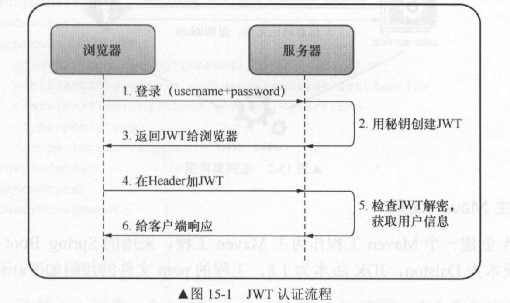

#### Oath2

---

> oath2 是标准的授权协议，oath1取代 oath1，是完全的舍弃，不会向后兼容。
>
> oath2 允许不同的客户端通过认证和授权的形式来访问被保护起来的资源
>
> 1. 用户(资源持有者)打开客户端，客户端询问用户授权
> 2. 用户同意授权
> 3. 客户端向授权服务器申请授权
> 4. 授权服务器对客户端进行认证，也包括用户信息的认证，认证成功之后授权给予令牌
> 5. 客户端获取令牌之后，携带令牌向资源服务器请求资源。
> 6. 资源服务器确认令牌正确无误之后，向客户端释放资源。

---

**如何使用Spring oath2**

> `Oath2` 分为2部分，
>
> 1. `Oath2 provider`  
> 2. `Oath2 client` 
>
> `Oath2 provider`   负责公开被 `oath2` 保护起来的资源，需要配置代表用户的客户端信息。被用户允许的客户端就可以访问被 `Oath2` 保护起来的资源。`Oath2 provider`   **通过管理和验证 `Oath2` 令牌来控制客户端是否有权限访问被保护的资源**，另外 `Oath2 provider`   还需要为用户提供认证的 API 接口，根据认证接口，用户提供账号和密码等信息，来确认客户端是否被 `Oath2 provider`   授权，这样做的好处就是第三方客户端不需要获取客户的账号和密码，通过授权的方式就可以访问被保护的资源。
>
> `Oath2 provider`   的角色被分为 `Authorization Service` (授权服务) 和 `Resource Service` (资源服务)， 他们通常不会再同一个服务中，可能一个  `Authorization Service`  会对应多个 `Resource Service` `Spring oath2` 需要配合 `Spring security` 一起使用，所有请求 经过 `Spring mvc`处理 之后再经过一层一层的 `Spring security` 过滤器。
>
> ` Spring security` 过滤器链中有以下两个节点
>
> 1. 授权节点  
> 2. 获取Token 节点
>

---

**JWT**

> JSON Web Token，将主体信息包装为Json 对象，主体信息(包含所有的主体信息)是通过数字签名进行加密和验证的。是加密后的字符串，数据体积非常小。可以通过post 请求参数或者请求头发送。

**结构**

主要有三个部分，分别以 . 分割，

* Header
* Payload
* Signature

> Xxxx.yyyyy.zzzzz
>
> **Header**
>
> 通常两部分组成，令牌的类型(即 JWT) 和使用的算法类型，如 HMAC, SHA256, HS256
>
> {	
>
> ​	"alg": "HS256",
>
> ​	"typ": "JWT"
>
> }
>
> **Payload**
>
> 包含用户的一些信息和Claim，三种claim：保留、公开、私人
>
> {
>
> ​	"sub":"1234455566",
>
> ​	"name":"John Doe",
>
> ​	"admin": true
>
> }
>
> **Signature**
>
> 需要将Base64编码后的Header、Payload 和密匙进行签名
>
> > HMACSHA256(	
> >
> > ​	base64UrlEncode(header) + "."base64UrlEncode(payload), secret 
> >
> > )

**JWT 使用场景**

> **认证**：最常见的场景，**一旦用户登录成功JWT后，后续的没个请求将会携带该JWT**，该JWT包含用户信息，权限点等信息，根据JWT包含的信息，资源服务可以控制该JWT可以访问的资源范围。
>
> **信息交换**：JWT 是在各方面之间安全传输信息的一种方式，JWT使用前面加密，安全性很高，另外，**当使用Header 和 Payload 计算签名的时候，还可以验证内容是否被修改**。

**如何使用JWT**

> 当用户通过提供用户名、密码向服务器请求获取JWT，服务器判断用户的用户名和密码是否正确，之后将用户和权限点进过加密以JWT的形式返回给客户端，在以后的每次请求中获取到该JWT的客户端都需要。携带该JWT，这样做的好处以后的请求不需要通过Uaa服务来判断该请求的用户的权限，在微服务中利用JWT 可以实现单点登录

