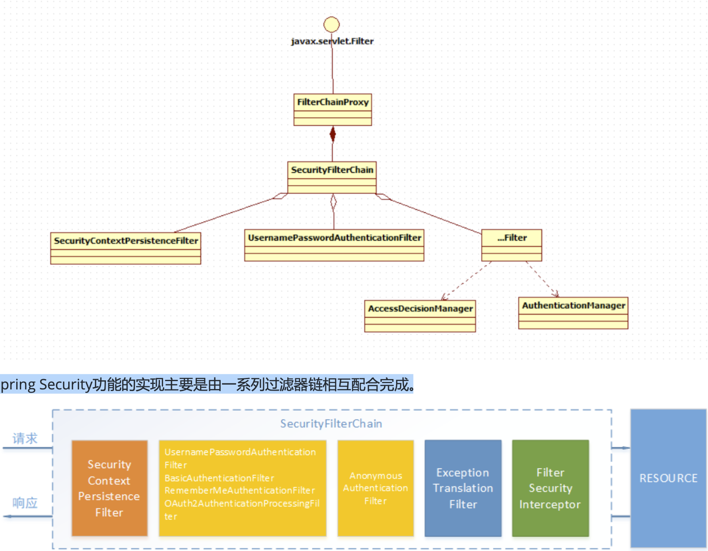
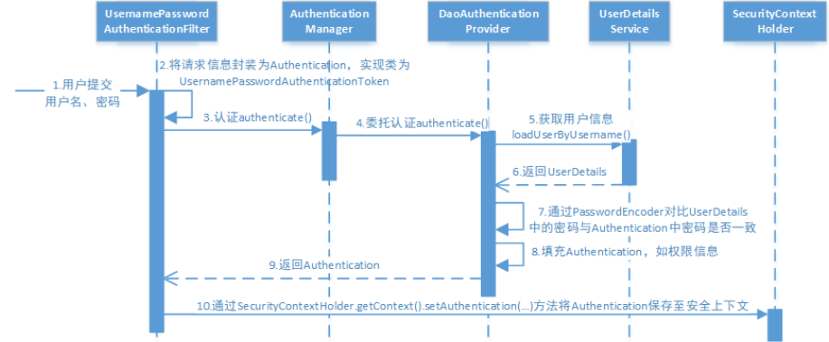
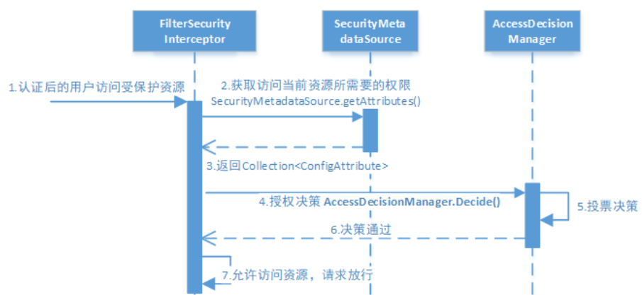

[博客](https://www.cnblogs.com/zyly/p/12286285.html#_label5)

---

### 一个安全框架需要有什么功能

* 需要对一些不需要权限的接口放行，如静态资源 `/login` 页面，同时需要对一些接口进行**身份验证**
* 需要做**授权**， 例如说不是所有登录的人都有权限访问 `/source` 接口，只有特定身份的人才有。
* 缓存(可选)，对于已经登录的用户(缓存中有)，可以在缓存中直接获取信息

概括来就是：鉴权(你是谁)、授权(你有哪些权利)

---

几个重要的过滤器：

`UsernamePasswordAuthenticationFilter`： 处理基于表单的方式登录验证，只有请求方法为 `post` 才生效。

`FilterSecurityInterceptor`: 判断当前请求身份是否成功，是否有相对应的权限，当身份失败或者权限不足的时候会抛出异常。

`ExceptionTranslateFilter`: 捕获异常并处理。

#### 简单的表单登录流程

* 用户提交用户名、密码，被`SecurityFilterChain` 中的`UserPasswordAuthenticationFilter` 捕获封装为 `Autnentication`，通常情况下会是 `UsernamePasswordAuthenticationToken` 这个实现类。
* 然后过滤器交给 `Authentication`，提交到认证管理器`AuthenticationManager` 进行认证。
  * `AuthenticationManager` 是认证的核心接口，也是认证的发起点。
  * `AuthenticationManager` 的实现类是 `ProviderManager` , 这个类维护着系列的`AuthenticationProvider` 类型的认证器，也就是在认证过程中`ProviderManager` 中的认证方法，会有一个`for` 循环，没个循环就是一个 ``AuthenticationProvider` ` 实例，该实例完成真正的认证。
  * `AuthenticationManager` -> `ProviderManager` -> `AuthenticationProvider`s
* 认证成功之后，`AuthenticationManager` 会返回一个被填充满信息的(权限信息、身份信息、细节信息，密码一般会被移除) 的`Authentication` 示例
* `SecurityContextHolder` 安全上下文容器将第3步填充了信息的 `Authentication` ，通过 `SecurityContextHolder.getContext().setAuthentication(…)`方法，设置到其中

#### 授权

`spring Security` 可以通过`http.authorizeRequests()` 对`Web` 资源进行授权保护，`Spring Security` 使用标准的`Filter` 对 `Web` 请求的拦截，最终实现对资源的授权访问。

