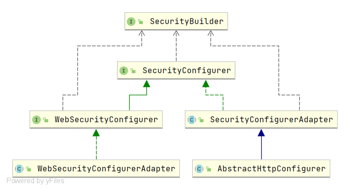
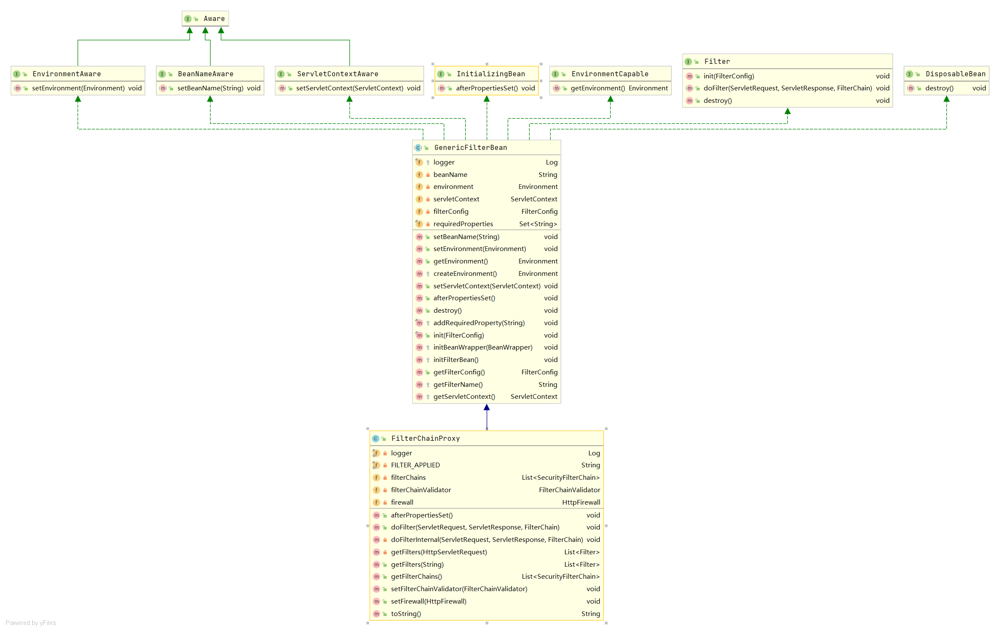
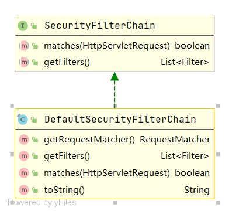

[博客](https://blog.csdn.net/qq_36221788/category_11009647.html)

---

### 概况

* 整体架构
* 启动流程


#### 整个架构原理

> 启动过程构建一个 `springSecurityFilterChain` 的过滤器


#### 程序启动入口

```javascript
WebSecurityEnablerConfiguration 
```

该类上注解了 `@EnableWebSecurity`,  该注解导入类 `WebSecurityConfiguration`,  该类中定义了各种`bean`

---


#### 框架整个接口

> 框架主要由 `建造者` 和 `配置器` 构成，在服务启动的时候就是 `通过适配器对构造者进行配置`， 配置完成之后建造者构建出核心过滤器。

* 适配器

   

* 构造器

   

  

  > 一般我们会使用底层的两个配置器 `WebSecurityConfigurerAdapter` 和 `AbstractHttpConfigurer` 

  

* `WebSecurity` 和 `HttpSecurity` 都是 建造者
* `WebSecurity` 的构建目标是` FilterChainProxy` 对象，即核心过滤器 `springSecurityFilterChain`
* `HttpSecurity` 的构建目标只是 `FilterChainProxy` 对象中一组 `SecurityFilterChain` 的一个
* 配置器 是通过 `HttpSecurity` 配置进 建造者 中用于构建 `SecurityFilterChain`


### 构造器


主要类，主要方法

#### `SecurityBuilder`

```java
public interface SecurityBuilder<O> {
	O build() throws Exception;
}
```

#### `AbstractSecurityBuilder`

原子判断，保证构建过程只被构建一次

```java
public abstract class AbstractSecurityBuilder<O> implements SecurityBuilder<O> {
	private AtomicBoolean building = new AtomicBoolean();

	private O object;

	public final O build() throws Exception {
        // 构建方法，保证只构建一次
		if (this.building.compareAndSet(false, true)) {
			this.object = doBuild();
			return this.object;
		}
		throw new AlreadyBuiltException("This object has already been built");
	}

	/**
	 * Gets the object that was built. If it has not been built yet an Exception is
	 * thrown.
	 * @return the Object that was built
	 */
	public final O getObject() {
		if (!this.building.get()) {
			throw new IllegalStateException("This object has not been built");
		}
		return this.object;
	}

	/**
	 * Subclasses should implement this to perform the build.
	 * @return the object that should be returned by {@link #build()}.
	 留给底层实现
	 */
	protected abstract O doBuild() throws Exception;
}
```

#### `AbstractConfiguredSecurityBuilder`

说明：主要关注 `add()`、`doBuild()`、`init()`、`configure()`、`performBuild()`
`add()` ：允许配置器应用到建造者中，实际上就是把各种配置添加到该类定义的配置器列表 `configurers`、`configurersAddedInInitializing`
`doBuild()`：实现的父类方法，真正执行构建的方法，方法中调用了` init()`、`configure()
init()`：循环初始化所有的 `configurers`、`configurersAddedInInitializing` 配置
`configure()`：循环配置所有的 `configurers`
`performBuild()`：配置完所有之后，进行实际的执行，该方法是抽象方法，留给下层子类`（WebSecurity、HttpSecurity） `实现

```java
public abstract class AbstractConfiguredSecurityBuilder<O, B extends SecurityBuilder<O>>
		extends AbstractSecurityBuilder<O> {

	private final LinkedHashMap<Class<? extends SecurityConfigurer<O, B>>, List<SecurityConfigurer<O, B>>> configurers = new LinkedHashMap<>();
	private final List<SecurityConfigurer<O, B>> configurersAddedInInitializing = new ArrayList<>();

	private final Map<Class<?>, Object> sharedObjects = new HashMap<>();

	private final boolean allowConfigurersOfSameType;

	private ObjectPostProcessor<Object> objectPostProcessor;

	public O getOrBuild() {
		if (isUnbuilt()) {
			try {
				return build();
			}
			catch (Exception e) {
				logger.debug("Failed to perform build. Returning null", e);
				return null;
			}
		}
		else {
			return getObject();
		}
	}

	@SuppressWarnings("unchecked")
	public <C extends SecurityConfigurerAdapter<O, B>> C apply(C configurer)
			throws Exception {
		configurer.addObjectPostProcessor(objectPostProcessor);
		configurer.setBuilder((B) this);
		add(configurer);
		return configurer;
	}

	public <C extends SecurityConfigurer<O, B>> C apply(C configurer) throws Exception {
		add(configurer);
		return configurer;
	}

	@SuppressWarnings("unchecked")
	public <C> void setSharedObject(Class<C> sharedType, C object) {
		this.sharedObjects.put(sharedType, object);
	}

	@SuppressWarnings("unchecked")
	public <C> C getSharedObject(Class<C> sharedType) {
		return (C) this.sharedObjects.get(sharedType);
	}

	public Map<Class<?>, Object> getSharedObjects() {
		return Collections.unmodifiableMap(this.sharedObjects);
	}

	@SuppressWarnings("unchecked")
	private <C extends SecurityConfigurer<O, B>> void add(C configurer) {
		Assert.notNull(configurer, "configurer cannot be null");

		Class<? extends SecurityConfigurer<O, B>> clazz = (Class<? extends SecurityConfigurer<O, B>>) configurer
				.getClass();
		synchronized (configurers) {
			if (buildState.isConfigured()) {
				throw new IllegalStateException("Cannot apply " + configurer
						+ " to already built object");
			}
			List<SecurityConfigurer<O, B>> configs = allowConfigurersOfSameType ? this.configurers
					.get(clazz) : null;
			if (configs == null) {
				configs = new ArrayList<>(1);
			}
			configs.add(configurer);
			this.configurers.put(clazz, configs);
			if (buildState.isInitializing()) {
				this.configurersAddedInInitializing.add(configurer);
			}
		}
	}

	@SuppressWarnings("unchecked")
	public <C extends SecurityConfigurer<O, B>> List<C> getConfigurers(Class<C> clazz) {
		List<C> configs = (List<C>) this.configurers.get(clazz);
		if (configs == null) {
			return new ArrayList<>();
		}
		return new ArrayList<>(configs);
	}

	@SuppressWarnings("unchecked")
	public <C extends SecurityConfigurer<O, B>> List<C> removeConfigurers(Class<C> clazz) {
		List<C> configs = (List<C>) this.configurers.remove(clazz);
		if (configs == null) {
			return new ArrayList<>();
		}
		return new ArrayList<>(configs);
	}

	@SuppressWarnings("unchecked")
	public <C extends SecurityConfigurer<O, B>> C getConfigurer(Class<C> clazz) {
		List<SecurityConfigurer<O, B>> configs = this.configurers.get(clazz);
		if (configs == null) {
			return null;
		}
		if (configs.size() != 1) {
			throw new IllegalStateException("Only one configurer expected for type "
					+ clazz + ", but got " + configs);
		}
		return (C) configs.get(0);
	}

	@SuppressWarnings("unchecked")
	public <C extends SecurityConfigurer<O, B>> C removeConfigurer(Class<C> clazz) {
		List<SecurityConfigurer<O, B>> configs = this.configurers.remove(clazz);
		if (configs == null) {
			return null;
		}
		if (configs.size() != 1) {
			throw new IllegalStateException("Only one configurer expected for type "
					+ clazz + ", but got " + configs);
		}
		return (C) configs.get(0);
	}

	@SuppressWarnings("unchecked")
	public O objectPostProcessor(ObjectPostProcessor<Object> objectPostProcessor) {
		Assert.notNull(objectPostProcessor, "objectPostProcessor cannot be null");
		this.objectPostProcessor = objectPostProcessor;
		return (O) this;
	}

	protected <P> P postProcess(P object) {
		return this.objectPostProcessor.postProcess(object);
	}

	@Override
	protected final O doBuild() throws Exception {
		synchronized (configurers) {
			buildState = BuildState.INITIALIZING;

			beforeInit();
			init();

			buildState = BuildState.CONFIGURING;

			beforeConfigure();
			configure();

			buildState = BuildState.BUILDING;

			O result = performBuild();

			buildState = BuildState.BUILT;

			return result;
		}
	}

	protected void beforeInit() throws Exception {
	}

	protected void beforeConfigure() throws Exception {
	}

	protected abstract O performBuild() throws Exception;

	@SuppressWarnings("unchecked")
	private void init() throws Exception {
		Collection<SecurityConfigurer<O, B>> configurers = getConfigurers();

		for (SecurityConfigurer<O, B> configurer : configurers) {
			configurer.init((B) this);
		}

		for (SecurityConfigurer<O, B> configurer : configurersAddedInInitializing) {
			configurer.init((B) this);
		}
	}

	@SuppressWarnings("unchecked")
	private void configure() throws Exception {
		Collection<SecurityConfigurer<O, B>> configurers = getConfigurers();

		for (SecurityConfigurer<O, B> configurer : configurers) {
			configurer.configure((B) this);
		}
	}

	private Collection<SecurityConfigurer<O, B>> getConfigurers() {
		List<SecurityConfigurer<O, B>> result = new ArrayList<>();
		for (List<SecurityConfigurer<O, B>> configs : this.configurers.values()) {
			result.addAll(configs);
		}
		return result;
	}
}
```


#### `HttpSecurityBuilder`

该接口被 `HttpSecurity` 所实现，主要声明了一些操作 `Filter` 的接口方法。

```java
public interface HttpSecurityBuilder<H extends HttpSecurityBuilder<H>> extends
		SecurityBuilder<DefaultSecurityFilterChain> {

	<C extends SecurityConfigurer<DefaultSecurityFilterChain, H>> C getConfigurer(
			Class<C> clazz);

	<C extends SecurityConfigurer<DefaultSecurityFilterChain, H>> C removeConfigurer(
			Class<C> clazz);
    
	<C> void setSharedObject(Class<C> sharedType, C object);

	<C> C getSharedObject(Class<C> sharedType);

	H authenticationProvider(AuthenticationProvider authenticationProvider);

	H userDetailsService(UserDetailsService userDetailsService) throws Exception;

	H addFilterAfter(Filter filter, Class<? extends Filter> afterFilter);

	H addFilterBefore(Filter filter, Class<? extends Filter> beforeFilter);

	H addFilter(Filter filter);
}
```

#### `FilterChainProxy`

> 在介绍主要建造者之前先看看核心过滤器 `springSecurityFilterChain` 的类型 `FilterChainProxy`



* 继承了 `GenericFilterBean` 类，这个类实现了 `Filter` 接口，所以 `FilterChainProxy` 也是个过滤器。
* 它其实是过滤器链的一个代理，真正起作用的是它内部维护的一组 `SecurityFilterChain` 过滤器链，`SecurityFilterChain` 是一个接口，
* 有个默认实现类 `DefaultSecurityFilterChain` ，实现类里面主要是一组 `URL` 和一组 过滤器（针对什么样的URL 执行什么过滤器）



#### `WebSecurity`

`WebSecurity` 的目标是构建 `FilterChainProxy` 对象，即构建核心过滤器 `springSecurityFilterChain`。

* 主要关注由 `AbstractConfiguredSecurityBuilder` 继承下来的方法实现 `performBuild()`
* 方法中首先创建了一个 `securityFilterChains`
* 然后第一个for循环将那些忽略拦截的URL封装成一堆 `DefaultSecurityFilterChain` 添加进 `securityFilterChains`
* 第二个for循环调用的是 build() 方法，其实它最终调用的是 `HttpSecurity` 实现的 `performBuild()` 方法，返回值也是 
* `DefaultSecurityFilterChain`，随后添加进 `securityFilterChains`
* 最后根据 `securityFilterChains` 创建出 `FilterChainProxy` 对象。

源码在 `springSecuritySrc` 目录下


#### `HttpSecurity`

>要会用此框架，必须知道 `HttpSecurity`

它的目标是构建一个 `SecurityFilterChain` 过滤器链实例，它 掌握着所有`Filter`的“生杀大权”，想要谁过滤就配置起来，不想要谁过滤就不配置或者禁用掉（因为有些会被默认配置）。
大致可以将其内方法分为两大类型，一类是框架默认给开发者提供的认证配置方法，可供开发者选择性调用，比如：

> formLogin()、openidLogin()、headers()、cors()、sessionManagement()、portMapper()、jee()、x509()、rememberMe()、authorizeRequests()、requestCache()、exceptionHandling()、securityContext()、servletApi()、csrf()、logout()、anonymous()、requiresChannel()、httpBasic()、requestMatchers()、addFilterAt()、requestMatcher()、antMatcher()、mvcMatcher()、regexMatcher()、getOrApply()

- 还有一类 `可供开发者配置自己的过滤器`，比如：

> setSharedObject()、beforeConfigure()、authenticationProvider()、userDetailsService()、getAuthenticationRegistry()、addFilterAfter()、addFilterBefore()、addFilter()

还有一个方法 `performBuild()` ，和 `WebSecurity` 一样继承自 `AbstractConfiguredSecurityBuilder` ，目的是创建 `SecurityFilterChain` 实例。


#### 总结

* `WebSecurity` 和 `HttpSecurity` 都是 建造者
* `WebSecurity` 的构建目标是` FilterChainProxy` 对象，即核心过滤器 `springSecurityFilterChain`
* `HttpSecurity` 的构建目标只是 `FilterChainProxy` 对象中一组 `SecurityFilterChain` 的一个
* 配置器 是通过 `HttpSecurity` 配置进 建造者 中用于构建 `SecurityFilterChain`


### 配置器

#### `SecurityConfiger`


#### `SecurityConfigurerAdapter`

 `init()` 和 `configure()` 皆为空实现，由子类去实现。它主要提供了 `and()` 方法，用于获得对正在配置的 `{@link SecurityBuilder}` 的访问权。

- `postProcess(T object)`：对传入的对象进行后置处理。
- `and()、getBuilder()`：返回当前正在配置的 `SecurityBuilder` 。


#### `AbstractHttpConfigurer`

> 继承了 `SecurityConfigurerAdapter` 类，增加了禁用功能，一般自定义配置器时会继承这个类。

---

### 如何使用 SpringSecurity

* 其实在开发的时候，`建造者我们是不会动的，我们能做的只是将我们自己的配置添加到整个架构下`，所以我们能扩展的是配置器
* 可以参考其他一些源码中默认的配置器，定义我们自己 `HttpConfigurer` 也继承 `AbstractHttpConfigurer` ，将自定义的单个过滤器配置到 HttpSecurity。
* 可以定义自己的 `WebSecurityConfig` 配置器，继承` WebSecurityConfigurerAdapter`，将源码中默认的一些过滤器和自定义的过滤器
* 配置到 `HttpSecurity` ，由建造者创建后形成一条过滤器链。
* 可以这么理解记忆（但不是很准确）
  * `AbstractHttpConfigurer` 配置器是用来配置 `HttpSecurity` 建造者
  * `WebSecurityConfigurerAdapter` 配置器是用来配置` WebSecurity `建造者


### 启动过程

从这里开始 `org.springframework.security.config.annotation.web.configuration.WebSecurityConfiguration#setFilterChainProxySecurityConfigurer`

* 创建 `WebSecurity` 建造者对象，`apply()` 初始配置。

```java
public void setFilterChainProxySecurityConfigurer(
			ObjectPostProcessor<Object> objectPostProcessor,
			@Value("#{@autowiredWebSecurityConfigurersIgnoreParents.getWebSecurityConfigurers()}") List<SecurityConfigurer<Filter, WebSecurity>> webSecurityConfigurers)
			throws Exception {
		webSecurity = objectPostProcessor
				.postProcess(new WebSecurity(objectPostProcessor));
		if (debugEnabled != null) {
			webSecurity.debug(debugEnabled);
		}

		webSecurityConfigurers.sort(AnnotationAwareOrderComparator.INSTANCE);

		Integer previousOrder = null;
		Object previousConfig = null;
		for (SecurityConfigurer<Filter, WebSecurity> config : webSecurityConfigurers) {
			Integer order = AnnotationAwareOrderComparator.lookupOrder(config);
			if (previousOrder != null && previousOrder.equals(order)) {
				throw new IllegalStateException(
				"@Order on WebSecurityConfigurers must be unique. Order of "
					+ order + " was already used on " + previousConfig + ", so it cannot be used on "
					+ config + " too.");
			}
			previousOrder = order;
			previousConfig = config;
		}
		for (SecurityConfigurer<Filter, WebSecurity> webSecurityConfigurer : webSecurityConfigurers) {
			webSecurity.apply(webSecurityConfigurer);
		}
		this.webSecurityConfigurers = webSecurityConfigurers;
	}
```

- 建造者 `webSecurity` 调用 `build()` 方法，开始构建 `springSecurityFilterChain`。

```java
@Bean(name = AbstractSecurityWebApplicationInitializer.DEFAULT_FILTER_NAME)
public Filter springSecurityFilterChain() throws Exception {
    boolean hasConfigurers = webSecurityConfigurers != null
        && !webSecurityConfigurers.isEmpty();
    if (!hasConfigurers) {
        WebSecurityConfigurerAdapter adapter = objectObjectPostProcessor
            .postProcess(new WebSecurityConfigurerAdapter() {
            });
        webSecurity.apply(adapter);
    }
    return webSecurity.build();
}
```

* `springSecurityFilterChain()` 方法中，`webSecurity `调用了 `build() `方法
* 方法进去继续调用了 `doBuild()`，该方法依次调用各个配置器的 `init()`、`configure()` 方法
* 等配置到位后，开始执行` performBuild()`，进行核心过滤器 `FilterChainProxy` 的创建

```java
@Override
protected final O doBuild() throws Exception {
    synchronized (configurers) {
        buildState = BuildState.INITIALIZING;

        beforeInit();
        init(); // 进入，然后调用 new HttpSecurity 

        buildState = BuildState.CONFIGURING;

        beforeConfigure();
        configure();

        buildState = BuildState.BUILDING;

        O result = performBuild();

        buildState = BuildState.BUILT;

        return result;
    }
}
```

- `webSecurity` 调用的 `performBuild()` 方法就创建了核心过滤器 `FilterChainProxy`。

注意创建过程可不是这么简单的由 `webSecurity` 一次性调用下来，就是说 `doBuild()` 可不只是被 `webSecurity` 对象调用，会被很多创建者重复调用，重复的去走创建流程，比如被一堆的 `HttpSecurity` 调用目的是创建单条过滤器链

---

#### `performBuild`

该方法被 `WebSecurity`、`HttpSecurity`、`AuthenticationManagerBuilder` 三个建造者所实现

- `HttpSecurity#performBuild`：创建核心过滤器中单条过滤器链：SecurityFilterChain

```java
@Override
protected DefaultSecurityFilterChain performBuild() throws Exception {
    Collections.sort(filters, comparator);
    return new DefaultSecurityFilterChain(requestMatcher, filters);
}
```

- `WebSecurity#performBuild`：创建核心过滤器：FilterChainProxy

```java
@Override
protected Filter performBuild() throws Exception {
 
    int chainSize = ignoredRequests.size() + securityFilterChainBuilders.size();
    List<SecurityFilterChain> securityFilterChains = new ArrayList<SecurityFilterChain>(
        chainSize);
    for (RequestMatcher ignoredRequest : ignoredRequests) {
        securityFilterChains.add(new DefaultSecurityFilterChain(ignoredRequest));
    }
    for (SecurityBuilder<? extends SecurityFilterChain> securityFilterChainBuilder : securityFilterChainBuilders) {
        securityFilterChains.add(securityFilterChainBuilder.build());
    }
    FilterChainProxy filterChainProxy = new FilterChainProxy(securityFilterChains);
    if (httpFirewall != null) {
        filterChainProxy.setFirewall(httpFirewall);
    }
    filterChainProxy.afterPropertiesSet();

    Filter result = filterChainProxy;
    if (debugEnabled) {
        logger.warn("\n\n"
                    + "********************************************************************\n"
                    + "**********        Security debugging is enabled.       *************\n"
                    + "**********    This may include sensitive information.  *************\n"
                    + "**********      Do not use in a production system!     *************\n"
                    + "********************************************************************\n\n");
        result = new DebugFilter(filterChainProxy);
    }
    postBuildAction.run();
    return result;
}
```

* 这个类是在 `WebSecurityConfigurerAdapter#init` 方法中创建的，创建了一个新线程，最后在 `WebSecurity#performBuild` 中启动
* 该线程 `postBuildAction.run()`; 将这个过滤器添加到每个过滤器链的末位，在认证过程中保证该过滤器是最后执行的。
* 这个过滤器是整个链条的最后一环，过了它就可以访问我们后台的资源服务了。
* `Spring Security`的访问控制功能，它起到了至关重要的作用，后面文章来对它进行详细解析。

