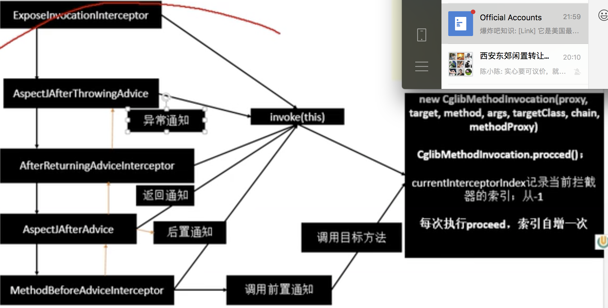

#### AOP：动态代理

AOP 得初衷

* 不重复
* 关注分离，非功能性需求从功能性需求剥离
  * 好处： 集中管理，代码可读性、扩展性增强

问题：

* 为什么要使用 AOP 得变成范式
* AOP 使用场景
* AOP 2大核心要点


指在程序运行期间动态的将某段代码切入到执行方法指定位置进行运行的编程方式。

在业务逻辑运行的时候将日志进行打印(方法之前、方法运行结束，方法出现异常等)

切面的通知Advice方法：

* 前置通知(@Before)：目前方法运行之前通知
* 后置通知(@After)：目标方法运行之后通知,无论方法正常结束还是异常结束(可以理解为该方法在 finally 模块中最后调用)
* 返回通知(@AfterReturning)：目标方法正常返回结果通知
* 异常通知(@AfterThrowing)：目标方法跑出异常之后通知
* 环绕通知(@Around)：动态代理，手动推进目标方法运行(joinPoint.proceed)， 执行这个方法就是执行了目标方法，然后再这个方法前，后，以及出现异常的时候执行某些事情

---

实例化：是对象创建的过程。比如使用构造方法new对象，为对象在内存中分配空间。

初始化：是为对象中的属性赋值的过程。

---

```java
public class LogAspect {
    /*
         匹配包下的任意方法的任意参数
         @Before("com.atguigu.secondCodeRecord.aop.MathCalcutor.*(..)")

         匹配包下的任意含有2个参数的方法
         @Before("com.atguigu.secondCodeRecord.aop.MathCalcutor.*(int, int)")

     */
    @Before("com.atguigu.secondCodeRecord.aop.MathCalcutor.*(..)")
    public void logStart() {
        System.out.println("除法进行中 ..... 参数列表是， {}");
    }

    @After("com.atguigu.secondCodeRecord.aop.MathCalcutor.div")
    public void logEnd() {
        System.out.println("除法结束 ....");
    }

    @AfterReturning("com.atguigu.secondCodeRecord.aop.MathCalcutor.div")
    public void logReturn() {
        System.out.println("除法正常返回。。。运行结束 ,{}");
    }

    @AfterThrowing("com.atguigu.secondCodeRecord.aop.MathCalcutor.div")
    public void logException() {
        System.out.println("除法异常，异常信息是, {}");
    }
                    
    @Around("pointCut()")
	public Object around(ProceedingJoinPoint joinPoint) {
		// 实现环绕通知
		System.out.println("Before");

		System.out.println("执行方法");
		try {
			return joinPoint.proceed();
		} catch (Throwable throwable) {
			System.out.println("AfterThrowing");
		}

		System.out.println("After");
		return null;
	}
}


public class MathCalcutor {
    public int div(int a, int b) {
        return a/b;
    }
}
```

或者可以抽取公共的方法切入点

```java
public class MathCalcutor {

    public int div(int a, int b) {
        return a/b;
    }
}

/*
    告诉Spirng 这是一个切面类
 */
@Aspect
public class LogAspect {


    /*
        抽取公共的切入点表达式
        *匹配任意数量得字符
        + 匹配指定类及其子类
        .. 一般用于匹配任意数得子包或者参数
        
        匹配包/类型
        匹配secondCodeRecordService 下所有得方法
        @Pointcut("within(com.atguigu.secondCodeRecordService)")
        
        匹配 atguigu 包下所有得类得所有方法
        @Pointcut("within(com.atguigu..*)")
        
        匹配 atguigu 包下所有得类得所有方法
        @Pointcut("this(com.atguigu..*)")
        
        execution: 参数匹配
        args：也能实现同样得功能，且更简单
        
        注解匹配
        @annotation(xx): 匹配标注有 xx 注解得方方法
        @within(xx)：标注注解 xx 下得类得方法
        @target
        @args
     */
    @Pointcut("execution(public int com.atguigu.secondCodeRecord.aop.MathCalcutor.*(..))")
    public void pointcut(){}

    /*
         匹配包下的任意方法的任意参数
         @Before("com.atguigu.secondCodeRecord.aop.MathCalcutor.*(..)")

         匹配包下的任意含有2个参数的方法
         @Before("com.atguigu.secondCodeRecord.aop.MathCalcutor.*(int, int)")

     */
    @Before("pointcut()")
    public void logStart(JoinPoint joinPoint) {
        Object[] args = joinPoint.getArgs();
        String methodName = joinPoint.getSignature().getName();

        System.out.print("methodName: " + methodName + " ");
        System.out.print("方法参数： " + Arrays.asList(args) + " ");
        System.out.println("除法进行中 .....");
    }

    /*
        本类中可以直接使用 @Before("pointcut()")
        如果在类的外面，那么需要写 pointcut 的全路径
     */
    @After("com.atguigu.secondCodeRecord.aop.LogAspect.pointcut()")
    public void logEnd(JoinPoint joinPoint) {
        String methodName = joinPoint.getSignature().getName();
        System.out.print("methodName: " + methodName + " ");
        System.out.println("除法结束 ....");
    }

    /*
        returning = "result" 指定 result 接收返回值
        这里目标方法返回之后，返回的结果作为这里的入参
     */
    @AfterReturning(value = "pointcut()", returning = "result")
    public void logReturn(Object result) {
        System.out.println("除法正常返回。。。运行结束 ,{result}： " + result);
    }

    /*
        throwing = "exception" 指定 exception 接收异常值
        这里目标抛出异常之后，异常作为这里的入参
     */
    @AfterThrowing(value = "pointcut()", throwing = "exception")
    public void logException(Exception exception) {
        System.out.println("除法异常，异常信息是, {} " + exception.getMessage());
    }
}
```

启动aop

```java
@Configuration
@EnableAspectJAutoProxy // 启动 aop
public class MainConfigAOP {

    @Bean
    public MathCalcutor mathCalcutor() {
        return new MathCalcutor();
    }

    @Bean
    public LogAspect logAspect() {
            return new LogAspect();
    }
}
```

---

##### EnableAspectJAutoProxy 源码【给容器中注册了什么组件、组件什么时候工作、组件的功能是什么】

> 1.  @EnableAspectJAutoProxy 才开启的aop 的功能
>
> 2. 使用这个主键，将类 `@Import(AspectJAutoProxyRegistrar.class)` 注入，且这个类实现了接口
>
>    ```java
>    AspectJAutoProxyRegistrar implements ImportBeanDefinitionRegistrar 
>    ```
>
>    该接口的方法`registerBeanDefinitions` 给容器注入bean，
>
>    注册bean`AnnotationAwareAspectJAutoProxyCreator`并给一个名字 `org.springframework.aop.config.internalAutoProxyCreator`
>
> 3. 现在看看这个组件的继承关系
>
>    ```java
>    AnnotationAwareAspectJAutoProxyCreator
>      AspectJAwareAdvisorAutoProxyCreator
>      	AbstractAdvisorAutoProxyCreator
>      		AbstractAutoProxyCreator
>      			ProxyProcessorSupport
>      			SmartInstantiationAwareBeanPostProcessor, 
>    			  BeanFactoryAware(setBeanFactory 方法)
>    ```
>
>    这里关注后置处理器(在bean 初始化前后做了一些工作)，
>
>    还有 BeanFactoryAware(自动注入BeanFactory) 的功能。
>
> 4. ```java
>    然后一层一层往上看，依次打断点
>    AbstractAutoProxyCreator.setBeanFactory，也有后置处理的一些逻辑
>    AbstractAutoProxyCreator.postProcessBeforeInstantiation 后置处理器
>    AbstractAutoProxyCreator.postProcessAfterInitialization
>       
>    AbstractAdvisorAutoProxyCreator.setBeanFactory
>    	AbstractAdvisorAutoProxyCreator.initBeanFactory
>         
>    AnnotationAwareAspectJAutoProxyCreator.initBeanFactory
>       
>    创建个和注册 AnnotationAwareAspectJAutoProxyCreator 的流程
>    调用流程
>    1. 传入主配置类 创建ioc new   	
>       AnnotationConfigApplicationContext(MainConfigAOP.class)
>         
>    2. 注册配置类register(annotatedClasses)
>       调用 refresh(); 刷新容器(创建bean，初始化容器)
>         
>    3. registerBeanPostProcessors(beanFactory); 注册bean 的后置处理器，
>       拦截bean的创建(Register bean processors that intercept bean creation.)
>         
>       1. 获取到定义了所有BeanPostProcessor, beanFactory.getBeanNamesForType
>       2. 还给容器中增加了其他的 BeanPostProcessorChecker  	
>       3. 将 BeanPostProcessor 进行分类，按照实现优先级接口分为 
>          PriorityOrdered、Ordered、NonOrdered 
>       4. 创建 BeanPostProcessor doCreateBean 对 
>      		获取orderedPostProcessor  getBean -> doGetBean 如果获取不到就获取 bean
>          createBean
>          1.doCreateBean.createBeanInstance 创建实例
>          2.populateBean(beanName, mbd, instanceWrapper); 属性赋值
>          3.initializeBean(beanName, exposedObject, mbd); 初始化
>         		1. invokeAwareMethods(beanName, bean); aware 接口的赋值
>            2. applyBeanPostProcessorsBeforeInitialization(wrappedBean, beanName);
>    					 使用后置处理器的，获取所有后置处理器前置处理方法，然后调用处理器的 	
>               postProcessBeforeInitialization 方法
>            3. invokeInitMethods(beanName, wrappedBean, mbd); 
>    					 执行自定义的初始化方法，就是生命周期中的那些 init 以及destroy 方法
>            4. wrappedBean=applyBeanPostProcessorsAfterInitialization(wrappedBean, 
>                                                                        beanName);
>    				   使用后置处理器的，获取所有后置处理器后置处理方法，然后调用处理器的 
>               postProcessAfterInitialization 方法
>            5. 最后调到 setBeanFactory、initBeanFactory 方法
>        5. this.aspectJAdvisorFactory = new 
>           ReflectiveAspectJAdvisorFactory(beanFactory);
>    			 反射创建 aspectJAdvisorFactory 以及 this.aspectJAdvisorsBuilder
>       
>    4. AnnotationAwareAspectJAutoProxyCreator 创建结束
>    5. 排序 sortPostProcessors(orderedPostProcessors, beanFactory);
>    6. 添加 pp 到bf registerBeanPostProcessors(beanFactory, orderedPostProcessors);
>    ```
>
> 5. 那么创建的 `AnnotationAwareAspectJAutoProxyCreator` 会去完成什么功能呢？
>
>    它是 `InstantiationAwareBeanPostProcessor` 类型的后置处理器，这种类型的后置处理器是如何处理的呢？
>
>    ```java
>    1. 在refresh() 方法里面后段调用 InstantiationAwareBeanPostProcessor 
>      
>    2. finishBeanFactoryInitialization 完成 beanFactory的初始化工作，
>       创建剩下的单实例bean
>    
>    3. 遍历所有的 bean，依次创建对象，getBean -> doGetBean -> getSingleton(beanName)
>       先从缓存中获取，如果能获取到，说明bean 是之前被创建过的，直接使用，否则创建,
>    	 所有创建过的bean 都被缓存起来，保证所有的bean是单实例的
>    
>    4. AbstractAutowireCapableBeanFactory.createBean
>       1. resolveBeforeInstantiation(beanName, mbdToUse);
>          写 BeanPostProcessors 创建一个代理对象，而不是之间创建一个实例
>           1. 后置处理器先尝试返回对象
>              bean = applyBeanPostProcessorsBeforeInstantiation(targetType, 
>                                                             beanName);
>            	
>    					拿到所有的后置处理器，如果是InstantiationAwareBeanPostProcessor 类型的
>              那么久执行 postProcessBeforeInstantiation   
>    					if (bean != null) {
>              	bean = applyBeanPostProcessorsAfterInitialization(bean, beanName);
>            	}
>      				综上：InstantiationAwareBeanPostProcessor 是在创建Bean 实例之前先尝试使用	         后置处理器返回对象的实例，返回不了，在去创建
>              而BeanPostProcessor 是在 Bean 对象创建完成初始化前后调用的
>       2. 如果返回的是 null
>       3. doCreateBean 去创建 bean，和上面3.4.1 中提到的是一样的。
>       4. 
>    ```
>
> 6. 每一个bean 创建之前都调用postProcessBeforeInstantiation()， 这里只看 LogAspect、MathCalcutor的创建
>
>    ```java
>    1. 判断当前 bean 是否在 advisedBeans 中 
>      1. this.advisedBeans.containsKey(cacheKey) advisedBeans所有需要增强的bean
>      2. 判断是否基础类(isInfrastructureClass)，
>         就是实现了 Pointcut.class Advisor.class	AopInfrastructureBean.class 等的类
>         以及是否有 Aspect 接口。
>         在判断 shouldSkip
>           1. 获取候选的增强器(每个通知方法是一个增强器)，其类型是 	
>              InstantiationModelAwarePointcutAdvisor，判断每个增强器是否是 	
>              AspectJPointcutAdvisor 类型，显然二者是不匹配的
>    2. 然后就是进入到自己的代码创建 new MathCalcutor();
>    
>    3. applyBeanPostProcessorsAfterInitialization
>           1. postProcessAfterInitialization
>           2. wrapIfNecessary(bean, beanName, cacheKey);
>              1. 获取当前bean 的所有增强器（通知方法） 
>                 getAdvicesAndAdvisorsForBean.findEligibleAdvisors
>                   .findCandidateAdvisors
>                 找到候选的增强器
>                 找到当前可以使用的增强器 封装为数组 specificInterceptors
>           3. 如果当前bean 需要增强，创建代理对象
>              1. 获取所有增强器
>              2. 保存到 proxyFactory
>              3. 创建 aop 代理 createAopProxy
>                 JdkDynamicAopProxy/ObjenesisCglibAopProxy
>    4. 以后容器中获取到的就是这个组件的代理对象，执行目标方法的时候，代理对象就会 制动通知方法的
>       流程
>    ```
>
> 7. 代理对象的通知方法的是如何得到执行
>
>    ```java
>    1. 容器中保存着 cglib 增强后的对象，这个对象里面保存了详细信息，比如增强器，目标对象
>    2. calcutor.div(1,0);
>       1. CglibAopProxy.intercept
>       2. 根据ProxyFactory 对象(this.advised)，获取目标方法拦截器链
>       3. chain=this.advised.getInterceptorsAndDynamicInterceptionAdvice(method, 
>                                                                   targetClass);
>      		   
>    			getInterceptorsAndDynamicInterceptionAdvice	
>          getInterceptors  
>    			interceptorList 保存5个增强器，一个默认，4个通知方法
>          遍历所有的增强器，转为Interceptor
>    	 4. 如果 chain 是空，那么直接执行对象的方法，chain是拦截器链
>       5. 如果有，需要执行的目标对象，方法，拦截器链等信息传入 
>       6. CglibMethodInvocation(..)..proceed()
>               
>       		currentInterceptorIndex 从-1开始，一次获取到拦截器中获取到通知方法，通知方法执行
>            之后,调用proceed()
>          然后 currentInterceptorIndex+=1，拿到下一个拦截器在调用下一个 proceed()
>          链式获取每一个拦截器、拦截器执行invoke 方法，每一个拦截器是等待你下一个拦截器
>          执行完成，返回以后在执行，拦截器链的机制，保质同志爱方法与目标方法的执行顺序
>          排序 -> 嵌套 -> 执行 -> 一步一步走出嵌套
>    ```
>
>    
>
>    


