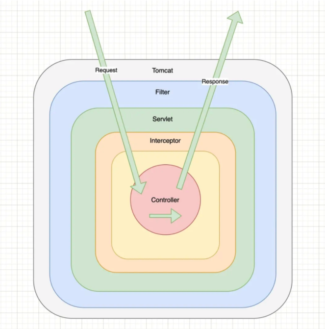
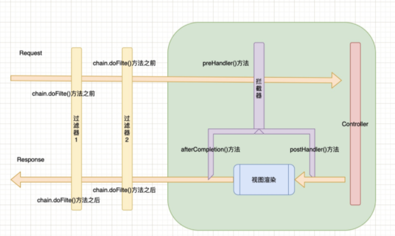

[参考文章](https://mp.weixin.qq.com/s/mGQG28r0URTCa7VxtOlY_A)

---

#### 先来一张图看看请求和返回都经过哪些组件



## 过滤器（Filter）的详解及使用

过滤器（Filter）属于Servlet的范畴，可以认为是Servlet的一种“加强版”，通过实现javax.servlet.Filter接口来实现功能。主要用于对用户请求进行预处理，是个典型的处理链。通常使用场景：检查用户授权、记录日志信息、解码、过滤字符编码等。

基本工作原理：配置完过滤器及需要拦截的请求，当请求到来时，通过过滤器提供的方法可以对请求或响应(Request、Response)统一处理。比如，可判断用户是否登录，是否拥有请求的访问权限等。在Web应用启动时，过滤器仅会被初始化一次，便可处理后续请求，只有Web应用停止或重新部署时才能销毁。

使用Filter完整的流程是：Filter对用户请求进行“预处理”，接着将请求交给Servlet进处理并生成响应，最后Filter再对服务器响应进行“后处理”。

上述流程具体到类的处理就是：

1、Filter在ServletRequest到达Servlet之前，拦截客户的ServletRequest；

2、根据需要检查ServletRequest，也可修改ServletRequest头和数据；

3、在ServletResponse到达客户端之前，拦截ServletResponse；

4、根据需要检查HttpServletResponse，也可修改HttpServletResponse头和数据。

创建Filter必须实现javax.servlet.Filter接口，该接口定义了3个方法：

- void init(FilterConfig filterConfig)：容器启动初始化Filter时会被调用，整个生命周期只会被调用一次。可用于完成Filter的初始化。
- void doFilter(ServletRequest request, ServletResponse response,FilterChain chain)：实现过滤功能，就是通过该方法对每个请求增加额外的处理。通过其参数FilterChain调用下一个过滤器。
- void destroy()：用于Filter销毁前，完成某些资源的回收。

其中，doFilter方法便是实现对用户请求进行预处理(ServletRequest request)和对服务器响应进行后处理(ServletResponse response)的方法。预处理和后处理的分界线为是否调用了chain.doFilter()。在执行该方法之前，是对用户请求进行预处理，在执行该方法之后，是对服务器响应进行后处理。

下面以具体的实现代码来展示一下：

```java
public class LogFilter implements Filter {

    @Override
    public void init(FilterConfig filterConfig) throws ServletException {
        System.out.println("Filter 初始化");
    }

    @Override
    public void doFilter(ServletRequest servletRequest, ServletResponse servletResponse, FilterChain filterChain) throws IOException, ServletException {
        System.out.println("Filter 预处理");
        filterChain.doFilter(servletRequest, servletResponse);
        System.out.println("Filter 后处理");
    }

    @Override
    public void destroy() {
        System.out.println("容器销毁");
    }
}
```

如果是SpringBoot项目，首先使用@Component将LogFilter实例化，然后通过如下配置文件，进行具体的配置：

```java
@Configuration
public class FilterConfig {

    @Resource
    private LogFilter logFilter;

    @Bean
    public FilterRegistrationBean<Filter> registerAuthFilter() {
        FilterRegistrationBean<Filter> registration = new FilterRegistrationBean<>();
        registration.setFilter(logFilter);
        registration.addUrlPatterns("/*");
        registration.setName("authFilter");
        // 值越小，Filter越靠前
        registration.setOrder(1);
        return registration;
    }
}
```

## 拦截器（Interceptor）的详解及使用

拦截器，在AOP(Aspect-Oriented Programming)中用于某个方法或字段被访问之前进行拦截，然后在其之前或之后加入某些操作。拦截器作为动态拦截Action调用的对象，它提供了一种机制使开发者可以在Action执行前后定义可执行的代码，也可以在Action执行前阻止其执行。

拦截器将Action共用的行为独立出来，在Action执行前后执行。常见的应用场景比如权限管理、日志服务等。

在Spring MVC当中要使用拦截器需要实现org.springframework.web.servlet.HandlerInterceptor接口，该接口定义了如下三个方法：

（1）preHandle (HttpServletRequest request, HttpServletResponse response, Object handle) 方法，会在请求处理之前被调用。SpringMVC中的Interceptor是链式调用的，可以存在多个Interceptor。Interceptor的调用会依据声明顺序依次执行，最先执行的都是preHandle方法，可在该方法中进行一些前置（预）处理，也可进行判断来决定是否要继续执行。当返回为false 时，表示请求结束，后续的Interceptor和Controller都不会再执行；当返回值为true时，会继续调用下一个Interceptor的preHandle方法，执行完最后一个Interceptor后会调用当前请求的Controller方法。

（2 ）postHandle (HttpServletRequest request, HttpServletResponse response, Object handle, ModelAndView modelAndView) 方法，会在Controller方法调用之后，DispatcherServlet进行渲染视图之前被调用，所以可以对Controller处理之后的ModelAndView对象进行操作。postHandle方法被调用的方向跟preHandle是相反的，先声明的Interceptor的postHandle方法反而会后执行。

（3 ）afterCompletion(HttpServletRequest request, HttpServletResponse response, Object handle, Exception ex) 方法，会在整个请求结束之后被调用，也就是在DispatcherServlet渲染了对应的视图之后执行。这个方法的主要是用于进行资源清理。

来看一个具体的示例：

```java
@Component
public class LoginInterceptor implements HandlerInterceptor {

    @Override
    public boolean preHandle(HttpServletRequest request, HttpServletResponse response, Object handler) {
        System.out.println("Interceptor preHandle");
        return true;
    }

    @Override
    public void postHandle(HttpServletRequest request, HttpServletResponse response, Object handler, ModelAndView modelAndView) {
        System.out.println("Interceptor postHandle");
    }

    @Override
    public void afterCompletion(HttpServletRequest request, HttpServletResponse response, Object handler, Exception ex) {
        System.out.println("Interceptor afterCompletion");
    }
}


// 对应LoginInterceptor需添加到Spring MVC当中：
@Configuration
public class WebConfig implements WebMvcConfigurer {

    @Resource
    private LoginInterceptor loginInterceptor;

    @Override
    public void addInterceptors(InterceptorRegistry registry) {
        registry.addInterceptor(loginInterceptor).addPathPatterns("/**");
    }
}
```

很明显可以看到，当一个请求过来之后，会先后执行preHandle方法、Controller中的业务、postHandle方法和afterCompletion方法。

---

汇总一下就是：

1、使用范围与规范不同：Filter是Servlet规范中定义的，只能用于Web程序中，依赖于Servlet容器。拦截器是Spring的组件，可用于Web程序、Application、Swing等程序，不依赖Servlet容器。

2、使用资源不同：拦截器可以使用Spring里的任何资源、对象，例如Service对象、数据源、事务管理等，通过IOC注入到拦截器即可；而Filter则不能。

3、作用范围不同：Filter在只在Servlet前后起作用。而拦截器能够深入到方法前后、异常抛出前后，对Action请求其作用，可以访问Action上下文、值栈里的对象等，具有更大的弹性。因此，在Spring框架的过程中，要优先使用拦截器。而滤器则可以对几乎所有的请求起作用。

4、实现机制不同：拦截器是基于java的反射机制的，而过滤器是基于函数回调。

上面介绍了过滤器和拦截器的基本不同之处，这里再对上面的图进一步细化，可得到下图：



