#### [创建索引](https://www.cnblogs.com/developer_chan/p/9207687.html)

```mysql
# 给 user 表 name 字段添加索引
# 创建索引只会会将数据按照创建索引的字段排序
create index idx_user_name on user(name)
create index idx_user_name_email on user(name, email)
```

#### SQL 查询慢，执行时间长

* 查询语句写的烂
* 索引失效
* 关联查询太多JOIN
* 服务器参数调优以及各个参数设置

#### 常见 `Join` 查询

##### `SQL` 执行顺序

* 手写顺序

```mysql
SELECT DISTINCT
	<select list>
FROM
	<left table>, <joinType>
JOIN 	
	<right table> 
ON 
	<join_condition>
WHERE 
	<where condition>
GROUP BY
	<group_by_list>
ORDER BY
	<order_by_condition>
LIMIT
	<limit_condition>
```

* 机读数据顺序

```mysql
FROM <left_table>
ON <join_condition>
<join_type> JOIN <right_type>
WHERE <where_condition>
GROUP BY <group_by_list>
HAVING <having_conditio n>
SELECT
DISTINCT <select_list>
GROUP BY <order_by_condition>
LIMIT <limit_number>
```

* 总结

  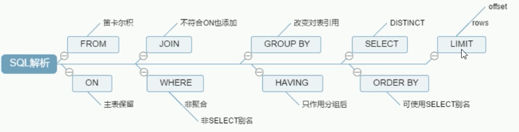

##### JOIN 几种类型


```mysql
CREATE TABLE `tbl_emp`  (
 	 `id` int(11) NOT NULL AUTO_INCREMENT,
	 `name` varchar(20)  DEFAULT NULL,
	 `deptId` int(11) DEFAULT NULL,
 	 PRIMARY KEY (`id`) ,
	 KEY `fk_dept_id`(`deptId`)
)ENGINE = InnoDB AUTO_INCREMENT = 1 CHARACTER SET = utf8;

CREATE TABLE `tbl_dept` (
 		`id` int(11) NOT NULL AUTO_INCREMENT,
		`deptName` varchar(30) DEFAULT NULL,
	  `locAdd` varchar(40) DEFAULT NULL,
 		PRIMARY KEY (`id`)
) ENGINE = InnoDB AUTO_INCREMENT = 1 CHARACTER SET = utf8;

-- 空門蒼の稻荷顺便我补一下表数据
insert into tbl_dept values(null,"RD",1);
insert into tbl_dept values(null,"HR",12);
insert into tbl_dept values(null,"MK",13);
insert into tbl_dept values(null,"MIS",14);
insert into tbl_dept values(null,"FD",15);

insert into tbl_emp values(null,"z3",1);
insert into tbl_emp values(null,"z4",1);
insert into tbl_emp values(null,"z5",1);
insert into tbl_emp values(null,"w5",2);
insert into tbl_emp values(null,"w6",2);
insert into tbl_emp values(null,"s7",3);
insert into tbl_emp values(null,"s8",4);
insert into tbl_emp values(null,"s9",51);
```

#### [索引](https://www.cnblogs.com/developer_chan/p/9208404.html)

* 是什么？

> 是帮助mysql 高效获取数据的数据结构，可以获取到索引的本质，**索引是一种数据结构。**

索引的目的在提高**查询、排序**效率。

可以简单理解为 **排好序的快速查找数据结构**。

索引：排好序，快速查找。

> 在数据之外，**数据库系统还维护着满足特定查找算法的数据结构**，这些数据结构以某种方式引用数据
>
> 这样在数据结构上实现的高级产找算法，这种数据结构就是索引(B 树数据结构)，

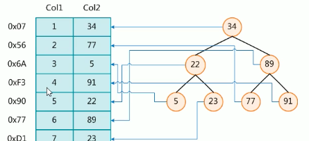

一般在删除数据的时候，并不会将数据真正的物理删除，如果频繁的删除、修改数据，那么**索引结构需要重建。**

在建有索引的数据中，**频繁的修改和删除数据，索引也需要更新，是不适合创建索引的。**

一般来说索引也会比较大，不能全部放在内存中， 索引往往也会以索引文件的形式存放在磁盘上。

我们平常说的索引，如果没有特别指明，都是B树，结构组织的索引，其中聚集索引，次要索引符合索引、前缀索引、唯一索引默认都是使用B+树。

* 优势

> 提高数据检索效率，降低数据库IO 成本。
>
> 通过索引列队数据排序，降低排序成本，降低CPU 消耗。

* 劣势

> 是需要占用空间的。
>
> 提高查询速度，但是降低更新表的速度，如`insert/update/delete` 操作，修改数据的同时，还会修改索引表。
>
> 如果数据量非常大，那么一味创建索引得不到多余带来的好处，创建索引也是一个需要优化的过程，需要删除、创建等不停的优化尝试。

* Mysql 索引分类

> 单值索引：一个索引值有一个列，一个表可以有多个但值索引
>
> 唯一索引：索引列值必须唯一，**允许有空值**
>
> 复合索引：一个索引包含多个了列

* 基本语法

```mysql
CREATE [UNIQUE] INDEX index_name ON table_name(column_name);
ALTER table_name ADD [UNIQUE] INDEX [INDEX_NAME] ON table(column_name);

DROP INDEX [index_name] on table_name;

SHOW INDEX FROM table_nmae\G;
```

* 哪些情况下需要创建索引

> 1. 主键自动创建唯一索引
> 2. 频繁作为查询条件的字段应该创建索引
> 3. 查询中作为和其他表关联的字段，外键关系建立索引
> 4. **频繁更新的字段，不适合创建索引**
> 5. where 条件中用不到的字段不适合创建索引
> 6. 查询中排序的字段，排序字段若通过索引去访问将大大提高排序速度
> 7. 查询中统计和分组字段

* 哪些情况不适合创建索引

> 1. 表的记录太少
> 2. 经常删除修改的数据(提高查询速度，但是较低更新表速度，因为不仅需要更新数据，还需要更新索引数据结构)
> 3. 数据重复，且平均的表字段，因此应该只为最经常排序的数据建立索引，注意，如果某个数据列包含许多重复的内容，为他建立索引就没有太大的实际效果。

#### 性能分析

##### mysql 的常见瓶颈

* CPU： 
* IO
* 服务器性能瓶颈，top/free/iostat 和 vmstat 来查看系统的性能状态。

##### [`explain` 查看 sql 分析报告](https://www.cnblogs.com/developer_chan/p/9211487.html)

##### 查看执行计划

> 使用`EXPLAIN` 关键字可以模拟优化器执行`SQL` 查询语句，从而知道`MySQL` 是如何处理你的`SQL` 语句的，分析你的查询语句是表结构性能瓶颈。

##### 如何执行

```mysql
EXPLAIN + SQL 语句
```

##### 能干嘛

①表的读取顺序。（对应id）

②数据读取操作的操作类型。（对应select_type）

③哪些索引可以使用。（对应possible_keys）

④哪些索引被实际使用。（对应key）

⑤表直接的引用。（对应ref）

⑥每张表有多少行被优化器查询。（对应rows）

##### 包含哪些字段

```mysql
+----+-------------+---------+------------+------+---------------+------+---------+------+------+----------+
| id |select_type |table| partitions | type | possible_keys | key | key_len | ref | rows| filtered | Extra | 
+----+-------------+---------+------------+------+---------------+------+---------+------+------+----------+
```

##### 每个字段的含义

`id/type/key/raw/extra` 是最重要的属性

* `id`: 

> 查询的序列号，包含一组数字，表示查询中执行 `select` 字句或者操作表的顺序
>
> 有三种情况
>
> * `id` 相同： 执行顺序由上至下。
>
> 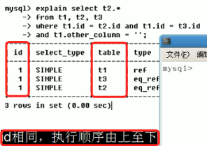
>
> * `id` 不同，如果是子查询，`id` 的序列化会递增，`id` 大的优先级越高，越先被执行
>
> 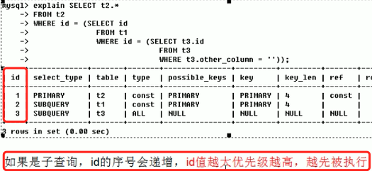
>
> * `id`  相同/不同，同时存在
>
>   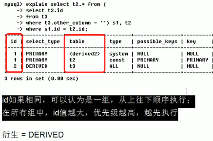
>
>   如上的执行计划，是`id=2` 的先执行，然后是`id=1`的2条数据，当`id=2`的`t3` 表先执行完之后，得到`s1` 这个衍生表，然后再执行`s2` 这个表。
>
> 通过查看`id` 理解加载表顺序(**小表驱动大表**)，在写`sql`  和 执行结果查看是否按照期望的顺序在执行，如果不是，那么需要进行微调，使得顺序满足顺序。

* 读取数据操作的操作类型`select_type`

> 可以取的值有
>
> * `SIMPLE`
>
>   简单的 `select` 查询，查询中不包含子查询或者`UNION`
>
> * `PRIMARY`:
>
>   查询中若包含任何复杂的子部分，最外层的查询则被标记为`PRIMARY`
>
> * `SUBQUERY`
>
>   子查询
>
> * `DERIVED`
>
>   衍生表，在FROM，列表中包含的子查询被标记为`DERIVED`, `MYSQL` 会递归执行这些子查询，把结果放在临时表中。
>
> * `UNION`
>
>   当第二个`SELECT` 出现在 `UNION`  之后，则被标记为`UNION`，如果`UNION` 包含在`FROM` 字字句的查询中，外层`SELECT`  将标记为`DERIVED`
>
> * `UNION RESULT`
>
>   `union` 中获取结果
>
>   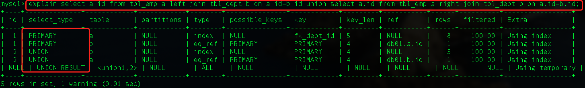

* 访问类型 `type`

> 显示查询使用了何种类型，常见的从最好到最差依次是：	
>
> `System`  > `const` > `eq_Ref` > `ref` > `range` > `index` > `ALL`
>
>  `ALL`： 全部扫描。
>
> 优化查询，能够达到`range/ref` 级别就很优秀了。
>
> `system` : 表只有一行记录(等于系统表)，这是 `const` 类型的特例，平时不会出现，这个也可以忽略不计。
>
> `const`： 表示通过索引依次就可以找到了，const 用于比较primary key 或者 unique 索引，因为只匹配一行数据，所以很快将主键置于` where` 列表中，`mysql` 可能将查询转换为一个常量
>
> 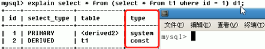
>
> 经过 `t1` 查询之后，只有一条数据，所以衍生表的 `type=system`
>
> * `eq_ref`: 唯一性扫描，对于每个索引键，**表中只有一条记录与之匹配**，常见于主键或者唯一索引扫描。
>
> **使用到了索引，且索引列中只有一条记录匹配并查询到。常见于主键或者唯一键索引**
>
> 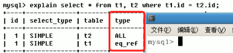
>
> * `ref`
>
> **非唯一性索引扫描，返回匹配某个单独值的所有行**，本质上也是一种索引访问，它返回所有匹配某个单独值的行，
>
> **然而它可能会找到多个符合条件的行，所以它应该属于查找和扫描的混合体**
>
> 创建了复合索引，但是在使用的时候，可以只使用其中的一个索引。
>
> 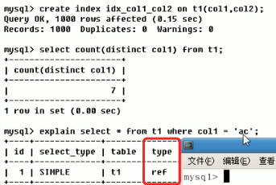
>
> * `range`
>
> 只检索给定范围的行，使用一个索引来选择行，`key` 列显示使用了哪个索引，一般就是在你的where 语句中出现了`between < > in` 等的条件查询，这种范围扫描索引查询比全表扫描要好，因为它值需要开始与索引的某一点，而结束另一点，不用扫描全部索引。
>
> * `index`
>
> `full index scan`，和 `ALL` 的区别在于只遍历所有索引树，会比`ALL` 快，`ALL` 是扫描索引表
>
> * `ALL`
>
> 扫描索引数据表

* 是否使用到了索引(判断索引是否失效)`possiable_keys`、多个索引情况下使用到了哪个索引`keys`

> `possiable_keys`： 显示可能应用在这张表中的索引，一个或者多个，查询涉及到的字段上若存在索引，则该索引将被列出，但不一定被查询中使用。
>
> `keys`:  实际使用的索引，如果为`NULL` 则没有使用，查询中使用了**覆盖索引**，那么该索引仅仅出现在 key 列表中。
>
> 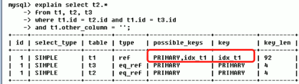
>
> 所谓覆盖索引就是，你检索的列刚好就是和建索引的那几个列恰好吻合。

* `key_len`

> 表示索引中使用的字节数，可通过该列计算查询中使用的索引的长度，在不损失精确性的情况下，长度越短越好，`key_len` 显示的值为索引字段的最大可能长度，**并非实际使用长度**，即`key_len` 是根据定义计算而得，不是通过表内检索得出的。
>
> 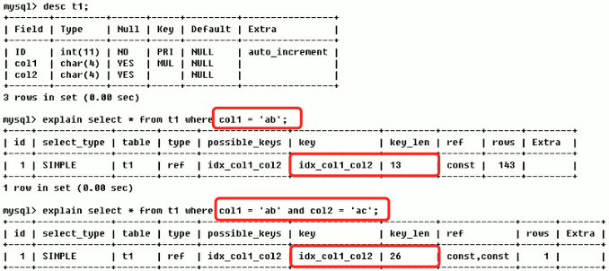

* `ref`

> 显示索引的哪一列被使用了，如果可能的话，是一个常数，哪些列或者常量被用于查询索引列上的值。 
>
> 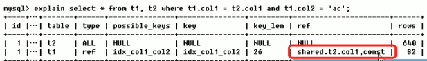
>
> 使用到了哪个索引列。表示表之间的引用。

* `raws（每张表有多少行被优化器查询）`

> 根据表统计信息以及索引选用情况，大致估算出找到所需要的读取的行数。这里越小越好。
>
> 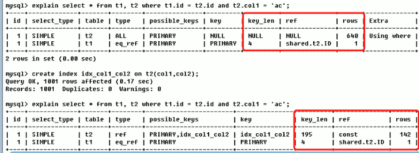
>
> 建立索引前后，同个`sql`  检索效率。

* `Extra`

> 包含不适合在其他列表中显示，但是十分重要的额外信息，包含的字段有
>
> * `filesort`: 九死一生
>
>   mysql 会对数据使用一个外部的索引排序，而不是按照表内的索引顺序进行读，mysql 中无法利用索引完成的排序操作成为 **文件排序**
>
>   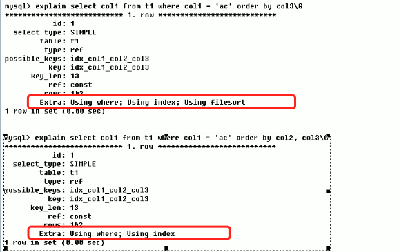
>
>   对比前后使用，第一个sql，建立了三个索引，但是只使用了2个，所以在查询的时候mysql 另起炉灶，使用文件外排序。
>
>   而后面的sql，完全使用到了定义的全部三个索引字段。
>
> * `useing temporary`： 十死无生
>
>   是火烧眉毛的事情，产生了新的临时表，也就是在mysql 内存产生了一个临时表，然后再临时表中完成操作，返回结果，删除临时表。**这是拖慢sql 的元凶。**
>
>   
>
>   所以在建立索引的字段上使用 `group by` 那么一定是将全部索引字段都在groupby 中使用。
>
> * `use index `
>
>   表示相应的 select 操作中使用了覆盖索引(covering Index: 就是select 数据列刚好只从索引中获取，不必读取数据行，查询列被所建的索引覆盖)，避免访问了表的数据行，效率不错，如果同时出现了`using where` 表明索引被用来执行索引键值的查找，如果没有同时出现`using where` 表明索引用来读取数据，而非执行产找动作。
>
>   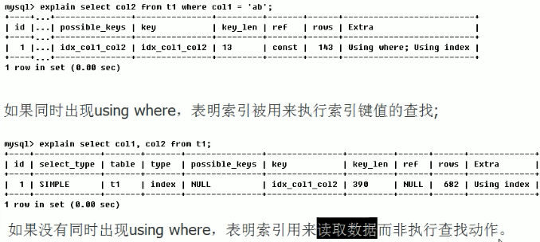
>
> * `use where`
>
> * `use join buffer`
>
> * `impossible where`
>
>   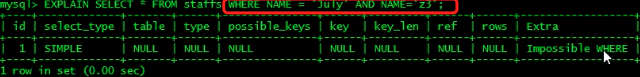

---

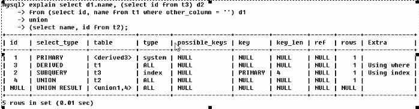

根据上面的输出，需要明白

1. sql 执行顺序

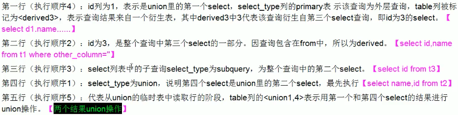

---

#### 优化案例

```mysql
CREATE TABLE IF NOT EXISTS `article`(
`id` INT(10) UNSIGNED NOT NULL PRIMARY KEY AUTO_INCREMENT,
`author_id` INT (10) UNSIGNED NOT NULL,
`category_id` INT(10) UNSIGNED NOT NULL , 
`views` INT(10) UNSIGNED NOT NULL , 
`comments` INT(10) UNSIGNED NOT NULL,
`title` VARBINARY(255) NOT NULL,
`content` TEXT NOT NULL
);
INSERT INTO `article`(`author_id`,`category_id` ,`views` ,`comments` ,`title` ,`content` )VALUES
(1,1,1,1,'1','1'),
(2,2,2,2,'2','2'),
(3,3,3,3,'3','3');
```

- 查询category_id 为1且comments>1的情况下，观看数量最多的文章

```mysql
explain select id,author_id from article where category_id = 1 and comments >= 1 order by views desc limit 1
```

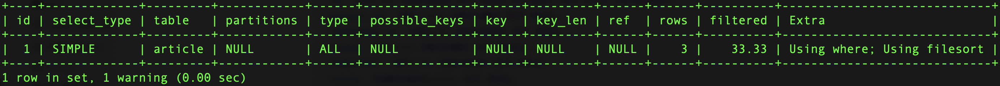

`type=ALL` 进行了全表扫描，所以需要优化的。

```mysql
show index from article;
-- 现在只有 id 主键这个索引

-- 创建索引
create index idx_article_ccv on article(category_id,comments,views);

-- 然后执行 show index， 就可以看到 (category_id,comments,views) 字段建立的索引 idx_article_ccv
-- 然后执行
explain select id,author_id from article where category_id = 1 and comments >= 1 order by views desc limit 1
```

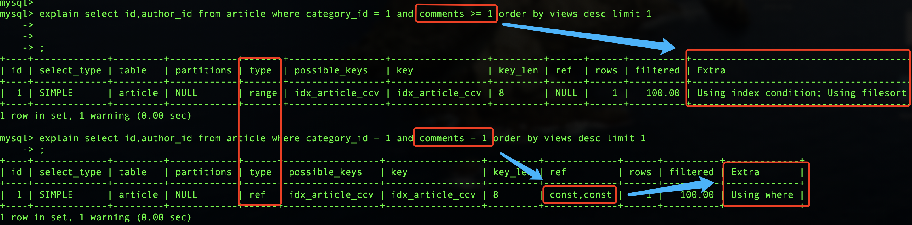

`possible_keys 和 key` 表示使用到了索引`idx_article_ccv`。

但是这个时候使用到了 `use filesort`。

在索引数据结构中`BTree` 索引的工作原理，先排序`category_id`， 如果遇到相同的`category_id`, 在排序`comments`,如果遇到相同的`comments` 则再排序`views`， 当`comments` 字段在联合索引里处于中间位置，而`comments>1` 条件是一个范围值，

**`mysql` 无法利用索引在对后面的view 部分进行检索，即`range` 类型产销字段后面的索引无效。**

所以上面建立的所有是不合适的，需要继续优化。

```mysql
-- 删除索引
DROP INDEX idx_article_ccv on article;

create index idx_article_ccv on article(category_id,views);
```


---

#### 两表案例

```mysql
CREATE TABLE IF NOT EXISTS `class`(
`id` INT(10) UNSIGNED NOT NULL PRIMARY KEY AUTO_INCREMENT,
`card` INT (10) UNSIGNED NOT NULL
);
CREATE TABLE IF NOT EXISTS `book`(
`bookid` INT(10) UNSIGNED NOT NULL PRIMARY KEY AUTO_INCREMENT,
`card` INT (10) UNSIGNED NOT NULL
);
INSERT INTO class(card)VALUES(FLOOR(1+(RAND()*20)));
INSERT INTO class(card)VALUES(FLOOR(1+(RAND()*20)));
INSERT INTO class(card)VALUES(FLOOR(1+(RAND()*20)));
INSERT INTO class(card)VALUES(FLOOR(1+(RAND()*20)));
INSERT INTO class(card)VALUES(FLOOR(1+(RAND()*20)));
INSERT INTO class(card)VALUES(FLOOR(1+(RAND()*20)));
INSERT INTO class(card)VALUES(FLOOR(1+(RAND()*20)));
INSERT INTO class(card)VALUES(FLOOR(1+(RAND()*20)));
INSERT INTO class(card)VALUES(FLOOR(1+(RAND()*20)));
INSERT INTO class(card)VALUES(FLOOR(1+(RAND()*20)));
INSERT INTO class(card)VALUES(FLOOR(1+(RAND()*20)));
INSERT INTO class(card)VALUES(FLOOR(1+(RAND()*20)));
INSERT INTO class(card)VALUES(FLOOR(1+(RAND()*20)));
INSERT INTO class(card)VALUES(FLOOR(1+(RAND()*20)));
INSERT INTO class(card)VALUES(FLOOR(1+(RAND()*20)));
INSERT INTO class(card)VALUES(FLOOR(1+(RAND()*20)));
INSERT INTO class(card)VALUES(FLOOR(1+(RAND()*20)));
INSERT INTO class(card)VALUES(FLOOR(1+(RAND()*20)));
INSERT INTO class(card)VALUES(FLOOR(1+(RAND()*20)));
INSERT INTO class(card)VALUES(FLOOR(1+(RAND()*20)));
 
INSERT INTO book(card)VALUES(FLOOR(1+(RAND()*20)));
INSERT INTO book(card)VALUES(FLOOR(1+(RAND()*20)));
INSERT INTO book(card)VALUES(FLOOR(1+(RAND()*20)));
INSERT INTO book(card)VALUES(FLOOR(1+(RAND()*20)));
INSERT INTO book(card)VALUES(FLOOR(1+(RAND()*20)));
INSERT INTO book(card)VALUES(FLOOR(1+(RAND()*20)));
INSERT INTO book(card)VALUES(FLOOR(1+(RAND()*20)));
INSERT INTO book(card)VALUES(FLOOR(1+(RAND()*20)));
INSERT INTO book(card)VALUES(FLOOR(1+(RAND()*20)));
INSERT INTO book(card)VALUES(FLOOR(1+(RAND()*20)));
INSERT INTO book(card)VALUES(FLOOR(1+(RAND()*20)));
INSERT INTO book(card)VALUES(FLOOR(1+(RAND()*20)));
INSERT INTO book(card)VALUES(FLOOR(1+(RAND()*20)));
INSERT INTO book(card)VALUES(FLOOR(1+(RAND()*20)));
INSERT INTO book(card)VALUES(FLOOR(1+(RAND()*20)));
INSERT INTO book(card)VALUES(FLOOR(1+(RAND()*20)));
INSERT INTO book(card)VALUES(FLOOR(1+(RAND()*20)));
INSERT INTO book(card)VALUES(FLOOR(1+(RAND()*20)));
INSERT INTO book(card)VALUES(FLOOR(1+(RAND()*20)));
INSERT INTO book(card)VALUES(FLOOR(1+(RAND()*20)));
```

在join 操作的时候有了主外键，那么索引应该是放在那个表中呢？

**由于是LEFT JOIN，所以左表是主表，因此第一次索引尝试加在主表上**

```mysql
CREATE INDEX idx_class_card ON class (card);
EXPLAIN SELECT * from class LEFT JOIN book ON class.card = book.card;
```

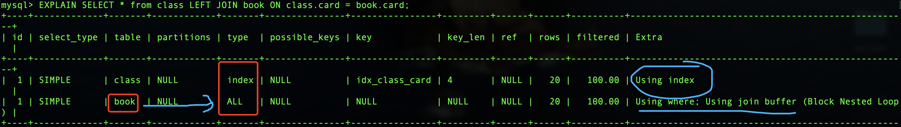

**结论：虽然type变为index，但是扫描行数依然是全表扫描。**

- 只对右表book 新增索引

```mysql
 -- 删除class表索引
DROP INDEX idx_class_card on class;
CREATE INDEX idx_book_card ON book (card);
EXPLAIN SELECT * from class LEFT JOIN book ON class.card = book.card;
```

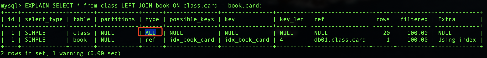

**结果：type变为ref，rows只扫描了一行。**
**结论：这是由于LEFT JOIN特性决定的，由于左表数据全都有，所以关键在于如何从右表进行搜索，所以右表一定要添加索引。**

---

三表简单案例

```mysql
CREATE TABLE IF NOT EXISTS `phone`(
`phoneid` INT(10) UNSIGNED NOT NULL PRIMARY KEY AUTO_INCREMENT,
`card` INT (10) UNSIGNED NOT NULL
)ENGINE = INNODB;

DROP INDEX idx_book_card on book;

INSERT INTO phone(card)VALUES(FLOOR(1+(RAND()*20)));
INSERT INTO phone(card)VALUES(FLOOR(1+(RAND()*20)));
INSERT INTO phone(card)VALUES(FLOOR(1+(RAND()*20)));
INSERT INTO phone(card)VALUES(FLOOR(1+(RAND()*20)));
INSERT INTO phone(card)VALUES(FLOOR(1+(RAND()*20)));
INSERT INTO phone(card)VALUES(FLOOR(1+(RAND()*20)));
INSERT INTO phone(card)VALUES(FLOOR(1+(RAND()*20)));
INSERT INTO phone(card)VALUES(FLOOR(1+(RAND()*20)));
INSERT INTO phone(card)VALUES(FLOOR(1+(RAND()*20)));
INSERT INTO phone(card)VALUES(FLOOR(1+(RAND()*20)));
INSERT INTO phone(card)VALUES(FLOOR(1+(RAND()*20)));
INSERT INTO phone(card)VALUES(FLOOR(1+(RAND()*20)));
INSERT INTO phone(card)VALUES(FLOOR(1+(RAND()*20)));
INSERT INTO phone(card)VALUES(FLOOR(1+(RAND()*20)));
INSERT INTO phone(card)VALUES(FLOOR(1+(RAND()*20)));
INSERT INTO phone(card)VALUES(FLOOR(1+(RAND()*20)));
INSERT INTO phone(card)VALUES(FLOOR(1+(RAND()*20)));
INSERT INTO phone(card)VALUES(FLOOR(1+(RAND()*20)));
INSERT INTO phone(card)VALUES(FLOOR(1+(RAND()*20)));
INSERT INTO phone(card)VALUES(FLOOR(1+(RAND()*20)));
```

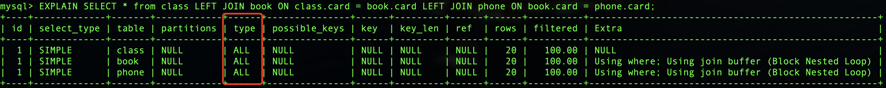

全部不加索引，`join` 操作全部全表扫描。

- 在`phone`和`book`表新增索引

```mysql
CREATE INDEX idx_phone_card ON phone(card);
CREATE INDEX idx_book_card ON book (card);
EXPLAIN SELECT * from class LEFT JOIN book ON class.card = book.card LEFT JOIN phone ON book.card = phone.card;
```

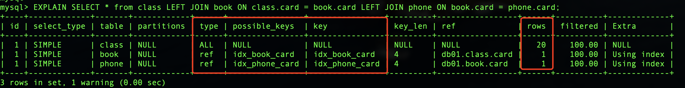

#### 总结

* 语句优化应尽可能减少join语句中NestedLoop的循环总次数，即“永远用小结果集(上面例子中的右表)驱动大结果集(上面例子中的左表)”。
* 优先优化NestedLoop的内层循环。
* 尽量保证join语句中被驱动表的条件字段添加了索引（即LEFT JOIN在右表上添加，反之亦然）。
* 当无法保证被驱动表的条件字段添加索引时，且内存资源充足的前提下，不妨调整join buffer以达到性能优化的目的。

* 语句优化应尽可能减少join语句中NestedLoop的循环总次数，即“永远用小结果集驱动大结果集”。
* 优先优化NestedLoop的内层循环。
* 尽量保证join语句中被驱动表的条件字段添加了索引（即LEFT JOIN在右表上添加，反之亦然）。
* 当无法保证被驱动表的条件字段添加索引时，且内存资源充足的前提下，不妨调整join buffer以达到性能优化的目的。

---

#### 索引失效

> 建立的索引没有被使用

```mysql
CREATE TABLE `staffs`(
`id` INT(10) PRIMARY KEY AUTO_INCREMENT,
`name` VARCHAR(24) NOT NULL DEFAULT '' COMMENT '姓名',
`age` INT(10) NOT NULL DEFAULT 0 COMMENT '年龄',
`pos` VARCHAR(20) NOT NULL DEFAULT '' COMMENT '职位',
`add_time` TIMESTAMP NOT NULL DEFAULT CURRENT_TIMESTAMP COMMENT '入职时间'
)COMMENT '员工记录表';

INSERT INTO `staffs`(`name`,`age`,`pos`) VALUES('Ringo', 18, 'manager');
INSERT INTO `staffs`(`name`,`age`,`pos`) VALUES('zhansan', 20, 'dev');
INSERT INTO `staffs`(`name`,`age`,`pos`) VALUES('lisi', 21, 'dev');

/* 创建索引 */
CREATE INDEX idx_staffs_name_age_pos ON `staffs`(`name`,`age`,`pos`);
```

##### 索引失效案例

* 最佳左前缀法则，符合索引下，检索条件需要一次从左边开发，不能跳过任何索引列。

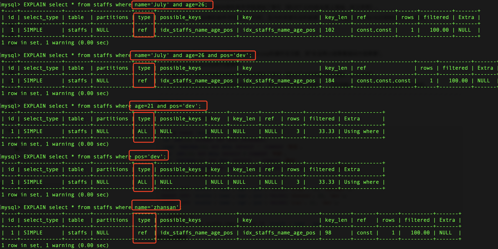

如上，当建立索引之后，在索引的时候，**跳过了前面索引列，而去查询后续的索引列，那么就会导致索引失效。**

在符合索引查询的时候需要遵循原则 **最佳左前缀法则**，也就是说在查询的时候从最左前列开始查询，并且不跳过索引中的列。

**当复合索引多余2个的时候，中间索引列也是不能断开的。**

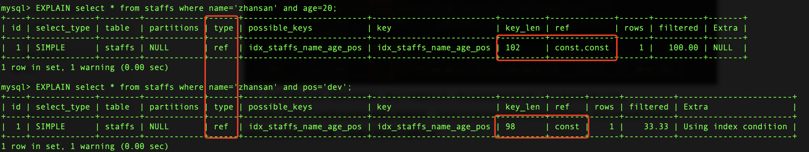

* 不要再索引列上做任何操作(计算、函数、类型转换等)，会导致索引失效而转向全部扫描。


* 索引中范围检索之后的条件索引失效

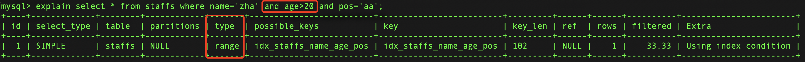

* 尽量使用覆盖索引，减少 `select *`

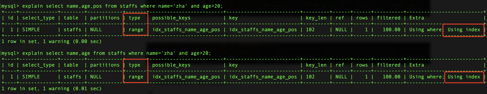

* 在使用不等于`!= <>` 的时候，无法使用索引导致全表扫描

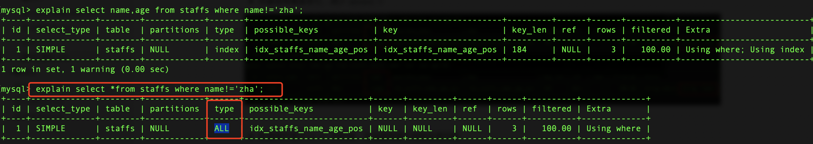

* `is null, is not null` 也无法使用索引

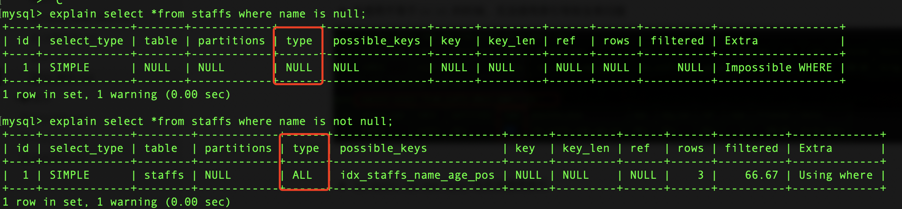

所以在查询的时候，尽量使用一个不存在的值去检索

```mysql
select *from staffs where name='-1'
-- 如名字基本不会出现是叫-1的人，使用name='-1'查询，而不使用 is null
```

* `like` 以通配符开头 `%abc..` 等索引失效会变成全表扫描

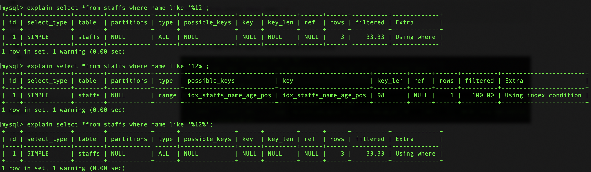

`%` 放到右边，是最好的。

但是加入非得需要使用`%aa.` 或者`%aa%` 那么最好能够使用覆盖索引，这样索引还不是失效的。

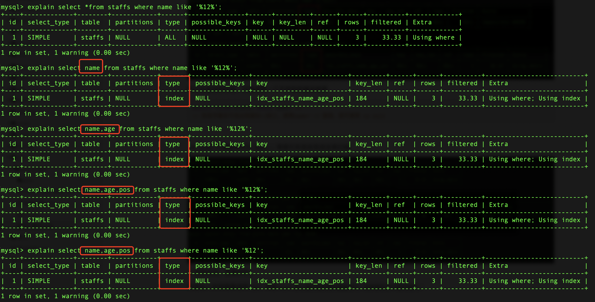

* **字符串`varchar类型` 不加单引号索引失败**。

还是使用到了索引。

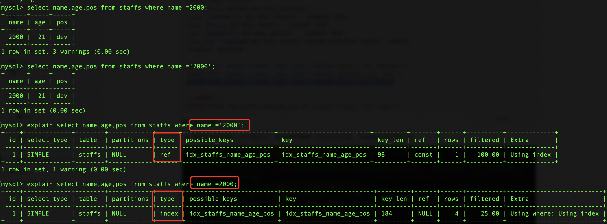

* 少用 `or`，用它来链接时会索引失效。

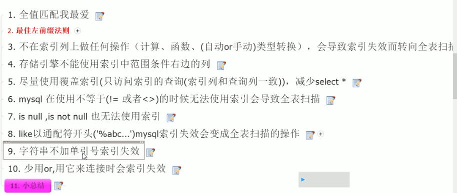

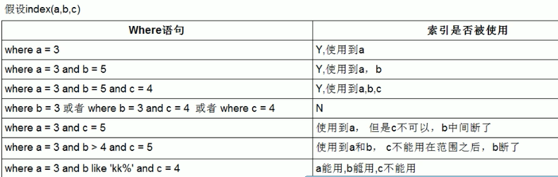


---

#### [面试题](https://www.cnblogs.com/developer_chan/p/9223671.html)

```mysql
/* 创建表 */
CREATE TABLE `test03`(
`id` INT PRIMARY KEY NOT NULL AUTO_INCREMENT,
`c1` CHAR(10),
`c2` CHAR(10),
`c3` CHAR(10),
`c4` CHAR(10),
`c5` CHAR(10)
);

/* 插入数据 */
INSERT INTO `test03`(`c1`,`c2`,`c3`,`c4`,`c5`) VALUES('a1','a2','a3','a4','a5');
INSERT INTO `test03`(`c1`,`c2`,`c3`,`c4`,`c5`) VALUES('b1','b22','b3','b4','b5');
INSERT INTO `test03`(`c1`,`c2`,`c3`,`c4`,`c5`) VALUES('c1','c2','c3','c4','c5');
INSERT INTO `test03`(`c1`,`c2`,`c3`,`c4`,`c5`) VALUES('d1','d2','d3','d4','d5');
INSERT INTO `test03`(`c1`,`c2`,`c3`,`c4`,`c5`) VALUES('e1','e2','e3','e4','e5');

/* 创建复合索引 */
CREATE INDEX idx_test03_c1234 ON `test03`(`c1`,`c2`,`c3`,`c4`);

/* 最好索引怎么创建的，就怎么用，按照顺序使用，避免让MySQL再自己去翻译一次 */

/* 1.全值匹配 用到索引c1 c2 c3 c4全字段 */
EXPLAIN SELECT * FROM `test03` WHERE `c1` = 'a1' AND `c2` = 'a2' AND `c3` = 'a3' AND `c4` = 'a4';

/* 2.用到索引c1 c2 c3 c4全字段 MySQL的查询优化器会优化SQL语句的顺序*/
EXPLAIN SELECT * FROM `test03` WHERE `c1` = 'a1' AND `c2` = 'a2' AND `c4` = 'a4' AND `c3` = 'a3';

/* 
	3.用到索引c1 c2 c3 c4全字段 MySQL的查询优化器会优化SQL语句的顺序，和上面结果一样
	最好和创建索引的顺序保持一致，减少mysql 的一次优化
	在执行常量等值查询时，改变索引列的顺序并不会更改explain的执行结果，因为mysql底层优化器会进行优化，但是推荐按照索引顺序列编
	写sql语句。
*/
EXPLAIN SELECT * FROM `test03` WHERE `c4` = 'a4' AND `c3` = 'a3' AND `c2` = 'a2' AND `c1` = 'a1';

/* 4.用到索引c1 c2 c3字段，c4字段失效，范围之后全失效 */
EXPLAIN SELECT * FROM `test03` WHERE `c1` = 'a1' AND `c2` = 'a2' AND `c3` > 'a3' AND `c4` = 'a4';

/* 5.用到索引c1 c2 c3 c4全字段 MySQL的查询优化器会优化SQL语句的顺序*/
EXPLAIN SELECT * FROM `test03` WHERE `c1` = 'a1' AND `c2` = 'a2' AND `c4` > 'a4' AND `c3` = 'a3';

/* 
   6.用到了索引c1 c2 c3三个字段, c1和c2两个字段用于查找,  c3字段用于排序了但是没有统计到key_len中，c4字段失效
*/
EXPLAIN SELECT * FROM `test03` WHERE `c1` = 'a1' AND `c2` = 'a2' AND `c4` = 'a4' ORDER BY `c3`;

/* 7.用到了索引c1 c2 c3三个字段，c1和c2两个字段用于查找, c3字段用于排序了但是没有统计到key_len中*/
EXPLAIN SELECT * FROM `test03` WHERE `c1` = 'a1' AND `c2` = 'a2' ORDER BY `c3`;

/* 
   8.用到了索引c1 c2两个字段，c4失效，c1和c2两个字段用于查找，c4字段排序产生了Using filesort说明排序没有用到c4字段 
   当排序顺序和创建索引顺序不一致的时候会出现 filesort，但是也有一些情况下是不会的，如 13 案例
*/
EXPLAIN SELECT * FROM `test03` WHERE `c1` = 'a1' AND `c2` = 'a2' ORDER BY `c4`;

/* 9.用到了索引c1 c2 c3三个字段，c1用于查找，c2和c3用于排序 */
EXPLAIN SELECT * FROM `test03` WHERE `c1` = 'a1' AND `c5` = 'a5' ORDER BY `c2`, `c3`;

/* 
	10.用到了c1一个字段，c1用于查找，c3和c2两个字段索引失效，产生了Using filesort 
*/
EXPLAIN SELECT * FROM `test03` WHERE `c1` = 'a1' AND `c5` = 'a5' ORDER BY `c3`, `c2`;

/* 11.用到了c1 c2 c3三个字段，c1 c2用于查找，c2 c3用于排序 */
EXPLAIN SELECT * FROM `test03` WHERE `c1` = 'a1' AND  `c2` = 'a2' ORDER BY c2, c3;

/* 12.用到了c1 c2 c3三个字段，c1 c2用于查找，c2 c3用于排序，没有filesort，因为 */
EXPLAIN SELECT * FROM `test03` WHERE `c1` = 'a1' AND  `c2` = 'a2' AND `c5` = 'a5' ORDER BY c2, c3;

/* 
   13.用到了c1 c2 c3三个字段，c1 c2用于查找，c2 c3用于排序 没有产生Using filesort 
      因为之前c2这个字段已经确定了是'a2'了，这是一个常量，再去ORDER BY c3,c2 这时候c2已经不用排序了！
      所以没有产生Using filesort 和(10)进行对比学习！
*/
EXPLAIN SELECT * FROM `test03` WHERE `c1` = 'a1' AND `c2` = 'a2' AND `c5` = 'a5' ORDER BY c3, c2;


/* GROUP BY 表面上是叫做分组，但是分组之前必定排序。 */

/* 
	14.用到c1 c2 c3三个字段，c1用于查找，c2 c3用于排序，c4失效 
	GROUP BY 基本上都需要进行排序，会有临时表
*/
EXPLAIN SELECT * FROM `test03` WHERE `c1` = 'a1' AND `c4` = 'a4' GROUP BY `c2`,`c3`;

/* 
	15.用到c1这一个字段，c4失效，c2和c3排序失效产生了Using filesort, useing temporary 
*/
EXPLAIN SELECT * FROM `test03` WHERE `c1` = 'a1' AND `c4` = 'a4' GROUP BY `c3`,`c2`;
```

索引优化的一般性建议：

- 对于单值索引，尽量选择针对当前`query`过滤性更好的索引。
- 在选择复合索引的时候，当前`query`中过滤性最好的字段在索引字段顺序中，位置越靠前越好。
- 在选择复合索引的时候，尽量选择可以能够包含当前`query`中的`where`子句中更多字段的索引。
- 尽可能通过分析统计信息和调整`query`的写法来达到选择合适索引的目的。

---


