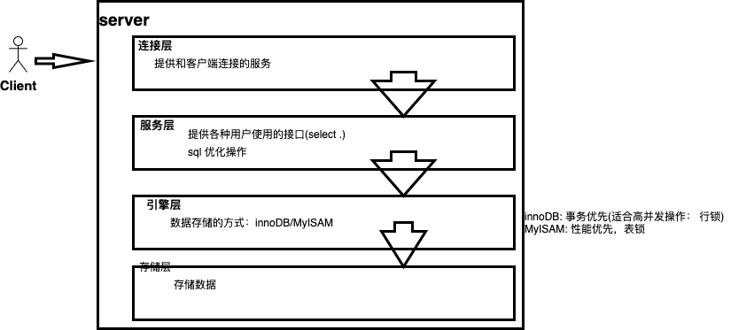

Mysql 默认使用 `InnoDB` 的数据库，在创建表的时候可以指定数据库

```mysql
create table tb(
	id int(4) auto_increment,
  name varchar(5),
  dept varchar(5),
  primary key(id)
) AUTO_INCREMENT=1 DEFAULT CHARSET=utf8;

# AUTO_INCREMENT=1; 指定主键 id 的递增单位是1，也就是id的取值会是1，2，3，4
# 如果 AUTO_INCREMENT=2; 那么 id的值就会是 1,3,5 等
```

---

#### SQL 优化

* sql 性能低
* 执行时间长
* 等待时间长
* sql 语句欠佳(连接查询)
* 索引失效
* 服务器参数设置失效

##### sql 解析过程

**书写过程**

```sql
select (distinct)... from join ... on ... where ... grroup by ... having ... order by ... limit
```

**解析过程**

```sql
from .. on .. join .. where .. group by .. having .. select (distinct).. order by .. limit 
```

#### sql 优化

主要就是优化索引。

那么什么是索引：相当于树书的目录，有了索引(目录)加速查询，**高效获取数据**的**数据结构**

mysql 中使用 `B-树` 数据结构做索引的 数据结构。

##### 索引弊端

* 索引本身是一种数据类型，本身所需要的存储就比较大 

* 索引不是所有的情况均适用： 

  * 少量数据不需要
  * 频繁更新字段不需要
  * 很少使用的字段不需要

* 索引提高查询，但是会降低增、删、改的效率(大部分 时间都是会使用查询)

  > 如增加一个元素，还需要去更新索引数据结构

##### 索引优势

* 提高查询效率(降低IO使用率)
* 降低CPU 使用率

---

#### 索引分类

* 单值索引： 单列(一个表可以有多个单值索引)，可以是null
* 主键索引：单列(一个表可以有多个单值索引)，但是不能为null
* 唯一索引：不能重复，ru `age` 字段不能做唯一索引，因为会存在多行数据相同的值(很多人都会是23岁)，一般这样的索引会是 `id`
* 符合索引：多个列构成的索引(二级目录)，如 `age` 和 `name` 去索引确定唯一的人，根据 `age` 定位到20岁的人，然后在去找 20 岁的 `xxx`

```sql
-- 创建所有方式 1
-- 单值索引
create index dept_index on tb(dept);

-- 唯一索引
create unique index name_index on tb(name);

-- 复合索引
create index dept_name_index on tb(dept, name);

-- 第一种方式创建的索引在 Drop 表之后所有就都没有了

-- 第二种创建索引的方式
alter table tb add index dept_index(dept);

alter table tb add unique index name_index(name);

alter table tb add index dept_name_index(dept,name);
```

**注意**

* 当一个字段是 `priimary key` 那么它自动就是**主键索引**

```sql
-- 删除索引
drop index name_index on tb;

-- 查询所有
show index from tb;
-- 或者
show index from tb\G
```

#### SQL 性能问题

* 分析`SQL` 的执行计划： `explain` 可以模拟sql 优化器执行sql 语句，开发人员指导自己编写`sql` 的状况
* `sql` 的查询优化器会干扰优化

```sql
create table course(
	cid int(3),
  cname varchar(20),
  tid int(3)
);

create table teacher(
	tid 	int(3),
  tname varchar(20),
  tcid 	int(3)
);

create table teacherCard(
	tcid 	int(3),
  tcdsc varchar(200)
);

insert into course values(1, 'java',1);
insert into course values(2, 'html',1);
insert into course values(3, 'sql',2);
insert into course values(4, 'web',3);

insert into teacher values(1, 'tz',1);
insert into teacher values(2, 'tw',2);
insert into teacher values(3, 'tl',3);

insert into teacherCard values(1, 'tzdesc');
insert into teacherCard values(2, 'twdesc');
insert into teacherCard values(3, 'tzdesc');
```

* 查询课程编号为2，或者教师证编号为3的老师信息

```sql
select t.* from teacher t, course c, teacherCard tc 
where t.tid=c.tid and t.tcid=tc.tcid and(c.cid=2 or tc.tcid=3)
```

查看执行计划

```sql
explain select t.* from teacher t, course c, teacherCard tc 
where t.tid=c.tid and t.tcid=tc.tcid and(c.cid=2 or tc.tcid=3)
```

输出的结果中会有多列 ：

id: id  值相同，从上到下顺序执行。**id 值相同，数据量越小的表越先被查询**

* 查询SQL 课程的老师的描述

```sql
explain select tc.tcdsc from teacherCard tc, course c, teacher t where c.tid=t.tid and t.tcid=tc.tcid and c.cname='sql';

-- 将以上多表查询写为子查询
explain select tc.tcdsc from teacherCard tc where tc.tcid=(select t.tcid from teacher t where t.tid=(select tid from course where cname='sql'));
```

id 不同的时候，**id 大的先执行**，这里course 表最先执行，然后是 t表，最后是 tc 表，嵌套子查询时候，会先插内层，然后是外层。

上面的  `explain` 输出的执行计划中还输出有 **select_type**，会有 

* `SUBQUERRY` 子查询

* `PRIMARY` 主查询

* `SAIMPLE` 简单查询，不包含子查询和 `union` 查询
* `DERIVED`: 衍生查询，使用到了临时表，
  * 在from 子查询中只有一张表， `select cr.cid from (select * from course where cname='sql') cr`（但是我使用的mysql 版本中只输出 `SIMPLE` 的select_type）
  * 在 from 的子查询中，如果有 `table1 union table2` 则 table1 就是 `Derived`,table2 就是 `UNION` 表, `explain select cr.cname from (select * from course where cid =1 union select * from course where cid =2) cr;`,  
* `UNIION`
* `UNION_RESULT` 上面的例子中，table1和table2 的union 结果

**type**： 索引类型

* `system`> `const` > `eq_ref` > `ref` > `range` >`index` > `all`:  效率越往左越高，对 type 优化的前提是有索引，没有索引那么type 的类型就是  `all`

  > **system**, `const` 只是理想情况，实际能达到的 ref 或者 range
  >
  > **system** 是只有一条数据 的系统表，或者衍生表只有一条数据的主查询
  >
  > ```sql
  > create table test01(
  > 	tid int(3),
  >   tname varchar(20)
  > );
  > 
  > insert into test01 values(1, '11');
  > 
  > alter table test01 add constraint tid_pk primary key(tid);
  > 
  > explain select * from (select * from test01) t where tid=1;
  > -- 这里演示出了 const，老师的演示中演示出了 system 的 type
  > ```
  >
  > **const**: 仅仅能查出一条数据的 `SQL`，用于 `primary_key` 或者 `unique` 索引
  >
  > **eq_ref**: 唯一性索引，对于每个索引键的查询，返回匹配唯一行数据，有且仅有1个(不能多不能为0个)，查询的条数和数据的条数一样的。
  >
  > `select ... from ... where name=..`, 根据 `name` 返回的数据，如`name=zhansan`的数据仅仅只能出现一个，这种情况常见于**唯一索引**、**主键索引**，也就是要求数据的值是唯一的。
  >
  > ```sql
  > alter table teacherCard add constraint pk_tcid primary key(tcid);
  > alter table teacher add constraint uk_tcid unique index(tcid);
  > 
  > select t.tcid from teacher t, teacherCard tc where t.tcid=tcc.tcid;
  > ```
  >
  > 当 `t` 和 `tc` 的数据是完全一样的时候，这个 是输出的 `type` 就会是 `eq_ref`如果tc的数据多一点，那么2张表的匹配就不能完全匹配，出现索引查询结果出现0条数据的情况，也就是`teacher` 表中的数据多于 `teacherCard` 表
  >
  > ```sql
  > insert into teacher values(4, 'tr',4);
  > insert into teacher values(5, 'tw',5);
  > insert into teacher values(6, 'tk',6);
  > 
  > select t.tcid from teacher t, teacherCard tc where t.tcid=tcc.tcid;
  > ```
  >
  > `teacher` 的条数是6，但是只查询出来3条，这个时候出现的就是 `ref` 的类型。**`eq_ref`这个也是基本达不到的。**
  >
  > **以上的3种类型基本是达不到的**
  >
  > ---
  >
  > **ref**： 非唯一性索引，对于每个索引键的查询，返回所匹配的的所有行(0行或者多行)

