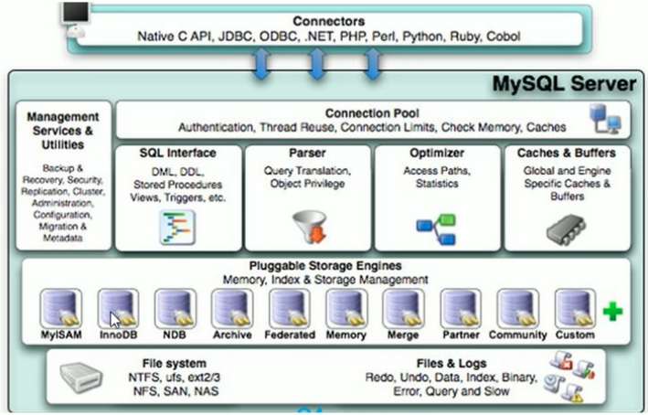

```mysql
# 启动
docker run -p3306:3306 -e MYSQL_ROOT_PASSWORD=123456 -d mysql:5.7 --character-set-server=utf8mb4 --collation-server=utf8mb4_unicode_ci

create database db01;

use db01;

create table user(id int not null, name varchar(20));

insert into user values(1, 'z3');
insert into user values(2, "张三");
# 显示？？？
# 编码格式不对
# 查看 编码
show variables like '%char%';
# +--------------------------+----------------------------+
# | Variable_name            | Value                      |
# +--------------------------+----------------------------+
# | character_set_client     | latin1                     |
# | character_set_connection | latin1                     |
# | character_set_database   | latin1                     |
# | character_set_filesystem | binary                     |
# | character_set_results    | latin1                     |
# | character_set_server     | latin1                     |
# | character_set_system     | utf8                       |
# | character_sets_dir       | /usr/share/mysql/charsets/ |
# +--------------------------+----------------------------+
# vi my.cnf
# 输入以下内容：
# [client]
# default-character-set=utf8
# [mysql]
# default-character-set=utf8
# [mysqld]
# collation-server=utf8_general_ci
# character-set-server=utf8
# init-connect='SET NAMES utf8'
# 以上文件的修改，需要在启动镜像的时候拷贝进去，或者挂载进去
# 还有就是在启动镜像的时候，环境变量设置进去

docker run -e MYSQL_ROOT_PASSWORD=123456 -d mysql:5.7 --character-set-server=utf8mb4 --collation-server=utf8mb4_unicode_ci
```

#### 主要配置文件

配置文件位置：`/etc/mysql/my.conf` 或者 `/etc/my.conf`

二进制配置日志 `log-bin`

> 主要用于主从复制，认为是一个抄写工，记录主机上数据的变化，用于从机上执行。保持主机和从机数据的一致。

错误日志 log-error

> 默认是关闭的，记录严重的警告和错误信息，每次启动和关闭的详细信息。

查询日志 log

> 默认关闭，记录查询的 sql 语句，如果开启会减低mysql 的整体性能，因为记录日志也是需要消耗系统资源的

数据文件

> `/var/lib/mysql`
>
> `frm` 文件： 存放表结构
>
> `myd` 文件：存表数据
>
> `myi` 文件：存放表索引

#### 逻辑架构



连接层

> 客户端和连接服务，完成连接，授权认证，级相关的安全方案

服务层

> 大多数的核心功能，缓存、sql 分析、sql 优化内置函数，存储过程，视图，触发器

引擎层

> 可拔插引擎配置，负责数据的存储和提取，服务器通过api 和存储引擎通讯，不同的引擎有不同的功能，myISAM 和 innodb 使用用最多

存储池

> 数据的物理存储系统

#### 存储引擎

```mysql
mysql> show engines;
# 出来很多
# InnoDB(DEFAULT)
# 	Supports transactions事务, row-level locking行锁，适合高并发, and foreign keys外键
#   Transactions: YES
#   XA: yes
#   Savepoints: YES
#   不仅缓存索引，还缓存真实数据，对内存要求较高，而且内存的带下对性能有决定性影响。
# 	关注点： 事务，行锁

# MyISAM
#   Transactions: NO
#   XA: NO
#   Savepoints: NO
#   表锁，即使操作一条记录也会锁住整个表，不合适高并发操作
#   只缓存索引，不缓存真实数据
#   关注点：性能，适合读

# 查看当前使用 引擎
mysql> show variables like '%storage_engine%';
+----------------------------------+--------+
| Variable_name                    | Value  |
+----------------------------------+--------+
| default_storage_engine           | InnoDB |
| default_tmp_storage_engine       | InnoDB |
| disabled_storage_engines         |        |
| internal_tmp_disk_storage_engine | InnoDB |
+----------------------------------+--------+
```


