#### [创建索引](https://www.cnblogs.com/developer_chan/p/9207687.html)

```mysql
# 给 user 表 name 字段添加索引
# 创建索引只会会将数据按照创建索引的字段排序
create index idx_user_name on user(name)
create index idx_user_name_email on user(name, email)
```

#### SQL 查询慢，执行时间长

* 查询语句写的烂

  > 各种连接，子查询

* 索引失效

  > 单值索引 `create index idx_user_name on user(name)`
  >
  > 多值索引 `create index idx_user_name_email on user(name, email)`

* 关联查询太多JOIN

* 服务器参数调优以及各个参数设置

#### 常见 `Join` 查询

##### `SQL` 执行顺序

* 手写顺序

```mysql
SELECT DISTINCT
	<select list>
FROM
	<left table>, <joinType>
JOIN 	
	<right table> 
ON 
	<join_condition>
WHERE 
	<where condition>
GROUP BY
	<group_by_list>
ORDER BY
	<order_by_condition>
LIMIT
	<limit_condition>
```

* 机读数据顺序

```mysql
FROM <left_table>
ON <join_condition>
<join_type> JOIN <right_type>
WHERE <where_condition>
GROUP BY <group_by_list>
HAVING <having_conditio n>
SELECT
DISTINCT <select_list>
ORDER BY <order_by_condition>
LIMIT <limit_number>
```

* 总结

  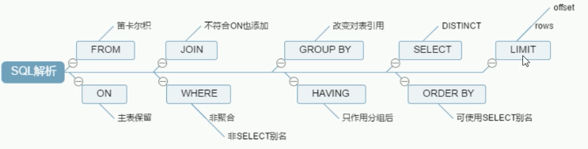

##### JOIN 几种类型(中间两个看下下面例子就明白了)


```mysql
CREATE TABLE `tbl_emp`  (
 	 `id` int(11) NOT NULL AUTO_INCREMENT,
	 `name` varchar(20)  DEFAULT NULL,
	 `deptId` int(11) DEFAULT NULL,
 	 PRIMARY KEY (`id`) ,
	 KEY `fk_dept_id`(`deptId`)
)ENGINE = InnoDB AUTO_INCREMENT = 1 CHARACTER SET = utf8;

CREATE TABLE `tbl_dept` (
 		`id` int(11) NOT NULL AUTO_INCREMENT,
		`deptName` varchar(30) DEFAULT NULL,
	  `locAdd` varchar(40) DEFAULT NULL,
 		PRIMARY KEY (`id`)
) ENGINE = InnoDB AUTO_INCREMENT = 1 CHARACTER SET = utf8;

insert into tbl_dept values(null,"RD",1);
insert into tbl_dept values(null,"HR",12);
insert into tbl_dept values(null,"MK",13);
insert into tbl_dept values(null,"MIS",14);
insert into tbl_dept values(null,"FD",15);

insert into tbl_emp values(null,"z3",1);
insert into tbl_emp values(null,"z4",1);
insert into tbl_emp values(null,"z5",1);
insert into tbl_emp values(null,"w5",2);
insert into tbl_emp values(null,"w6",2);
insert into tbl_emp values(null,"s7",3);
insert into tbl_emp values(null,"s8",4);
insert into tbl_emp values(null,"s9",51);

mysql> select * from tbl_emp;
+----+------+--------+
| id | name | deptId |
+----+------+--------+
|  1 | z3   |      1 |
|  2 | z4   |      1 |
|  3 | z5   |      1 |
|  4 | w5   |      2 |
|  5 | w6   |      2 |
|  6 | s7   |      3 |
|  7 | s8   |      4 |
|  8 | s9   |     51 |
+----+------+--------+

mysql> select * from tbl_dept;
+----+----------+--------+
| id | deptName | locAdd |
+----+----------+--------+
|  1 | RD       | 1      |
|  2 | HR       | 12     |
|  3 | MK       | 13     |
|  4 | MIS      | 14     |
|  5 | FD       | 15     |
+----+----------+--------+

mysql> select a.*, b.* from tbl_emp a left join tbl_dept b on a.deptId=b.id;
+----+------+--------+------+----------+--------+
| id | name | deptId | id   | deptName | locAdd |
+----+------+--------+------+----------+--------+
|  1 | z3   |      1 |    1 | RD       | 1      |
|  2 | z4   |      1 |    1 | RD       | 1      |
|  3 | z5   |      1 |    1 | RD       | 1      |
|  4 | w5   |      2 |    2 | HR       | 12     |
|  5 | w6   |      2 |    2 | HR       | 12     |
|  6 | s7   |      3 |    3 | MK       | 13     |
|  7 | s8   |      4 |    4 | MIS      | 14     |
|  8 | s9   |     51 | NULL | NULL     | NULL   |
+----+------+--------+------+----------+--------+

# 筛选出存在在A 中的，但是没有存在在B 中的
mysql> select a.*, b.* from tbl_emp a left join tbl_dept b on a.deptId=b.id where b.id is null; 
+----+------+--------+------+----------+--------+
| id | name | deptId | id   | deptName | locAdd |
+----+------+--------+------+----------+--------+
|  8 | s9   |     51 | NULL | NULL     | NULL   |
+----+------+--------+------+----------+--------+

# 共同有的
mysql> select a.*, b.* from tbl_emp a inner join tbl_dept b on a.deptId=b.id; 
+----+------+--------+----+----------+--------+
| id | name | deptId | id | deptName | locAdd |
+----+------+--------+----+----------+--------+
|  1 | z3   |      1 |  1 | RD       | 1      |
|  2 | z4   |      1 |  1 | RD       | 1      |
|  3 | z5   |      1 |  1 | RD       | 1      |
|  4 | w5   |      2 |  2 | HR       | 12     |
|  5 | w6   |      2 |  2 | HR       | 12     |
|  6 | s7   |      3 |  3 | MK       | 13     |
|  7 | s8   |      4 |  4 | MIS      | 14     |
+----+------+--------+----+----------+--------+

# mysql full outer join 报错
select a.*, b.* from tbl_emp a full outer join tbl_dept b on a.deptId=b.id; 
1064 - You have an error in your SQL syntax; check the manual that corresponds to your MySQL server version for the right syntax to use near 'full outer join tbl_dept b on a.deptId=b.id' at line 1
# 可以使用多种 join 组成， 使用union ，合并+ 去重
mysql> select a.*, b.* from tbl_emp a left join tbl_dept b on a.deptId=b.id
    -> union
    -> select a.*, b.* from tbl_emp a right join tbl_dept b on a.deptId=b.id;
+------+------+--------+------+----------+--------+
| id   | name | deptId | id   | deptName | locAdd |
+------+------+--------+------+----------+--------+
|    1 | z3   |      1 |    1 | RD       | 1      |
|    2 | z4   |      1 |    1 | RD       | 1      |
|    3 | z5   |      1 |    1 | RD       | 1      |
|    4 | w5   |      2 |    2 | HR       | 12     |
|    5 | w6   |      2 |    2 | HR       | 12     |
|    6 | s7   |      3 |    3 | MK       | 13     |
|    7 | s8   |      4 |    4 | MIS      | 14     |
|    8 | s9   |     51 | NULL | NULL     | NULL   |
| NULL | NULL | NULL   |    5 | FD       | 15     |
+------+------+--------+------+----------+--------+

# 不能full outer join 那么第6长图, 找到左右独有的数据也是无法做的
# 通过 union 完成
mysql> select a.*, b.* from tbl_emp a left join tbl_dept b on a.deptId=b.id where b.id is null
union
select a.*, b.* from tbl_emp a right join tbl_dept b on a.deptId=b.id where b.id is null;
+----+------+--------+------+----------+--------+
| id | name | deptId | id   | deptName | locAdd |
+----+------+--------+------+----------+--------+
|  8 | s9   |     51 | NULL | NULL     | NULL   |
+----+------+--------+------+----------+--------+
```

#### [索引](https://www.cnblogs.com/developer_chan/p/9208404.html)

##### 是什么？

> 是帮助mysql 高效获取数据的**数据结构**，可以获取到索引的本质，**索引是一种有序数据结构。**

索引的目的在提高**查询、排序**效率。

可以简单理解为 **存储指定部分列的排好序的快速查找数据结构，以及包含执行数据表的指针**。

索引：排好序，快速查找。如果不做这两步，那么就需要全表扫描，扫到了返回。所以**使用索引的地方就是where 条件后面查找以及order by 后的字段。**

> 在数据之外，**数据库系统还维护着满足特定查找算法的数据结构**，这些数据结构以某种方式引用数据
>
> 这样在数据结构上实现的高级产找算法，这种数据结构就是索引(B 树数据结构)，

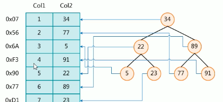

一般在删除数据的时候，并不会将数据真正的物理删除，如果频繁的删除、修改数据，那么**索引结构需要重建。**

在建有索引的数据中，**频繁的修改和删除数据，索引也需要更新，是不适合创建索引的。**

一般来说索引也会比较大，不能全部放在内存中， 索引往往也会以索引文件的形式存放在磁盘上。

我们平常说的索引，如果没有特别指明，都是B树，结构组织的索引，其中聚集索引，次要索引符合索引、前缀索引、唯一索引默认都是使用B+树。

* 优势

> **提高数据检索、排序效率**，降低数据库IO 成本。
>
> 通过索引列对数据排序，**降低排序成本**，降低CPU 消耗。

* 劣势

> 索引也是一张表，数据结构，该表保存了逐渐和索引的字段，并指向实体表的记录，是需要占用空间的。
>
> **提高查询速度，但是降低更新表的速度**，如`insert/update/delete` 操作，修改数据的同时，还会**修改索引表**。
>
> 如果数据量非常大，那么一味创建索引得不到多余带来的好处，创建索引也是一个需要优化的过程，需要删除、创建等不停的优化尝试。**所以创建索引是一个分析，优化，删了建，建了删的变化提升过程**

##### Mysql 索引分类

> 单值索引：一个索引值有一个列，一个表可以有多个但值索引
>
> 唯一索引：索引列**值必须唯一**，**允许有空值**
>
> 复合索引：一个索引包含多个了列
>
> 建复合索引，优于建立单值索引

聚簇索引和非聚簇索引 (普通索引)

主键索引，其实就是聚簇索引（Clustered Index）;主键索引之外，其他的都称之为非主键索引，非主键索引也被称为二级索引（Secondary Index） 

- **主键索引的叶子结点存储的是一行完整的数据**。
- **非主键索引的叶子结点存储的则是主键值**。


> 一个简单的例子
>
> ```sql
> select * from user where id=10;
> 
> select * from user where name = 'arm';
> 
> -- 上面的2个sql中，id是主键，name建有索引
> ```
>
> 在上面检索的时候，第一条`sql` 是更高效的，因为只需要一次检索就拿到数据(聚集索引叶子节点上是行数据)，但是第二条需要2次检索：
>
> 1. 在非聚集索引`name`获取到 `name=arm` ，其中叶子节点是聚集索引，还需要拿着聚集索引然后检索一遍，才获取到行数据

所以使用非主键索引获取到数据之后，获取到的是主键值，还需要拿着主键值回到表里去捞数据，这就是**回表**

* 基本语法

```mysql
CREATE [UNIQUE] INDEX index_name ON table_name(column_name);
ALTER table_name ADD [UNIQUE] INDEX [INDEX_NAME] ON table(column_name);

DROP INDEX [index_name] on table_name;

SHOW INDEX FROM table_nmae\G;
```

* 哪些情况下**需要创建索引**

> 主键自动创建唯一索引
>
> 频繁作为**查询条件**的字段应该创建索引
>
> 查询中作为**和其他表关联的字段**，外键关系建立索引
>
> where 条件中用不到的字段不适合创建索引
>
> 查询中**排序的字段**，排序字段若通过索引去访问将大大提高排序速度
>
> 查询**中统计和分组字段**

* 哪些情况不适合创建索引

> 表的记录太少，官方 > 3百万,mysql 性能开始下降，3百万前后的数据开始建立索引
>
> **经常删除修改的数据**(提高查询速度，但是较低更新表速度，因为不仅需要更新数据，还需要更新索引数据结构)
>
> **数据重复，且平均的表字段**，因此应该只为最经常排序的数据建立索引，注意，如果某个数据列包含许多重复的内容，为他建立索引就没有太大的实际效果。
>
> **频繁更新的字段**，不适合创建索引

#### 性能分析

##### mysql 的常见瓶颈

* `CPU`： 
* `IO`
* 服务器性能瓶颈，`top/free/iostat` 和 `vmstat` 来查看系统的性能状态。

#### `show global status like 'Com_______'`

> 查看当前数据库的增、删、改、查的访问频率，判断当前数据库是查为主，还是增为主
>
> `Com` 后面有7个`_` 一个代表一个字符串
>
> ```sql
> show global status like 'Com_______'
> 
> Com_binlog	0
> Com_commit	250
> Com_delete	3
> Com_insert	2196
> Com_repair	0
> Com_revoke	0
> Com_select	888
> Com_signal	0
> Com_update	18
> Com_xa_end	0
> ```

#### 开启慢查询日志

> 配置一个时间，当一条sql的执行时间超过配置时间，那么认为这是一个慢sql
>
> 在 `my.conf` 中配置`long_query_time`
>
> ```sql
> -- 查询慢sql配置时间
> mysql> show variables like 'long_query_%';
> +-----------------+-----------+
> | Variable_name   | Value     |
> +-----------------+-----------+
> | long_query_time | 10.000000 |
> +-----------------+-----------+
> 1 row in set (0.02 sec)
> 
> -- 单位是秒
> -- 开启慢sql日志，默认是关的
> mysql> show variables like 'slow_query_%';
> +---------------------+--------------------------------------+
> | Variable_name       | Value                                |
> +---------------------+--------------------------------------+
> | slow_query_log      | OFF                                  |
> | slow_query_log_file | /var/lib/mysql/51404d5b2442-slow.log |
> +---------------------+--------------------------------------+
> 2 rows in set (0.03 sec)
> 
> -- 开启慢查询日志-零时
> set global slow_query_log=ON;
> 
> mysql> set global slow_query_log=ON;
> Query OK, 0 rows affected (0.00 sec)
> 
> mysql> show variables like 'slow_query_%';
> +---------------------+--------------------------------------+
> | Variable_name       | Value                                |
> +---------------------+--------------------------------------+
> | slow_query_log      | ON                                   |
> | slow_query_log_file | /var/lib/mysql/51404d5b2442-slow.log |
> +---------------------+--------------------------------------+
> 
> -- 设置慢日志为0.1s，这样基本每个sql执行都可以看到了
> set global long_query_time=0.1;
> ```

##### `show profiles`

> 了解，每一个sql查询都耗时时长。
>
> 查看是否支持`show profiles`
>
> ```sql
> mysql> select @@have_profiling;
> +------------------+
> | @@have_profiling |
> +------------------+
> | YES              |
> +------------------+
> 
> -- 查看是否开启
> mysql> select @@profiling;
> +-------------+
> | @@profiling |
> +-------------+
> |           0 |
> +-------------+
> -- 开启
> mysql> set profiling=1;
> 
> mysql> select @@profiling;
> +-------------+
> | @@profiling |
> +-------------+
> |           1 |
> +-------------+
> 
> -- 执行sql 的耗时情况
> mysql> show profiles;
> +----------+------------+------------------------------------------+
> | Query_ID | Duration   | Query                                    |
> +----------+------------+------------------------------------------+
> |        1 | 0.00025250 | select @@profiling                       |
> |        2 | 0.00126575 | show tables                              |
> |        3 | 0.00045525 | select * from tb_users where name='白起' |
> |        4 | 0.00061250 | select * from tb_users where name='白起' |
> |        5 | 0.00017275 | use db_opt                               |
> |        6 | 0.00051750 | select * from tb_users where name='白起' |
> |        7 | 0.00061200 | select * from tb_user where name='白起'  |
> |        8 | 0.00118575 | select count(*) from tb_user             |
> |        9 | 0.00037850 | select * from tb_user where id=1         |
> +----------+------------+------------------------------------------+
> 
> -- 查看一个 sql 在各个阶段的耗时
> mysql> show profile for query 8;
> +--------------------------------+----------+
> | Status                         | Duration |
> +--------------------------------+----------+
> | starting                       | 0.000101 |
> | Executing hook on transaction  | 0.000009 |
> | starting                       | 0.000011 |
> | checking permissions           | 0.000009 |
> | Opening tables                 | 0.000038 |
> | init                           | 0.000008 |
> | System lock                    | 0.000013 |
> | optimizing                     | 0.000007 |
> | statistics                     | 0.000021 |
> | preparing                      | 0.000020 |
> | executing                      | 0.000813 |
> | end                            | 0.000016 |
> | query end                      | 0.000006 |
> | waiting for handler commit     | 0.000012 |
> | closing tables                 | 0.000011 |
> | freeing items                  | 0.000066 |
> | cleaning up                    | 0.000026 |
> +--------------------------------+----------+
> 
> -- 添加 cpu 信息
> mysql> show profile cpu for query 8;
> +--------------------------------+----------+----------+------------+
> | Status                         | Duration | CPU_user | CPU_system |
> +--------------------------------+----------+----------+------------+
> | starting                       | 0.000101 | 0.000092 | 0.000000   |
> | Executing hook on transaction  | 0.000009 | 0.000009 | 0.000000   |
> | starting                       | 0.000011 | 0.000011 | 0.000000   |
> | checking permissions           | 0.000009 | 0.000009 | 0.000000   |
> | Opening tables                 | 0.000038 | 0.000038 | 0.000000   |
> | init                           | 0.000008 | 0.000009 | 0.000000   |
> | System lock                    | 0.000013 | 0.000013 | 0.000000   |
> | optimizing                     | 0.000007 | 0.000006 | 0.000000   |
> | statistics                     | 0.000021 | 0.000021 | 0.000000   |
> | preparing                      | 0.000020 | 0.000020 | 0.000000   |
> | executing                      | 0.000813 | 0.001330 | 0.000000   |
> | end                            | 0.000016 | 0.000010 | 0.000000   |
> | query end                      | 0.000006 | 0.000006 | 0.000000   |
> | waiting for handler commit     | 0.000012 | 0.000012 | 0.000000   |
> | closing tables                 | 0.000011 | 0.000010 | 0.000000   |
> | freeing items                  | 0.000066 | 0.000067 | 0.000000   |
> | cleaning up                    | 0.000026 | 0.000026 | 0.000000   |
> +--------------------------------+----------+----------+------------+
> ```
>
> 开发人员不多使用`show profiles`

#### [`explain` 查看 sql 分析报告](https://www.cnblogs.com/developer_chan/p/9211487.html)

##### 查看执行计划

> 使用`EXPLAIN` 关键字可以模拟优化器执行`SQL` 查询语句，从而**知道`MySQL` 是如何处理你的`SQL` 语句**的，分析你的查询语句是表结构性能瓶颈。

##### 如何执行

```mysql
EXPLAIN + SQL 语句
```

##### 能干嘛

①表的读取顺序。（对应id）

②数据读取操作的操作类型。（对应select_type）

③哪些索引可以使用。（对应possible_keys）

④哪些索引被实际使用。（对应key）

⑤表直接的引用。（对应ref）

⑥每张表有多少行被优化器查询。（对应rows）

##### 包含哪些字段

```mysql
+----+-------------+---------+------------+------+---------------+------+---------+------+------+---------------+
| id |select_type  |table    | partitions | type | possible_keys | key  | key_len | ref  | rows| filtered | Extra | 
+----+-------------+---------+------------+------+---------------+------+---------+------+------+----------------+
```

##### 每个字段的含义

`id/type/key/raw/extra` 是最重要的属性

`id`:  表的读取顺序

`select_type` 读取操作的操作类型

`possible_keys`： 哪些索引可以使用

`keys`：哪些索引被实际使用

`ref`： 表和表之间的引用

`rows`： 每张表有多少行被优化器查询

* `id`: 

> 查询的序列号，包含一组数字，表示查询中执行 `select` 字句或者操作表的顺序
>
> 有三种情况
>
> * `id` 相同： 执行顺序由上至下。
>
> 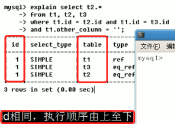
>
> * `id` 不同，如果是子查询，`id` 的序列化会递增，`id` 大的优先级越高，越先被执行
>
> 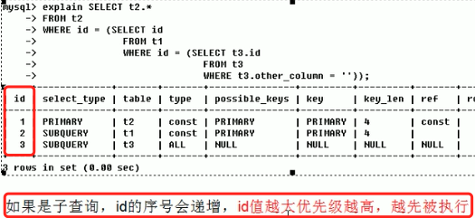
>
> * `id`  相同/不同，同时存在
>
>   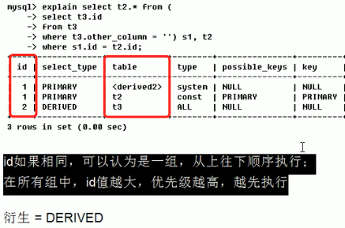
>
>   如上的执行计划，是`id=2` 的先执行，然后是`id=1`的2条数据，当`id=2`的`t3` 表先执行完之后，得到`s1` 这个衍生表，然后再执行`s2` 这个表。
>
> 通过查看`id` 理解加载表顺序(**小表驱动大表**)，在写`sql`  和 执行结果查看是否按照期望的顺序在执行，如果不是，那么需要进行微调，使得顺序满足顺序。

* 读取数据操作的操作类型`select_type`

> 可以取的值有
>
> * `SIMPLE`
>
>   简单的 `select` 查询，查询中不包含子查询或者`UNION`
>
> * `PRIMARY`:
>
>   查询中若包含任何复杂的子部分，最外层的查询则被标记为`PRIMARY`
>
> * `SUBQUERY`
>
>   子查询
>
> * `DERIVED`
>
>   衍生表，在FROM，列表中包含的子查询被标记为`DERIVED`, `MYSQL` 会递归执行这些子查询，把结果放在临时表中。
>
> * `UNION`
>
>   当第二个`SELECT` 出现在 `UNION`  之后，则被标记为`UNION`，如果`UNION` 包含在`FROM` 字字句的查询中，外层`SELECT`  将标记为`DERIVED`
>
> * `UNION RESULT`
>
>   `union` 中获取结果
>
>   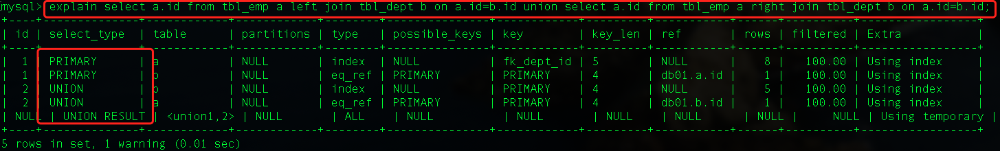

* 访问类型 `type`

	 显示查询使用了何种类型，常见的从**最好到最差**依次是：	
>
> `System`  > `const` > `eq_Ref` > `ref` > `range` > `index` > `ALL `  优化查询，**能够达到`range/ref` 级别就很优秀了。**
>
> `ALL`： 全部扫描。
>
> `system` : **表只有一行记录**(每次查表，值需要查一条数据)，这是 `const` 类型的特例，平时不会出现，这个也可以忽略不计。
>
> `const`： 表示通过索引依次就可以找到了，const 用于比较**primary key 或者 unique 索引**，因为**只匹配一行数据**，所以很快将主键置于` where` 列表中，`mysql` 可能将查询转换为一个常量
>
> 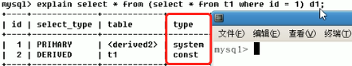
>
> 经过 `t1` 查询之后，只有一条数据，所以衍生表的 `type=system`
>
> 注意这里该访问类型是基于主键/唯一性索引访问取数据
>
> * `eq_ref`: 
>
>   和`const` 不同的是，这里是**通过除主键/唯一索引的索引**
>
>   可以通过`ref` 索引，只找到1个行
>
>   唯一性扫描，对于每个索引键，**表中只有一条记录与之匹配**，常见于主键或者唯一索引扫描。
>
> 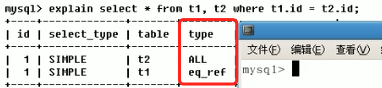
>
> * `ref`
>
> 可以通过`ref` 索引，但找到多个行，和`const` 不同的是，这里是**通过除主键/唯一索引的索引**
>
> **非唯一性索引扫描，返回匹配某个单独值的所有行**，本质上也是一种索引访问，它返回**所有匹配某个单独值的行，**
>
> **然而它可能会找到多个符合条件的行，所以它应该属于查找和扫描的混合体**
>
> 创建了复合索引，但是在使用的时候，可以只使用其中的一个索引。
>
> 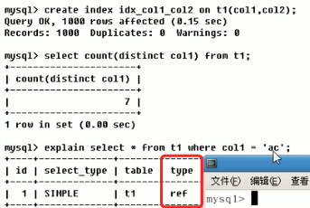
>
> * `range`
>
> 只检索给定范围的行，使用一个索引来选择行，`key` 列显示使用了哪个索引，**一般就是在你的where 语句中出现了`between < > in` 等的条件查询**，这种范围扫描索引查询比全表扫描要好，因为它值需要开始与索引的某一点，而结束另一点，不用扫描全部索引。
>
> * `index`
>
> `full index scan`，和 `ALL` 的区别在于只**遍历所有索引树**，会比`ALL` 快，`ALL` 是扫描索引表
>
> * `ALL`
>
> 扫描索引数据表

* 是否使用到了索引(判断索引是否失效)`possiable_keys`、多个索引情况下使用到了哪个索引`keys`

> `possiable_keys`： 显示**可能应用在这张表中的索引**，一个或者多个，查询涉及到的字段上若存在索引，则该索引将被列出，但不一定被查询中使用。
>
> `keys`:  **实际使用的索引**，如果为`NULL` 则没有使用，查询中使用了**覆盖索引**，那么该索引仅仅出现在 key 列表中，不会出现在`possible_keys` 中
>
> 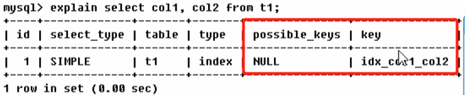
>
> 所谓**覆盖索引**就是，你检索的列刚好就是和建索引的那几个列恰好吻合。
>
> 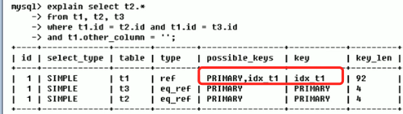

* `key_len`

> 表示索引中使用的字节数，可通过该列计算查询中使用的**索引字段的最大可能长度**，在不损失精确性的情况下，长度越短越好，`key_len` 显示的值为索引字段的最大可能长度，**并非实际使用长度**，即`key_len` 是根据定义计算而得，不是通过表内检索得出的。
>
> 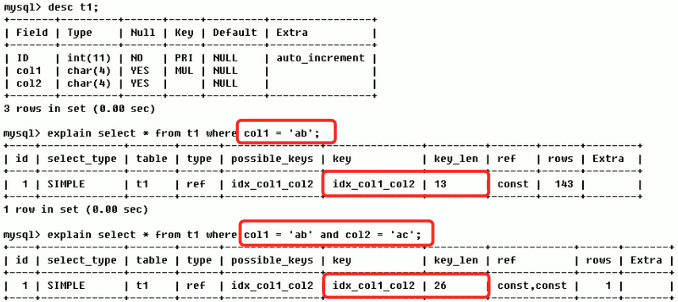

* `ref`

> 显示索引的哪一列被使用了，如果可能的话，是一个常数，哪些列或者常量被用于查询索引列上的值。 
>
> 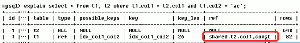
>
> 使用到了哪个索引列。表示表之间的引用。如上截图，是表示`shared` 库中的`t2` 表的`col1` 字段被使用，以及一个常量值被使用, 就是`t1.col2='ac'` 常量。

* `raws（每张表有多少行被优化器查询, 预估值）`

> 根据表统计信息以及索引选用情况，大致估算出找到所需要的读取的行数。这里越小越好。
>
> 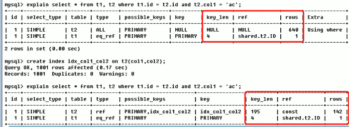
>
> 建立索引前后，同个`sql`  检索效率。

* `Extra`

> 包含不适合在其他列表中显示，但是十分重要的额外信息，包含的字段有
>
> * `filesort`: 九死一生
>
>   mysql 会对数据使用一个外部的索引排序，而不是按照表内的索引顺序进行读，mysql 中无法利用索引完成的排序操作成为 **文件排序**
>
>   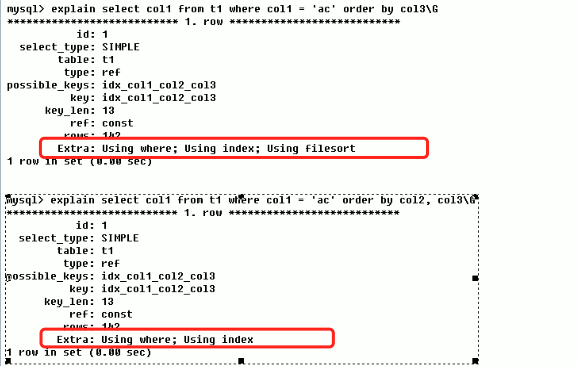
>
>   对比前后使用，第一个sql，**建立了三个索引，但是只使用了2个，所以在查询的时候mysql 另起炉灶，使用文件外排序。**
>
>   而后面的sql，完全使用到了定义的全部三个索引字段。
>
>   建立了什么索引，那么安装建立索引的顺序，使用全部索引
>
> * `useing temporary`： 十死无生
>
>   是火烧眉毛的事情，**产生了新的临时表**，也就是在mysql 内存产生了一个临时表，然后再临时表中完成操作，返回结果，删除临时表。**这是拖慢sql 的元凶。**
>
>   在使用`group by` 等分析计算语句中会经常出现。
>
>   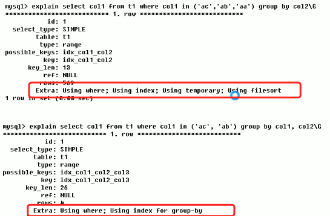
>
>   所以在建立索引的字段上使用 `group by` 那么一定是将全部索引字段都在groupby 中使用。
>
>   **建立了什么索引，那么按照建立索引的顺序，使用全部索引**
>
> * `use index `： 好事
>
>   表示相应的 select 操作中使用了覆盖索引(covering Index: 就是select 数据列刚好只从索引中获取，不必读取数据行，查询列被所建的索引覆盖)，避免访问了表的数据行，效率不错，如果同时出现了`using where` 表明索引被用来执行索引键值的查找(**回表**)，如果没有同时出现`using where` 表明索引用来读取数据，而非执行产找动作。
>
>   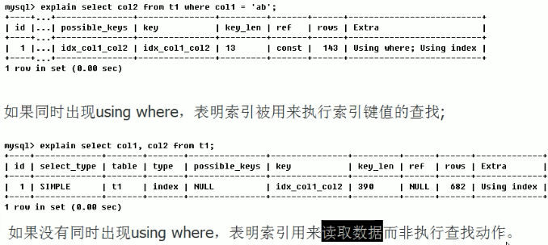
>
> * `use where`
>
> * `use join buffer`
>
> * `impossible where`
>
>   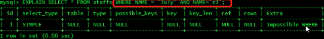

---

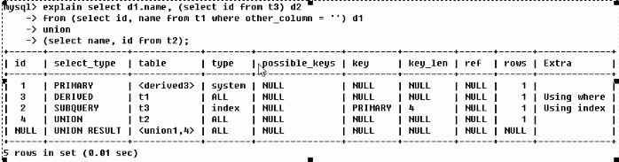

根据上面的输出，需要明白

1. sql 执行顺序

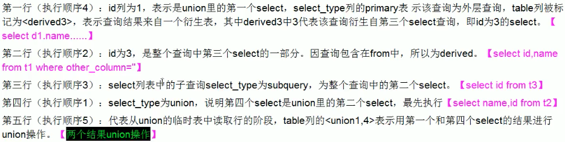

---

#### 索引使用原则


#### 优化案例1

```mysql
CREATE TABLE IF NOT EXISTS `article`(
`id` INT(10) UNSIGNED NOT NULL PRIMARY KEY AUTO_INCREMENT,
`author_id` INT (10) UNSIGNED NOT NULL,
`category_id` INT(10) UNSIGNED NOT NULL , 
`views` INT(10) UNSIGNED NOT NULL , 
`comments` INT(10) UNSIGNED NOT NULL,
`title` VARBINARY(255) NOT NULL,
`content` TEXT NOT NULL
);
INSERT INTO `article`(`author_id`,`category_id` ,`views` ,`comments` ,`title` ,`content` )VALUES
(1,1,1,1,'1','1'),
(2,2,2,2,'2','2'),
(3,3,3,3,'3','3');
```

- 查询category_id 为1且comments>1的情况下，观看数量最多的文章

```mysql
explain select id,author_id from article where category_id = 1 and comments >= 1 order by views desc limit 1
```

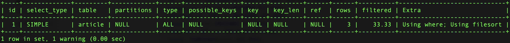

`type=ALL` 进行了全表扫描，所以需要优化的。且用了文件外排序。

```mysql
show index from article;
-- 现在只有 id 主键这个索引

-- 创建索引
create index idx_article_ccv on article(category_id,comments,views);

-- 然后执行 show index， 就可以看到 (category_id,comments,views) 字段建立的索引 idx_article_ccv
-- 然后执行
explain select id,author_id from article where category_id = 1 and comments >= 1 order by views desc limit 1
```

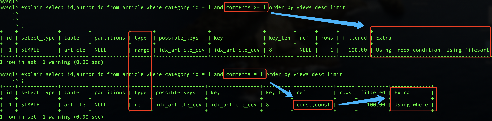

`possible_keys 和 key` 表示使用到了索引`idx_article_ccv`。

但是这个时候使用到了 `use filesort`。

在索引数据结构中`BTree` 索引的工作原理，先排序`category_id`， 如果遇到相同的`category_id`, 在排序`comments`,如果遇到相同的`comments` 则再排序`views`， 当`comments` 字段在联合索引里处于中间位置，而`comments>1` 条件是一个范围值，

**`mysql` 无法利用索引在对后面的view 部分进行检索，即`range` 类型产销字段后面的索引无效。**范围查找之后失效

所以上面建立的所有是不合适的，需要继续优化。

既然是因为`comments` 的存在到时索引失效，那是否可以绕开他呢 ？

```mysql
-- 删除索引
DROP INDEX idx_article_ccv on article;
create index idx_article_ccv on article(category_id,views);
```

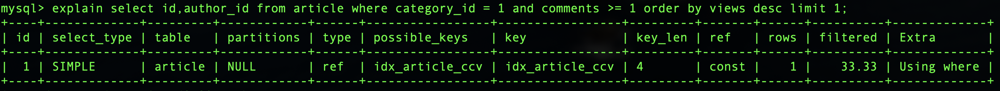

---

#### 两表案例

```mysql
CREATE TABLE IF NOT EXISTS `class`(
	`id` INT(10) UNSIGNED NOT NULL PRIMARY KEY AUTO_INCREMENT,
	`card` INT (10) UNSIGNED NOT NULL
);
CREATE TABLE IF NOT EXISTS `book`(
	`bookid` INT(10) UNSIGNED NOT NULL PRIMARY KEY AUTO_INCREMENT,
	`card` INT (10) UNSIGNED NOT NULL
);
INSERT INTO class(card)VALUES(FLOOR(1+(RAND()*20)));
INSERT INTO class(card)VALUES(FLOOR(1+(RAND()*20)));
INSERT INTO class(card)VALUES(FLOOR(1+(RAND()*20)));
INSERT INTO class(card)VALUES(FLOOR(1+(RAND()*20)));
INSERT INTO class(card)VALUES(FLOOR(1+(RAND()*20)));
INSERT INTO class(card)VALUES(FLOOR(1+(RAND()*20)));
INSERT INTO class(card)VALUES(FLOOR(1+(RAND()*20)));
INSERT INTO class(card)VALUES(FLOOR(1+(RAND()*20)));
INSERT INTO class(card)VALUES(FLOOR(1+(RAND()*20)));
INSERT INTO class(card)VALUES(FLOOR(1+(RAND()*20)));
INSERT INTO class(card)VALUES(FLOOR(1+(RAND()*20)));
INSERT INTO class(card)VALUES(FLOOR(1+(RAND()*20)));
INSERT INTO class(card)VALUES(FLOOR(1+(RAND()*20)));
INSERT INTO class(card)VALUES(FLOOR(1+(RAND()*20)));
INSERT INTO class(card)VALUES(FLOOR(1+(RAND()*20)));
INSERT INTO class(card)VALUES(FLOOR(1+(RAND()*20)));
INSERT INTO class(card)VALUES(FLOOR(1+(RAND()*20)));
INSERT INTO class(card)VALUES(FLOOR(1+(RAND()*20)));
INSERT INTO class(card)VALUES(FLOOR(1+(RAND()*20)));
INSERT INTO class(card)VALUES(FLOOR(1+(RAND()*20)));
 
INSERT INTO book(card)VALUES(FLOOR(1+(RAND()*20)));
INSERT INTO book(card)VALUES(FLOOR(1+(RAND()*20)));
INSERT INTO book(card)VALUES(FLOOR(1+(RAND()*20)));
INSERT INTO book(card)VALUES(FLOOR(1+(RAND()*20)));
INSERT INTO book(card)VALUES(FLOOR(1+(RAND()*20)));
INSERT INTO book(card)VALUES(FLOOR(1+(RAND()*20)));
INSERT INTO book(card)VALUES(FLOOR(1+(RAND()*20)));
INSERT INTO book(card)VALUES(FLOOR(1+(RAND()*20)));
INSERT INTO book(card)VALUES(FLOOR(1+(RAND()*20)));
INSERT INTO book(card)VALUES(FLOOR(1+(RAND()*20)));
INSERT INTO book(card)VALUES(FLOOR(1+(RAND()*20)));
INSERT INTO book(card)VALUES(FLOOR(1+(RAND()*20)));
INSERT INTO book(card)VALUES(FLOOR(1+(RAND()*20)));
INSERT INTO book(card)VALUES(FLOOR(1+(RAND()*20)));
INSERT INTO book(card)VALUES(FLOOR(1+(RAND()*20)));
INSERT INTO book(card)VALUES(FLOOR(1+(RAND()*20)));
INSERT INTO book(card)VALUES(FLOOR(1+(RAND()*20)));
INSERT INTO book(card)VALUES(FLOOR(1+(RAND()*20)));
INSERT INTO book(card)VALUES(FLOOR(1+(RAND()*20)));
INSERT INTO book(card)VALUES(FLOOR(1+(RAND()*20)));
```

在join 操作的时候有了主外键，那么索引应该是放在那个表中呢？

**由于是LEFT JOIN，所以左表是主表，因此第一次索引尝试加在主表上**

```mysql
CREATE INDEX idx_class_card ON class (card);
EXPLAIN SELECT * from class LEFT JOIN book ON class.card = book.card;
```

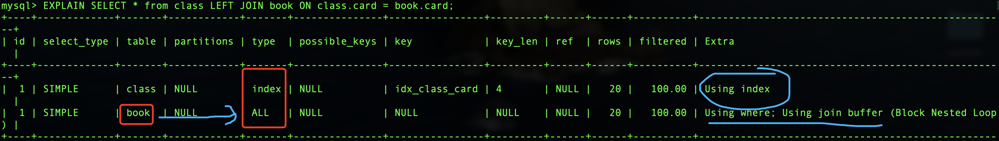

**结论：虽然type变为index，但是扫描行数依然是全表扫描。**

- 只对右表book 新增索引

```mysql
 -- 删除class表索引
DROP INDEX idx_class_card on class;
CREATE INDEX idx_book_card ON book (card);
EXPLAIN SELECT * from class LEFT JOIN book ON class.card = book.card;
```

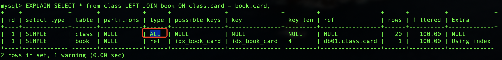

**结果：type变为ref，rows只扫描了一行。**
**结论：这是由于LEFT JOIN特性决定的，由于左表数据全都有，所以关键在于如何从右表进行搜索，所以右表一定要添加索引**

对于右链接，右边表示全部数据，应该关系从左边如何检索数据，应该给左表建立索引

---

三表简单案例 

```mysql
CREATE TABLE IF NOT EXISTS `phone`(
`phoneid` INT(10) UNSIGNED NOT NULL PRIMARY KEY AUTO_INCREMENT,
`card` INT (10) UNSIGNED NOT NULL
)ENGINE = INNODB;

DROP INDEX idx_book_card on book;

INSERT INTO phone(card)VALUES(FLOOR(1+(RAND()*20)));
INSERT INTO phone(card)VALUES(FLOOR(1+(RAND()*20)));
INSERT INTO phone(card)VALUES(FLOOR(1+(RAND()*20)));
INSERT INTO phone(card)VALUES(FLOOR(1+(RAND()*20)));
INSERT INTO phone(card)VALUES(FLOOR(1+(RAND()*20)));
INSERT INTO phone(card)VALUES(FLOOR(1+(RAND()*20)));
INSERT INTO phone(card)VALUES(FLOOR(1+(RAND()*20)));
INSERT INTO phone(card)VALUES(FLOOR(1+(RAND()*20)));
INSERT INTO phone(card)VALUES(FLOOR(1+(RAND()*20)));
INSERT INTO phone(card)VALUES(FLOOR(1+(RAND()*20)));
INSERT INTO phone(card)VALUES(FLOOR(1+(RAND()*20)));
INSERT INTO phone(card)VALUES(FLOOR(1+(RAND()*20)));
INSERT INTO phone(card)VALUES(FLOOR(1+(RAND()*20)));
INSERT INTO phone(card)VALUES(FLOOR(1+(RAND()*20)));
INSERT INTO phone(card)VALUES(FLOOR(1+(RAND()*20)));
INSERT INTO phone(card)VALUES(FLOOR(1+(RAND()*20)));
INSERT INTO phone(card)VALUES(FLOOR(1+(RAND()*20)));
INSERT INTO phone(card)VALUES(FLOOR(1+(RAND()*20)));
INSERT INTO phone(card)VALUES(FLOOR(1+(RAND()*20)));
INSERT INTO phone(card)VALUES(FLOOR(1+(RAND()*20)));
```

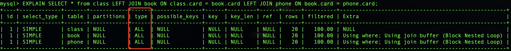

全部不加索引，`join` 操作全部全表扫描。

- 在`phone`和`book`表新增索引

```mysql
CREATE INDEX idx_phone_card ON phone(card);
CREATE INDEX idx_book_card ON book (card);
EXPLAIN SELECT * from class LEFT JOIN book ON class.card = book.card LEFT JOIN phone ON book.card = phone.card;
```

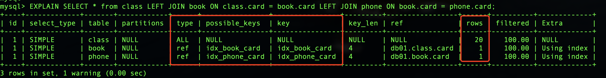

#### 总结

* 语句优化应**尽可能减少join语句中NestedLoop的循环总次数**，即**永远用小结果集(上面例子中的右表)驱动大结果集(上面例子中的左表：左连接-小标应该在左边，右链接-小表应该在右边)**。
* 优先NestedLoop的内层循环。
* 尽量保证join语句中被驱动表的条件字段添加了索引（即LEFT JOIN在右表上添加，RIGHT JOIN 中左表加索引）。
* 当无法保证被驱动表的条件字段添加索引时，且内存资源充足的前提下，不妨调整join buffer以达到性能优化的目的。

* 语句优化应尽可能减少join语句中NestedLoop的循环总次数，即“永远用小结果集驱动大结果集”。
* 优先优化NestedLoop的内层循环。
* 尽量保证join语句中被驱动表的条件字段添加了索引（即LEFT JOIN在右表上添加，反之亦然）。
* 当无法保证被驱动表的条件字段添加索引时，且内存资源充足的前提下，不妨调整join buffer以达到性能优化的目的。

---

#### 索引失效

> 建立的索引没有被使用

```mysql
CREATE TABLE `staffs`(
	`id` INT(10) PRIMARY KEY AUTO_INCREMENT,
	`name` VARCHAR(24) NOT NULL DEFAULT '' COMMENT '姓名',
	`age` INT(10) NOT NULL DEFAULT 0 COMMENT '年龄',
	`pos` VARCHAR(20) NOT NULL DEFAULT '' COMMENT '职位',
	`add_time` TIMESTAMP NOT NULL DEFAULT CURRENT_TIMESTAMP COMMENT '入职时间'
)COMMENT '员工记录表';

INSERT INTO `staffs`(`name`,`age`,`pos`) VALUES('Ringo', 18, 'manager');
INSERT INTO `staffs`(`name`,`age`,`pos`) VALUES('zhansan', 20, 'dev');
INSERT INTO `staffs`(`name`,`age`,`pos`) VALUES('lisi', 21, 'dev');

/* 创建索引 */
CREATE INDEX idx_staffs_name_age_pos ON `staffs`(`name`,`age`,`pos`);
```

索引失效案例

##### 复合索引最佳左前缀法则

复合索引下，检索条件需要一次从左边开发，**不能跳过任何索引列**。最好实践就是：**怎么建立索引，怎么使用索引**，如果跳过其中的某一列，那么跳过的索引后面的部分会失效。

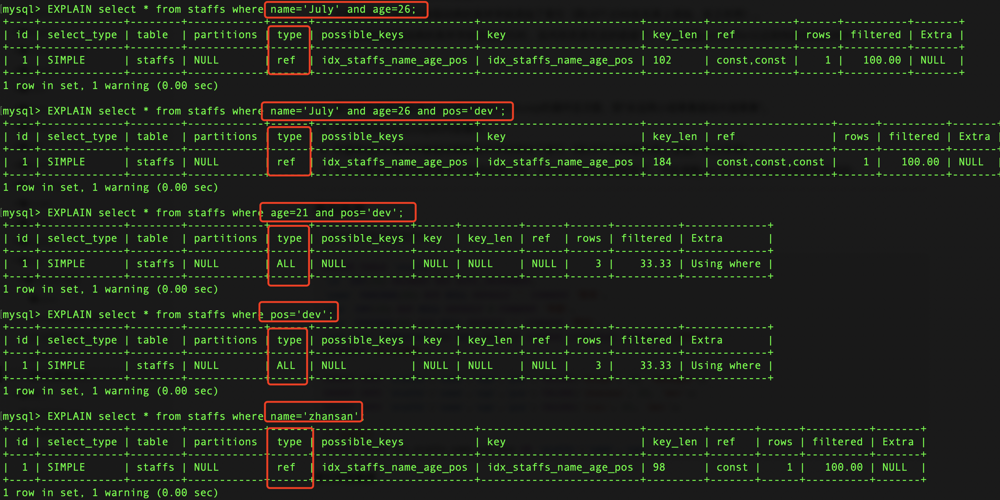

如上，当建立索引之后，在索引的时候，**跳过了前面索引列，而去查询后续的索引列，那么就会导致索引失效。**

在符合索引查询的时候需要遵循原则 **最佳左前缀法则，也就是说在查询的时候从最左前列开始查询，并且不跳过索引中的列**。

案例

```sql
create index idx_user_profession_age_status on tb_user(profession, age, status);
```

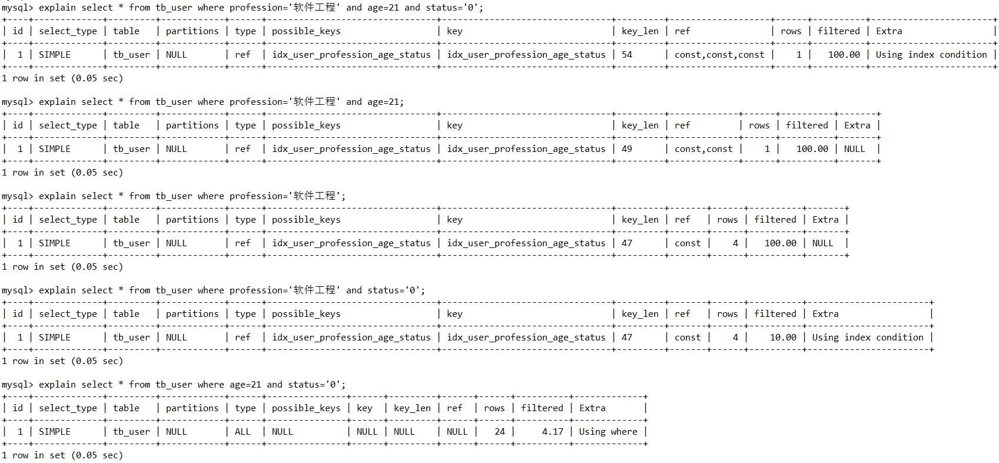

主要查看`key_len` 长度的变化，第一个查询用到了所有的索引，`key_len=54`, 第二个查询用到了第一个、第二个索引`key_len=49`, 第三个查询用到了第一个索引`key_len=47`, 这里也说明了复合索引中第一个索引的长度等于`47`, 第二个索引长度`2`, 第三个索引长度等于5，第4个查询中断开了中间的`age`索引，`key_len=47` 说明仅仅使用了第一个索引，后面的第三个索引是没有使用的。

**当复合索引多于2个的时候，中间索引列也是不能断开的。**

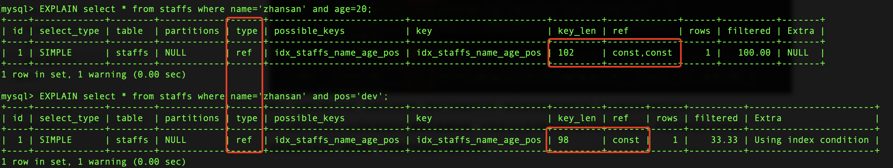

##### 索引列上少计算

会导致索引失效而转向全部扫描。操作(计算、函数、类型转换等)

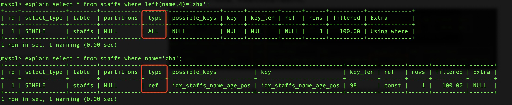

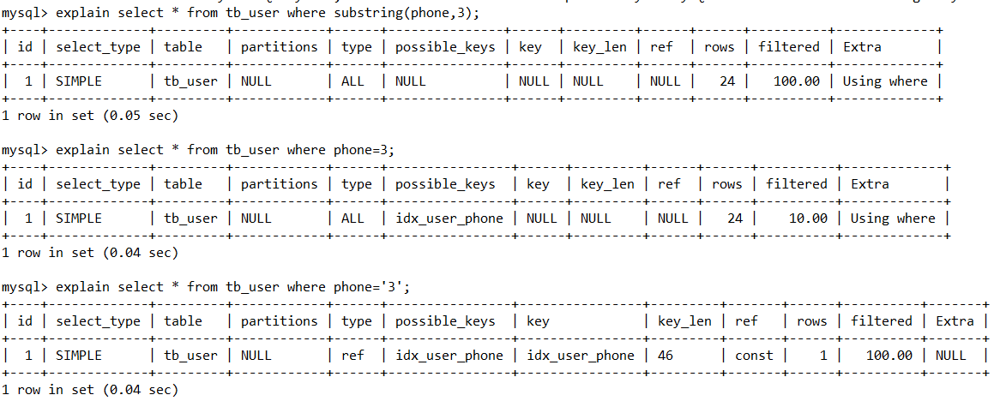

注意上面的查询中，`string` 类型的数据必须使用单引号，不使用就不会使用到索引。

##### 索引中范围检索之后的条件索引失效

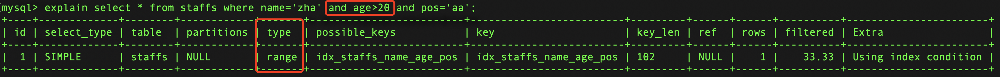

`ref` 列为`null`,  这里的其他操作还包括`in between` 等操作

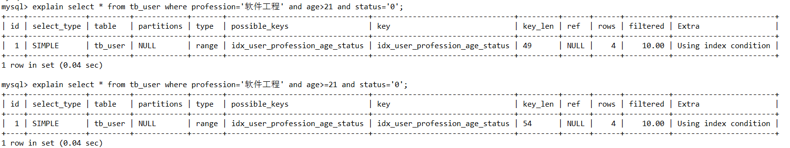

第一个查询使用到了`>`, `key_len=49` 只使用到了第一个和第二个索引，第三个失效了。解决办法就是在业务允许的情况下使用`>=`

##### 尽量使用覆盖索引，减少 `select *`

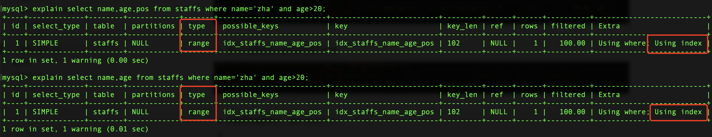

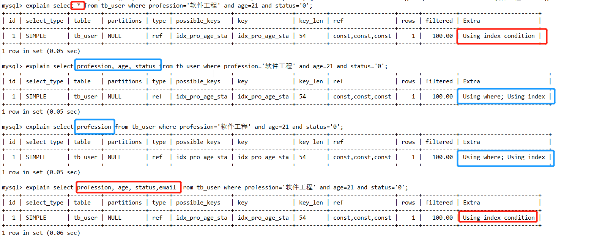

黑色部分，检索出的列是比索引中的列`profession/age/status` 都多，所以使用了`use index condition` **回表**，但是蓝色的检索的列均是在索引中可以找到，所以就不会回表。

`use index condition` 是要比`use where;using index` 性能更好

无法使用索引导致全表扫描

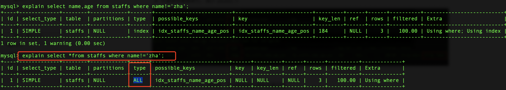

##### `is null, is not null` 也无法使用索引

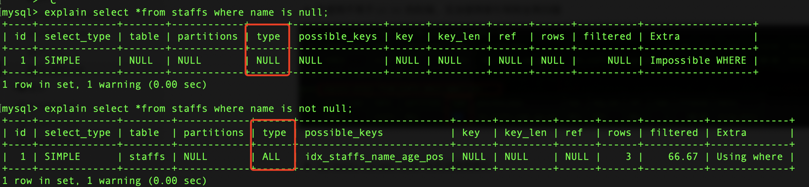

所以在查询的时候，尽量使用一个不存在的值去检索

```mysql
select *from staffs where name='-1'
-- 如名字基本不会出现是叫-1的人，使用name='-1'查询，而不使用 is null
```

#####  `%`方左边 

>  等索引失效会变成全表扫描

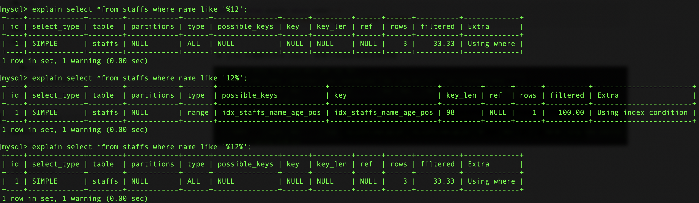

##### `%` 放到右边

>  是可以满足了最左前缀法则，也是可以走索引。

但是加入非得需要使用`%aa.` 或者`%aa%` 那么最好能够使用覆盖索引，这样索引还不是失效的。

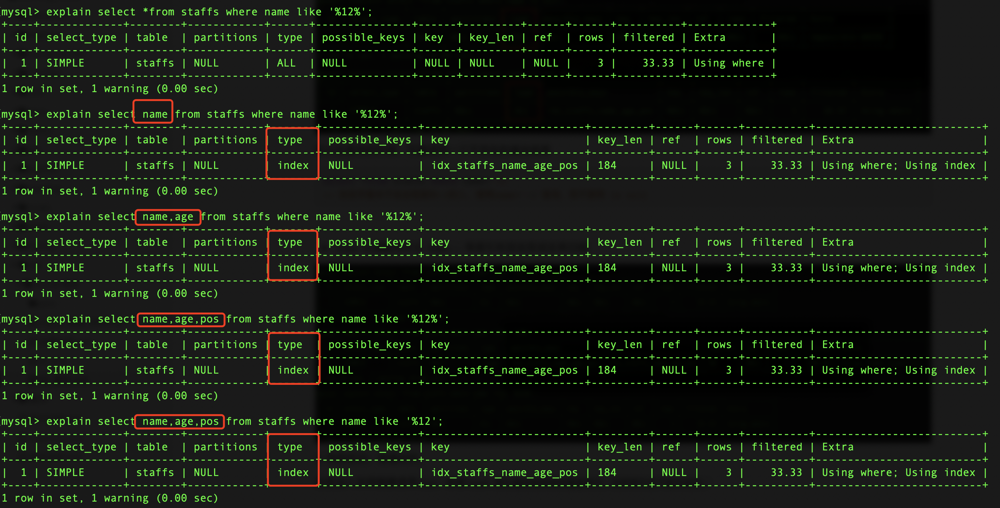

##### **字符串`varchar类型` 不加单引号索引失败**。

还是使用到了索引。

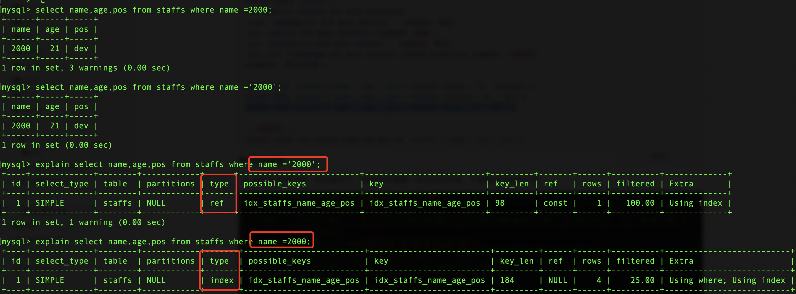

##### 少用 `or`

> `or` 链接的后面的美誉索引，那么即使前面的带有索引，那么也全部失效。所以要`or`前后全部均有索引。


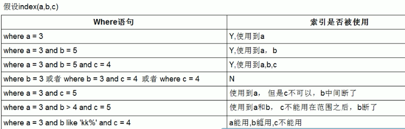

##### 数据分布影响走索引

数据有

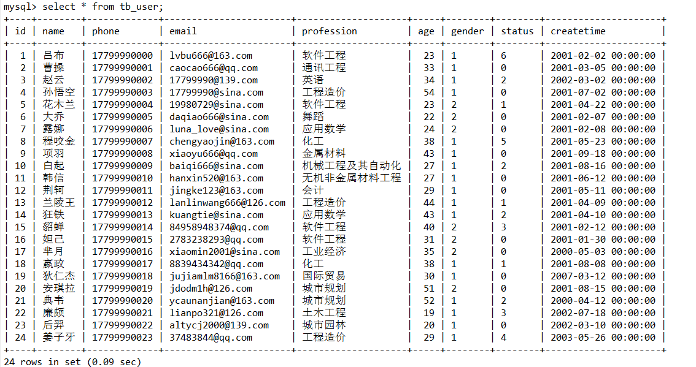

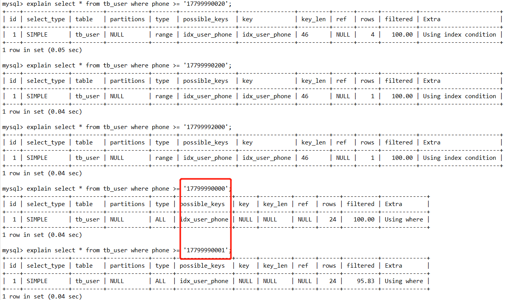

后面的两个查询，因为几乎全部的手机号都大于`where` 判断的手机号，这时候还还不如走全表扫。


#### 前缀索引

> 如`name` 字段的长度是100，那么可以只使用`name` 的前50个字符创建索引，改方法用于避免对长度比较大的字段建立索引的时候占用过多的索引结构空间。
>
> ```sql
> create index idx_xx on table_name(column(n));
> ```

#### 单例索引和联合索引

> 创建联合索引的时候需要注意**最左前缀法则**，注意多个字段的顺序

#### 设计索引的原则

> 什么表，应该建立什么样的索引

* 数据量较大，查询比较频繁的变建立索引
* 针对常用做查询条件，排序，分组建立索引
* 尽量选择区分度搞的列作为索引，尽量建立唯一索引，区分度搞，使用索引效率越高
* 如果是字符串字段，长度较长，那么应该选择**前缀索引**
* **尽量使用联合索引**，减少单例索引，查询时候也尽量覆盖索引，避免回表
* 控制索引的数据，维护索引也是有代价


#### `order by` 中的索引

* 联合索引，均排序时候，必须使用相同的排序方式，如果一个升序，一个降序，那么就会`file sort`
* 对多个列不同排序方式，那么序对多个列建立非联合索引，才不会使用`file sort`

以上的前提均是使用覆盖索引，否则还会出现`file sort`

---

#### [面试题](https://www.cnblogs.com/developer_chan/p/9223671.html)

```mysql
/* 创建表 */
CREATE TABLE `test03`(
`id` INT PRIMARY KEY NOT NULL AUTO_INCREMENT,
`c1` CHAR(10),
`c2` CHAR(10),
`c3` CHAR(10),
`c4` CHAR(10),
`c5` CHAR(10)
);

/* 插入数据 */
INSERT INTO `test03`(`c1`,`c2`,`c3`,`c4`,`c5`) VALUES('a1','a2','a3','a4','a5');
INSERT INTO `test03`(`c1`,`c2`,`c3`,`c4`,`c5`) VALUES('b1','b22','b3','b4','b5');
INSERT INTO `test03`(`c1`,`c2`,`c3`,`c4`,`c5`) VALUES('c1','c2','c3','c4','c5');
INSERT INTO `test03`(`c1`,`c2`,`c3`,`c4`,`c5`) VALUES('d1','d2','d3','d4','d5');
INSERT INTO `test03`(`c1`,`c2`,`c3`,`c4`,`c5`) VALUES('e1','e2','e3','e4','e5');

/* 创建复合索引 */
CREATE INDEX idx_test03_c1234 ON `test03`(`c1`,`c2`,`c3`,`c4`);

/* 最好索引怎么创建的，就怎么用，按照顺序使用，避免让MySQL再自己去翻译一次 */

/* 1.全值匹配 用到索引c1 c2 c3 c4全字段 */
EXPLAIN SELECT * FROM `test03` WHERE `c1` = 'a1' AND `c2` = 'a2' AND `c3` = 'a3' AND `c4` = 'a4';

/* 2.用到索引c1 c2 c3 c4全字段 MySQL的查询优化器会优化SQL语句的顺序*/
EXPLAIN SELECT * FROM `test03` WHERE `c1` = 'a1' AND `c2` = 'a2' AND `c4` = 'a4' AND `c3` = 'a3';

/* 
	3.用到索引c1 c2 c3 c4全字段 MySQL的查询优化器会优化SQL语句的顺序，和上面结果一样
	最好和创建索引的顺序保持一致，减少mysql 的一次优化
	在执行常量等值查询时，改变索引列的顺序并不会更改explain的执行结果，因为mysql底层优化器会进行优化，但是推荐按照索引顺序列编
	写sql语句。
*/
EXPLAIN SELECT * FROM `test03` WHERE `c4` = 'a4' AND `c3` = 'a3' AND `c2` = 'a2' AND `c1` = 'a1';

/* 4.用到索引c1 c2 c3字段，c4字段失效，范围(C3使用范围)之后全失效 */
EXPLAIN SELECT * FROM `test03` WHERE `c1` = 'a1' AND `c2` = 'a2' AND `c3` > 'a3' AND `c4` = 'a4';

/* 5.用到索引c1 c2 c3 c4全字段 MySQL的查询优化器会优化SQL语句的顺序*/
EXPLAIN SELECT * FROM `test03` WHERE `c1` = 'a1' AND `c2` = 'a2' AND `c4` > 'a4' AND `c3` = 'a3';

/* 
   6.用到了索引c1 c2 c3三个字段, c1和c2两个字段用于查找,  c3字段用于排序了但是没有统计到key_len中，C3断开了，所以c4字段失效
*/
EXPLAIN SELECT * FROM `test03` WHERE `c1` = 'a1' AND `c2` = 'a2' AND `c4` = 'a4' ORDER BY `c3`;

/* 7.用到了索引c1 c2 c3三个字段，c1和c2两个字段用于查找, c3字段用于排序了但是没有统计到key_len中*/
EXPLAIN SELECT * FROM `test03` WHERE `c1` = 'a1' AND `c2` = 'a2' ORDER BY `c3`;

/* 
   8.用到了索引c1 c2两个字段，c4失效，c1和c2两个字段用于查找，c4字段排序产生了Using filesort说明排序没有用到c4字段 
   当排序顺序和创建索引顺序不一致的时候会出现 filesort，但是也有一些情况下是不会的，如 13 案例
*/
EXPLAIN SELECT * FROM `test03` WHERE `c1` = 'a1' AND `c2` = 'a2' ORDER BY `c4`;

/* 9.用到了索引c1 c2 c3三个字段，c1用于查找，C1 之后所以断开，C5索引失效， c2和c3用于排序 */
EXPLAIN SELECT * FROM `test03` WHERE `c1` = 'a1' AND `c5` = 'a5' ORDER BY `c2`, `c3`;

/* 
	10.用到了c1一个字段，c1用于查找，c3和c2两个字段索引失效，产生了Using filesort 
*/
EXPLAIN SELECT * FROM `test03` WHERE `c1` = 'a1' AND `c5` = 'a5' ORDER BY `c3`, `c2`;

/* 11.用到了c1 c2 c3三个字段，c1 c2用于查找，c2 c3用于排序 ok*/
EXPLAIN SELECT * FROM `test03` WHERE `c1` = 'a1' AND  `c2` = 'a2' ORDER BY c2, c3;

/* 12.用到了c1 c2 c3三个字段，c1 c2用于查找，c2 c3用于排序，没有filesort，因为 */
EXPLAIN SELECT * FROM `test03` WHERE `c1` = 'a1' AND  `c2` = 'a2' AND `c5` = 'a5' ORDER BY c2, c3;

/* 
   13.用到了c1 c2 c3三个字段，c1 c2用于查找，c2 c3用于排序 没有产生Using filesort 
      因为之前c2这个字段已经确定了是'a2'了，这是一个常量，再去ORDER BY c3,c2 这时候c2已经不用排序了！
      所以没有产生Using filesort 和(10)进行对比学习！
*/
EXPLAIN SELECT * FROM `test03` WHERE `c1` = 'a1' AND `c2` = 'a2' AND `c5` = 'a5' ORDER BY c3, c2;


/* GROUP BY 表面上是叫做分组，但是分组之前必定排序。 */

/* 
	14.用到c1 c2 c3三个字段，c1用于查找，c2 c3用于排序，c4失效 
	GROUP BY 基本上都需要进行排序，会有临时表
*/
EXPLAIN SELECT * FROM `test03` WHERE `c1` = 'a1' AND `c4` = 'a4' GROUP BY `c2`,`c3`;

/* 
	15.用到c1这一个字段，c4失效，c2和c3排序失效产生了Using filesort, useing temporary 
*/
EXPLAIN SELECT * FROM `test03` WHERE `c1` = 'a1' AND `c4` = 'a4' GROUP BY `c3`,`c2`;
```

索引优化的一般性建议：

- 对于单值索引，尽量选择针对当前`query`过滤性更好的索引。
- 在选择复合索引的时候，当前`query`中过滤性最好的字段在索引字段顺序中，位置越靠前越好。
- 在选择复合索引的时候，尽量选择可以能够包含当前`query`中的`where`子句中更多字段的索引。
- 尽可能通过分析统计信息和调整`query`的写法来达到选择合适索引的目的。

---


