#### MyCat-Web

是`My-Cat` 的运维的监控和管理平台，分担统计和配置管理任务，引入了`ZK` 作为管理多个节点，主要管理和监控`Mycat` 的流量、链接、活动现场和内存等，具备IP 白名单，邮件告警等模块，还可以统计SQL 并分析慢SQL 和高频SQL 等，为优化SQL 提供依据。

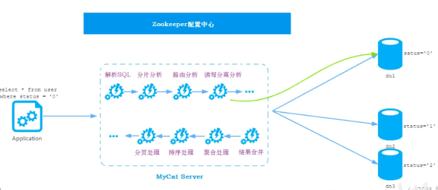

##### 安装

```shell
# 减压 zk 和 mycatweb
tar -zxvf mycat-web -C /user/local
tar -zxvf zk  -C /user/local

# zk 目录下新建 data 目录
mkdir data

# 配置 zk
cp zoo.sample.cfg zoo.cfg
#修改dataDir 目录为上面新建的 data目录
# 启动zk
./bin/zkServer.sh status
./bin/zkServer.sh start

# 安装，启动 mycatweb
# 减压完成后直接启动
./start.sh

# 访问端口 8082/mycat 打开监控平台

# 如果mycat 和 zk 不在同一台服务器上需要在 mycatweb/webinfo/classes/mycat.properties 中完成配置
```

##### 监控

启动之后还需要去配置，让`mycatweb` 去监控哪一台mycat /mycat服务管理/新增。

还可以单独管理监控一个mysql性能，mysql服务管理/新增。完成配置

添加之后就可以完成监控配置。


#### 读写分离

##### 主从复制

> 将主数据库中`DDL` 和 `DML` 操作通过二进制日志传递到从服务器中，然后在从库中对这些日志进行重新执行(重做)，从而是的从库和主库的数据保持同步
>
> mysql 支持一台主库 同时往多台从库进行复制，从库同时也作为其他服务器的主库，实现链状复制

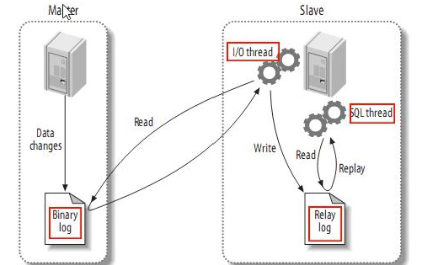

复制分为三步

1. Master 在提交事务提交的时候，会将数据变更作为时间`Events` 记录在二进制日志文件中`binlog`
2. 主库推送二进制日志文件BinLog 中的日志事件到从库的中继日志`Relay Log`
3. slave 重做中继日志中的事件，将改变反应为自己的数据

##### 主从复制搭建

1. 手动`docker` 搭建

   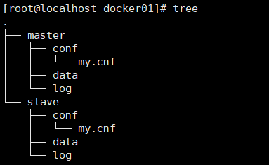

   master 的 my.cnf 配置

   ```shell
   [mysqld]
   ## 设置server_id，同一局域网中需要唯一
   server_id=101 
   ## 指定不需要同步的数据库名称
   binlog-ignore-db=mysql  
   ## 开启二进制日志功能
   log-bin=mall-mysql-bin  
   ## 设置二进制日志使用内存大小（事务）
   binlog_cache_size=1M  
   ## 设置使用的二进制日志格式（mixed,statement,row）
   binlog_format=mixed  
   ## 二进制日志过期清理时间。默认值为0，表示不自动清理。
   expire_logs_days=7  
   ## 跳过主从复制中遇到的所有错误或指定类型的错误，避免slave端复制中断。
   ## 如：1062错误是指一些主键重复，1032错误是因为主从数据库数据不一致
   slave_skip_errors=1062
   ```

   slave 的 my.cnf 配置

   ```shell
   [mysqld]
   ## 设置server_id，同一局域网中需要唯一
   server_id=102
   ## 指定不需要同步的数据库名称
   binlog-ignore-db=mysql  
   ## 开启二进制日志功能，以备Slave作为其它数据库实例的Master时使用
   log-bin=mall-mysql-slave1-bin  
   ## 设置二进制日志使用内存大小（事务）
   binlog_cache_size=1M  
   ## 设置使用的二进制日志格式（mixed,statement,row）
   binlog_format=mixed  
   ## 二进制日志过期清理时间。默认值为0，表示不自动清理。
   expire_logs_days=7  
   ## 跳过主从复制中遇到的所有错误或指定类型的错误，避免slave端复制中断。
   ## 如：1062错误是指一些主键重复，1032错误是因为主从数据库数据不一致
   slave_skip_errors=1062  
   ## relay_log配置中继日志
   relay_log=mall-mysql-relay-bin  
   ## log_slave_updates表示slave将复制事件写进自己的二进制日志
   log_slave_updates=1  
   ## slave设置为只读（具有super权限的用户除外）
   read_only=1
   ```

   master-mysql 容器启动

   ```shell
   docker run -p 3306:3306 --name mysql-master \
   -v /home/local/docker/mysql01/mysql-cluster/docker01/master/log:/var/log/mysql \
   -v /home/local/docker/mysql01/mysql-cluster/docker01/master/data:/var/lib/mysql \
   -v /home/local/docker/mysql01/mysql-cluster/docker01/master/conf:/etc/mysql \
   -e MYSQL_ROOT_PASSWORD=root \
   -d mysql:5.7.25
   ```

   slave-mysql 容器启动: 二者保证

   ```shell
   docker run -p 3307:3306 --name mysql-slave \
   -v /home/local/docker/mysql01/mysql-cluster/docker01/slave/log:/var/log/mysql \
   -v /home/local/docker/mysql01/mysql-cluster/docker01/slave/data:/var/lib/mysql \
   -v /home/local/docker/mysql01/mysql-cluster/docker01/slave/conf:/etc/mysql \
   -e MYSQL_ROOT_PASSWORD=root \
   -d mysql:5.7.25
   ```

   配置主从关系: 主要就这里2步骤

   ```shell
   # 进入到主容器的mysql 命令中
   # 创建主从复制binlog 文件用户，赋予权限
   create user 'slave'@'%' identified by 'slave';
   grant replication slave,replication client on *.* to 'slave'@'%';
   
   # 从容器设置master
   change master to master_host='192.168.56.100', master_user='slave', master_password='slave', master_port=3306, master_log_file='mall-mysql-bin.000004	', master_log_pos=154, master_connect_retry=30;
   
   # 查看用户
   select user,host from mysql.user;
   ```

   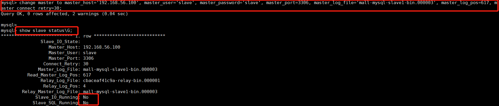

   此时slave 还没启动

   ```shell
   STOP slave IO_THREAD;
   ```

   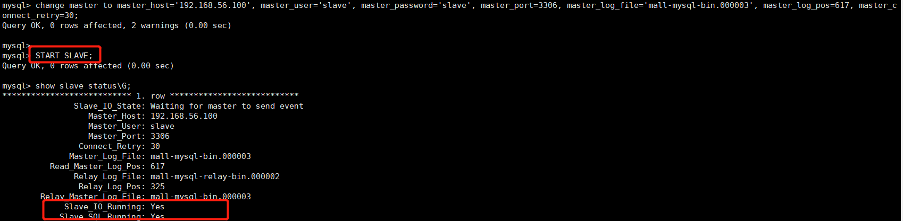

   

2台mysql 实现主从复制

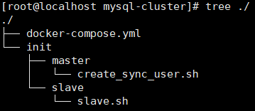

* Master 脚本

```shell
#!/bin/bash
#定义用于同步的用户名
MASTER_SYNC_USER=${MASTER_SYNC_USER:-sync_admin}
#定义用于同步的用户密码
MASTER_SYNC_PASSWORD=${MASTER_SYNC_PASSWORD:-123456}
#定义用于登录mysql的用户名
ADMIN_USER=${ADMIN_USER:-root}
#定义用于登录mysql的用户密码
ADMIN_PASSWORD=${ADMIN_PASSWORD:-123456}
#定义运行登录的host地址
ALLOW_HOST=${ALLOW_HOST:-%}
#定义创建账号的sql语句
CREATE_USER_SQL="CREATE USER '$MASTER_SYNC_USER'@'$ALLOW_HOST' IDENTIFIED BY '$MASTER_SYNC_PASSWORD';"
#定义赋予同步账号权限的sql,这里设置两个权限，REPLICATION SLAVE，属于从节点副本的权限，REPLICATION CLIENT是副本客户端的权限，可以执行show master status语句
GRANT_PRIVILEGES_SQL="GRANT REPLICATION SLAVE,REPLICATION CLIENT ON *.* TO '$MASTER_SYNC_USER'@'$ALLOW_HOST';"
#定义刷新权限的sql
FLUSH_PRIVILEGES_SQL="FLUSH PRIVILEGES;"
#执行sql
mysql -u"$ADMIN_USER" -p"$ADMIN_PASSWORD" -e "$CREATE_USER_SQL $GRANT_PRIVILEGES_SQL $FLUSH_PRIVILEGES_SQL"
```

*-e, --execute=name  Execute command and quit.*

*  slave 参数

```shell
#定义连接master进行同步的账号,:xx， 默认值写法
SLAVE_SYNC_USER="${SLAVE_SYNC_USER:-sync_admin}"
#定义连接master进行同步的账号密码
SLAVE_SYNC_PASSWORD="${SLAVE_SYNC_PASSWORD:-123456}"
#定义slave数据库账号
ADMIN_USER="${ADMIN_USER:-root}"
#定义slave数据库密码
ADMIN_PASSWORD="${ADMIN_PASSWORD:-123456}"
#定义连接master数据库host地址
MASTER_HOST="${MASTER_HOST:-%}"
#等待10s，保证master数据库启动成功，不然会连接失败
sleep 10
#连接master数据库，查询二进制数据，并解析出logfile和pos，这里同步用户要开启 REPLICATION CLIENT权限，才能使用SHOW MASTER STATUS;
RESULT=`mysql -u"$SLAVE_SYNC_USER" -h$MASTER_HOST -p"$SLAVE_SYNC_PASSWORD" -e "SHOW MASTER STATUS;" | grep -v grep |tail -n +2| awk '{print $1,$2}'`
#解析出logfile
LOG_FILE_NAME=`echo $RESULT | grep -v grep | awk '{print $1}'`
#解析出pos
LOG_FILE_POS=`echo $RESULT | grep -v grep | awk '{print $2}'`
#设置连接master的同步相关信息
SYNC_SQL="change master to master_host='$MASTER_HOST',master_user='$SLAVE_SYNC_USER',master_password='$SLAVE_SYNC_PASSWORD',master_log_file='$LOG_FILE_NAME',master_log_pos=$LOG_FILE_POS;"
#开启同步
START_SYNC_SQL="start slave;"
#查看同步状态
STATUS_SQL="show slave status\G;"
mysql -u"$ADMIN_USER" -p"$ADMIN_PASSWORD" -e "$SYNC_SQL $START_SYNC_SQL $STATUS_SQL"
```

* docker-compose

```shell
version: '3'
services:
  mysql-master:
    image: mysql:5.7.25
    container_name: mysql-master
    environment:
      MYSQL_ROOT_PASSWORD: "root"
      MASTER_SYNC_USER: "repl" #设置脚本中定义的用于同步的账号
      MASTER_SYNC_PASSWORD: "repl" #设置脚本中定义的用于同步的密码
      ADMIN_USER: "root" #当前容器用于拥有创建账号功能的数据库账号
      ADMIN_PASSWORD: "root"
      ALLOW_HOST: "10.10.%.%" #允许同步账号的host地址
      TZ: "Asia/Shanghai" #解决时区问题
    networks:
      mysql:
        ipv4_address: "10.10.10.10" #固定ip，因为从库在连接master的时候，需要设置host
    volumes:
    - ./init/master:/docker-entrypoint-initdb.d #挂载master脚本
    command:
    -  "--server-id=1"
    -  "--character-set-server=utf8mb4"
    -  "--collation-server=utf8mb4_unicode_ci"
    -  "--log-bin=mysql-bin"
    -  "--sync_binlog=1"
    ports:
      - "3306:3306"
  mysql-slave1:
    image: mysql:5.7.25
    container_name: mysql-slave1
    environment:
      MYSQL_ROOT_PASSWORD: "root"
      SLAVE_SYNC_USER: "repl" #用于同步的账号，由master创建
      SLAVE_SYNC_PASSWORD: "repl"
      ADMIN_USER: "root"
      ADMIN_PASSWORD: "root"
      MASTER_HOST: "10.10.10.10" #master地址，开启主从同步需要连接master
      TZ: "Asia/Shanghai" #设置时区
    networks:
    - mysql
    volumes:
    - ./init/slave:/docker-entrypoint-initdb.d #挂载slave脚本
    command:
    -  "--server-id=2"
    -  "--character-set-server=utf8mb4"
    -  "--collation-server=utf8mb4_unicode_ci"
    ports:
      - "3307:3306"
networks:
  mysql:
    driver: bridge
    ipam:
      driver: default
      config:
      - subnet: "10.10.0.0/16"
```


##### mycat 一主一从读写分离

```xml
<?xml version="1.0"?>
<!DOCTYPE mycat:schema SYSTEM "schema.dtd">
<mycat:schema xmlns:mycat="http://io.mycat/">

	<schema name="ITCAST" checkSQLschema="true" sqlMaxLimit="100">
    <table name="user" dataNode="dn1" primaryKey="id"></table>
	</schema>

	<dataNode name="dn1" dataHost="localhost1" database="db01" /> 

	<dataHost name="localhost1" maxCon="1000" minCon="10" balance="0"
			  writeType="0" dbType="mysql" dbDriver="native" switchType="1"  slaveThreshold="100">
		<heartbeat>select user()</heartbeat>
		<writeHost host="hostM1" url="localhost:3306" user="root" password="root">
      <readHost host="host1" url="localhost:3307" user="root" password="root"></readHost>
    </writeHost>
	</dataHost>

</mycat:schema>
```

新建库以及表

```mysql
create database db01;

user db01;

create table user(
	id int(11) not null auto_increment,
	name varchar(50) not null,
	sex varchar(1),
	primary key (id)
)engine=innodb default charset=utf8;

insert into user(id,name,sex) values(null,'Tom','1');
insert into user(id,name,sex) values(null,'Trigger','0');
insert into user(id,name,sex) values(null,'Dawn','1');
```

然后在`mycat` 上执行`sql` 查询，通过将`mysql` 的日志配置`./conf/log4j2.xml` 级别调整到`debug` 就能看到结果

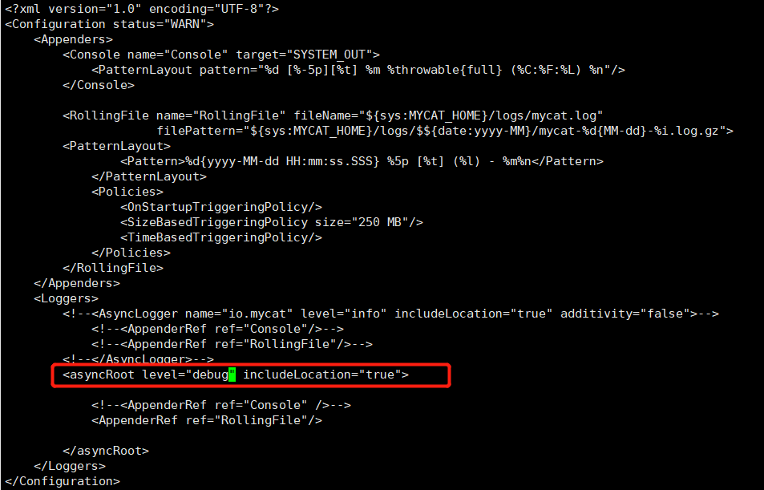

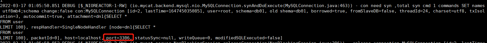

从日志中看到的依然是访问了`master`,这里没有发生读写分离是因为负载均衡配置 `balance="0"` 的配置。

* `balance=0`

  > 不开启读写分离，所有操作均发到`writeHost` 中

* `balance=1`

  > 全部的`readHost` 和 `stand by writeHost`(备用writeHost) 都参与`select` 语句的负载均衡，就是采用双主双从的模型，

* `balance=2`

  > 所有的读写操作都随机在`writeHost，readHost` 上分发

* `balance=3`

  > 所有的读请求随机分发到`writeHost` 对应的`readHost` 上执行，`writeHost` 不负担压力，

将配置文件`balance` 的值修改为3之后，再测试

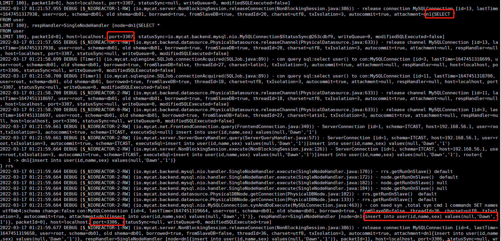

日志中`select` 语句是在从节点执行，写节点在主节点中完成。

*当主库挂掉之后，从库就不能在工作了*

##### mycat 双主双从读写分离

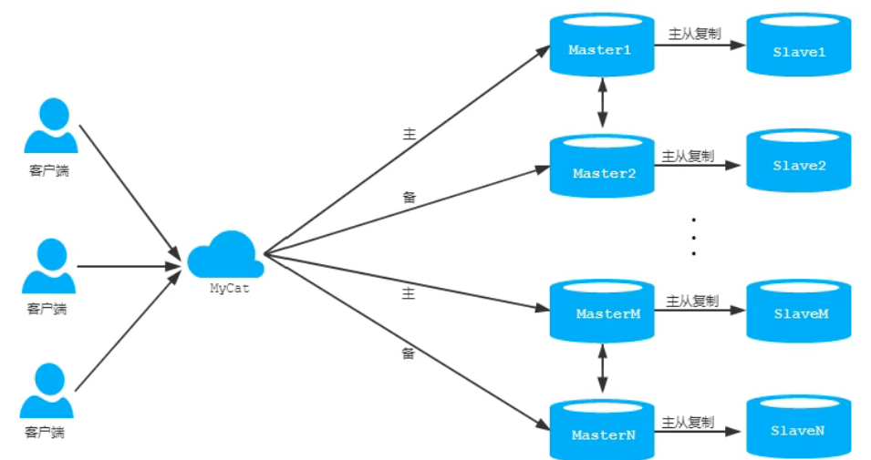

`master1` 和 `master2` 是互为备份的，正常情况下，`master1` 负责写，`slave1` 负责读，当`master1` 挂掉之后，`slave1` 也是不能工作的。这个时候`master2` 作为写节点，`slave2` 作为从节点，继续工作。

1. 配置`my.conf` 主要是配置`server-id` 保证4台`mysql` 不重复

2. 启动镜像

   ```shell
   # master1
   docker run -p 3306:3306 --name mysql-master1 \
   -v /home/local/docker/mysql01/mysql-cluster/docker02/master/log:/var/log/mysql \
   -v /home/local/docker/mysql01/mysql-cluster/docker02/master/data:/var/lib/mysql \
   -v /home/local/docker/mysql01/mysql-cluster/docker02/master/conf:/etc/mysql \
   -e MYSQL_ROOT_PASSWORD=root \
   -d mysql:5.7.25
   # slave1
   docker run -p 3307:3306 --name mysql-slave1 \
   -v /home/local/docker/mysql01/mysql-cluster/docker02/slave/log:/var/log/mysql \
   -v /home/local/docker/mysql01/mysql-cluster/docker02/slave/data2:/var/lib/mysql \
   -v /home/local/docker/mysql01/mysql-cluster/docker02/slave/conf:/etc/mysql \
   -e MYSQL_ROOT_PASSWORD=root \
   -d mysql:5.7.25
   
   # master2
   docker run -p 3308:3306 --name mysql-master2 \
   -v /home/local/docker/mysql01/mysql-cluster/docker02/master2/log:/var/log/mysql \
   -v /home/local/docker/mysql01/mysql-cluster/docker02/master2/data2:/var/lib/mysql \
   -v /home/local/docker/mysql01/mysql-cluster/docker02/master2/conf:/etc/mysql \
   -e MYSQL_ROOT_PASSWORD=root \
   -d mysql:5.7.25
   # slave2
   docker run -p 3309:3306 --name mysql-slave2 \
   -v /home/local/docker/mysql01/mysql-cluster/docker02/slave2/log:/var/log/mysql \
   -v /home/local/docker/mysql01/mysql-cluster/docker02/slave2/data2:/var/lib/mysql \
   -v /home/local/docker/mysql01/mysql-cluster/docker02/slave2/conf:/etc/mysql \
   -e MYSQL_ROOT_PASSWORD=root \
   -d mysql:5.7.25
   ```

   3. 主机需要关闭防火墙

   4. 登记两台主机`master1` 和 `master2` 并创建账户并授权`slave`

      ```shell
      # 进入到主容器的mysql 命令中
      # 创建主从复制binlog 文件用户，赋予权限
      create user 'slave'@'%' identified by 'slave';
      grant replication slave,replication client on *.* to 'slave'@'%';
      flush privileges;
      
      # slave1 从容器设置 master1
      change master to master_host='192.168.56.100', master_user='slave', master_password='slave', master_port=3306, master_log_file='mysql-bin.000003', master_log_pos=769, master_connect_retry=30;
      
      # slave2 从容器设置 master2
      change master to master_host='192.168.56.100', master_user='slave', master_password='slave', master_port=3308, master_log_file='mysql-slave-slave-bin.000003', master_log_pos=769, master_connect_retry=30;
      
      # 开启复制功能
      start slave;
      # 查看2个IO 的状态是否是 Yes
      show slave status\G;
       
      # 查看用户
      select user,host from mysql.user;
      ```

   5. 测试

      ```mysql
      create database db01;
      
      use db01;
      
      create table user(
      	id int(11) not null auto_increment,
      	name varchar(50) not null,
      	sex varchar(1),
      	primary key (id)
      )engine=innodb default charset=utf8;
      
      insert into user(id,name,sex) values(null,'Tom','1');
      insert into user(id,name,sex) values(null,'Trigger','0');
      insert into user(id,name,sex) values(null,'Dawn','1');
      ```

   6. 2个master 之间的互备

      ```mysql
      # master1 执行
      change master to master_host='192.168.56.100', master_user='slave', master_password='slave', master_port=3308, master_log_file='mysql-slave-slave-bin.000003', master_log_pos=1550, master_connect_retry=30;
      
      start slave;
      show slave status;
      
      # master2 执行
      change master to master_host='192.168.56.100', master_user='slave', master_password='slave', master_port=3306, master_log_file='mysql-bin.000003', master_log_pos=1550, master_connect_retry=30;
      
      start slave;
      show slave status;
      
      ```

   7. 测试master 之间的复制功能

      ```mysql
      # 在 master1 中执行，然后再slave1，master2 slave2 中均可以看到插入的数据
      create database db02;
      
      use db02;
      
      create table user(
      	id int(11) not null auto_increment,
      	name varchar(50) not null,
      	sex varchar(1),
      	primary key (id)
      )engine=innodb default charset=utf8;
      
      insert into user(id,name,sex) values(null,'Tom','1');
      insert into user(id,name,sex) values(null,'Trigger','0');
      insert into user(id,name,sex) values(null,'Dawn','1');
      
      # 在 master2 中执行，然后再slave2，master1 slave1 中均可以看到插入的数据
      create database db03;
      
      use db03;
      
      create table user(
      	id int(11) not null auto_increment,
      	name varchar(50) not null,
      	sex varchar(1),
      	primary key (id)
      )engine=innodb default charset=utf8;
      
      insert into user(id,name,sex) values(null,'Tom','1');
      insert into user(id,name,sex) values(null,'Trigger','0');
      insert into user(id,name,sex) values(null,'Dawn','1');
      ```

   8. 配置读写分离

      ```xml
      <?xml version="1.0"?>
      <!DOCTYPE mycat:schema SYSTEM "schema.dtd">
      <mycat:schema xmlns:mycat="http://io.mycat/">
      
      	<schema name="ITCAST" checkSQLschema="true" sqlMaxLimit="100">
          <table name="user" dataNode="dn1" primaryKey="id"></table>
      	</schema>
      
      	<dataNode name="dn1" dataHost="localhost1" database="db01" /> 
      
          <!-- 2个主机，从机-->
      	<dataHost name="localhost1" maxCon="1000" minCon="10" balance="1"
      			  writeType="0" dbType="mysql" dbDriver="native" switchType="1"  slaveThreshold="100">
      		<heartbeat>select user()</heartbeat>
      		<writeHost host="hostM1" url="localhost:3306" user="root" password="root">
            <readHost host="host1" url="localhost:3307" user="root" password="root"></readHost>
          </writeHost>
      
          <writeHost host="hostM2" url="localhost:3308" user="root" password="root">
            <readHost host="host2" url="localhost:3309" user="root" password="root"></readHost>
          </writeHost>
      
      	</dataHost>
      
      </mycat:schema>
      ```

      ​	`balance="1"` 备用主节点的write和dead节点，以及主节点的read 节点都会读，主节点的write 不会读。也就是		

      ​	`3307,3308,3309` 三个mysql 都会读，但是`3306` mysql 则不会。但是当写入操作则只会操作3306.

      ​	`switchType="1"` 表示第一个主机挂掉，会自动切换到第二个，`="0"` 表示不会自动切换

      9. 测试将现在的主节点挂掉，也就是3306这个机器

         ```shell
         docker stop 6b1
         ```

         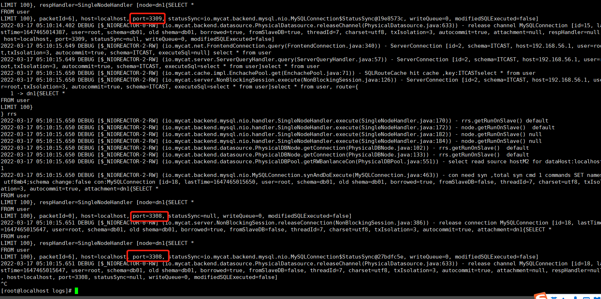

      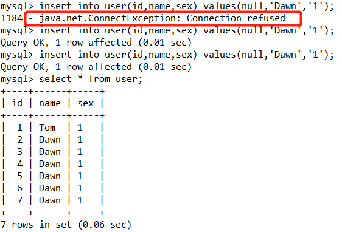

      刚开始写会报错，后面在插入就可以插入了。

      
