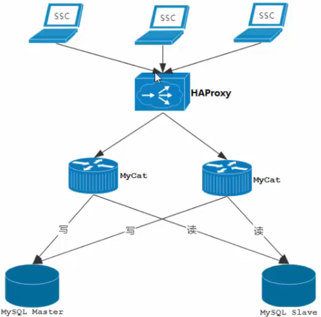
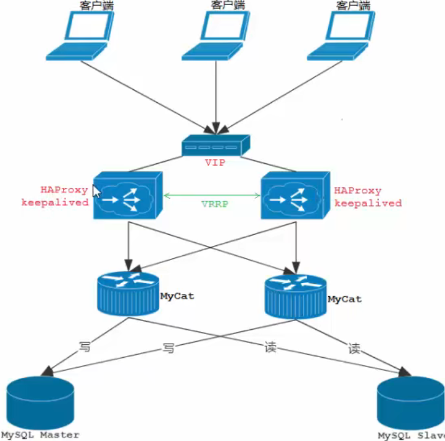

#### MyCat-Web

是`My-Cat` 的运维的监控和管理平台，分担统计和配置管理任务，引入了`ZK` 作为管理多个节点，主要管理和监控`Mycat` 的流量、链接、活动现场和内存等，具备IP 白名单，邮件告警等模块，还可以统计SQL 并分析慢SQL 和高频SQL 等，为优化SQL 提供依据。


##### 安装

```shell
# 减压 zk 和 mycatweb
tar -zxvf mycat-web -C /user/local
tar -zxvf zk  -C /user/local

# zk 目录下新建 data 目录
mkdir data

# 配置 zk
cp zoo.sample.cfg zoo.cfg
#修改dataDir 目录为上面新建的 data目录
# 启动zk
./bin/zkServer.sh status
./bin/zkServer.sh start

# 安装，启动 mycatweb
# 减压完成后直接启动
./start.sh

# 访问端口 8082/mycat 打开监控平台

# 如果mycat 和 zk 不在同一台服务器上需要在 mycatweb/webinfo/classes/mycat.properties 中完成配置
```

##### 监控

启动之后还需要去配置，让`mycatweb` 去监控哪一台mycat /mycat服务管理/新增。

还可以单独管理监控一个mysql性能，mysql服务管理/新增。完成配置

添加之后就可以完成监控配置。


#### 读写分离

##### 主从复制

> 将主数据库中`DDL` 和 `DML` 操作通过二进制日志传递到从服务器中，然后在从库中对这些日志进行重新执行(重做)，从而是的从库和主库的数据保持同步
>
> mysql 支持一台主库 同时往多台从库进行复制，从库同时也作为其他服务器的主库，实现链状复制


复制分为三步

1. Master 在提交事务提交的时候，会将数据变更作为时间`Events` 记录在二进制日志文件中`binlog`
2. 主库推送二进制日志文件BinLog 中的日志事件到从库的中继日志`Relay Log`
3. slave 重做中继日志中的事件，将改变反应为自己的数据

##### 主从复制搭建

1. 手动`docker` 搭建

   

   master 的 my.cnf 配置

   ```shell
   [mysqld]
   ## 设置server_id，同一局域网中需要唯一
   server_id=101 
   ## 指定不需要同步的数据库名称
   binlog-ignore-db=mysql  
   ## 开启二进制日志功能
   log-bin=mall-mysql-bin  
   ## 设置二进制日志使用内存大小（事务）
   binlog_cache_size=1M  
   ## 设置使用的二进制日志格式（mixed,statement,row）
   binlog_format=mixed  
   ## 二进制日志过期清理时间。默认值为0，表示不自动清理。
   expire_logs_days=7  
   ## 跳过主从复制中遇到的所有错误或指定类型的错误，避免slave端复制中断。
   ## 如：1062错误是指一些主键重复，1032错误是因为主从数据库数据不一致
   slave_skip_errors=1062
   ```

   slave 的 my.cnf 配置

   ```shell
   [mysqld]
   ## 设置server_id，同一局域网中需要唯一
   server_id=102
   ## 指定不需要同步的数据库名称
   binlog-ignore-db=mysql  
   ## 开启二进制日志功能，以备Slave作为其它数据库实例的Master时使用
   log-bin=mall-mysql-slave1-bin  
   ## 设置二进制日志使用内存大小（事务）
   binlog_cache_size=1M  
   ## 设置使用的二进制日志格式（mixed,statement,row）
   binlog_format=mixed  
   ## 二进制日志过期清理时间。默认值为0，表示不自动清理。
   expire_logs_days=7  
   ## 跳过主从复制中遇到的所有错误或指定类型的错误，避免slave端复制中断。
   ## 如：1062错误是指一些主键重复，1032错误是因为主从数据库数据不一致
   slave_skip_errors=1062  
   ## relay_log配置中继日志
   relay_log=mall-mysql-relay-bin  
   ## log_slave_updates表示slave将复制事件写进自己的二进制日志
   log_slave_updates=1  
   ## slave设置为只读（具有super权限的用户除外）
   read_only=1
   ```

   master-mysql 容器启动

   ```shell
   docker run -p 3306:3306 --name mysql-master \
   -v /home/local/docker/mysql01/mysql-cluster/docker01/master/log:/var/log/mysql \
   -v /home/local/docker/mysql01/mysql-cluster/docker01/master/data:/var/lib/mysql \
   -v /home/local/docker/mysql01/mysql-cluster/docker01/master/conf:/etc/mysql \
   -e MYSQL_ROOT_PASSWORD=root \
   -d mysql:5.7.25
   ```

   slave-mysql 容器启动: 二者保证

   ```shell
   docker run -p 3307:3306 --name mysql-slave \
   -v /home/local/docker/mysql01/mysql-cluster/docker01/slave/log:/var/log/mysql \
   -v /home/local/docker/mysql01/mysql-cluster/docker01/slave/data:/var/lib/mysql \
   -v /home/local/docker/mysql01/mysql-cluster/docker01/slave/conf:/etc/mysql \
   -e MYSQL_ROOT_PASSWORD=root \
   -d mysql:5.7.25
   ```

   配置主从关系: 主要就这里2步骤

   ```shell
   # 进入到主容器的mysql 命令中
   # 创建主从复制binlog 文件用户，赋予权限
   create user 'slave'@'%' identified by 'slave';
   grant replication slave,replication client on *.* to 'slave'@'%';
   
   # 从容器设置master
   change master to master_host='192.168.56.100', master_user='slave', master_password='slave', master_port=3306, master_log_file='mall-mysql-bin.000004	', master_log_pos=154, master_connect_retry=30;
   
   # 查看用户
   select user,host from mysql.user;
   ```

   

   此时slave 还没启动

   ```shell
   STOP slave IO_THREAD;
   ```

   

   

2台mysql 实现主从复制


* Master 脚本

```shell
#!/bin/bash
#定义用于同步的用户名
MASTER_SYNC_USER=${MASTER_SYNC_USER:-sync_admin}
#定义用于同步的用户密码
MASTER_SYNC_PASSWORD=${MASTER_SYNC_PASSWORD:-123456}
#定义用于登录mysql的用户名
ADMIN_USER=${ADMIN_USER:-root}
#定义用于登录mysql的用户密码
ADMIN_PASSWORD=${ADMIN_PASSWORD:-123456}
#定义运行登录的host地址
ALLOW_HOST=${ALLOW_HOST:-%}
#定义创建账号的sql语句
CREATE_USER_SQL="CREATE USER '$MASTER_SYNC_USER'@'$ALLOW_HOST' IDENTIFIED BY '$MASTER_SYNC_PASSWORD';"
#定义赋予同步账号权限的sql,这里设置两个权限，REPLICATION SLAVE，属于从节点副本的权限，REPLICATION CLIENT是副本客户端的权限，可以执行show master status语句
GRANT_PRIVILEGES_SQL="GRANT REPLICATION SLAVE,REPLICATION CLIENT ON *.* TO '$MASTER_SYNC_USER'@'$ALLOW_HOST';"
#定义刷新权限的sql
FLUSH_PRIVILEGES_SQL="FLUSH PRIVILEGES;"
#执行sql
mysql -u"$ADMIN_USER" -p"$ADMIN_PASSWORD" -e "$CREATE_USER_SQL $GRANT_PRIVILEGES_SQL $FLUSH_PRIVILEGES_SQL"
```

*-e, --execute=name  Execute command and quit.*

*  slave 参数

```shell
#定义连接master进行同步的账号,:xx， 默认值写法
SLAVE_SYNC_USER="${SLAVE_SYNC_USER:-sync_admin}"
#定义连接master进行同步的账号密码
SLAVE_SYNC_PASSWORD="${SLAVE_SYNC_PASSWORD:-123456}"
#定义slave数据库账号
ADMIN_USER="${ADMIN_USER:-root}"
#定义slave数据库密码
ADMIN_PASSWORD="${ADMIN_PASSWORD:-123456}"
#定义连接master数据库host地址
MASTER_HOST="${MASTER_HOST:-%}"
#等待10s，保证master数据库启动成功，不然会连接失败
sleep 10
#连接master数据库，查询二进制数据，并解析出logfile和pos，这里同步用户要开启 REPLICATION CLIENT权限，才能使用SHOW MASTER STATUS;
RESULT=`mysql -u"$SLAVE_SYNC_USER" -h$MASTER_HOST -p"$SLAVE_SYNC_PASSWORD" -e "SHOW MASTER STATUS;" | grep -v grep |tail -n +2| awk '{print $1,$2}'`
#解析出logfile
LOG_FILE_NAME=`echo $RESULT | grep -v grep | awk '{print $1}'`
#解析出pos
LOG_FILE_POS=`echo $RESULT | grep -v grep | awk '{print $2}'`
#设置连接master的同步相关信息
SYNC_SQL="change master to master_host='$MASTER_HOST',master_user='$SLAVE_SYNC_USER',master_password='$SLAVE_SYNC_PASSWORD',master_log_file='$LOG_FILE_NAME',master_log_pos=$LOG_FILE_POS;"
#开启同步
START_SYNC_SQL="start slave;"
#查看同步状态
STATUS_SQL="show slave status\G;"
mysql -u"$ADMIN_USER" -p"$ADMIN_PASSWORD" -e "$SYNC_SQL $START_SYNC_SQL $STATUS_SQL"
```

* docker-compose

```shell
version: '3'
services:
  mysql-master:
    image: mysql:5.7.25
    container_name: mysql-master
    environment:
      MYSQL_ROOT_PASSWORD: "root"
      MASTER_SYNC_USER: "repl" #设置脚本中定义的用于同步的账号
      MASTER_SYNC_PASSWORD: "repl" #设置脚本中定义的用于同步的密码
      ADMIN_USER: "root" #当前容器用于拥有创建账号功能的数据库账号
      ADMIN_PASSWORD: "root"
      ALLOW_HOST: "10.10.%.%" #允许同步账号的host地址
      TZ: "Asia/Shanghai" #解决时区问题
    networks:
      mysql:
        ipv4_address: "10.10.10.10" #固定ip，因为从库在连接master的时候，需要设置host
    volumes:
    - ./init/master:/docker-entrypoint-initdb.d #挂载master脚本
    command:
    -  "--server-id=1"
    -  "--character-set-server=utf8mb4"
    -  "--collation-server=utf8mb4_unicode_ci"
    -  "--log-bin=mysql-bin"
    -  "--sync_binlog=1"
    ports:
      - "3306:3306"
  mysql-slave1:
    image: mysql:5.7.25
    container_name: mysql-slave1
    environment:
      MYSQL_ROOT_PASSWORD: "root"
      SLAVE_SYNC_USER: "repl" #用于同步的账号，由master创建
      SLAVE_SYNC_PASSWORD: "repl"
      ADMIN_USER: "root"
      ADMIN_PASSWORD: "root"
      MASTER_HOST: "10.10.10.10" #master地址，开启主从同步需要连接master
      TZ: "Asia/Shanghai" #设置时区
    networks:
    - mysql
    volumes:
    - ./init/slave:/docker-entrypoint-initdb.d #挂载slave脚本
    command:
    -  "--server-id=2"
    -  "--character-set-server=utf8mb4"
    -  "--collation-server=utf8mb4_unicode_ci"
    ports:
      - "3307:3306"
networks:
  mysql:
    driver: bridge
    ipam:
      driver: default
      config:
      - subnet: "10.10.0.0/16"
```


##### mycat 一主一从读写分离

```xml
<?xml version="1.0"?>
<!DOCTYPE mycat:schema SYSTEM "schema.dtd">
<mycat:schema xmlns:mycat="http://io.mycat/">

	<schema name="ITCAST" checkSQLschema="true" sqlMaxLimit="100">
    <table name="user" dataNode="dn1" primaryKey="id"></table>
	</schema>

	<dataNode name="dn1" dataHost="localhost1" database="db01" /> 

	<dataHost name="localhost1" maxCon="1000" minCon="10" balance="0"
			  writeType="0" dbType="mysql" dbDriver="native" switchType="1"  slaveThreshold="100">
		<heartbeat>select user()</heartbeat>
		<writeHost host="hostM1" url="localhost:3306" user="root" password="root">
      <readHost host="host1" url="localhost:3307" user="root" password="root"></readHost>
    </writeHost>
	</dataHost>

</mycat:schema>
```

新建库以及表

```mysql
create database db01;

user db01;

create table user(
	id int(11) not null auto_increment,
	name varchar(50) not null,
	sex varchar(1),
	primary key (id)
)engine=innodb default charset=utf8;

insert into user(id,name,sex) values(null,'Tom','1');
insert into user(id,name,sex) values(null,'Trigger','0');
insert into user(id,name,sex) values(null,'Dawn','1');
```

然后在`mycat` 上执行`sql` 查询，通过将`mysql` 的日志配置`./conf/log4j2.xml` 级别调整到`debug` 就能看到结果


从日志中看到的依然是访问了`master`,这里没有发生读写分离是因为负载均衡配置 `balance="0"` 的配置。

* `balance=0`

  > 不开启读写分离，所有操作均发到`writeHost` 中

* `balance=1`

  > 全部的`readHost` 和 `stand by writeHost`(备用writeHost) 都参与`select` 语句的负载均衡，就是采用双主双从的模型，

* `balance=2`

  > 所有的读写操作都随机在`writeHost，readHost` 上分发

* `balance=3`

  > 所有的读请求随机分发到`writeHost` 对应的`readHost` 上执行，`writeHost` 不负担压力，

将配置文件`balance` 的值修改为3之后，再测试


日志中`select` 语句是在从节点执行，写节点在主节点中完成。

*当主库挂掉之后，从库就不能在工作了*

##### mycat 双主双从读写分离


`master1` 和 `master2` 是互为备份的，正常情况下，`master1` 负责写，`slave1` 负责读，当`master1` 挂掉之后，`slave1` 也是不能工作的。这个时候`master2` 作为写节点，`slave2` 作为从节点，继续工作。

1. 配置`my.conf` 主要是配置`server-id` 保证4台`mysql` 不重复

2. 启动镜像

   ```shell
   # master1
   docker run -p 3306:3306 --name mysql-master1 \
   -v /home/local/docker/mysql01/mysql-cluster/docker02/master/log:/var/log/mysql \
   -v /home/local/docker/mysql01/mysql-cluster/docker02/master/data:/var/lib/mysql \
   -v /home/local/docker/mysql01/mysql-cluster/docker02/master/conf:/etc/mysql \
   -e MYSQL_ROOT_PASSWORD=root \
   -d mysql:5.7.25
   # slave1
   docker run -p 3307:3306 --name mysql-slave1 \
   -v /home/local/docker/mysql01/mysql-cluster/docker02/slave/log:/var/log/mysql \
   -v /home/local/docker/mysql01/mysql-cluster/docker02/slave/data2:/var/lib/mysql \
   -v /home/local/docker/mysql01/mysql-cluster/docker02/slave/conf:/etc/mysql \
   -e MYSQL_ROOT_PASSWORD=root \
   -d mysql:5.7.25
   
   # master2
   docker run -p 3308:3306 --name mysql-master2 \
   -v /home/local/docker/mysql01/mysql-cluster/docker02/master2/log:/var/log/mysql \
   -v /home/local/docker/mysql01/mysql-cluster/docker02/master2/data2:/var/lib/mysql \
   -v /home/local/docker/mysql01/mysql-cluster/docker02/master2/conf:/etc/mysql \
   -e MYSQL_ROOT_PASSWORD=root \
   -d mysql:5.7.25
   # slave2
   docker run -p 3309:3306 --name mysql-slave2 \
   -v /home/local/docker/mysql01/mysql-cluster/docker02/slave2/log:/var/log/mysql \
   -v /home/local/docker/mysql01/mysql-cluster/docker02/slave2/data2:/var/lib/mysql \
   -v /home/local/docker/mysql01/mysql-cluster/docker02/slave2/conf:/etc/mysql \
   -e MYSQL_ROOT_PASSWORD=root \
   -d mysql:5.7.25
   ```

   3. 主机需要关闭防火墙

   4. 登记两台主机`master1` 和 `master2` 并创建账户并授权`slave`

      ```shell
      # 进入到主容器的mysql 命令中
      # 创建主从复制binlog 文件用户，赋予权限
      create user 'slave'@'%' identified by 'slave';
      grant replication slave,replication client on *.* to 'slave'@'%';
      flush privileges;
      
      # slave1 从容器设置 master1
      change master to master_host='192.168.56.100', master_user='slave', master_password='slave', master_port=3306, master_log_file='mysql-bin.000003', master_log_pos=761, master_connect_retry=30;
      
      # slave2 从容器设置 master2
      change master to master_host='192.168.56.100', master_user='slave', master_password='slave', master_port=3308, master_log_file='mysql-slave-slave-bin.000003', master_log_pos=769, master_connect_retry=30;
      
      # 开启复制功能
      start slave;
      # 查看2个IO 的状态是否是 Yes
      show slave status\G;
       
      # 查看用户
      select user,host from mysql.user;
      ```

   5. 测试

      ```mysql
      create database db01;
      
      use db01;
      
      create table user(
      	id int(11) not null auto_increment,
      	name varchar(50) not null,
      	sex varchar(1),
      	primary key (id)
      )engine=innodb default charset=utf8;
      
      insert into user(id,name,sex) values(null,'Tom','1');
      insert into user(id,name,sex) values(null,'Trigger','0');
      insert into user(id,name,sex) values(null,'Dawn','1');
      ```

   6. 2个master 之间的互备

      ```mysql
      # master1 执行
      change master to master_host='192.168.56.100', master_user='slave', master_password='slave', master_port=3308, master_log_file='mysql-slave-slave-bin.000003', master_log_pos=1550, master_connect_retry=30;
      
      start slave;
      show slave status;
      
      # master2 执行
      change master to master_host='192.168.56.100', master_user='slave', master_password='slave', master_port=3306, master_log_file='mysql-bin.000003', master_log_pos=1550, master_connect_retry=30;
      
      start slave;
      show slave status;
      
      ```

   7. 测试master 之间的复制功能

      ```mysql
      # 在 master1 中执行，然后再slave1，master2 slave2 中均可以看到插入的数据
      create database db02;
      
      use db02;
      
      create table user(
      	id int(11) not null auto_increment,
      	name varchar(50) not null,
      	sex varchar(1),
      	primary key (id)
      )engine=innodb default charset=utf8;
      
      insert into user(id,name,sex) values(null,'Tom','1');
      insert into user(id,name,sex) values(null,'Trigger','0');
      insert into user(id,name,sex) values(null,'Dawn','1');
      
      # 在 master2 中执行，然后再slave2，master1 slave1 中均可以看到插入的数据
      create database db03;
      
      use db03;
      
      create table user(
      	id int(11) not null auto_increment,
      	name varchar(50) not null,
      	sex varchar(1),
      	primary key (id)
      )engine=innodb default charset=utf8;
      
      insert into user(id,name,sex) values(null,'Tom','1');
      insert into user(id,name,sex) values(null,'Trigger','0');
      insert into user(id,name,sex) values(null,'Dawn','1');
      ```

   8. 配置读写分离

      ```xml
      <?xml version="1.0"?>
      <!DOCTYPE mycat:schema SYSTEM "schema.dtd">
      <mycat:schema xmlns:mycat="http://io.mycat/">
      
      	<schema name="ITCAST" checkSQLschema="true" sqlMaxLimit="100">
          <table name="user" dataNode="dn1" primaryKey="id"></table>
      	</schema>
      
      	<dataNode name="dn1" dataHost="localhost1" database="db01" /> 
      
          <!-- 2个主机，从机-->
      	<dataHost name="localhost1" maxCon="1000" minCon="10" balance="1"
      			  writeType="0" dbType="mysql" dbDriver="native" switchType="1"  slaveThreshold="100">
      		<heartbeat>select user()</heartbeat>
      		<writeHost host="hostM1" url="localhost:3306" user="root" password="root">
            <readHost host="host1" url="localhost:3307" user="root" password="root"></readHost>
          </writeHost>
      
          <writeHost host="hostM2" url="localhost:3308" user="root" password="root">
            <readHost host="host2" url="localhost:3309" user="root" password="root"></readHost>
          </writeHost>
      
      	</dataHost>
      
      </mycat:schema>
      ```

      ​	`balance="1"` 备用主节点的write和dead节点，以及主节点的read 节点都会读，主节点的write 不会读。也就是		

      ​	`3307,3308,3309` 三个mysql 都会读，但是`3306` mysql 则不会。但是当写入操作则只会操作3306.

      ​	`switchType="1"` 表示第一个主机挂掉，会自动切换到第二个，`="0"` 表示不会自动切换

      9. 测试将现在的主节点挂掉，也就是3306这个机器

         ```shell
         docker stop 6b1
         ```

         

      

      刚开始写会报错，后面在插入就可以插入了。

   #### 高可用

   

   `HAProxy` 负责将请求分发到`mycat` 中，起到负载均衡的作用，同时`HAProxy` 能检测到`Mycat` 是否存活，`HAProxy` 只会将请求转发到存活的`Mycat` 上，如果一台`Mycat` 服务器宕机，则不会被转发。

   *`Mycat` 实现了高可用，但是`HAProxy` 并不是高可用的。*

   `keepalive` 会虚拟出一个`VIP`虚拟IP，客户端访问`VIP` 虚拟IP，虚拟IP 实现`HAProxy` 的高可用

   两个`keepAlived` 会去抢占虚拟IP。那个抢占到了，然后哪个就会收到客户端发来的请求。

   且高可用`HAProxy` 会互相发送心跳，检测对方是否还存活。

   

   1). HAProxy 实现了 MyCat 多节点的集群高可用和负载均衡，而 HAProxy 自身的高可用则可以通过Keepalived 来实现。因此，HAProxy 主机上要同时安装 HAProxy 和 Keepalived，Keepalived 负责为该服务器抢占 vip（虚拟 ip），抢占到 vip 后，对该主机的访问可以通过原来的 ip访问，也可以直接通过 vip访问。

   2). Keepalived 抢占 vip 有优先级，在 keepalived.conf 配置中的 priority 属性决定。但是一般哪台主机上的Keepalived服务先启动就会抢占到vip，即使是slave，只要先启动也能抢到（要注意避免Keepalived的资源抢占问题）。

   3). HAProxy 负责将对 vip 的请求分发到 MyCat 集群节点上，起到负载均衡的作用。同时 HAProxy 也能检测到 MyCat 是否存活，HAProxy 只会将请求转发到存活的 MyCat 上。

   4). 如果 Keepalived+HAProxy 高可用集群中的一台服务器宕机，集群中另外一台服务器上的 Keepalived会立刻抢占 vip 并接管服务，此时抢占了 vip 的 HAProxy 节点可以继续提供服务。

   5). 如果一台 MyCat 服务器宕机，HAPorxy 转发请求时不会转发到宕机的 MyCat 上，所以 MyCat 依然可用。

   Keepalived是一种基于VRRP协议来实现的高可用方案,可以利用其来避免单点故障。 通常有两台甚至多台服务器运行Keepalived，一台为主服务器(Master), 其他为备份服务器, 但是对外表现为一个虚拟IP(VIP), 主服务器会发送特定的消息给备份服务器, 当备份服务器接收不到这个消息时, 即认为主服务器宕机, 备份服务器就会接管虚拟IP, 继续提供服务, 从而保证了整个集群的高可用。

   ---

   ##### 高可用搭建

   1. 创建`mycat` 镜像

      ```dockerfile
      FROM docker.io/centos
      COPY jdk-8u181-linux-x64.tar.gz /usr/local/
      RUN tar -zxvf /usr/local/jdk-8u181-linux-x64.tar.gz -C /usr/local/
      ENV JAVA_HOME=/usr/local/jdk1.8.0_181
      ENV PATH=$PATH:$JAVA_HOME/bin
      ENV CLASSPATH=.:$JAVA_HOME/lib/dt.jar:$JAVA_HOME/lib/tools.jar
      COPY Mycat-server-1.6.7.3-release-20190927161129-linux.tar.gz /usr/local/
      RUN tar -zxvf /usr/local/Mycat-server-1.6.7.3-release-20190927161129-linux.tar.gz -C /usr/local/
      ENV MYCAT_HOME=/usr/local/mycat
      RUN source /etc/profile
      RUN source ~/.bash_profile
      CMD ["/usr/local/mycat/bin/mycat", "console"]
      
      # 构建镜像
      docker build --tag=mycat:1.6 .
      ```

      *./mycat console console表示将启动信息显示在控制台，如果不需要显示启动信息，可以用：./mycat start*

   2. `mycat schema.xml` 配置

      ```xml
      <?xml version="1.0"?>
      <!DOCTYPE mycat:schema SYSTEM "schema.dtd">
      <mycat:schema xmlns:mycat="http://io.mycat/">
      
      	<schema name="TESTDB" checkSQLschema="false" sqlMaxLimit="100">
      		<table name="travelrecord" dataNode="dn1,dn2,dn3" rule="auto-sharding-long" />
      	</schema>
          
      	<dataNode name="dn1" dataHost="mysql1" database="db1" />
      	<dataNode name="dn2" dataHost="mysql2" database="db2" />
      	<dataNode name="dn3" dataHost="mysql3" database="db3" />
      	<dataHost name="mysql1" maxCon="1000" minCon="10" balance="0"
      			  writeType="0" dbType="mysql" dbDriver="native" switchType="1"  slaveThreshold="100">
      		<heartbeat>select user()</heartbeat>
      		<writeHost host="hostS1" url="172.18.0.2:3306" user="root"
      				   password="root" />
      	</dataHost>
          
      	<dataHost name="mysql2" maxCon="1000" minCon="10" balance="0"
      			  writeType="0" dbType="mysql" dbDriver="native" switchType="1"  slaveThreshold="100">
      		<heartbeat>select user()</heartbeat>
      		<writeHost host="hostS2" url="172.18.0.4:3306" user="root"
      				   password="root" />
      	</dataHost>
          
      	<dataHost name="mysql3" maxCon="1000" minCon="10" balance="0"
      			  writeType="0" dbType="mysql" dbDriver="native" switchType="1"  slaveThreshold="100">
      		<heartbeat>select user()</heartbeat>
      		<writeHost host="hostS3" url="172.18.0.6:3306" user="root"
      				   password="root" />
      	</dataHost>
      </mycat:schema>
      ```

   3. `docker-compose文件的编写`

      -v /home/local/docker/mysql01/mysql-cluster/docker02/slave/log:/var/log/mysql \
      -v /home/local/docker/mysql01/mysql-cluster/docker02/slave/data2:/var/lib/mysql \
      -v /home/local/docker/mysql01/mysql-cluster/docker02/slave/conf:/etc/mysql \

      

      ```yaml
      version: '2'
      services:
        mycat-01:
         image: mycat:1.6
         networks:
             dcynet:
               ipv4_address: 172.18.0.10
         volumes:
           - /home/local/docker/mysql01/mysql-high-avail/mycat/logs:/usr/local/mycat/logs
           - /home/local/docker/mysql01/mysql-high-avail/mycat/conf/schema.xml:/usr/local/mycat/conf/schema.xml
           - /home/local/docker/mysql01/mysql-high-avail/mycat/conf/server.xml:/usr/local/mycat/conf/server.xml
         ports:
           - "8066:8066"
           - "9066:9066"
        mycat-02:
         image: mycat:1.6
         networks:
             dcynet:
               ipv4_address: 172.18.0.11
         volumes:
           - /home/local/docker/mysql01/mysql-high-avail/mycat/logs:/usr/local/mycat/logs
           - /home/local/docker/mysql01/mysql-high-avail/mycat/conf/schema.xml:/usr/local/mycat/conf/schema.xml
           - /home/local/docker/mysql01/mysql-high-avail/mycat/conf/server.xml:/usr/local/mycat/conf/server.xml
         ports:
           - "8076:8066"
           - "9076:9066"
        mysql-master:
         image: mysql:5.7.25
         networks:
             dcynet:
               ipv4_address: 172.18.0.2
         volumes:
           - /home/local/docker/mysql01/mysql-high-avail/mysql/mysql1/data:/var/lib/mysql
           - /home/local/docker/mysql01/mysql-high-avail/mysql/mysql1/conf:/etc/mysql
           - /home/local/docker/mysql01/mysql-high-avail/mysql/mysql1/log:/var/log/mysql
         ports:
           - "3306:3306"
         environment:
           - MYSQL_ROOT_PASSWORD=root
        mysql-slave:
         image: mysql:5.7.25
         networks:
             dcynet:
               ipv4_address: 172.18.0.4
         volumes:
           - /home/local/docker/mysql01/mysql-high-avail/mysql/mysql2/data:/var/lib/mysql
           - /home/local/docker/mysql01/mysql-high-avail/mysql/mysql2/conf:/etc/mysql
           - /home/local/docker/mysql01/mysql-high-avail/mysql/mysql2/log:/var/log/mysql
         ports:
           - "3307:3306"
         environment:
           - MYSQL_ROOT_PASSWORD=root
      networks:
        dcynet:
          driver: bridge
          ipam:
            driver: default
            config:
            - subnet: 172.18.0.0/16
      ```

      *报错*

      > Invalid dataSource 0
      >
      > 解决
      >
      > `schema.xml` 中的配置项,url  配置错误
      >
      > ```xml
      > <writeHost host="hostM1" url="172.18.0.2:3306" user="root" password="root">
      >     <readHost host="hostM1" url="172.18.0.4:3307" user="root" password="root"></readHost>
      > </writeHost>
      > docker-compose 中可以直接写service name
      > <writeHost host="hostM1" url="mysql-master:3306" user="root" password="root">
      >     <readHost host="hostM1" url="mysql-slave:3307" user="root" password="root"></readHost>
      > </writeHost>
      > ```
      >
      > 

   4. `安装haproxy`

      ```shell
      # haproxy 镜像
      docker pull haproxy:1.7
      
      # 配置 haproxy 文件，haproxy.cfg
      global
      	#工作目录
      	chroot /usr/local/etc/haproxy
      	#日志文件，使用rsyslog服务中local5日志设备（/var/log/local5），等级info
      	log 127.0.0.1 local5 info
      	#守护进程运行
      	daemon
       
      defaults
          log 127.0.0.1 local0 err #[err warning info debug]
          mode http                #默认的模式mode { tcp|http|health }，tcp是4层，http是7层，health只会返回OK
          retries 2                #两次连接失败就认为是服务器不可用，也可以通过后面设置
          option redispatch        #当serverId对应的服务器挂掉后，强制定向到其他健康的服务器
          option abortonclose      #当服务器负载很高的时候，自动结束掉当前队列处理比较久的链接
          option dontlognull       #日志中不记录负载均衡的心跳检测记录
          maxconn 4096             #默认的最大连接数
          timeout connect 5000ms   #连接超时
          timeout client 30000ms   #客户端超时
          timeout server 30000ms   #服务器超时
          #timeout check 2000      #=心跳检测超时
       
      ######## 监控界面配置 #################	
      listen  admin_stats
      	#监控界面的访问的IP和端口
      	bind  0.0.0.0:8888
      	#访问协议
          mode        http
      	#URI相对地址
          stats uri   /dbs
      	#统计报告格式
          stats realm     Global\ statistics
      	#登陆帐户信息
          stats auth  admin:admin
      
      ########frontend配置##############
      #mycat负载均衡
      listen  proxy-mycat
      	#访问的IP和端口
      	bind  0.0.0.0:9000  
              #网络协议
      	mode  tcp
      	#负载均衡算法（轮询算法）
      	#轮询算法：roundrobin
      	#权重算法：static-rr
      	#最少连接算法：leastconn
      	#请求源IP算法：source 
              balance  roundrobin
      	# 这里是容器中的IP地址，由于配置的是轮询roundrobin，weight 权重其实没有生效
              server mycat_01 172.18.0.10:8066 check weight 1 maxconn 2000 
              server mycat_02 172.18.0.11:8066 check weight 1 maxconn 2000 
      	# 使用keepalive检测死链
              option tcpka
      
      ```

   5. 启动2个`haproxy`

      ```shell
      docker run -d -p 4001:8888 -p 9000:8066 -v /home/local/docker/mysql01/mysql-high-avail/haproxy/1:/usr/local/etc/haproxy --name haproxy01 --privileged --net=mysql_dcynet haproxy:1.7
      
      docker run -d -p 4002:8888 -p 9001:8066 -v /home/local/docker/mysql01/mysql-high-avail/haproxy/2:/usr/local/etc/haproxy --name haproxy02 --privileged --net=mysql_dcynet haproxy:1.7
      
      # http://192.168.56.100:4001/dbs admin/admin 访问
      ```

   6. `keepAlived` 搭建

      master

      ```shell
      global_defs {
      	notification_email {
      		javadct@163.com
      	}
      	notification_email_from keepalived@showjoy.com
      	smtp_server 127.0.0.1
      	smtp_connect_timeout 30
      	router_id haproxy01
      	vrrp_skip_check_adv_addr
      	vrrp_garp_interval 0
      	vrrp_gna_interval 0
      }
      
      vrrp_script chk_haproxy {
      	script "/etc/keepalived/haproxy_check.sh"
      	interval 2
      	weight 2
      }
      
      vrrp_instance VI_1 {
      	#主机配MASTER，备机配BACKUP
      	state MASTER
      	#所在机器网卡
      	interface eth1
      	virtual_router_id 51
      	#数值越大优先级越高
      	priority 120
      	advert_int 1
      	authentication {
      		auth_type PASS
      		auth_pass 1111
      	}
      	## 将 track_script 块加入 instance 配置块
          track_script {
          	chk_haproxy ## 检查 HAProxy 服务是否存活
          }
      	virtual_ipaddress {
      		#虚拟IP
      		192.168.192.200
      	}
      }
      ```

      BACKUP

      ```shell
      global_defs {
      	notification_email {
      		javadct@163.com
      	}
      	notification_email_from keepalived@showjoy.com
      	smtp_server 127.0.0.1
      	smtp_connect_timeout 30
      	router_id haproxy01
      	vrrp_skip_check_adv_addr
      	vrrp_garp_interval 0
      	vrrp_gna_interval 0
      }
      
      vrrp_script chk_haproxy {
      	script "/etc/keepalived/haproxy_check.sh"
      	interval 2
      	weight 2
      }
      
      vrrp_instance VI_1 {
      	state BACKUP
      	interface eth1
      	virtual_router_id 51
      	priority 100
      	advert_int 1
      	authentication {
      		auth_type PASS
      		auth_pass 1111
      	}
          track_script {
          	chk_haproxy 
          }
      	virtual_ipaddress {
      		192.168.192.200
      	}
      }
      ```

      检测脚本

      ```shell
      #!/bin/bash
      
      A=`ps -C haproxy --no-header | wc -l`
      
      if [ $A -eq 0 ];then
      
        /usr/local/haproxy/sbin/haproxy -f /usr/local/haproxy/haproxy.conf
      
        echo "haproxy restart ..." &> /dev/null
      
        sleep 1
      
        if [ `ps -C haproxy --no-header | wc -l` -eq 0 ];then
      
          /etc/init.d/keepalived stop
      
          echo "stop keepalived" &> /dev/null
      
        fi
      
      fi
      ```

      
