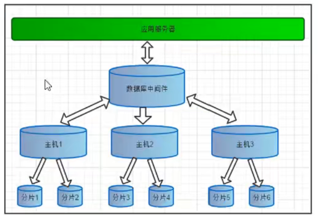
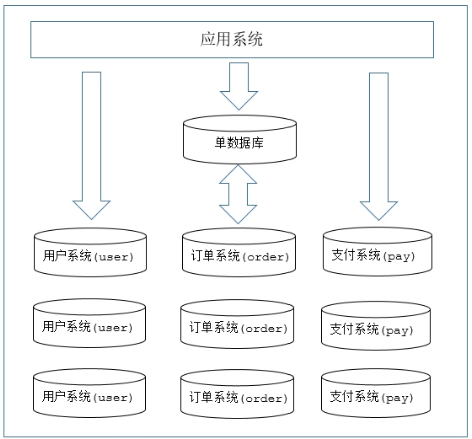
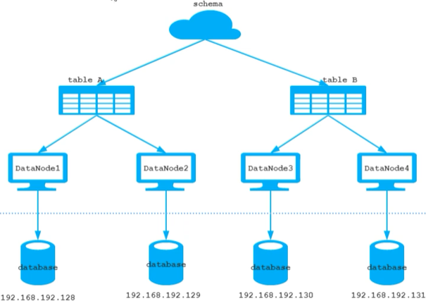
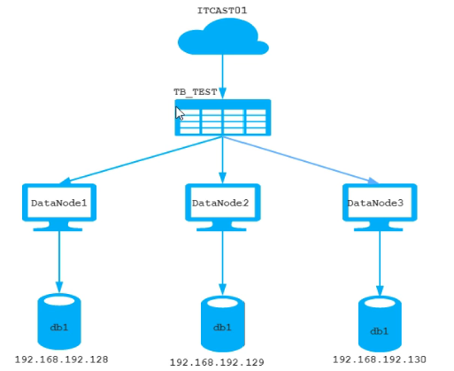
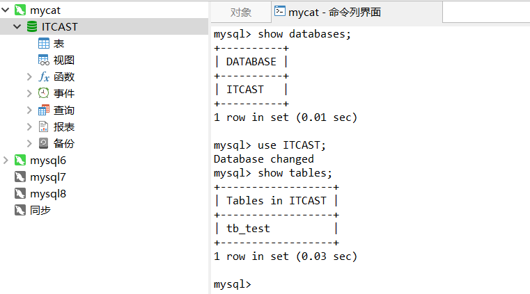
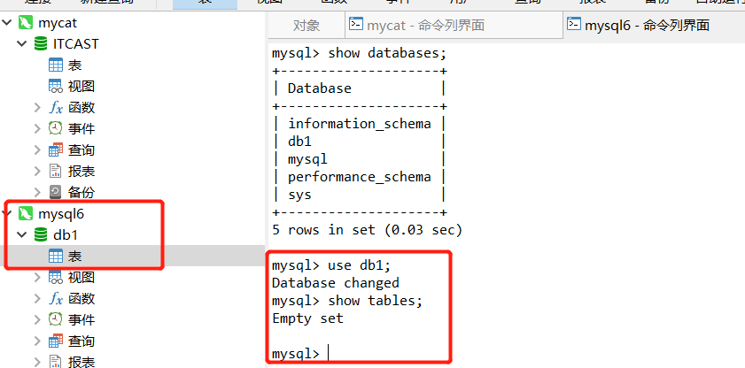
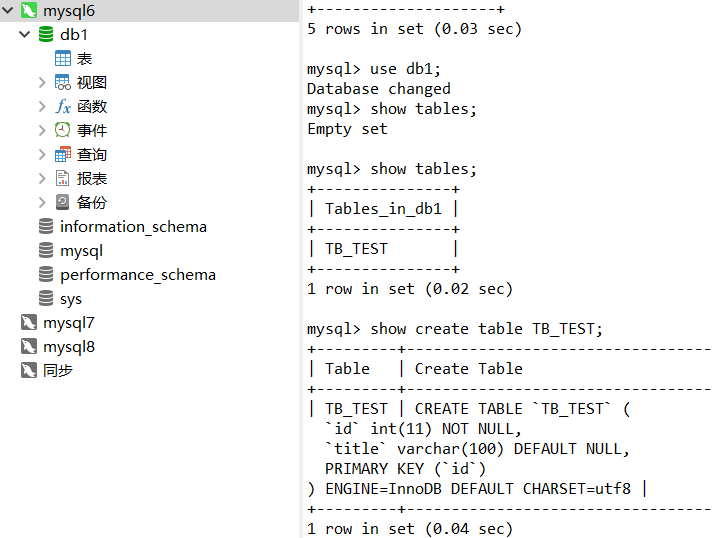
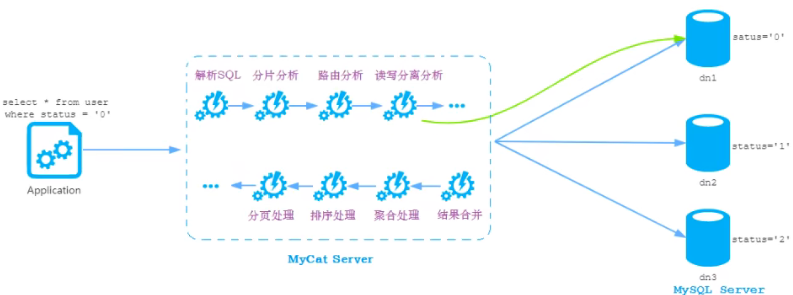

> 数据库，分库分表中间件

#### 为什么使用`MyCat`

> 如果不使用`MyCat`， 客户端直接链接到`MySQL` 数据库。
>
> Java 和 数据库耦合；
>
> 当高并发场景，数据库压力增加；

#### 主要内容

* `mycat` 入门
* `mycat分片规则 && mycat 高级`
* `mycat` 高可用 && 架构
* `mycat 案例`

#### 入门

> 对于关系型数据库而言，随着存储的数据量的提升，其快速查询和插入性能得到困难，`NoSQL` 的出现解决这个问题，它是通过降低数据的安全性，减少对事物的支持，减少对复杂查询的执行，获取性能的提升。
>
> `MyCAt` 也是用来解决这个问题的，其目标是低成本的将现有的单机数据库和应用平滑迁移到云，**通过MyCAT 搭建MySQL 集群解决海量数据存储和业务规模迅速增长情况下数据存储和访问的瓶颈问题**
>
> `MyCat`
>
> 是阿里给予`Cobar` 重构而来，兼容绝大多数数据库成为通用的数据库中间件。简单来说它就是**一个新颖的数据库中间件产品支持MySQL集群，提供高可用，数据分片集群，可以像使用MySQL 一样使用MyCat， 对于开发人员而言，感受不到MyCat的存在**



##### 优势

* 性能可靠
* 强大技术团队
* 体系完善
  * 完善的周边产品，web/NIO/Balance 等
* 开源社区活跃

##### 使用场合

* 高可用性以及读写分离

  > 主从赋值，读写分离

* 业务数据分离存储

* 大表水平拆分，集群并行计算

* 数据库路由表

  > 基于MySQL 实例的连接池复用技术，可以让每个应用最大程度共享一个MySQL实例的所有连接池，让数据库的并发访问能力大大提升。

* 整合多种数据源

  > 当一个项目中整合多个数据库(Oracle,mysql 等)，并配置多个数据源，操作起来就比较麻烦，使用mycat 进行整合，最终我们的程序就只需要访问一个数据源就可以。


##### 安装

```shell
tar -zxvf Mycat-server-1.6.7.3-release-20190927161129-linux.tar.gz
```

##### 分片

> 简单来说就是，通过某种特定的条件，将我们存储在同一个数据库中的数据分散到多个数据库(主机)上，达到分散单台设备负载的效果
>
> 数据的分片(sharding) 根据切分规则的类型，分为
>
> * 垂直分：按照不同的表(schema) 分到不同的数据库(主机)上，一个数据库负责一个应用的数据
>
>   > 各个数据库schema 不同
>
> * 水平分：同一个表中的数据按照某种条件拆到另外一个数据库中的表，两个表的schema 相同
>
> 




##### 逻辑库(schema)

是一个逻辑概念，例如说经过垂直分片之后，一个表存储在4个物理节点上，在一个查询中，查询的数据是分散在4个节点中，如果没有`mycat` 那么就需要程序去访问4个库，然后将结果放在一起。

如果有了`mycat` 就不需要了，对于客户端而言，4个节点数据库是透明的，客户端只需要访问操作`mycat` 中的逻辑库，然后如何访问多个节点数据库，查询的结果如何整合均有`mycat`完成，对于用于客户端而言就是在操作一个库。

##### 逻辑表

逻辑库中的表。

* 分片表：参与分片的表，经过水平或者垂直分片的那些表
* 非分片表
* ER表：是基于entity relationship model，`mycat`提供了基于`ER` 关系的数据分片策略，子表的记录和其管理的父表的记录存放在同一个数据分片中通过表分组(Table Group) 保证数据关联查询不会夸库操作。也就是保证相互关联的表放在一个分片库中，从而在关联的时候不会发送夸库关联
* 全局表：有一些数据是通用的数据，每个分片中的数据均需要的元信息，物理层面在每个节点中都有该数据，就防止跨库操作。

##### 分片节点

`dataNode` 一个大表分为多个片，每个分片所在的数据库就是分片节点

##### 节点主机

`datahost` 具体的每台数据库物理服务器

##### 分片规则

##### 原理

> `mycat` 原理中最重要的一个动词就是**拦截**， 拦截用户发来的`SQL` 语句，首先对`SQL` 语句进行特定的分析，分片分析，路由分析，读写分离分析，缓存分析等，然后将此`SQL` 语句发往后端的真实数据库，并将返回的结果做适当处理，最终返回用户


#### 一个需求

由于`TB_TEST` 表中的数据量很大， 现在需要对`TB_TEST` 表进行数据分片，分为三个数据节点，每一个节点主机位于不同的服务器上。



1. `mycat` 中的核心配置文件`schema.xml`

```xml
<?xml version="1.0"?>
<!DOCTYPE mycat:schema SYSTEM "schema.dtd">
<mycat:schema xmlns:mycat="http://io.mycat/">

    <schema name="ITCAST" checkSQLschema="true" sqlMaxLimit="100">
        <!-- 逻辑库库名，下面有一个逻辑分片，这些表分别再dataNode 中 -->
        <table name="TB_TEST" dataNode="dn1,dn2,dn3" rule="auto-sharding-long" />
    </schema>

    <!-- 三个dataNode 定义，每一个dataNode 都位于dataHost(数据库服务器)中，且每一个服务器都有db1的数据库 -->
    <dataNode name="dn1" dataHost="localhost1" database="db1" /> 
    <dataNode name="dn2" dataHost="localhost2" database="db1" />
    <dataNode name="dn3" dataHost="localhost3" database="db1" /> 
    <!-- 在数据库服务器localhost1 中有一个名为 db1的数据库, -->

    <!-- 每一个数据库服务器的链接信息 -->
    <dataHost name="localhost1" maxCon="1000" minCon="10" balance="0"
              writeType="0" dbType="mysql" dbDriver="native" switchType="1"  slaveThreshold="100">
        <heartbeat>select user()</heartbeat>
        <!-- mycat中的心跳，检测mysql是否还活着 -->
        <writeHost host="hostM1" url="localhost:3306" user="root" password="root"></writeHost>
    </dataHost>

    <dataHost name="localhost2" maxCon="1000" minCon="10" balance="0"
              writeType="0" dbType="mysql" dbDriver="native" switchType="1"  slaveThreshold="100">
        <heartbeat>select user()</heartbeat>
        <!-- mycat中的心跳，检测mysql是否还活着 -->
        <writeHost host="hostM1" url="localhost:3307" user="root" password="root"></writeHost>
    </dataHost>

    <dataHost name="localhost3" maxCon="1000" minCon="10" balance="0"
              writeType="0" dbType="mysql" dbDriver="native" switchType="1"  slaveThreshold="100">
        <heartbeat>select user()</heartbeat>
        <!-- mycat中的心跳，检测mysql是否还活着 -->
        <writeHost host="hostM1" url="localhost:3308" user="root" password="root"></writeHost>
    </dataHost>

</mycat:schema>
```

2. 第二个配置 `server.xml` 

保存着所有`mycat` 需要的系统配置信息，最常使用的是配置用户名，密码和权限，在`system` 中添加`utf-8` 字符设置。

3. `虚拟机docker` 中起三个`mysql` 镜像

```shell
docker run --name mysql1 -p 3306:3306 -e MYSQL_ROOT_PASSWORD=root -d mysql:5.7.25
docker run --name mysql2 -p 3307:3306 -e MYSQL_ROOT_PASSWORD=root -d mysql:5.7.25
docker run --name mysql3 -p 3308:3306 -e MYSQL_ROOT_PASSWORD=root -d mysql:5.7.25
# -p {host_port}:{container_port}
```

4. 在三台mysql 中创建三个db1的数据库

5. 启动mycal

   ```shell
   # mycal 的bin目录下,注意在启动的时候确保JVM 是按照好了的，否则mycat 无法启动
   bin/mycat start
   bin/mycat stop
   bin/mycat status
   ```

6. 通过mycat 访问数据库

   > mycat 是模拟了mysql 的协议，对外而言，假装自己就是一个mysql，客户端访问mycat 和访问mysql 是一样的。

7. 链接`mycat`

   

   8. 尝试同步表结构，此时`mycat` 中是已经有逻辑表了，但是三个`mysql` 是没有这个表的

   

   需要在`mycat` 中创建表

   ```mysql
   create table TB_TEST (
   	id bigint not null,
       title varchar(100),
       primary key (id)
   )ENGINE=INNODB DEFAULT CHARSET=utf8;
   ```

   然后再`mysql` 库中就可以看到从`mycat` 中创建的表了

   

   ·9.  通过`mycat` 往数据库中插入数据

```shell
insert into TB_TEST(id, title) values(1, "11");
insert into TB_TEST(id, title) values(2, "22");
insert into TB_TEST(id, title) values(3, "33");
```

​	 然后从`mycat` 中执行查询，可以看到3条数据。从底层3台数据库中的数据，只有一台有全部的这三个数据，其他两台没有数据

然后再插入数据

```shell
insert into TB_TEST(id, title) values(4, "44");
insert into TB_TEST(id, title) values(3, "33");
```

还是同样的效果。只有一台有全部的数据，其他两台没有数据。

如果插入这样的数据

```shell
insert into TB_TEST(id, title) values(500000, "44000000");# 进入分片1
insert into TB_TEST(id, title) values(500001, "44000000"); # 进入分片2
insert into TB_TEST(id, title) values(1000000, "44000000"); # 进入分片2
insert into TB_TEST(id, title) values(1000001, "44000000"); # 进入分片3
```

10. 在`schema.xml` 中配置了分片规则

    ```xml
    <table name="TB_TEST" dataNode="dn1,dn2,dn3" rule="auto-sharding-long" />
    ```

    `auto-sharding-long` 的规则是这样的

    `[0-5000000]` 分片1。 `[5000000-10000000]` 分片2。 `[10000000-15000000]` 分片3。

    然后再`mycat` 的配置路径下`rule.xml` 有较多的规则

    ```xml
    <tableRule name="auto-sharding-long">
        <rule>
            <columns>id</columns>
            <algorithm>rang-long</algorithm>
        </rule>
    </tableRule>
    
    <function name="rang-long"
              class="io.mycat.route.function.AutoPartitionByLong">
        <property name="mapFile">autopartition-long.txt</property>
    </function>
    ```

    `autopartition-log.txt`

    ```shell
    # range start-end ,data node index
    # K=1000,M=10000.
    0-500M=0
    500M-1000M=1
    1000M-1500M=2
    ```

    

    

