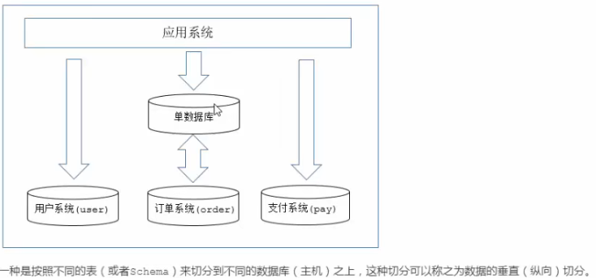
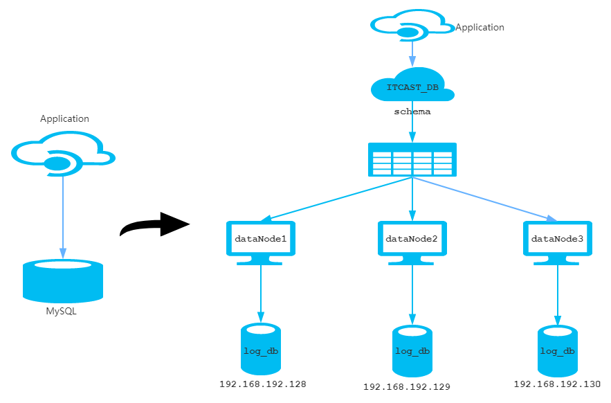
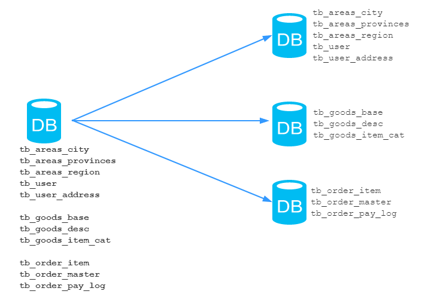
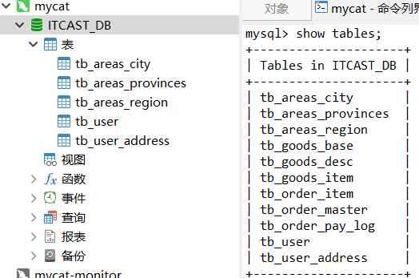
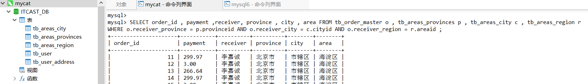
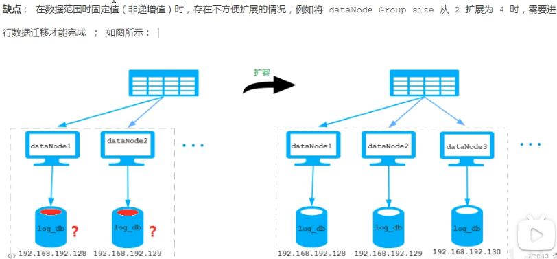

#### 垂直分

由原有的所有业务表均在一个单数据库中，变为根据业务将不同的业务表分到不同的数据库中



##### 案例，三个业务域



具体表的拆分



1. 根据右侧表和数据库的划分，上到下分别

```shell
3306 3307 3308 
```

脚本分别再三个数据库执行，注意这里不是在`mycat` 中执行全部脚本，而是在不同库中执行不同的脚本。

2. 配置`schema.xml` 进行垂直拆分配置

```xml
<?xml version="1.0"?>
<!DOCTYPE mycat:schema SYSTEM "schema.dtd">
<mycat:schema xmlns:mycat="http://io.mycat/">
	<schema name="ITCAST_DB" checkSQLschema="true" sqlMaxLimit="100">
        <- 一个表分配到一个dataNode 中，注意和水平分片的区别->
	   <table name="tb_areas_city" dataNode="dn1" primary_key="id" />
        <table name="tb_areas_provinces" dataNode="dn1" primary_key="id" />
        <table name="tb_areas_region" dataNode="dn1" primary_key="id" />
        <table name="tb_user" dataNode="dn1" primary_key="id" />
        <table name="tb_user_address" dataNode="dn1" primary_key="id" />
        
        <table name="tb_order_item" dataNode="dn2" primary_key="id" />
        <table name="tb_order_master" dataNode="dn2" primary_key="order_id" />
        <table name="tb_order_pay_log" dataNode="dn2" primary_key="out_trade_no" />

        <table name="tb_goods_base" dataNode="dn3" primary_key="id" />
        <table name="tb_goods_desc" dataNode="dn3" primary_key="goods_id" />
        <table name="tb_goods_item" dataNode="dn3" primary_key="id" />
	</schema>

	<dataNode name="dn1" dataHost="localhost1" database="user_db" /> 
	<dataNode name="dn2" dataHost="localhost2" database="order_db" />
	<dataNode name="dn3" dataHost="localhost3" database="goods_db" /> 

	<dataHost name="localhost1" maxCon="1000" minCon="10" balance="0"
			  writeType="0" dbType="mysql" dbDriver="native" switchType="1"  slaveThreshold="100">
		<heartbeat>select user()</heartbeat>
		<writeHost host="hostM1" url="localhost:3306" user="root" password="root"></writeHost>
	</dataHost>

  	<dataHost name="localhost2" maxCon="1000" minCon="10" balance="0"
			  writeType="0" dbType="mysql" dbDriver="native" switchType="1"  slaveThreshold="100">
		<heartbeat>select user()</heartbeat>
		<writeHost host="hostM1" url="localhost:3307" user="root" password="root"></writeHost>
	</dataHost>

  	<dataHost name="localhost3" maxCon="1000" minCon="10" balance="0"
			  writeType="0" dbType="mysql" dbDriver="native" switchType="1"  slaveThreshold="100">
		<heartbeat>select user()</heartbeat>
		<writeHost host="hostM1" url="localhost:3308" user="root" password="root"></writeHost>
	</dataHost>
	
</mycat:schema>
```

3. 配置`server.xml`

   因为换了逻辑库名字，配置文件中的 schemas 需要换

   ```xml
   <user name="root" defaultAccount="true">
   		<property name="password">root</property>
   		<property name="schemas">ITCAST_DB</property>
   </user>
   
   <user name="user">
       <property name="password">root</property>
       <property name="schemas">ITCAST_DB</property>
       <property name="usingDecrypt">true</property>
       <!-- <property name="readOnly">true</property> -->
   </user>
   ```

4. 重新启动`mycat`

   ```xml
   ./bin/mycat restart
   ```

5. mycat 表中可以查看到所有表

   

   6. 在mycat 插入数据

      ```mysql
      insert  into `tb_order_pay_log`(`out_trade_no`,`create_time`,`pay_time`,`total_fee`,`user_id`,`transaction_id`,`trade_state`,`order_list`,`pay_type`) values ('1014520480276676908','2018-07-04 22:45:06',NULL,21097900,'java20',NULL,'0','1014520479974686720','1')
      ```

      从`mycat` 的客户端插入数据，根据`schema.xml` 中配置，会插入到具体的mysql 表中。

   7. 测试跨表分片的查询

      ```mysql
      SELECT order_id , payment ,receiver, province , city , area FROM tb_order_master o , tb_areas_provinces p , tb_areas_city c , tb_areas_region r
      WHERE o.receiver_province = p.provinceid AND o.receiver_city = c.cityid AND o.receiver_region = r.areaid ;
      ```

      报错

      ````shell
      1064 - invalid route in sql, multi tables found but datanode has no intersection  sql:SELECT order_id , payment ,receiver, province , city , area FROM tb_order_master o , tb_areas_provinces p , tb_areas_city c , tb_areas_region r
      WHERE o.receiver_province = p.provinceid AND o.receiver_city = c.cityid AND o.receiver_region = r.areaid
      ````

      发生跨库连接查询。

   8. 全局表

      是一张数据不多，表结构是属于全系统基础数据，很多库中的表都需要使用，**在每个节点/数据库中都会存储一份。**

      使用`navcate` 或者 数据库命令将`user` 的三张表`tb_areas_provinces p , tb_areas_city c , tb_areas_region`

      同步到其他两个库。(命令查看`./heima-mycat-note` 中关于课程老师提供的笔记)

   9. 全局表配置`schema.xml`

      ```xml
      <table name="tb_areas_city" dataNode="dn1,dn2,dn3" primaryKey="id" type="global"/>
      <table name="tb_areas_provinces" dataNode="dn1,dn2,dn3" primaryKey="id" type="global"/>
      <table name="tb_areas_region" dataNode="dn1,dn2,dn3" primaryKey="id" type="global"/>
      <- 指明 dataNode="dn1,dn2,dn3"  type="global" ->
      ```

   10. 重启`mycat`

       然后就可以夸库全局去查找了。

       

   11. 更新全局表

       通过`mycat` 更新全局表之后，在3个`mysql` 中查看，也更新了。

   

#### 水平分

根据表中的数据的逻辑关系，将同一个表中的数据，按照某种条件拆分到多台数据库(主机)，多台数据库中存储的表结构是一样的，数据不一样。


##### 操作

1. 准备三台mysql 数据库服务器，还是使用`docker` 搭建

2. 三台服务器中创建数据库实例

   ```mysql
   create database log_db default character set utf8mb4;
   ```

3. 配置`schema.xml`

   ```xml
   <schema name="LOG_DB" checkSQLschema="true" sqlMaxLimit="100">
       <table name="tb_log" dataNode="dn1,dn2,dn3" primaryKey="id" rule="mod-long"></table>
   </schema>
   
   <- 逻辑库LOG_DB分别均指向mysql中的log_db 数据库 ->
   <dataNode name="dn1" dataHost="localhost1" database="log_db" /> 
   <dataNode name="dn2" dataHost="localhost2" database="log_db" />
   <dataNode name="dn3" dataHost="localhost3" database="log_db" /> 
   --- 一下内容是说明来着，并没有改动
   <tableRule name="mod-long">
       <rule>
           <columns>id</columns>
           <algorithm>mod-long</algorithm>
       </rule>
   </tableRule>
   
   <function name="mod-long" class="io.mycat.route.function.PartitionByMod">
       <!-- 有几个dataNode，默认3 -->
       <property name="count">3</property>
   </function>
       
       --- 修改 server.xml
       <user name="root" defaultAccount="true">
           <property name="password">root</property>
           <property name="schemas">LOG_DB</property>
       </user>
   ```

4. 测试

   在`mycat` 中建表

   ```mysql
   CREATE TABLE `tb_log` (
     `id` bigint(20) NOT NULL COMMENT 'ID',
     `model_name` varchar(200) DEFAULT NULL COMMENT '模块名',
     `model_value` varchar(200) DEFAULT NULL COMMENT '模块值',
     `return_value` varchar(200) DEFAULT NULL COMMENT '返回值',
     `return_class` varchar(200) DEFAULT NULL COMMENT '返回值类型',
     `operate_user` varchar(20) DEFAULT NULL COMMENT '操作用户',
     `operate_time` varchar(20) DEFAULT NULL COMMENT '操作时间',
     `param_and_value` varchar(500) DEFAULT NULL COMMENT '请求参数名及参数值',
     `operate_class` varchar(200) DEFAULT NULL COMMENT '操作类',
     `operate_method` varchar(200) DEFAULT NULL COMMENT '操作方法',
     `cost_time` bigint(20) DEFAULT NULL COMMENT '执行方法耗时, 单位 ms',
     `source` int(1) DEFAULT NULL COMMENT '来源 : 1 PC , 2 Android , 3 IOS',
     PRIMARY KEY (`id`)
   ) ENGINE=InnoDB DEFAULT CHARSET=utf8mb4;
   ```

5. 在其他3个mysql 库中能看到新建的这张表

6. mycat中插入数据

   ```mysql
   INSERT INTO `tb_log` (`id`, `model_name`, `model_value`, `return_value`, `return_class`, `operate_user`, `operate_time`, `param_and_value`, `operate_class`, `operate_method`, `cost_time`,`source`) VALUES('1','user','insert','success','java.lang.String','10001','2020-02-26 18:12:28','{\"age\":\"20\",\"name\":\"Tom\",\"gender\":\"1\"}','cn.itcast.controller.UserController','insert','10',1);
   INSERT INTO `tb_log` (`id`, `model_name`, `model_value`, `return_value`, `return_class`, `operate_user`, `operate_time`, `param_and_value`, `operate_class`, `operate_method`, `cost_time`,`source`) VALUES('2','user','insert','success','java.lang.String','10001','2020-02-26 18:12:27','{\"age\":\"20\",\"name\":\"Tom\",\"gender\":\"1\"}','cn.itcast.controller.UserController','insert','23',1);
   INSERT INTO `tb_log` (`id`, `model_name`, `model_value`, `return_value`, `return_class`, `operate_user`, `operate_time`, `param_and_value`, `operate_class`, `operate_method`, `cost_time`,`source`) VALUES('3','user','update','success','java.lang.String','10001','2020-02-26 18:16:45','{\"age\":\"20\",\"name\":\"Tom\",\"gender\":\"1\"}','cn.itcast.controller.UserController','update','34',1);
   INSERT INTO `tb_log` (`id`, `model_name`, `model_value`, `return_value`, `return_class`, `operate_user`, `operate_time`, `param_and_value`, `operate_class`, `operate_method`, `cost_time`,`source`) VALUES('4','user','update','success','java.lang.String','10001','2020-02-26 18:16:45','{\"age\":\"20\",\"name\":\"Tom\",\"gender\":\"1\"}','cn.itcast.controller.UserController','update','13',2);
   INSERT INTO `tb_log` (`id`, `model_name`, `model_value`, `return_value`, `return_class`, `operate_user`, `operate_time`, `param_and_value`, `operate_class`, `operate_method`, `cost_time`,`source`) VALUES('5','user','insert','success','java.lang.String','10001','2020-02-26 18:30:31','{\"age\":\"200\",\"name\":\"TomCat\",\"gender\":\"0\"}','cn.itcast.controller.UserController','insert','29',3);
   INSERT INTO `tb_log` (`id`, `model_name`, `model_value`, `return_value`, `return_class`, `operate_user`, `operate_time`, `param_and_value`, `operate_class`, `operate_method`, `cost_time`,`source`) VALUES('6','user','find','success','java.lang.String','10001','2020-02-26 18:30:31','{\"age\":\"200\",\"name\":\"TomCat\",\"gender\":\"0\"}','cn.itcast.controller.UserController','find','29',2);
   ```

   因为水平分片规则是使用对3取模规则，所以三个mysql 数据库中均会平均数据，均会有2条数据。

#### 分片规则

三个数据库新建库

```mysql
create database partition_db default character set utf8mb4;
```

分片规则

##### 取模

```xml
<tableRule name="mod-long">
    <rule>
        <columns>id</columns> 标识将要分片的表字段
        <algorithm>mod-long</algorithm> 指定分片函数与function 的对应关系
    </rule>
</tableRule>

-- class 指定算法实现类，
<function name="mod-long" class="io.mycat.route.function.PartitionByMod">
    <!-- dataNode 个数，取模的时候基数就是这里的数, 这里配置class 使用的一些参数，还可以配置文件 -->
    <property name="count">3</property>
</function>
```

##### 范围分片

> 根据指定列值大小，分到哪个 dataNode 中

```xml
<tableRule name="auto-sharding-long">
    <rule>
        <columns>id</columns>
        <algorithm>rang-long</algorithm>
    </rule>
</tableRule>

<function name="rang-long" class="io.mycat.route.function.AutoPartitionByLong">
    <!-- 配置范围参数，参数均写在配置文件中 -->
    <property name="mapFile">autopartition-long.txt</property>
    <!-- 默认节点，在使用枚举分片的时候，遇到不认识的枚举值，路由到默认节点，如果没有这个默认值，碰到不认识的则报错 -->
    <property name="defaultNode">0</property>
</function>

# range start-end ,data node index
# K=1000,M=10000.
0-500M=0      # 第一个分片id取值范围
500M-1000M=1  # 第二个分片id取值范围
1000M-1500M=2 # 第三个分片id取值范围
```

##### 枚举分片

```xml
<tableRule name="sharding-by-intfile">
    <rule>
        <columns>status</columns>
        <algorithm>hash-int</algorithm>
    </rule>
</tableRule>

<function name="hash-int"
          class="io.mycat.route.function.PartitionByFileMap">
    <property name="mapFile">partition-hash-int.txt</property>
    <property name="type">0</property>
    <property name="defaultNode">0</property>
</function>
<!-- 
	partition-hash-int.txt 写着枚举字典 key-value
	key 就是表中列 status 的取值，value 就是status映射到的对应的枚举值，
	10000=0 status=10000 分到第一个dataNode
	10010=1 status=10000 分到第二个dataNode
-->
10000=0
10010=1
```

##### 范围求模算法


该算法为先进行范围分片，计算出分片组，在再组内求模

优点：综合了范围分片和求模优点，分片组内使用求模可以保证组内的数据分布均匀，分片组内采用范围分片可以兼顾范围分片的特定

缺点：当增加节点的时候需要进行数据迁移



```xml
<tableRule name="auto-sharding-rang-mod">
    <rule>
        <columns>id</columns>
        <algorithm>rang-mod</algorithm>
    </rule>
</tableRule>

<function name="rang-mod" class="io.mycat.route.function.PartitionByRangeMod">
    <property name="mapFile">partition-range-mod.txt</property>
</function>

# range start-end ,data node group size
0-200M=5
200M1-400M=1
400M1-600M=4
600M1-800M=4
800M1-1000M=6
```

