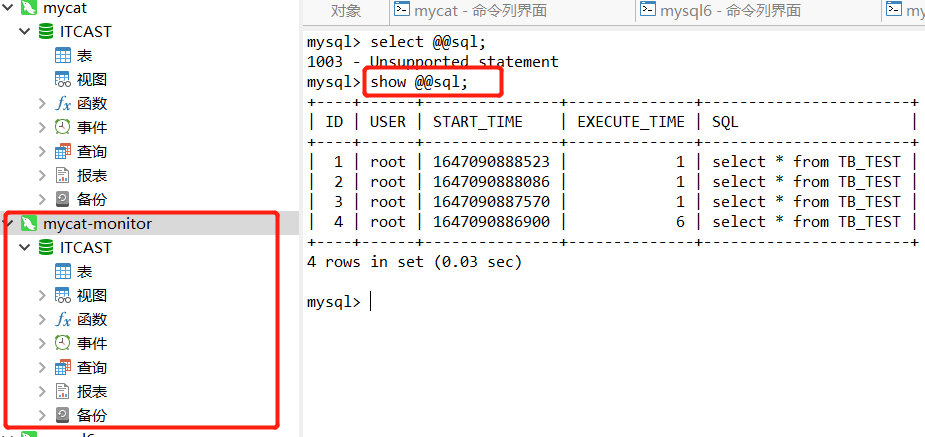

*配置信息查看目录下 的配置文件中的注释*

#### `server.xml`

##### system 标签

```xml
<property name="useSqlStat">1</property>
```

执行重启mycat,mycat 的 9066端口能够监控mycat 的实时统计




##### user 标签

```xml
<property name="useDecrpt">true</property>
```

重启mycat

然后通过指令

```java
java -cp Mycat-server-1.6.7.3-release.jar io.mycat.util.DecryptUtil 0:root:root
```

生成密文

##### firewalld 标签

设置黑白名单

#### `schema.xml`

最重要的配置

##### `schema` 标签


##### `dataNode` 标签


##### `dataHost` 标签


#### `rule.xml`

定义分片算法

#### `sequence 配置文件`

在分库分表的情况下 , 原有的自增主键已无法满足在集群中全局唯一的主键 ,因此, MyCat中提供了全局sequence来实现主键 , 并保证全局唯一。那么在MyCat的配置文件 sequence_conf.properties 中就配置的是序列的相关配置。

