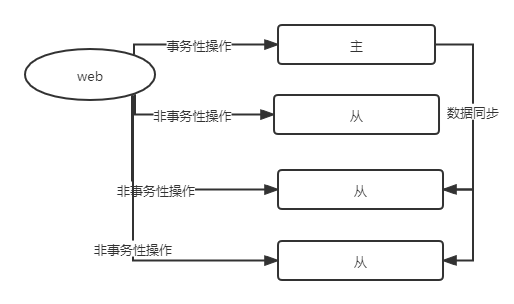
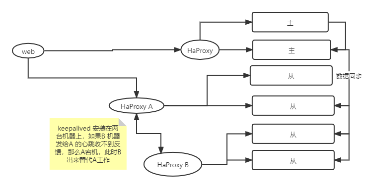

#### 相比较单节点优势

* 数据冗余：安全优势
* 多服务器-读写分离：提供负载

---

#### 主从复制

> `MySQL` 本身提供的机制

* 认识主从复制
* 理解`binlog`日志
* 搭建`mysql` 主从复制
* 使用`java` 演示读写分离操作

##### 主从复制



多台数据库节点，其中有`master` 节点，也有从节点`slave` 节点。

写等有事务的操作从主数据库，读等无事务的操作在从数据库中。

从数据库的数据是从主数据库同步而来，从节点不宜过多，增加主数据库同步数据的延时，以及增加主数据库的负载。如果增加了较多的从节点，还是性能有问题，那么应该试图从业务角度讲代码库进行拆分。

##### 理解`binlog` 日志

> `binary log` 二进制日志文件

`mysql` 有以下的日志类型，`Error log` 错误日志。

`General query log` 普通查询日志

`Slow query log` 慢查询日志

`Binary log` 二进制日志文件

> 记录所有日志的`DDL/DML`日志。
>
> 1. 用于增量备份
>
> 2. 主从复制(全量备份)
>
> 3. 每次服务器重启，服务器会调用`flush logs` 会创建一个新的`binlog` 日志
>
> 4. `Flush logs` 刷新日志文件，会产生新的日志文件，这两个日志文件
>
>    ```shell
>    # 查看日志
>    show binlog event in xxx
>             
>    # 查看当前日志的状态
>    show master status
>             
>    # 查看所有的日志文件
>    show master logs 
>             
>    # 清空所有日志
>    reset master;
>    ```

* 开启`binlog`日志

```shell
show variables like ’%log_bin%’;
# 查看变量
```

`/etc/my.conf` 增加配置

```shell
server-id=1
# 保证每个服务器该id不重复
log-bin=/var/lib/mysql/mysql-bin
# 保持退出，重启mysql，操作之后查看该目录下是否有文件生成
```

* binlogs 文件数据恢复

```shell
# master 数据库数据
mysql> select * from test;
+------+
| id   |
+------+
|    1 |
|   16 |
|   10 |
+------+

# master 
flush logs;

# 删除3条数据
delete from test where id>1;

mysql> show master logs;
+------------------+-----------+
| Log_name         | File_size |
+------------------+-----------+
| mysql-bin.000001 |       456 |
| mysql-bin.000002 |       414 |
+------------------+-----------+

# 000002 是删除数据之后新产生的文件，而删除的数据均是放在 01 的binlog 中

# 恢复删除的数据， 注意需要在mysql-bin.000001 所在的目录执行
# 该目录一般会在 /var/lib/mysql/ 下
mysqlbinlog mysql-bin.000001 | mysql -uroot -proot;

mysqlbinlog mysql-bin.000001 --start-position 219 --stop-popsition 421 | mysql -uroot -proot;
# 还可以根据时间戳恢复时间范围内的数据
```

##### 搭建集群

```she
create user 'repl'@'192.168.153.%' identified by 'repl';
select * from mysql.user\G;
select user, host from mysql.user\G;

drop user repl@'192.168.153.%';

grant privilege on *.* to username@'host' identified by 'password';

grant replication slave on *.* to 'repl'@'192.168.153.%' identified by 'repl';
```

* `docker` 搭建

```shell
#启动新的镜像，设置server-id和开启logbin
docker run --name mysql -p 3306:3306 -e MYSQL_ROOT_PASSWORD="root" -d mysql:5.7.25 --server-id=1 --character-set-server=utf8mb4 --collation-server=utf8mb4_unicode_ci --log-bin=mysql-bin --sync_binlog=1

CREATE USER 'repl'@'172.17.%.%' IDENTIFIED BY 'repl';

GRANT replication slave, replication client on *.* to 'repl'@'172.17.%.%'';

FLUSH PRIVILEGES;

select user, host from mysql.user;

show master status;

# 启动从
docker run --name mysql-slave -p 3307:3307 -e MYSQL_ROOT_PASSWORD="root" -d mysql:5.7.25 --server-id=2 --character-set-server=utf8mb4 --collation-server=utf8mb4_unicode_ci

# 这里master_host就是刚刚看到的master的ip，master_user就是我们创建用于同步的账号，master_log_file和master_log_pos就是通过show master status获得到的
CHANGE MASTER TO MASTER_HOST='172.17.0.2',MASTER_USER='repl',MASTER_PASSWORD='repl',MASTER_LOG_FILE='mysql-bin.000003',MASTER_LOG_POS=785;
#开启同步
START SLAVE;
#查看slave同步状态
SHOW SLAVE STATUS\G

# 从master 中创建库以及表就可以从从数据库中同步过去了，并且可以看到测试数据。
```

* `docker-compose` 方式创建

```yaml
version: '3'
services:
  mysql-master:
    image: mysql:5.7.25
    container_name: mysql-master
    environment:
      MYSQL_ROOT_PASSWORD: "root"
      MASTER_SYNC_USER: "repl" #设置脚本中定义的用于同步的账号
      MASTER_SYNC_PASSWORD: "repl" #设置脚本中定义的用于同步的密码
      ADMIN_USER: "root" #当前容器用于拥有创建账号功能的数据库账号
      ADMIN_PASSWORD: "root"
      ALLOW_HOST: "10.10.%.%" #允许同步账号的host地址
      TZ: "Asia/Shanghai" #解决时区问题
    networks:
      mysql:
        ipv4_address: "10.10.10.10" #固定ip，因为从库在连接master的时候，需要设置host
    volumes:
    - ./init/master:/docker-entrypoint-initdb.d #挂载master脚本
    command:
    -  "--server-id=1"
    -  "--character-set-server=utf8mb4"
    -  "--collation-server=utf8mb4_unicode_ci"
    -  "--log-bin=mysql-bin"
    -  "--sync_binlog=1"
    ports:
      - "3306:3306" # 宿主机端口-docker 端口
  mysql-slave1:
    image: mysql:5.7.25
    container_name: mysql-slave1
    environment:
      MYSQL_ROOT_PASSWORD: "root"
      SLAVE_SYNC_USER: "repl" #用于同步的账号，由master创建
      SLAVE_SYNC_PASSWORD: "repl"
      ADMIN_USER: "root"
      ADMIN_PASSWORD: "root"
      MASTER_HOST: "10.10.10.10" #master地址，开启主从同步需要连接master
      TZ: "Asia/Shanghai" #设置时区
    networks:
    - mysql
    volumes:
    - ./init/slave:/docker-entrypoint-initdb.d #挂载slave脚本
    command:
    -  "--server-id=2"
    -  "--character-set-server=utf8mb4"
    -  "--collation-server=utf8mb4_unicode_ci"
    ports:
      - "3307:3306" 
  mysql-slave2:
    image: mysql:5.7.25
    container_name: mysql-slave2
    environment:
      MYSQL_ROOT_PASSWORD: "root"
      SLAVE_SYNC_USER: "repl"
      SLAVE_SYNC_PASSWORD: "repl"
      ADMIN_USER: "root"
      ADMIN_PASSWORD: "root"
      MASTER_HOST: "10.10.10.10"
      TZ: "Asia/Shanghai"
    networks:
    - mysql
    volumes:
    - ./init/slave:/docker-entrypoint-initdb.d
    command: #这里需要修改server-id，保证每个mysql容器的server-id都不一样
    -  "--server-id=3"
    -  "--character-set-server=utf8mb4"
    -  "--collation-server=utf8mb4_unicode_ci"
    ports:
      - "3308:3306"
networks:
  mysql:
    driver: bridge
    ipam:
      driver: default
      config:
      - subnet: "10.10.0.0/16"
```

创建所需要的脚本

```shell
#创建对应目录
mkdir -p ./init/{master,slave}
#将master初始化脚本写入到init/master目录下
cat > ./init/master/create_sync_user.sh <<EOF
#!/bin/bash
#定义用于同步的用户名
MASTER_SYNC_USER=\${MASTER_SYNC_USER:-sync_admin}
#定义用于同步的用户密码
MASTER_SYNC_PASSWORD=\${MASTER_SYNC_PASSWORD:-123456}
#定义用于登录mysql的用户名
ADMIN_USER=\${ADMIN_USER:-root}
#定义用于登录mysql的用户密码
ADMIN_PASSWORD=\${ADMIN_PASSWORD:-123456}
#定义运行登录的host地址
ALLOW_HOST=\${ALLOW_HOST:-%}
#定义创建账号的sql语句
CREATE_USER_SQL="CREATE USER '\$MASTER_SYNC_USER'@'\$ALLOW_HOST' IDENTIFIED BY '\$MASTER_SYNC_PASSWORD';"
#定义赋予同步账号权限的sql,这里设置两个权限，REPLICATION SLAVE，属于从节点副本的权限，REPLICATION CLIENT是副本客户端的权限，可以执行show master status语句
GRANT_PRIVILEGES_SQL="GRANT REPLICATION SLAVE,REPLICATION CLIENT ON *.* TO '\$MASTER_SYNC_USER'@'\$ALLOW_HOST';"
#定义刷新权限的sql
FLUSH_PRIVILEGES_SQL="FLUSH PRIVILEGES;"
#执行sql
mysql -u"\$ADMIN_USER" -p"\$ADMIN_PASSWORD" -e "\$CREATE_USER_SQL \$GRANT_PRIVILEGES_SQL \$FLUSH_PRIVILEGES_SQL"
EOF


#----

#mkdir -p ./init/slave
cat > ./init/slave/slave.sh <<EOF
  #定义连接master进行同步的账号,:xx， 默认值写法
  SLAVE_SYNC_USER="\${SLAVE_SYNC_USER:-sync_admin}"
  #定义连接master进行同步的账号密码
  SLAVE_SYNC_PASSWORD="\${SLAVE_SYNC_PASSWORD:-123456}"
  #定义slave数据库账号
  ADMIN_USER="\${ADMIN_USER:-root}"
  #定义slave数据库密码
  ADMIN_PASSWORD="\${ADMIN_PASSWORD:-123456}"
  #定义连接master数据库host地址
  MASTER_HOST="\${MASTER_HOST:-%}"
  #等待10s，保证master数据库启动成功，不然会连接失败
  sleep 10
  #连接master数据库，查询二进制数据，并解析出logfile和pos，这里同步用户要开启 REPLICATION CLIENT权限，才能使用SHOW MASTER STATUS;
  RESULT=\`mysql -u"\$SLAVE_SYNC_USER" -h\$MASTER_HOST -p"\$SLAVE_SYNC_PASSWORD" -e "SHOW MASTER STATUS;" | grep -v grep |tail -n +2| awk '{print \$1,\$2}'\`
  #解析出logfile
  LOG_FILE_NAME=\`echo \$RESULT | grep -v grep | awk '{print \$1}'\`
  #解析出pos
  LOG_FILE_POS=\`echo \$RESULT | grep -v grep | awk '{print \$2}'\`
  #设置连接master的同步相关信息
  SYNC_SQL="change master to master_host='\$MASTER_HOST',master_user='\$SLAVE_SYNC_USER',master_password='\$SLAVE_SYNC_PASSWORD',master_log_file='\$LOG_FILE_NAME',master_log_pos=\$LOG_FILE_POS;"
  #开启同步
  START_SYNC_SQL="start slave;"
  #查看同步状态
  STATUS_SQL="show slave status\G;"
  mysql -u"\$ADMIN_USER" -p"\$ADMIN_PASSWORD" -e "\$SYNC_SQL \$START_SYNC_SQL \$STATUS_SQL"
EOF
```

##### `Java` 读写分离演示

#### `HaProxy` 负载均衡

> 工作在`TCP` 层之上。代理`mysql`


> `nginx` 是基于`http` 协议的代理
>
> `lvs`:  已经写到了 `linux` 的内核之中，所需要的机器比较多。

* [安装](https://www.cnblogs.com/MacoLee/p/5853413.html)

```shell
tar -axvf haproxy-ss-LATEST.tar.gz

# 编译
make TARGET=linux2628 ARCH=x86_64 PREFIX=/usr/local/haproxy

# 安装
make install PREFIX=/usr/local/haproxy

#参数说明
TARGET=linux26 #内核版本，使用uname -r查看内核，如：2.6.18-371.el5，此时该参数就为linux26；kernel 大于2.6.28的用：TARGET=linux2628
ARCH=x86_64 #系统位数
PREFIX=/usr/local/haprpxy #/usr/local/haprpxy为haprpxy安装路径

# 完成配置 /usr/local/haproxy/haproxy.cfg
###########全局配置#########
global
　　daemon #以后台形式运行harpoxy
　　nbproc 1 #设置进程数量
　　pidfile /usr/local/haproxy/conf/haproxy.pid

########默认配置############
defaults
　　log global
　　mode http #默认的模式mode { tcp|http|health }，tcp是4层，http是7层，health只会返回OK
　　option httplog #日志类别,采用httplog
　　option dontlognull #不记录健康检查日志信息
　　retries 2 #两次连接失败就认为是服务器不可用，也可以通过后面设置
　　#option forwardfor #如果后端服务器需要获得客户端真实ip需要配置的参数，可以从Http Header中获得客户端ip
　　option httpclose #每次请求完毕后主动关闭http通道,haproxy不支持keep-alive,只能模拟这种模式的实现
　　#option redispatch #当serverId对应的服务器挂掉后，强制定向到其他健康的服务器，以后将不支持
　　option abortonclose #当服务器负载很高的时候，自动结束掉当前队列处理比较久的链接
　　maxconn 4096 #默认的最大连接数
　　timeout connect 5000ms #连接超时
　　timeout client 30000ms #客户端超时
　　timeout server 30000ms #服务器超时
　　#timeout check 2000 #心跳检测超时
　　#timeout http-keep-alive10s #默认持久连接超时时间
　　#timeout http-request 10s #默认http请求超时时间
　　#timeout queue 1m #默认队列超时时间
　　balance roundrobin #设置默认负载均衡方式，轮询方式
　　#balance source #设置默认负载均衡方式，类似于nginx的ip_hash
　　#balnace leastconn #设置默认负载均衡方式，最小连接数

listen stats
　　bind 0.0.0.0:1080 #设置Frontend和Backend的组合体，监控组的名称，按需要自定义名称
　　mode http #http的7层模式
　　option httplog #采用http日志格式
　　#log 127.0.0.1 local0 err #错误日志记录
　　maxconn 10 #默认的最大连接数
　　stats refresh 30s #统计页面自动刷新时间
　　stats uri /stats #统计页面url
　　stats realm XingCloud\ Haproxy #统计页面密码框上提示文本
　　stats auth admin:admin #设置监控页面的用户和密码:admin,可以设置多个用户名
　　stats auth Frank:Frank #设置监控页面的用户和密码：Frank
　　stats hide-version #隐藏统计页面上HAProxy的版本信息
　　stats admin if TRUE #设置手工启动/禁用，后端服务器(haproxy-1.4.9以后版本)

listen tcptest 
　　bind 0.0.0.0:5222 
　　mode tcp 
　　option tcplog #采用tcp日志格式 
　　#balance source 
　　#log 127.0.0.1 local0 debug 
　　server s1 192.168.56.100:3307 weight 2
　　server s2 192.168.56.100:3308 weight 1
```

通过`navicate` 就可以连接`haproxy` 就可以连到2个机器上了，也可以从配置的统计页面能看到负载的服务器的状态。


---

#### 高可用



> `keepAlived`
>
> 原理比较简单，就是机器直接发送心跳机制，当一个机器接受不到心跳的时候，就是损坏了，然后另外一个机器作为master。
>
> Keepalived+mysql**双主来实现MySQL-HA**，我们必须保证两台MySQL 数据库 的数据完全一样，基本思路是两台MySQL互为主从关系，通过Keepalived配置虚拟IP，实现当其中的一台MySQL数据库宕机后，应用能够自动切换到另外一台MySQL数据库，保证系统的高可用


#### 分库分表

> 按照条件，将存储在一个数据库的数据(一个节点)，分布到不同的数据库中去(多个节点)。

* 垂直分

> 数据库级别的拆分
>
> 针对不同的业务，将多个表，分到不同的数据库中。使用到的表分到不同的数据库，不同的数据库存储在不同的物理节点上。
>
> 带来的问题就是夸库的增删改，以及分布式事务。
>
> 还有一个拆分表就是将一个表拆分为多个表，然后两个表使用外键链接。也是一种垂直分

* 水平分(分片)

> 
>
> 分库后的每个库有全部的表，但是每个表中只有部分数据
>
> 表级别，对数据拆分，一个表分为个表。
>
> 拆分之后如何存储，可以有同一个库不同的表，同一个节点不同的库，不同节点不同库。
>
> * 拆分方式
>   * `id` 拆分，那么限定`[0-10000]` 存放在`A库`， `[10000-100000]` 存放在`B库`
>   * 按照日期年月拆分
>   * 按照指定字段取模拆分，可以指定分为5个库
>
> ```mysql
>  create user 'test'@'%' identified by 'test';
>  grant all on *.* to 'test'@'%';
>  -- 水平拆表
>  -- t_table_2017
>  -- t_table_2016
>  create database test1;
>  use test1;
>  create table t_table(id int primary key auto_increment, name varchar(10));
>  create table t_table_2017(id int primary key auto_increment, name varchar(10));
>  create table t_table_2016(id int primary key auto_increment, name varchar(10));
>  -- 往那个表中操作，在代码中完成逻辑
> ```

* 水平拆分/垂直拆分 均数据/业务逻辑拆分
* 物理拆分

> 表分区：数据是以文件存储在磁盘，可以将文件拆为多个，分布在不同的磁盘

不使用中间件进行多个拆分的问题

* 数据一致性问题
* 分布式事务问题
* 跨表，夸库访问

#### 中间件MyCat

处于客户端和`MySQL` 中间，客户端只访问中间件，中间件链接中后面一个`MySLQ` 集群，至于客户端访问那个库，那是中间件的事情。


