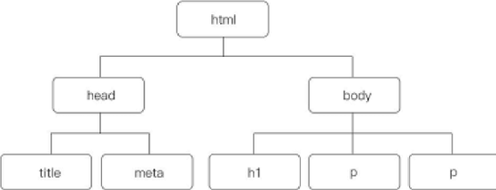
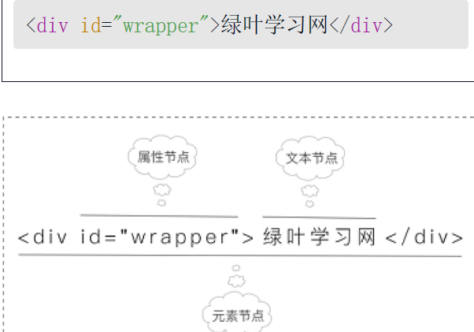
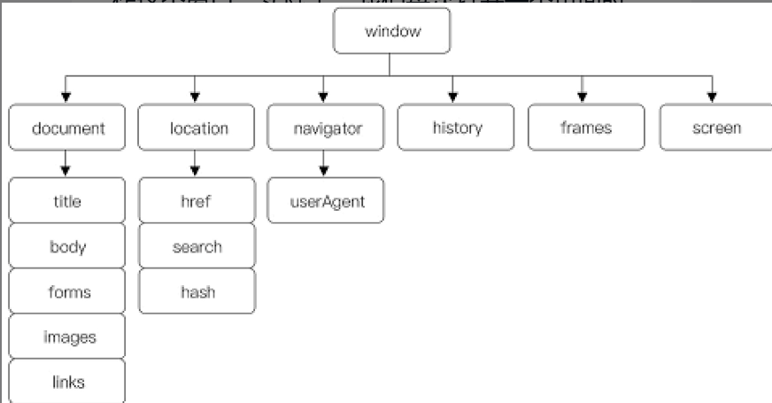

HTML和CSS的页面一般只供用户浏览，而JavaScript的出现，使得用户可以与页面进行交互，实现更多绚丽的效果。拿绿叶学习网来说，二级导航、图片轮播、返回顶部按钮等

JS更像是一门函数式编程语言

#### 函数

函数也是一个对象 

```javascript
function 函数名(参数 1 , 参数 2 ,..., 参数n)
{
    ……
}

// 有返回值
function 函数名(参数 1 , 参数 2 ,..., 参数n)
{
    ……
    return 返回值;
}

// 函数表达式
let a = function(){
   console.log(`这是一个匿名函数的打印`) 
}
a()

// 箭头函数;箭头函数为定义匿名函数提供了简洁的语法
let foo = (arg)=> console.log('接受参数'+arg)
foo()

// 逻辑多了使用 {} 
let foo =  (number)=>{
        if(number>0){
            console.log('number大于0')
        }else{
            console.log('number小于0')
        }
}

// 构造函数,使用带有 new 关键字的 Function 构造函数
let sum =new Function("a","b","return a+b");
console.log(sum(5,6))
//此构造函数可以传递任意数量的参数。
//最后一个参数是应该传递函数应该执行的指令的代码。
//也就是我们要执行的函数体。

// 一般语法
letfuncName= new Function("arg1","arg2","arg3","arg4","arg5",......,"函数体")

```

根据你的个人喜好，随意选择你喜欢的任何一种。但是，我建议尽可能坚持使用箭头函数类型，因为它提供更好的性能和可读性。当时他也是有缺点的就是在我们使用时要注意他的this指向问题 。


#### DOM基础

全称Document Object Model（文档对象模型），**DOM操作，可以简单理解成“元素操作”**DOM采用的是“树形结构”，用“树节点”形式来表示页面中的每一个元素

```html
<!DOCTYPE html>
<html>
<head>
    <meta charset="utf-8" />
    <title></title>
<body>
    <h1>绿叶学习网</h1>
    <p>绿叶学习网是一个……</p>
    <p>绿叶学习网成立于……</p>
</body>
</html>
```



DOM节点共有12种类型，不过常见的只有三种

* 元素节点
* 属性节点
* 文本节点




#### window

一个浏览器窗口就是一个window对象，JavaScript会把一个窗口看成一个对象，这样我们就可以用这个对象的属性和方法来操作这个窗口。

window对象存放了这个页面的所有信息，为了更好分类处理这些信息



一个窗口就是一个window对象，这个窗口里面的HTML文档就是一个document对象(并且会为这个窗口内部的页面（即HTML文档）自动生成一个document对象)，document对象是window对象的子对象。

window对象及下面的location、navigator等子对象，由于都是操作浏览器窗口的，所以我们又称之为“BOM”

由于window对象是包括document对象的，所以我们可以简单地把BOM和DOM的关系理解成：BOM包含DOM。