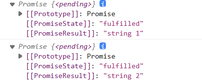

#### [promise](https://es6.ruanyifeng.com/#docs/promise)

所谓`Promise`，简单说就是一个容器，里面保存着某个未来才会结束的事件（通常是一个异步操作）的结果。从语法上说，`Promise`是一个对象，从它可以获取异步操作的消息。


`Promise`对象有以下两个特点。

1. 对象的状态不受外界影响。`Promise`对象代表一个异步操作，有三种状态：`pending`（进行中）、`fulfilled`（已成功）和`rejected `（已失败）。只有异步操作的结果，可以决定当前是哪一种状态，任何其他操作都无法改变这个状态。这也是`Promise`这个名字的由来，它的英语意思就是“承诺”，表示其他手段无法改变。

2. 一旦状态改变，就不会再变，任何时候都可以得到这个结果。`Promise`对象的状态改变，只有两种可能：从`pending`变为`fulfilled`和从`pending`变为`rejected`。只要这两种情况发生，状态就凝固了，不会再变了，会一直保持这个结果，这时就称为` resolved`（已定型）。如果改变已经发生了，你再对`Promise`对象添加回调函数，也会立即得到这个结果。这与事件`（Event）`完全不同，事件的特点是，如果你错过了它，再去监听，是得不到结果的。

**注意，为了行文方便，本章后面的`resolved`统一只指`fulfilled`状态，不包含`rejected`状态。*


**有了`Promise`对象，就可以将异步操作以同步操作的流程表达出来，避免了层层嵌套的回调函数(解决回调地狱问题)**。此外，`Promise`对象提供统一的接口，使得控制异步操作更加容易。

##### Promise 基本使用

```javascript
 const promise = new Promise(function(resolve, reject) {
  // ... some code
  if (/* 异步操作成功 */){
   resolve(value);
  } else {
   reject(error);
  }
 });

//---
new Promise((resolve, reject) => {
  
})
```

* `Promise`构造函数接受一个函数作为参数，
* 该函数的两个参数分别是`resolve`和`reject`。它们是两个函数，由 `JavaScript` 引擎提供。

`Promise` 有两个属性

* state 状态

  > pending: 初始化、fulfilled：已完成-成功、reject: 已拒绝-失败。
  >
  > ```javascript
  > const p = new Promise((resolve, reject) => {
  >   // resolve() 从 pending 变为 fulfilled
  >   // reject() pending 变为 rejected
  > })
  > ```
  >
  > 且状态的改变不是可逆的。一旦状态从`pending`改为`fulfilled` 或者`rejected`，promise 的执行就结束了。不可能再由`fulfilled` 变为`rejected`或者`rejected`改为`fulfilled` 
  >
  > 结果很重要，结果不同，会调用不同的后续回调事件

* result 属性

  ```javascript
  const p = new Promise((resolve, reject) => {
     resolve('成功') 
    // 调用它，传递参数，改变当前Promise对象的结果
  })
  
  [[Prototype]]: Promise
  [[PromiseState]]: "fulfilled"
  [[PromiseResult]]: "成功"
  
  const p = new Promise((resolve, reject) => {
     reject('失败')
    // 调用它，传递参数，改变当前Promise对象的结果
  })
  
  [[Prototype]]: Promise
  [[PromiseState]]: "rejected"
  [[PromiseResult]]: "失败"
  ```

下面是一个`Promise`对象的简单例子。

```javascript
function timeout(ms) {
  return new Promise((resolve, reject) => {
    setTimeout(resolve, ms, 'done');
  });
}

timeout(100).then((value) => {
  console.log(value);
});
```

上面代码中，`timeout`方法返回一个`Promise`实例，表示一段时间以后才会发生的结果。过了指定的时间（`ms`参数）以后，`Promise`实例的状态变为`resolved`，就会触发`then`方法绑定的回调函数。

```java
let promise = new Promise(function(resolve, reject) {
  console.log('Promise');
  resolve();
});

promise.then(function() {
  console.log('resolved.');
});

console.log('Hi!');

// Promise
// Hi!
// resolved
```

上面代码中，Promise 新建后立即执行，所以首先输出的是`Promise`。然后，`then`方法指定的回调函数，将在当前脚本所有同步任务执行完才会执行，所以`resolved`最后输出。

**如果调用`resolve`函数和`reject`函数时带有参数，那么它们的参数会被传递给回调函数。`reject`函数的参数通常是`Error`对象的实例，表示抛出的错误；**

**`resolve`函数的参数除了正常的值以外，还可能是另一个 Promise 实例，比如像下面这样。**

```javascript
const p1 = new Promise(function (resolve, reject) {
  // ...
});

const p2 = new Promise(function (resolve, reject) {
  // ...
  resolve(p1);
})
```

注意，这时`p1`的状态就会传递给`p2`，也就是说，`p1`的状态决定了`p2`的状态。如果`p1`的状态是`pending`，那么`p2`的回调函数就会等待`p1`的状态改变；如果`p1`的状态已经是`resolved`或者`rejected`，那么`p2`的回调函数将会立刻执行。

```javascript
const p1 = new Promise(function (resolve, reject) {
  setTimeout(() => reject(new Error('fail')), 3000)
})

const p2 = new Promise(function (resolve, reject) {
  setTimeout(() => resolve(p1), 1000)
})

p2
  .then(result => console.log(result))
  .catch(error => console.log(error))
// Error: fail
```

上面代码中，`p1`是一个 Promise，3 秒之后变为`rejected`。`p2`的状态在 1 秒之后改变，`resolve`方法返回的是`p1`。由于`p2`返回的是另一个 Promise，导致`p2`自己的状态无效了，由`p1`的状态决定`p2`的状态。所以，后面的`then`语句都变成针对后者（`p1`）。又过了 2 秒，`p1`变为`rejected`，导致触发`catch`方法指定的回调函数。

注意，调用`resolve`或`reject`并不会终结 Promise 的参数函数的执行。

```javascript
new Promise((resolve, reject) => {
  resolve(1);
  console.log(2);
}).then(r => {
  console.log(r);
});
// 2
// 1
```

上面代码中，调用`resolve(1)`以后，后面的`console.log(2)`还是会执行，并且会首先打印出来。这是因为立即 resolved 的 Promise 是在本轮事件循环的末尾执行，总是晚于本轮循环的同步任务。

一般来说，调用`resolve`或`reject`以后，Promise 的使命就完成了，后继操作应该放到`then`方法里面，而不应该直接写在`resolve`或`reject`的后面。所以，最好在它们前面加上`return`语句，这样就不会有意外。

```javascript
new Promise((resolve, reject) => {
  return resolve(1);
  // 后面的语句不会执行
  console.log(2);
})
```

##### then()

`Promise` 实例具有`then`方法，`then`方法用于处理Promise 的结果，其结果有成功和失败，所以`then`也有两个参数分别处理失败和成功的情况，第一个参数是`resolved`状态的回调函数，第二个参数是`rejected`状态的回调函数，它们都是可选的。

```javascript
const p = new Promise((resolve, reject) => {
   // resolve('成功')
   reject('失败')
})

p.then((value) => { // 响应resolve后的回调，并接受传来的参数
   console.log("状态为-fulfilled 成功时候调用", value);
}, (err) => { // 响应reject后的回调，并接受其传来的失败参数
    console.log("状态为-reject 失败 时候调用 " +  err);
})
```

`then`方法返回的是一个新的`Promise`实例（注意，不是原来那个`Promise`实例）。因此可以采用链式写法。

采用链式的`then`，可以指定一组按照次序调用的回调函数。这时，前一个回调函数，有可能返回的还是一个`Promise`对象（即有异步操作）状态为`pending`，当promise 的状态不改变，不会执行then里面的代码。

```javascript
 const p = new Promise((resolve, reject) => {
  // resolve('成功')
  // reject('失败')
})

const t = p.then((value) => {
     console.log("P状态为-fulfilled 成功时候调用", value);
}, (err) => {
    console.log("P状态为-reject 失败 时候调用 " +  err);
})
// p的状态不改变，一直是pending，p.then就不会执行
// 里面的log 不会被打印
```

then 给后续的then 传递参数

```javascript
const p = new Promise((resolve, reject) => {
    resolve('成功')
    // reject('失败')
})

const t = p.then((value) => {
    console.log("P状态为-fulfilled 成功时候调用", value);
	 }, (err) => {
    console.log("P状态为-reject 失败 时候调用 " +  err);
})

t.then((value) => {
   console.log("T状态为-fulfilled 成功时候调用", value);
  }, (err) => {
   console.log("T状态为-reject 失败 时候调用 " +  err);
})
console.dir(t);

P状态为-fulfilled 成功时候调用 成功
T状态为-fulfilled 成功时候调用 undefined
```

在then 中return 传递， return 会将 t Promise 的状态改为Fulfilled

```javascript
const p = new Promise((resolve, reject) => {
    resolve('成功')
    // reject('失败')
})

const t = p.then((value) => {
    console.log("P状态为-fulfilled 成功时候调用", value);
    return value	 
}, (err) => {
    console.log("P状态为-reject 失败 时候调用 " +  err);
})

t.then((value) => {
   console.log("T状态为-fulfilled 成功时候调用", value);
  }, (err) => {
   console.log("T状态为-reject 失败 时候调用 " +  err);
})
console.dir(t);

P状态为-fulfilled 成功时候调用 成功
T状态为-fulfilled 成功时候调用 成功
```

then 中出错, 应用一个不存在的变量，会将 t Promise 的状态改为Rejected，并能够捕获错误

```javascript
const p = new Promise((resolve, reject) => {
    resolve('成功')
    // reject('失败')
})

const t = p.then((value) => {
    console.log("P状态为-fulfilled 成功时候调用", value);
    console.log(aaa);
}, (err) => {
    console.log("P状态为-reject 失败 时候调用 " +  err);
})

t.then((value) => {
   console.log("T状态为-fulfilled 成功时候调用", value);
  }, (err) => {
   console.log("T状态为-reject 失败 时候调用 " +  err);
})
console.dir(t);

P状态为-fulfilled 成功时候调用 成功
T状态为-reject 失败 时候调用 ReferenceError: aaa is not defined
```

##### catch()

`Promise.prototype.catch()`方法是`.then(null, rejection)`或`.then(undefined, rejection)`的别名，用于指定发生错误时的回调函数。

一下三种情况都会触发执行 catch

```javascript
const p = new Promise((resolve, reject) => {
   // reject('失败') 状态直接改为 reject
   // console.log(aaaa); 引用一个不存在的变量
   throw new Error('失败') // 直接抛异常
}).catch((err) => {
   console.log('catch ', err);
})

catch  ReferenceError: aaaa is not defined
catch  Error: 失败
```

如果异步操作抛出错误、发送错误，状态就会变为`rejected`，就会调用`catch()`方法指定的回调函数，处理这个错误。

如上then的第二个参数和catch 都会捕获错误并处理，一般在使用的时候，更多使用catch 处理，then 只有第一个函数


**如果 Promise 状态已经变成`resolved`，再抛出错误是无效的。**

```javascript
const promise = new Promise(function(resolve, reject) {
  resolve('ok');
  throw new Error('test');
});
promise
  .then(function(value) { console.log(value) })
  .catch(function(error) { console.log(error) });
// ok
```

一般来说，不要在`then()`方法里面定义 Reject 状态的回调函数（即`then`的第二个参数），总是使用`catch`方法。

```javascript
// bad
promise
  .then(function(data) {
    // success
  }, function(err) {
    // error
  });

// good
promise
  .then(function(data) { //cb
    // success
  })
  .catch(function(err) {
    // error
  });
```

上面代码中，第二种写法要好于第一种写法，理由是第二种写法可以捕获前面`then`方法执行中的错误，也更接近同步的写法（`try/catch`）。**因此，建议总是使用`catch()`方法，而不使用`then()`方法的第二个参数。**

跟传统的`try/catch`代码块不同的是，如果没有使用`catch()`方法指定错误处理的回调函数，Promise 对象抛出的错误不会传递到外层代码，即不会有任何反应。

```javascript
const someAsyncThing = function() {
  return new Promise(function(resolve, reject) {
    // 下面一行会报错，因为x没有声明
    resolve(x + 2);
  });
};

someAsyncThing().then(function() {
  console.log('everything is great');
});

setTimeout(() => { console.log(123) }, 2000);
// Uncaught (in promise) ReferenceError: x is not defined
// 123
```

上面代码中，`someAsyncThing()`函数产生的 Promise 对象，内部有语法错误。浏览器运行到这一行，会打印出错误提示`ReferenceError: x is not defined`，但是不会退出进程、终止脚本执行，2 秒之后还是会输出`123`。这就是说，**Promise 内部的错误不会影响到 Promise 外部的代码，通俗的说法就是“Promise 会吃掉错误”**。

一般总是建议，Promise 对象后面要跟`catch()`方法，这样可以处理 Promise 内部发生的错误。`catch()`方法返回的还是一个 Promise 对象，因此后面还可以接着调用`then()`方法。

```javascript
const someAsyncThing = function() {
  return new Promise(function(resolve, reject) {
    // 下面一行会报错，因为x没有声明
    resolve(x + 2);
  });
};

someAsyncThing()
.catch(function(error) {
  console.log('oh no', error);
})
.then(function() {
  console.log('carry on');
});
// oh no [ReferenceError: x is not defined]
// carry on
```

上面代码运行完`catch()`方法指定的回调函数，会接着运行后面那个`then()`方法指定的回调函数。如果没有报错，则会跳过`catch()`方法。

```javascript
Promise.resolve()
.catch(function(error) {
  console.log('oh no', error);
})
.then(function() {
  console.log('carry on');
});
// carry on
```

上面的代码因为没有报错，跳过了`catch()`方法，直接执行后面的`then()`方法。此时，要是`then()`方法里面报错，就与前面的`catch()`无关了。

`catch()`方法之中，还能再抛出错误。

```javascript
const someAsyncThing = function() {
  return new Promise(function(resolve, reject) {
    // 下面一行会报错，因为x没有声明
    resolve(x + 2);
  });
};

someAsyncThing().then(function() {
  return someOtherAsyncThing();
}).catch(function(error) {
  console.log('oh no', error);
  // 下面一行会报错，因为 y 没有声明
  y + 2;
}).then(function() {
  console.log('carry on');
});
// oh no [ReferenceError: x is not defined]
```

上面代码中，`catch()`方法抛出一个错误，因为后面没有别的`catch()`方法了，导致这个错误不会被捕获，也不会传递到外层。如果改写一下，结果就不一样了。

```javascript
someAsyncThing().then(function() {
  return someOtherAsyncThing();
}).catch(function(error) {
  console.log('oh no', error);
  // 下面一行会报错，因为y没有声明
  y + 2;
}).catch(function(error) {
  console.log('carry on', error);
});
// oh no [ReferenceError: x is not defined]
// carry on [ReferenceError: y is not defined]
```

上面代码中，第二个`catch()`方法用来捕获前一个`catch()`方法抛出的错误。

##### finally()

`finally()`方法用于指定不管 Promise 对象最后状态如何，都会执行的操作

```javascript
promise
.then(result => {···})
.catch(error => {···})
.finally(() => {···});
```

上面代码中，不管`promise`最后的状态，在执行完`then`或`catch`指定的回调函数以后，都会执行`finally`方法指定的回调函数。

下面是一个例子，服务器使用 Promise 处理请求，然后使用`finally`方法关掉服务器。

```javascript
server.listen(port)
  .then(function () {
    // ...
  })
  .finally(server.stop);
```

`finally`方法的回调函数不接受任何参数，这意味着没有办法知道，前面的 Promise 状态到底是`fulfilled`还是`rejected`。这表明，`finally`方法里面的操作，应该是与状态无关的，不依赖于 Promise 的执行结果。

`finally`本质上是`then`方法的特例。

##### all()

接收一个Promise对象组成的数组作为参数，当这个数组所有的Promise对象状态都变成resolved或者rejected的时候，它才会去调用then方法。

```javascript
let getInfoA = new Promise((resolve, reject) => {
    console.log('小A开始执行了')
    resolve()
})
let getInfoB = new Promise((resolve, reject) => {
    console.log('小B开始执行了')
    resolve()
})
let getInfoC = new Promise((resolve, reject) => {
    console.log('小C开始执行了')
    resolve()
})
Promise.all([getInfoA, getInfoB, getInfoC]).then(res => {
   console.log('全都执行完了！')
})
```

 ##### race

Promise.race都是以一个Promise对象组成的数组作为参数，只要当数组中的其中一个Promsie状态变成resolved或者rejected时，就可以调用.then方法了。 

```javascript
作者：小jerry有话说
链接：https://zhuanlan.zhihu.com/p/134230190
来源：知乎
著作权归作者所有。商业转载请联系作者获得授权，非商业转载请注明出处。

let getInfoA = new Promise((resolve, reject) => {
    console.log('小A开始执行了')
    setTimeout((err => {
        resolve('小A最快')
    }),1000)
})
let getInfoB = new Promise((resolve, reject) => {
    console.log('小B开始执行了')
    setTimeout((err => {
        resolve('小B最快')
    }),1001)
})
let getInfoC = new Promise((resolve, reject) => {
    console.log('小C开始执行了')
    setTimeout((err => {
        resolve('小C最快')
    }),1002)
})
Promise.race([getInfoA, getInfoB, getInfoC]).then(res => {
    console.log(res)
})

打印结果
小A开始执行了
小B开始执行了
小C开始执行了
小A最快
```


#### 解决JQuery回调地狱问题

```javascript
      new Promise((resolve, reject) => {
        $.ajax({
          type: 'GET',
          url: 'data1.json',
          success: function (res) {
            resolve(res)
          },
          error: function (res) {
            reject(res)
          }
        })
      }).then((data) => {
        const {id} = data;

        return new Promise((resolve, reject) => {
          $.ajax({
            type: 'GET',
            url: 'data2.json',
            data: {id},
            success: function (res) {
              resolve(res)
            },
            error: function (res) {
              reject(res)
            }
          })
        })
      }).then((data) => {
        const {username} = data;

        return new Promise((resolve, reject) => {
          $.ajax({
            type: 'GET',
            url: 'data3.json',
            data: {username},
            success: function (res) {
              resolve(res)
            },
            error: function (res) {
              reject(res)
            }
          })
        })
      })

      console.dir(p);
```

代码相对于`jQuery` 更加的扁平，但是会有很多的重复代码，可以尝试将重复的东西提取出来，封装为函数

```javascript
function getData(url, data = {}) {
   return new Promise((resolve, reject) => {
       $.ajax({
         type: 'GET',
         url: url,
         data: data,
         success: function (res) {
          resolve(res)
        },
        error: function (res) {
          reject(res)
        }
       })
  })
}

getData('data1.json')
  .then(data => {
  const {id} = data;
  getData('data3.json', {id})
})
  .then(data => {
  const {username} = data;
  getData('data3.json', {username})
}).then(data => {
  console.log(data);
})
```

promise 让异步操作看起来像是同步的操作

---

#### Async/await

[为什么要有 Async/await ?](https://codehhr.cn/2021/06/25/js/es7-async-await/)

Promise 虽然跳出了异步嵌套的怪圈 , 解决了回调地狱的问题 , 用链式表达更加清晰 , 但是我们也发现如果有大量的异步请求的时候 , **流程复杂的情况下 , 会发现充满了屏幕的 then **, 看起来非常吃力 , 

[文章](https://www.cnblogs.com/leungUwah/p/7932912.html)

async顾名思义是“异步”的意思，async用于声明一个函数是异步的。而await从字面意思上是“等待”的意思，就是用于等待异步完成。并且await只能在async函数中使用

await得到Promise对象之后就等待Promise接下来的resolve或者reject。

来看一段简单的代码：

```javascript
async function testSync() {
  const response = await new Promise(resolve => {
    setTimeout(() => {
      resolve("async await test...");
     }, 1000);
   });
  console.log(response);
}
testSync();//async await test...
```

就这样一个简单的async、await异步就完成了。使用async、await完成异步操作代码可读与写法上更像是同步的，也更容易让人理解。

async、await串行并行处理

串行：等待前面一个await执行后接着执行下一个await，以此类推

```javascript
async function asyncAwaitFn(str) {
    return await new Promise((resolve, reject) => {
        setTimeout(() => {
            resolve(str)
        }, 1000);
    })
}

const serialFn = async () => { //串行执行
    console.time('serialFn')
    console.log(await asyncAwaitFn('string 1'));
    console.log(await asyncAwaitFn('string 2'));
    console.timeEnd('serialFn')
}

serialFn();
```

输出：

> string 1
> string 2
> serialFn: 2011.585205078125 ms

**`async`函数完全可以看作多个异步操作，包装成的一个 Promise 对象，而`await`命令就是内部`then`命令的语法糖，碰到await就等待异步执行结束 **

> 如上例子，async 表示函数中是多个异步操作，这里有2个例子，而await 则是等待，先等第一个异步执行完，然后再等第二个异步执行完，最后这个异步函数执行结束。

可以看到两个await串行执行的总耗时为两千多毫秒。

并行：将多个promise直接发起请求（先执行async所在函数），然后再进行await操作。

```javascript
async function asyncAwaitFn(str) {
    return await new Promise((resolve, reject) => {
        setTimeout(() => {
            resolve(str)
        }, 1000);
    })
}
const parallel = async () => { 
    console.time('parallel')
    //并行执行
    const parallelOne = asyncAwaitFn('string 1');
    const parallelTwo = asyncAwaitFn('string 2')

    //直接打印
    console.log(await parallelOne)
    console.log(await parallelTwo)

    console.timeEnd('parallel')
}
parallel()
```

> string 1
> string 2
> parallel: 1008.758056640625 ms

`await parallelOne` 这里返回的`string1`, 如果去掉`await` 则返回的是



所以这里可就可看出`await` 其实也是`then` 的一个语法糖，简单理解为当`promise遇`到`await`，执行了方法

```javascript
then((data) => {return data})
```

 直接将值`return`，解构。

##### async 函数有多种使用形式 

```javascript
// 函数声明
async function foo() {}

// 函数表达式
const foo = async function () {};

// 对象的方法
let obj = { async foo() {} };
obj.foo().then(...)

// Class 的方法
class Storage {
  constructor() {
    this.cachePromise = caches.open('avatars');
  }

  async getAvatar(name) {
    const cache = await this.cachePromise;
    return cache.match(`/avatars/${name}.jpg`);
  }
}

const storage = new Storage();
storage.getAvatar('jake').then(…);

// 箭头函数
const foo = async () => {};
```

##### async、await错误处理

JavaScript异步请求肯定会有请求失败的情况，上面也说到了async返回的是一个Promise对象。既然是返回一个Promise对象的话那处理当异步请求发生错误的时候我们就要处理reject的状态了。

```javascript
async function f() {
   return 'hello world';
}

console.log(f()); // Promise fulfilled 状态
f().then(v => console.log(v)) // 'hello world'


async function f() {
   throw new Error('出错了');
}

console.log(f()); // Promise rejected 状态
f().then(
  v => console.log('resolve', v),
  e => console.log('reject', e)
)
// reject Error: 出错了
```


在Promise中当请求reject的时候我们可以使用catch。为了保持代码的健壮性使用async、**await的时候我们使用try catch来处理错误。**

```javascript
async function catchErr() {
    try {
        const errRes = await new Promise((resolve, reject) => {
            setTimeout(() => {
                reject("http error...");
            }, 1000);
            );
            //平常我们也可以在await请求成功后通过判断当前status是不是200来判断请求是否成功
            // console.log(errRes.status, errRes.statusText);
        } catch(err) {
            console.log(err);
        }
    }
}
    
catchErr(); //http error...
```

##### await

`await`命令后面是一个 Promise 对象，返回该对象的结果。如果不是 Promise 对象，就直接返回对应的值。 

```javascript
async function f() {
    return await new Promise((resolved, rejected) => resolved('123'));
}
console.log(f()); // Promise
f().then(v => console.log(v)) // 123


async function f() {
   return await '123'
}
console.log(f()); // Promise
f().then(v => console.log(v)) // 123

// 打印出来的是一样 的
```

`await`命令后，面的 Promise 对象如果变为`reject`状态，则`reject`的参数会被`catch`方法的回调函数接收到 。且`reject` 状态的`Promise` 后续的逻辑将不会被执行

```javascript
async function f() {
   await Promise.reject('出错了');
   console.log('121212'); // 不会打印出来
}

f()
  .then(v => console.log('then',v))
  .catch(e => console.log('catch', e)) // 执行到这里
```

如果希望即使前一个异步操作失败，也不要中断后面的异步操作。这时可以将第一个`await`放在`try...catch`结构里面，这样不管这个异步操作是否成功，第二个`await`都会执行。 

```javascript
async function f() {
   try {
     await Promise.reject('出错了');
   } catch (error) {
     console.log('try', error); // 会执行
   }
   console.log('121212'); // 会被执行
   return  Promise.resolve('后续逻辑') // 会被执行
}

f()
  .then(v => console.log('then',v)) // 执行到这里
  .catch(e => console.log('catch', e)) 
```

打印：

> try 出错了
> PromiseR.html:18 121212
> PromiseR.html:23 then 后续逻辑

除了使用`try catch` 还可以直接处理`Promise` 异常

```javascript
async function f() {
  await Promise.reject('出错了')
    .catch(e => console.log(e));
  return await Promise.resolve('hello world');
}

f()
.then(v => console.log(v))
// 出错了
// hello world
```

以上两种解决异常的方式均是`Promise.reject('出错了')` 方式，下面的出错方式也是一样的

```javascript
await new Promise((resolve, reject) => {
   throw new Error('出错了')
})
```

也可以使用上面的2中方法解决。

##### 使用注意点

`await`命令后面的`Promise`对象，运行结果可能是`rejected`，所以最好把`await`命令放在`try...catch`代码块中 或者`catch` 处理。


多个`await`命令后面的异步操作，如果不存在继发关系，使用`all`最好让它们同时触发 

```javascript
let foo = await getFoo();
let bar = await getBar();
```

这两个方法独立执行，被写成继发关系，getFoo`完成以后，才会执行`getBar`，这样比较耗时，可以让它们同时触发。 

```javascript
// 写法一
let [foo, bar] = await Promise.all([getFoo(), getBar()]);

// 写法二
let fooPromise = getFoo();
let barPromise = getBar();
let foo = await fooPromise;
let bar = await barPromise;
```


`forEach`方法的参数改成`async`函数 ,会有问题

```javascript
function dbFuc(db) { //这里不需要 async
  let docs = [{}, {}, {}];

  // 可能得到错误结果
  docs.forEach(async function (doc) {
    await db.post(doc);
  });
}
```

可能不会正常工 ,正确的写法是采用`for`循环 

```javascript
async function dbFuc(db) {
  let docs = [{}, {}, {}];

  for (let doc of docs) {
    await db.post(doc);
  }
}
```

这由是一个post结束后，然后再执行下一次