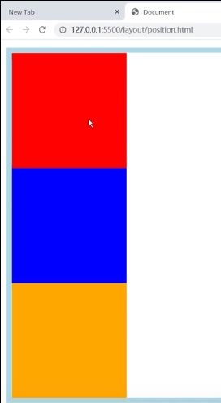
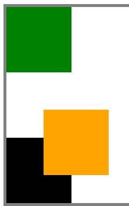
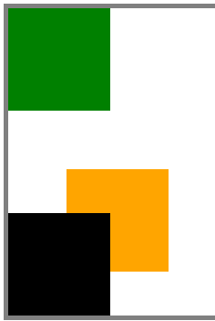

> `div` 是块元素，会单独占一行

**static** 

```html
<!DOCTYPE html>
<html>
  <HEAD>
    <META charset="UTF-8"></META>
    <style>
      .cards {
        border: 5px solid gray;
      }

      .card {
        width: 7rem;
        height: 7rem;
      }

      .card1 {
        background-color: green;
      }

      .card2 {
        background-color: orange;
      }

      .card3 {
        background-color: black;
      }

    </style>
  </HEAD>

  <BODY>
    <div class='cards'>
        <div class="card card1"></div>
        <div class="card card2"></div>
        <div class="card card3"></div>
    </div>
  </BODY>
</html>
```

> 该关键字指定元素使用正常的布局行为，从浏览器最上方，一行一行的排列下来。




**relative **

relative 相对定位元素的定位是相对其正常位置。就是相对于原来的位置进行定位， 如对上面中间的蓝色 `div` 块进行相对位置移动，那么就是从他现在的位置开始移动，而不是从浏览器最左上角开始。

```css
.card2 {
        background-color: orange;
        position: relative;
        left: 4rem;
        top: 4rem;
      }
```



如上黑色和橙色发生了重叠，那么加入想要黑色显示在上面

```css
   .card2 {
        background-color: orange;
        position: relative;
        left: 4rem;
        top: 4rem;
        z-index: 1;
      }

      .card3 {
        background-color: black;
        position: relative;
        z-index: 2;
      }
```

借助 `z-index` 的值那个大，那个就显示在上面，`z-index` 也需要是使用`position:relative` 才能生效



#### absolute 绝对定位

相关对于它的父元素的定位 ，当然如果仅仅是在一个元素中使用 `absolute`

```css
.card2 {
        background-color: orange;
        position: absolute;
        bottom: 0em;
        right: 0em;
      }
```

那么橙色的就会跑到整个浏览器的右下角，而正确的使用是，`absolute` 的属性会在里它最近的属性为`absolute/relative` 的父元素的参考定位，所以还需要将父元素的属性该掉。

```css
.cards {
        border: 5px solid gray;
        position: relative;
      }

.....

.card2 {
    background-color: orange;
    position: absolute;
    bottom: 0em;
    right: 0em;
}
```

#### fix

就是元素会固定在页面，即使是页面在滚动条的时候，元素还是不动的。

```css
body {
    height: 200vh;
}

....

.card2 {
    background-color: orange;
    position: fixed;
    right: 2em;
    left: 2em;
    width: auto;
}
```

#### stiky


