### Book1

#### CSS引入方式

##### 页面引入CSS

* 外部样式表

是最理想的CSS引入方式，把CSS代码和HTML代码单独放在不同的文件中，在HTML文件的<head></head>标签对中使用link标签来引用

```html
<link rel="stylesheet" type="text/css" href="文件路径" />
```

rel即relative的缩写，它的取值是固定的，即stylesheet；

type属性取值也是固定的，即"text/css"，表示这是标准的CSS

* 内部样式

HTML代码和CSS代码放到同一个HTML文件中。其中，CSS代码放在head标签内部的style标签内

```html
<style type="text/css">
……
</style>
```

* 行内样式

内部样式表的CSS是在“style标签”内定义的，而行内样式表的CSS是在“标签的style属性”

```html
<div style="color:red;">绿叶，给你初恋般的感觉。</div>
```

#### 选择器

用一种方式把你想要的那个元素选中！只有把它选中了，你才可以为这个元素添加CSS样式

##### id和class

id和class都是用来选择元素，以便进行CSS操作或者JavaScript操作的。

id属性具有唯一性，如果出现多个，CSS和JS则无法识别是哪个元素。

class，顾名思义，就是“类”，**可以为同一个页面的相同元素或者不同元素设置相同的class**，然后使得具有相同class的元素具有相同的CSS样式。

可以这样理解：id就像你的身份证号，而class就像你的名字。身份证号是全国唯一的，但是两个人的名字就有可能是一样的

##### 元素选择器

选中”相同的元素，然后给相同的元素定义同一个CSS样式。

```html
<style type="text/css">
    div {
      color: red;
    }
</style>

<body>
  <div>绿叶学习网</div>
  <p>绿叶学习网</p>
  <span>绿叶学习网</span>
  <div>绿叶学习网</div>
</body>
```

`div{color:red;} `表示把页面中所有的div元素选中，然后定义它们的文本颜色为红色，id名前面必须要加上前缀#

##### id选择器

针对设置了这个id的元素定义CSS样式，在同一个页面中，是不允许出现两个相同的id的。

```html
<style type="text/css">
    #lvye{color: red;}
</style>

<body>
  <div>绿叶学习网</div>
  <p>绿叶学习网</p>
  <span id="lvye">绿叶学习网</span>
  <div>绿叶学习网</div>
</body>
```

##### class选择器

“类选择器”。我们可以对“相同的元素”或者“不同的元素”定义相同的class属性

```html
<style type="text/css">
    .lvye{color: red;}
  </style>
</head>

<body>
  <div>绿叶学习网</div>
  <p>绿叶学习网</p>
  <span class="lvye">绿叶学习网</span>
  <div class="lvye">绿叶学习网</div>
</body>
```

##### 后代选择器

选择元素内部中所有的某一种元素，包括子元素和其他后代元素。父元素和后代元素必须要用空格隔开

```html
<style type="text/css">
    #father1 div {color:red;}
    #father2 span{color:blue;}
</style>

<body>
    <div id="father1">
        <div>绿叶学习网</div>
        <div>绿叶学习网</div>
    </div>
    <div id="father2">
        <p>绿叶学习网</p>
        <span>绿叶学习网</span>
    </div>
</body>
```

##### 群组选择器

同时对几个选择器进行相同的操作。

两个选择器之间必须要用英文逗号（，）隔开

```html
<style type="text/css">
    h3,
    div,
    span {color: red;}
</style>

<body>
  <h3>绿叶学习网</h3>
  <div>绿叶学习网</div>
  <p>绿叶学习网</p>
  <span>绿叶学习网</span>
</body>
```

可以混合id、class、元素选择器使用

`#lvye,.lv,span{……}`表示选中id为lvye、class为lv的元素以及所有的span元素。

#### 字体样式

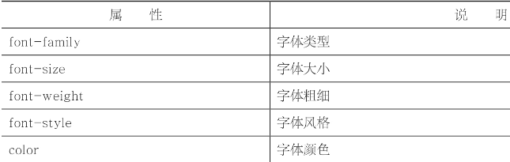

字体大小取值有：

一种是“关键字”，如small、medium、large等。(基本不会用)

另外一种是“像素值”，如 10px、16px、21px等。px也是属于相对单位，因为屏幕分辨率的不同，1px的大小也是不同的。

**font-weight**属性取值有两种：一种是100～900的“数值”；另外一种是“关键字”

* normal: 正常-默认
* lighter: 较细
* bold: 较粗
* bolder: 很粗

**font-style**

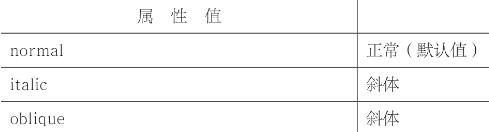

有些字体有斜体italic属性，但有些字体却没有italic属性。oblique是让没有italic属性的字体也能够有斜体效果。

#### 文本样式

字体样式针对的是“文字本身”的型体效果，而文本样式针对的是“整个段落”的排版效果。字体样式注重个体，文本样式注重整体。

在CSS中，特意使用了font和text两个前缀来区分这两类样式。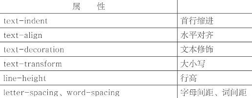

```css
text-indent:像素值;

text-align:取值;
/*取值 left(默认)、center、right*/
```

**text-decoration**属性来定义文本的修饰效果，下划线、中划线、顶划线。

```css
text-decoration:取值;
/*
none(默认)、
underline(下划线): 强调文章中的重点
line-through(中划线)、
overline(顶划线)
*/
```

**text-transform**属性来将文本进行大小写转换

```css
text-transform:取值;
/*
none:默认
uppercase
lowercase
capitalize 每个英文字母首字母大写
*/
```

**line-height**属性来控制每行文本的高度 “一行的高度”

```css
line-height:像素值;
```

**letter-spacing**属性来调整两个字之间的距离

#### 边框样式

如，可以对div、img、table、span等元素定义边框。

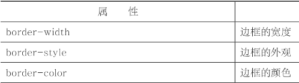

border-style可取值有：

1. none
2. dashed: 虚线
3. solid: 实线

```html
    /*定义所有div样式*/
    div {
      width: 100px;
      height: 30px;
    }
  /*定义单独div样式,简写形式，分别为width style color*/
    #div1 {
      border: 1px dashed red;
    }
    #div2 {
      border: 10px solid red;
    }
  </style>

<body>
  <div id="div1"></div>
  <div id="div2"></div>
</body>
```

设置局部样式

```css
border-top-width:1px;
border-top-style:solid;
border-top-color:red;

/*简写*/
border-top:1px solid red;
```

相同的还有

`border-left、border-right、border-bottom`

#### 列表样式

有序列表和无序列表的列表项符号，都是使用type属性来定义列表项符号，针对ol或者ul元素的，而不是li元素

```css
list-style-type:取值;
```

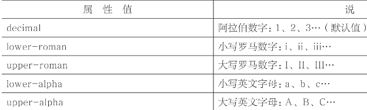

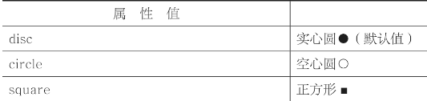

```html
<style type="text/css">
    ol{list-style-type:lower-roman;}
</style>

<body>
    <h3>有序列表</h3>
    <ol>
        <li>HTML</li>
        <li>CSS</li>
        <li>JavaScript</li>
    </ol>
</body>
```

使用list-style-type属性来去除有序列表或无序列表的列表项符号的

```html
list-style-type:none;
```

**list-style-image**属性来定义列表项图片

```css
list-style-image:url(图片路径);
```

```html
<style type="text/css">
        ul{list-style-image: url(img/leaf.png);}
</style>
<ul>
    <li>HTML</li>
    <li>CSS</li>
    <li>JavaScript</li>
</ul>
```

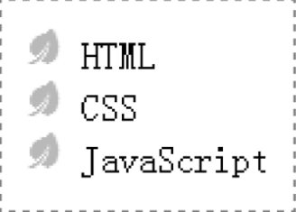


#### 图片

对其可以使用 **text-align**、边框使用**边框**章节介绍的border属性、

高和宽直接使用`width 和 length`

垂直对其**vertical-align**，其取值可以为：top、middle、baseline(基线对其)、bottom。

##### 图文混排

文字环绕着图片进行布局，使用float属性来实现其效果。

```css
float:取值;
/*left: 左浮动、right:向右浮动*/
```


#### 背景样式

背景样式包括两个方面：背景颜色和背景图片。

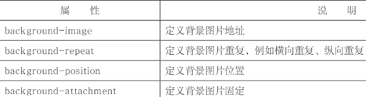

```css
background-image:url(图片路径);

background-repeat:取值;
/*
repeat: 水平、垂直方向同时平铺
repeat-x: 只在水平方向平铺
repeat-y: 只在垂直方向平铺
no-repeat: 不平铺
*/
```

background-position属性取值为“像素值”时，如

```background-position:12px 24px;```表示背景图片与该元素**左上角的水平方向距离为12px，垂直方向距离为24px**

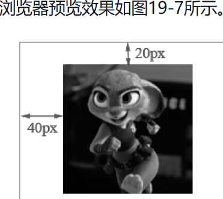

```css
background-position:水平距离 垂直距离;
```

background-position属性的关键字取值:

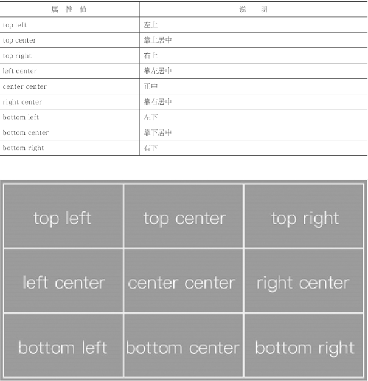


**background-attachment**属性来定义背景图片是随元素一起滚动还是固定不动

```css
background-attachment:取值;
/*
scroll: 默认随元素一起滚动
fixed: 固定不动
*/
```


#### 超链接

使用“超链接伪类”来定义超链接在鼠标点击的不同时期的样式，

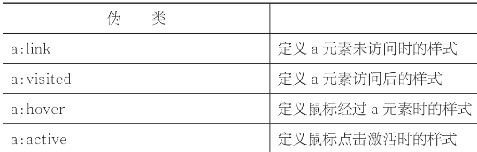

定义这四个伪类，必须按照link、visited、hover、active的顺序进行，不然浏览器可能无法正常显示这四种样式。

```html
<style type="text/css">
    a {text-decoration: none;}
    a:link {color: red;}
    a:visited {color: purple;}
    a:hover {color: yellow;}
    a:active {color: blue;}
  </style>

<body>
  <a href="http://www.lvyestudy.com" target="_blank">绿叶学习网</a>
</body>
```

**a{text-decoration:none;}表示去掉超链接默认样式中的下划线**

实际开发中，我们只会用到两种状态：未访问时状态和鼠标经过状态。

```css
/*没必要使用a:link,直接对a元素进行定义就好*/
a{…}
a:hover{…}
/*一般使用hover就可以的了*/
```

:hover伪类可以定义任何一个元素在鼠标经过时的样式。

* `:hover用于div`

```html
  <style type="text/css">
    div {
      width: 100px;
      height: 30px;
      line-height: 30px;
      text-align: center;
      color: white;
      background-color: lightskyblue;
    }
                      
    div:hover {
      background-color: hotpink;
    }
  </style>

<body>
  <div>绿叶学习网</div>
</body>
```

##### 定义鼠标样式

```css
cursor:取值;
```

一般只会用到default、pointer、text这三个

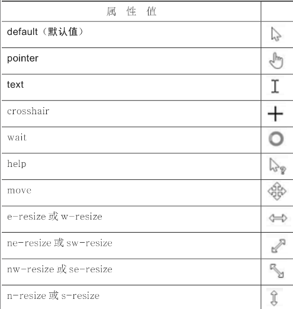

```html
<style type="text/css">
    div
    {
        width:100px;
        height:30px;
        line-height:30px;
        text-align:center;
        background-color: hotpink;
        color:white;
        font-size:14px;
    }
    #div_default{cursor:default;}
    #div_pointer{cursor:pointer;}
</style>
</head>

<body>
    <div id="div_default">鼠标默认样式</div>
    <div id="div_pointer">鼠标手状样式</div>
</body>
```

#### **transform**

允许你旋转，缩放，倾斜或平移给定元素 ,应用 2D 或 3D 转换 

[transform-function - CSS：层叠样式表 | MDN (mozilla.org)](https://developer.mozilla.org/zh-CN/docs/Web/CSS/transform-function) 

[CSS transform 属性 (w3school.com.cn)](https://www.w3school.com.cn/cssref/pr_transform.asp) 

```css
/* Keyword values */
transform: none;

/* Function values */
transform: matrix(1, 2, 3, 4, 5, 6);
transform: translate(12px, 50%);
transform: translateX(2em);
transform: translateY(3in);
transform: scale(2, 0.5);
transform: scaleX(2);
transform: scaleY(0.5);
transform: rotate(0.5turn);
transform: skew(30deg, 20deg);
transform: skewX(30deg);
transform: skewY(1.07rad);
transform: matrix3d(1, 2, 3, 4, 5, 6, 7, 8, 9, 10, 11, 12, 13, 14, 15, 16);
transform: translate3d(12px, 50%, 3em);
transform: translateZ(2px);
transform: scale3d(2.5, 1.2, 0.3);
transform: scaleZ(0.3);
transform: rotate3d(1, 2, 3, 10deg);
transform: rotateX(10deg);
transform: rotateY(10deg);
transform: rotateZ(10deg);
transform: perspective(17px);

/* Multiple function values */
transform: translateX(10px) rotate(10deg) translateY(5px);

/* Global values */
transform: inherit;
transform: initial;
transform: unset;


对应的还有 translate(x,y) x 和 y 方向的平移
translateX X方向的平移
取 + 值的时候x/y是右/下方向平移
取 - 值的时候x/y是左/上方向平移
scale(x,y) x 和 y 方向的缩放
transform: translateY(-100%);
```

#### transition

简写属性，用于设置四个过渡属性 。

- [transition-property](https://www.w3school.com.cn/cssref/pr_transition-property.asp)：设置过渡效果的 CSS 属性的名称 
- [transition-duration](https://www.w3school.com.cn/cssref/pr_transition-duration.asp)：需始终设置这个值，否则时长为 0，就不会产生过渡效果 
- [transition-timing-function](https://www.w3school.com.cn/cssref/pr_transition-timing-function.asp) 规定速度效果的速度曲线 
  - linear  相同速度开始至结束的过渡效果 
  - ease 慢速开始，然后变快，然后慢速结束的过渡效果 
- [transition-delay](https://www.w3school.com.cn/cssref/pr_transition-delay.asp) 定义过渡效果何时开始 

#### overflow

[overflow - CSS：层叠样式表 | MDN (mozilla.org)](https://developer.mozilla.org/zh-CN/docs/Web/CSS/overflow) 

设置了元素溢出时所需的行为——即当元素的内容太大而无法适应它的[块级格式化上下文](https://developer.mozilla.org/zh-CN/docs/Web/Guide/CSS/Block_formatting_context)时。 

是 `overflow-x` 和 `overflow-y` 的缩写

可以取到值有：

* visible 内容不能被裁减，并且可能渲染到边距盒（padding）的外部 
* hidden：如果需要，内容将被裁减以适应边距（padding）盒。不提供滚动条，也不支持允许用户滚动（例如通过拖拽或者使用滚轮） 
* clip: 内容将以元素的边距（padding）盒进行裁剪。`clip` 和 `hidden` 之间的区别是 `clip` 关键字禁止所有滚动，包括以编程方式的滚动 
* scroll :内容将被裁减以适应边距（padding）盒。无论是否实际裁剪了任何内容，浏览器总是显示滚动条，以防止滚动条在内容改变时出现或者消失 
* auto

---

### Book 深入解析CSS

#### 基础回顾

层叠、相对单位以及盒模型，层叠、相对单位以及盒模型。

##### 层叠、优先级和继承

CSS是很特别的存在。严格来讲，它不是编程语言，却要求抽象思维。

首先需要理解浏览器如何解析样式规则，在项目中可能会遇到这样的问题

> 但是当两条规则提供了冲突的样式时会发生什么呢？如果你发现有一条规则没有按照预期生效，可能是因为另一条规则跟它冲突了

* 层叠

  > 指的就是这一系列规则。它决定了如何解决冲突，是CSS语言的基础。

当声明冲突时，层叠会依据三种条件解决冲突

1. 样式表的来源

   ！important的样式声明 > 作者自定义样式 > 用户代理样式(默认样式)。

2. 选择器优先级

   行内样式 > 选择器样式

   ```css
   <li><a href="/" style="background-color: orange;">Home</a></li>
   ```

   如上行内样式，是在标签的`style` 属性中定义样式，这样它会覆盖来自`<style>` 标签中的样式。

   有两个类名的选择器 > 一个类名的选择器

   ```css
   #main-nav a {
     color: white;
     background-color: #13adad;
     padding: 5px;
     border-radius: 2px;
     text-decoration: none;
   }
   
   .featured {
     background-color: orange;
   }
   
     <header class="page-header">
       <h1 id="page-title" class="title">Womat cooffee Roaster</h1>
       <nav>
         <ul id="main-nav" class="nav">
           <li><a href="/">Home</a></li>
           <li><a href="/coffee">Coffee</a></li>
           <li><a href="/brewers">Brewers</a></li>
           <li><a href="/specials" class="featured">Specials</a></li>
         </ul>
       </nav>
     </header>
   ```

   如上`main-nav` 和 `a` 以及`.featured` 都对标签`<a> `进行标记，`main-nav` 和 `a` 放在一起的2个选择器(id和标签)定义的`#13adad` 颜色样式，就是比及`.featured` 一个选择器定义的`orange` 颜色的样式优先级高，浏览器中显示的是`#13adad` 颜色样式

   ID选择器 > 类选择器 > 标签选择器

   > 一个id选择器的优先级也比多个类选择器的优先级更高

3. 源码顺序

   如果两个声明的来源和优先级相同，其中一个声明在样式表中出现较晚，或者位于页面较晚引入的样式表中，则该声明胜出

在使用过程中的经验

* 在选择器中不要使用id

  > 就算只用一个ID，也会大幅提升优先级。当需要覆盖这个选择器时，通常找不到另一个有意义的ID，于是就会复制原来的选择器，然后加上另一个类，让它区别于想要覆盖的选择器

* 不要使用 !important

  > 它比ID更难覆盖，一旦用了它，想要覆盖原先的声明，就需要再加上一个！important

* 继承

> 如果一个元素的某个属性没有层叠值，则可能会继承某个祖先元素的值。比如通常会给<body>元素加上font-family，里面的所有祖先元素都会继承这个字体，就不必给页面的每个元素明确指定字体了

靠近顶部的样式会覆盖下面的样式。被覆盖的样式上划了删除线


* 特殊值

> 可以赋给任意属性，用于控制层叠，inherit和initial
>
> inherit：用继承代替一个层叠值。这时候可以用inherit关键字。可以用它来覆盖另一个值，这样该元素就会继承其父元素的值

```css
/* 设置全局链接颜色 */
a:link{
  color: blue;
}

/* 页脚的文本设置为灰色 */
.footer {
  color: #666;
  background-color: #ccc;
  padding: 15px 0;
  text-align: center;
  font-size: 14px;
}

/* 
从页脚继承文本颜色，继承父页脚 <footer> 的颜色
*/
.footer a {
  color: inherit;
  text-decoration: underline;
}

<footer class="footer">
    &copy; 2016 Wobat Coffee Roaatser &mdash; 
    <a href="/term">Term of use</a>
</footer>
```

要撤销作用于某个元素的样式。这可以用initial关键字来实现，每一个CSS属性都有初始（默认）值。如果将initial值赋给某个属性，那么就会有效地将其重置为默认值

```css
.footer a {
      color: initial;
      text-decoration: underline;
}
```

黑色是color属性的初始值，所以color: initial等价于color: black

如果想删除一个元素的边框，设置border: initial即可。如果想让一个元素恢复到默认宽度，设置width: initial即可


* 关于简写属性

简写属性是用于同时给多个属性赋值的属性。

border是border-width、border-style以及border-color的简写属性,border-width是上、右、下、左四个边框宽度的简写属性

简写属性可以让代码简洁明了，但是也隐藏了一些怪异行为

1. 多数简写属性可以省略一些值，只指定我们关注的值。但是要知道，这样做仍然会设置省略的值，即它们会被隐式地设置为初始值。

2. 简写属性会尽量包容指定的属性值的顺序

   > `border: 1px solid black`或者`border: black 1px solid`，两者都会生效。这是因为浏览器知道宽度、颜色、边框样式分别对应什么类型的值。
   >
   > **像margin、padding这样的属性，属性的值是按顺时针方向，从上边开始的**
   >
   > 这样的顺时针规律，值适用于**盒子**  设置属性。
   >
   > top（上）、right（右）、bottom（下）、left（左）
   >
   > ```css
   > padding: 10px 15px 0 5px;
   > ```
   >
   > 如果缺少值时候：
   >
   > * 四个属性值还剩一个没指定，没有指定的一边会取其对边的值
   > * 指定三个值时，左边和右边都会使用第二个值
   > * 指定两个值时，上边和下边会使用第一个值
   > * 指定一个值，那么四个方向都会使用这个值
   >
   > 下面是等价的
   >
   > ```css
   > padding: 1em 2em;
   > padding: 1em 2em 1em;
   > padding: 1em 2em 1em 2em;
   > ```

* 水平 垂直

  > 还有一些属性只支持设置两个值。`background-position、box-shadow、text-shadow`
  >
  > background-position: 25% 75%则先指定水平方向的右/左属性值，然后才是垂直方向的上/下属性值。
  >
  > 其和上面的规律是相反的，原因是
  >
  > > 这两个值代表了一个笛卡儿网格。笛卡儿网格的测量值一般是按照x, y（水平，垂直）的顺序来的
  >
  > ```css
  > .featured {
  >       background-color: orange;
  >       /* 缩影向右偏移 10px 向下偏移2px */
  >       box-shadow: 10px 2px #6f9090; 
  > }
  > ```

这两个规律可以这么记忆

**盒子是12点钟开始顺时针顺序、(xy)笛卡尔方向是从3点钟开始的顺时针顺序**


##### 相对单位

在早期，开发人员明确知道其媒介的限制。一个典型的程序窗口可能宽400px、高300px，一个页面可能是宽4英寸、高6.5英寸。因此，当开发人员设置应用程序的按钮和文字布局时，他们能精确地知道元素在屏幕上的大小和留给其他元素的空间。

但是在Web环境下，用户可以缩放浏览器窗口的大小，而CSS必须适应这种窗口大小，开始考虑响应式设计，在CSS中指的是样式能够根据浏览器窗口的大小有不同的“响应”

**相对单位就是CSS用来解决这个问题**

* 几种常用的绝对单位

最基础的是像素（px）。不常用的绝对单位是mm（毫米）、cm（厘米）、in（英寸）、pt（点）、pc（派卡）。这些单位都可以通过公式互相换算：1in = 25.4mm = 2.54cm = 6pc = 72pt =96px。

CSS像素并不严格等于显示器的像素，但是96px通常等于一个物理英寸的大小。


* em 和 rem

em是最常见的相对长度单位，**适合基于特定的字号进行排版**,

1em等于当前元素的字号，其准确值取决于作用的元素

```css
.padded {
   font-size: 16px;
   padding: 1em;
}
```

规则集指定了字号为16px，也就是元素局部定义的1em，这里设置内边距的值为1em。浏览器将其乘以字号，最终渲染为16px。

设置padding、height、width、border-radius等属性时，使用em会很方便。这是因为当元素继承了不同的字号，或者用户改变了字体设置时，这些属性会跟着元素均匀地缩放

如下，两个box 会根据字体的`small` 和 `large` 变化边距。

```css
.box {
  padding: 1em;
  border-radius: 1em;
  background-color: lightgray;
}

.box-small {
  font-size: 12px;
}

.box-larger {
  font-size: 18px;
}

<span class="box box-small">但是在Web环境下</span>
<span class="box box-large">但是在Web环境下</span>
```

em的好处。可以定义一个元素的大小，然后只需要改变字号就能整体缩放元素

那么如果当`font-size` 也使用`em` 表示的时候，此时这个font-size是根据继承的字号来计算的

```css
body{
  font-size: 16px;
}

.slogan {
  font-size: 2em;
}

<body>
 We love coffee
 <p class="slogan">We love coffee</p>
</body>
```

第一行文字在<body>标签中，因此它会按照body的字号来渲染.

em的复杂之处在于同时用它指定一个元素的字号和其他属性。这时，浏览器必须先计算字号，然后使用这个计算值去算出其余的属性值。这两类属性可以拥有一样的声明值，但是计算值不一样

```css
body{
  font-size: 16px;
}

.slogan {
  font-size: 2em;
  padding: 2em;
  background-color: #ccc;
}
```

如上，指定`slogan` 的字体是`2em` ，浏览器先计算`slogan` 的字体，也就是`2*16px`, 浏览器然后再计算`padding` 的属性，其值为`2em` 但是他此时参考的值不是`body` 而是`slogan` 的字体，`slogan` 的字体是`2*16px`,  所以`padding `  的值为`2*2*16px`

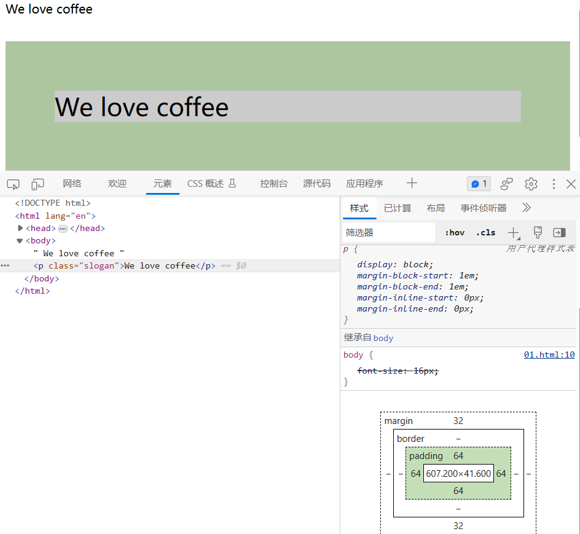

尽管`padding` 和`font-size` 申明都是`2em` 但是计算出来最后的值确实不一样的。

* 嵌套缩小问题

当使用`em` 指定字体的时候，如下的例子就会一层一层的向上找参考值

```css
body{
  font-size: 16px;
}

ul {
  font-size: .8em;
}

<ul>
  <li> 1 Level
    <ul>
      <li>2 Level
        <ul>
          <li>3 Level
            <ul>
              <li>4 Level
                <ul>
                  <li>5 Level</li>
                </ul>
              </li>
            </ul>
          </li>
        </ul>
      </li>
    </ul>
  </li>
 </ul>
```

例子告诉我们，如果不小心的话，em就会变得难以驾驭。em用在内边距、外边距以及元素大小上很好，但是用在字号上就会很复杂。

**值得庆幸的是，我们有更好的选择：rem**

DOM（文档对象模型）最顶级(根)节点有一个伪类选择器(`:root`)，可以用来选中自己，等价类型选择器`html`，`rem=root em`，rem不是相对于当前元素，而是相对于根元素的单位。

不管在文档的什么位置使用rem,1.2rem都会有相同的计算值：1.2乘以根元素的字号

```css
:root {
  font-size: 1em;
}

ul {
  font-size: .8em;
}
```

根元素的字号为浏览器默认的字号16px（根元素上的em是相对于浏览器默认值的）。

rem结合了px和em的优点，既保留了相对单位的优势，又简单易用。

**一般会用rem设置字号，用px设置边框，用em设置其他大部分属性，尤其是内边距、外边距和圆角**

在响应式网页中，需要习惯“模糊”值。1.2em到底是多少像素并不重要，重点是它比继承的字号要稍微大一点


更进一步地说，我们甚至可以根据屏幕尺寸，用媒体查询改变根元素的字号。这样就能够基于不同用户的屏幕尺寸，渲染出不同大小的面板

> 媒体查询，即@media规则，可以指定某种屏幕尺寸或者媒体类型
>
> 后续章节继续

em和rem都是相对于font-size定义的，但CSS里不止有这一种相对单位。还有相对于浏览器视口定义长度的视口的相对单位

* 视口

> 浏览器窗口里网页可见部分的边框区域。它不包括浏览器的地址栏、工具栏、状态栏

1. vh：视口高度的1/100。
2. vw：视口宽度的1/100。
3. vmin：视口宽、高中较小的一方的1/100（IE9中叫vm，而不是vmin）。
4. vmax：视口宽、高中较大的一方的1/100（本书写作时IE和Edge均不支持vmax）

比如50vw等于视口宽度的一半，25vh等于视口高度的25%。


##### 盒模型

`box-sizing` 的值

> 默认值为content-box，这意味任何指定的宽或高都只会设置内容盒子的大小。将box-sizing设置为border-box后，height和width属性会设置内容、内边距以及边框的大小总和

**Flexbox实现两列等高布局**。Flexbox不需要一个额外的div包裹元素，它默认会产生等高的元素。此外也不需要使用负外边距


min-height和max-height。你可以用这两个属性指定最小或最大值。


**垂直居中**

vertical-align: middle后，块级元素里的内容就能垂直居中，声明只会影响行内元素或者table-cell元素，对于行内元素，它控制着该元素跟同一行内其他元素之间的对齐关系。


**负外边距**

负外边距的具体行为取决于设置在元素的哪边。如果设置左边或顶部的负外边距，元素就会相应地向左或向上移动，导致元素与它前面的元素重叠，

如果设置右边或者底部的负外边距，并不会移动元素，而是将它后面的元素拉过来

负外边距并不常用


**猫头鹰选择器**

> `* + *`

开头是一个通用选择器（＊），它可以选中所有元素，后面是一个相邻兄弟组合器（+），最后是另一个通用选择器。

它不会选中直接跟在其他按钮后面的按钮，而是会选中直接跟在其他元素后面的任何元素。也就是说，它会选中页面上有着相同父级的非第一个子元素。

```css
body * + * {
      margin-top: 1.5em;
}

<body>
  <header>
    <h1>Franklin Running Club</h1>
  </header>
  <div class="container">
    haha
  </div>

  <div class="container">
    haha
  </div>
</body>
```

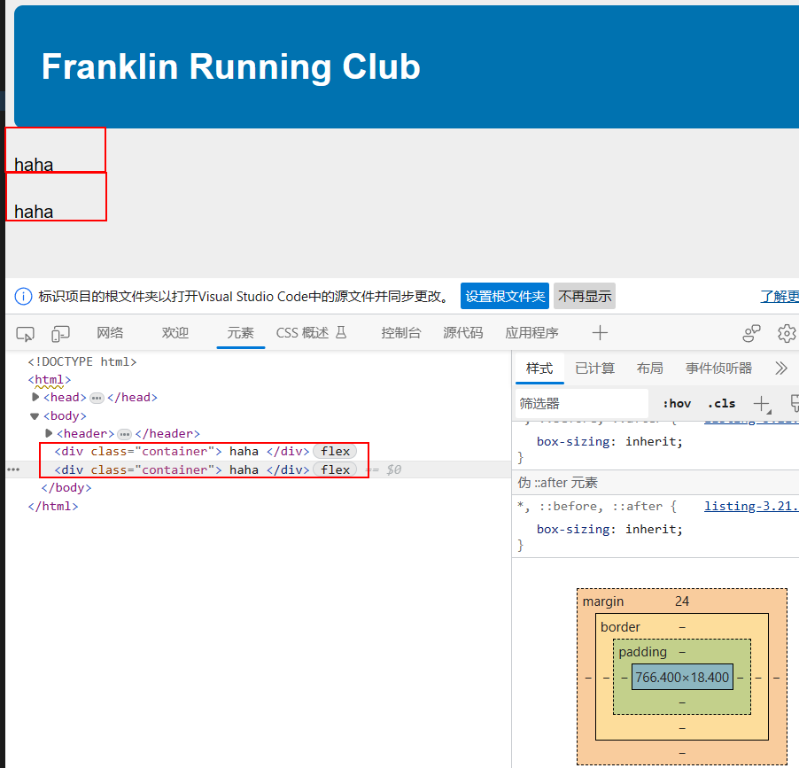

如上，使用猫头鹰选择器后，会选中`body` 中，第二个元素`div`开始的后续元素(包括第二个)

#### 布局

包括浮动、Flexbox和定位。这些工具本身没有优劣之分，只不过实现布局的方式略有不同。

最重要的三种改变文档流的方式：浮动、Flexbox和网格布局，以及定位(主要作用是将元素堆叠到其他元素之上)


##### 浮动布局

* 浮动的工作原理，以及如何避开常见的陷阱
* 媒体对象和双容器模式
* 块级格式化上下文
* 如何创建和理解一个网格系统


**浮动元素会被移出正常文档流**，并被拉到容器边缘。文档流会重新排列，但是它会包围浮动元素此刻所占据的空间，如果让多个元素向同侧浮动，它们就会挨着排列。

浮动本身不是为了实现页面布局而设计的，但把它当成了布局工具。


**双容器模式（double container pattern）**

将内容放置到两个嵌套的容器中，然后给内层的容器设置外边距，让它在外层容器中居中

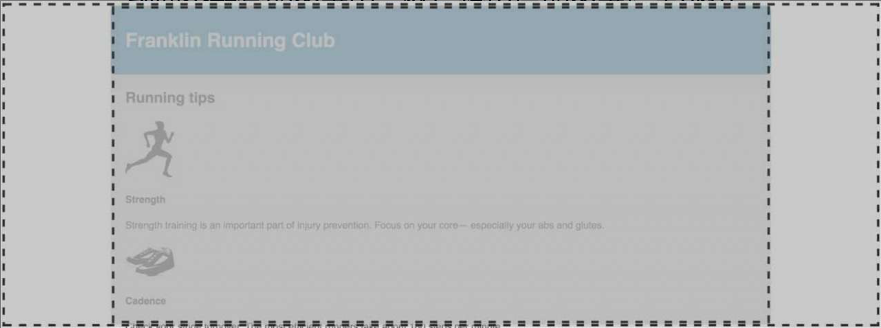

```html
<!-- <body>就是外层容器，默认是100%的网页宽度 -->
<body>
  <!-- 在<body>内部，整个网页的内容放在了<div class="container">，也就是内层容器中 -->
  <div class="container">
  </div>
</body>
```

* 容器折叠和清除浮动

```html
<body>
  <!-- 在<body>内部，整个网页的内容放在了<div class="container">，也就是内层容器中 -->
  <div class="container">
    <header>
      <h1>Franklin Running Club</h1>
    </header>

    <main class="main clearfix">
      <h2>Running tips</h2>
      <div>
        <div class="media">
          
          <div class="media-body">
            <h4>Strength</h4>
            <p>
              Strength training is an important part of
              injury prevention. Focus on your core&mdash;
              especially your abs and glutes.
            </p>
          </div>
        </div>

        <div class="media">
          
          <div class="media-body">
            <h4>Cadence</h4>
            <p>
              Check your stride turnover. The most efficient
              runners take about 180 steps per minute.
            </p>
          </div>
        </div>

        <div class="media">
          
          <div class="media-body">
            <h4>Change it up</h4>
            <p>
              Don't run the same every time you hit the
              road. Vary your pace, and vary the distance
              of your runs.
            </p>
          </div>
        </div>

        <div class="media">
          
          <div class="media-body">
            <h4>Focus on form</h4>
            <p>
              Run tall but relaxed. Your feet should hit
              the ground beneath your hips, not out in
              front of you.
            </p>
          </div>
        </div>
      </div>
    </main>
  </div>
</body>
```

CSS

```css
    :root {
      box-sizing: border-box;
    }

    *,
    ::before,
    ::after {
      box-sizing: inherit;
    }

    body {
      background-color: #eee;
      font-family: Helvetica, Arial, sans-serif;
    }

    /* 猫头鹰选择器 */
    body * + * {
      margin-top: 1.5em;
    }

    header {
      padding: 1em 1.5em;
      color: #fff;
      background-color: #0072b0;
      border-radius: .5em;
      margin-bottom: 1.5em;
    }

    .main {
      padding: 0 1.5em;
      background-color: #f2ff;
      border-radius: .5em;
    }
    
    .container{
      max-width: 1080px;
      margin: 0 auto;
    }
    .media {
      /* 盒子都网左侧浮动 */
      /* float: left; */
      /* 盒子宽度在水平方向上能够放下2个 */
      width: 50%;
      padding: 1.5em;
      background-color: #eee;
      border-radius: 0.5em;
    }
```

当标签关闭浮动`float: left` 的时候，一切显示均正常

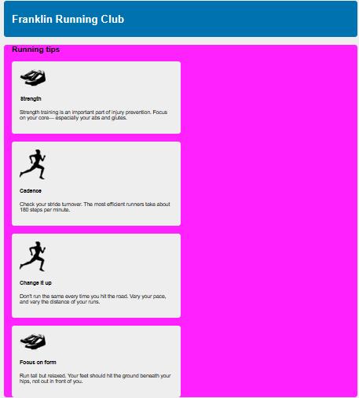

当打开注释后，显示

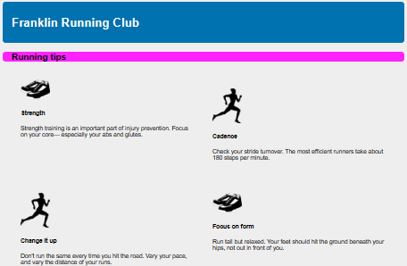

背景的确出现在了页面标题（“Running tips”）后面，但是并没有向下延伸，直到包含媒体盒子。是因为浮动元素不同于普通文档流的元素，它们的高度不会加到父元素上，所以容器的高度只包含页面标题的高度。要让主元素扩展到浮动元素后面，使用`伪元素`，使用`::after`伪元素选择器，就可以快速地在DOM中在容器末尾添加一个元素

> 伪元素——一种特殊的选择器，可以选中文档的特定部分。伪元素以双冒号（::）开头，大部分浏览器为了向后兼容也支持单冒号的形式。最常见的伪元素是：:before和：:after，用来向元素的开始或者结束位置插入内容

```css
.clearfix::after {
      /* 将伪元素设置为一个块元素，以块的形式出现在DOM中 */
      display: block;
      /* 显示内容为空 */
      content: " ";
      /* 要给包含浮动的元素清除浮动：伪元素清除容器中所有的浮动 */
      clear: both;
    }
```

进行如下修改

```css
.clearfix::after,
.clearfix::before {
  /* 
  	将伪元素设置为一个块元素，以块的形式出现在DOM中，table 也是一个block，给前后均插入一个空行，
    使得里面的内容，对上、对下都有一定的空隙，
  */
  display: table;
  /* 显示内容为空 */
  content: " ";
}

.clearfix::after {
  /* 要给包含浮动的元素清除浮动：伪元素清除容器中所有的浮动 */
  clear: both;
}
```

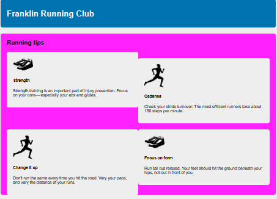

背景的问题解决了，但是明显发现4个`block` 并不是均匀的上下整体分布，因为浏览器会将浮动元素尽可能地放在靠上的地方，众多的元素浮动到同一侧，如果每个浮动盒子的高度不一样，最后的布局可能千变万化，同理，改变浏览器的宽度也会造成相同的结果，因为它会导致换行，从而改变元素高度。

要想修复这个问题很简单：清除第三个浮动元素上面的浮动。更通用的做法是，清除每行的第一个元素上面的浮动。**由于已知每行有两个盒子，因此只需要清除每行的第奇数个元素上面那行的浮动即可**

```css
/* 奇数行的第一个block 清除浮动 */
.media:nth-child(odd) {
  clear: left;
}
```

我们设想的是让图片在一侧，一段文字出现在图片的旁边。这是一种很典型的网页布局。

先将图片浮动到左边，但还不够。如果文字很长，它会包围浮动元素

```css
.media-image{
  float: left;
}
.media-body {
  /* 清除猫途鹰选择器添加的顶部外边距 */
  margin-top: 0;
}
.media-body h4{
  margin-top: 0;
}
```

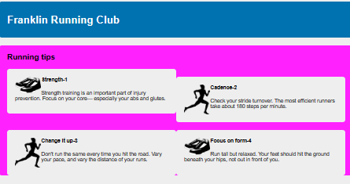

解决文字包围图片的问题，还要更加深入地了解浮动的工作原理**BFC**

通过浏览器检查元素，就会发现它的盒子扩展到了最左边，因此它会包围浮动的图片。只要清除了图片底部的浮动，正文就会立刻移动到媒体盒子的左边，为了解决，需要为正文建立一个块级格式化上下文（block formatting context,BFC），**简言之就是将其变为块级容器**


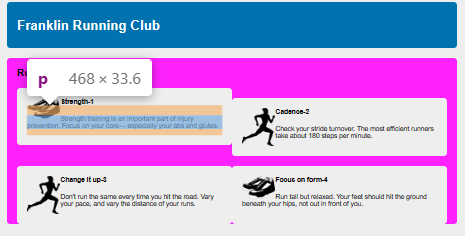


```css
.media {
  /* 盒子都网左侧浮动 */
  float: left;
  /* 盒子宽度在水平方向上能够放下2个 */
  margin: 0 1.5em 1.5em 0;
  width: calc(50% - 1.5em);
  padding: 1.5em;
  background-color: #eee;
  border-radius: 0.5em;
}

.media-image{
  float: left;
  /* 添加外边距，它于正文中间出现间隔 */
  margin-left: 1.5em;
}
.media-body {
  /* 清除猫途鹰选择器添加的顶部外边距 */
  margin-top: 0;
  /* 创建一个新的BFC, 这由正文就不会跟着浮动的图片重叠 */
  overflow: auto;
}
.media-body h4{
  margin-top: 0;
}
```

只要给媒体正文创建BFC。通常是给元素设置overflow值——hidden或者auto

整个页面的布局已经创建好了，但是还存在一些不足。最主要的问题是，无法轻松地复用样式表中的内容。现在媒体对象的宽度是50%，因此一行有两个元素。如果想要复用前面的设计，**但需要一行放三个元素，那又该怎么办呢？**

**比较普遍的做法是借助网格系统提高代码的可复用性**

通常网格系统的每行被划分为特定数量的列，一般是12个，但也可以是其他数。每行子元素的宽度可能等于1~12个列的宽度，使用**几列宽**的方式表示一个格子宽度。

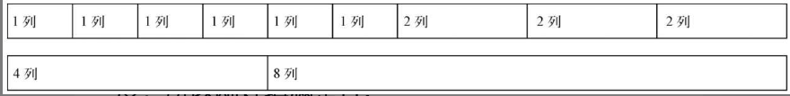

第一行有6个1列宽的子元素和3个2列宽的子元素。第二行有一个4列宽的子元素和一个8列宽的子元素。

**浮动布局有更好理解的替代方案**


##### Flexbox

全称弹性盒子布局（Flexible Box Layout），跟浮动布局相比，Flexbox的可预测性更好，还能提供更精细的控制。它也能轻松解决困扰我们许久的垂直居中和等高列问题。

Flexbox有缺点的话，那一定是它那数不清的选项了，当给一个元素加了`display:flex` 那么它的子元素也会变为弹性子元素，弹性子元素默认是在同一行按照从左到右的顺序**并排排列**，弹性元素，像块元素一样填满可用宽度(不一定装满)，弹性元素的高度一样，高度由它的内容决定。


1. 内联和块的上下左右居中布局
2. 不定项居中布局
3. 均分列布局
4. 组合嵌套布局


需要一个**弹性容器**能控制**内部弹性元素(直系子元素，非直系子元素不是弹性的)**的布局。

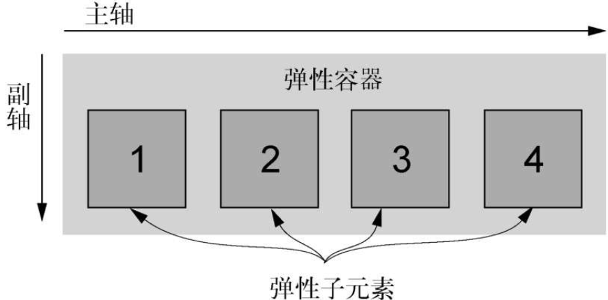

子元素按照主轴线排列，主轴的方向为主起点（左）到主终点（右）。垂直于主轴的是副轴。方向从副起点（上）到副终点（下）

```html
<body>
  <div class="container">
    <header>
      <h1>Ink</h1>
    </header>
    <nav>
      <!-- 导航菜单 -->
      <ul class="site-nav">
        <li><a href="/">Home</a></li>
        <li><a href="/features">Features</a></li>
        <li><a href="/pricing">Pricing</a></li>
        <li><a href="/support">Support</a></li>
        <li class="nav-right">
          <a href="/about">About</a>
        </li>
      </ul>
    </nav>
    <main class="flex">
      <!-- 大主题板块 -->
      <div class="column-main tile">
        <h1>Team collaboration done right</h1>
        <p>Thousands of teams from all over the
          world turn to <b>Ink</b> to communicate
          and get things done.</p>
      </div>
      <!-- 侧边 -->
      <div class="column-sidebar">
        <div class="tile">
          <form class="login-form">
            <h3>Login</h3>
            <p>
              <label for="username">Username</label>
              <input id="username" type="text"name="username"/>
            </p>
            <p>
              <label for="password">Password</label>
              <input id="password" type="password"
                name="password"/>
            </p>
            <button type="submit">Login</button>
          </form>
        </div>
        <div class="tile centered">
          <small>Starting at</small>
          <div class="cost">
            <span class="cost-currency">$</span>
            <span class="cost-dollars">20</span>
            <span class="cost-cents">.00</span>
          </div>
          <a class="cta-button" href="/pricing">
            Sign up
          </a>
        </div>
      </div>
    </main>
  </div>
</body>


<style>
    :root {
      box-sizing: border-box;
    }

    *,
    ::before,
    ::after {
      box-sizing: inherit;
    }

    body {
      background-color: #709b90;
      font-family: Helvetica, Arial, sans-serif;
    }

    body * + * {
      margin-top: 1.5em;
    }

    .container {
      max-width: 1080px;
      margin: 0 auto;
    }
  </style>
```

初始长这个样子 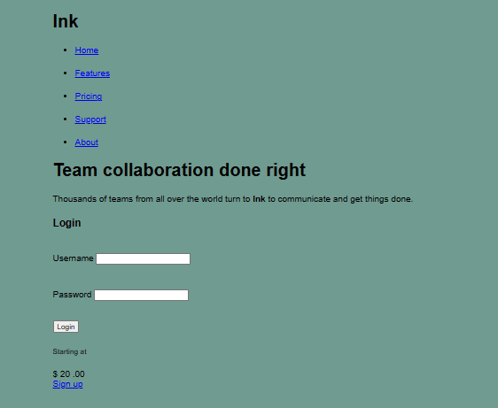

选择`<ul>` 为弹性容器

> **后代选择器（descendant selector）** 又称为包含选择器，会选择子、孙、重孙元素。 `.aaa a `
>
> **子元素选择器（Child selectors）** 选择作为某元素子元素的元素，值会选择子元素 `.aaa > a`

```css
.site-nav {
      display: flex;
      /* 加上内边距 */
      padding: .5em;
      /* 去掉浏览器默认的左侧内边距以及列表的项目符号（li 默认有符号） */
      list-style-type: none;
      background-color: #5f4b44;
      border-radius: .2em;
      
    }
/* > 子元素选择器*/
.site-nav > li {
  /* 覆盖猫途鹰选择器的顶部外边距 */
  margin-top: 0;
  /* 外边距会自动填充可用空间 */
  /* margin: auto; */
}

.site-nav > li > a {
  /* 链接变为块元素，这由就可以撑开父元素的高度 */
  display: block;
  /* 链接加上内边距 */
  padding: .5em 1em;
  background-color: #cc6b5a;
  color: white;
  /* 去掉浏览器默认的链接文字的下划线样式 */
  text-decoration: none;
}

.site-nav > li + li {
  /* 出了第一项之外的后面列表项，加特性 */
  margin-left: 1.5em;
}
```

如果链接还是行内元素，那么它给父元素贡献的高度会根据行高计算，而不是根据内边距和内容。

给菜单项添加间隔，Flexbox允许使用margin:auto来填充弹性子元素之间的可用空间。

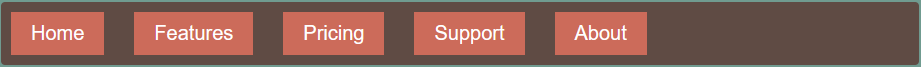

Flexbox还允许将最后的菜单项移动到右侧,

```css
.site-nav > .nav-right {
      /* 弹性盒子内的auto属性外边距会填充所有可用空间 */
      margin-left: auto;
}
```

选中最右边一个`li` 然后自动从第四个`li` 开始，从左向右剩下的位置，自动填充所有可用位置

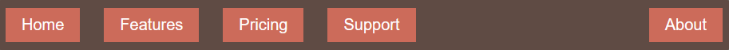

Flexbox属性提供更加强大的功能，在不使用`margin、width、height` 这些常见属性，设置达到相同的效果。其属性控制弹性子元素在主轴方向上的大小

```css
.flex {
  /* 主容器设置为弹性容器 */
  display: flex;
}

.tile {
  /* 三个板块中加上白色背景和内边距 */
  padding: 1.5em;
  background-color: #fff;
}

.flex > * + * {
  /* 去掉顶部外边距，给每个弹性容器子元素件加上间隔 */
  margin-top: 0;
  margin-left: 1.5em;
}
```

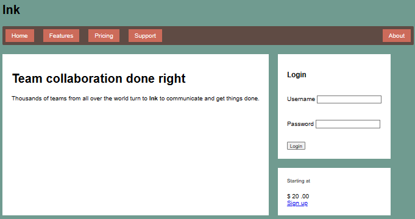

白色部分，划分为左右两个大的弹性容器，没有特别设置两列的宽度，所以是根据内容自适应的宽度。当改变内容的时候宽度是会变的。

使用flex属性给两列分别赋以2/3和1/3的宽度

```css
.column-main {
  flex: 2;
}

.column-sidebar {
  flex: 1;
}
```

flex属性是三个不同大小属性的简写：flex-grow、flex-shrink和flex-basis，其他两个均给了默认值(分别是1和0%）

###### **flex-grow、flex-shrink和flex-basis**

`flex-basis`定义了元素大小的基准值，初始值是`auto`，浏览器会检查元素是否设置了`width`属性值，如果有，那么就是`flex-basis` 的值，如果没有用元素内容自身的大小，`flex-basis`的值不是`auto, width`属性会被忽略

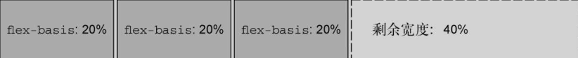

初始主尺寸确定后，可能需要在主轴方向扩大或者缩小来适应弹性容器的大小。需要flex-grow和flex-shrink来决定缩放的规则。

`flex-basis`值计算出来之后，在加上元素直接的外边距，加起来的宽度可能会填不满容器的宽度，而有留白。

多出来的留白会按照flex-grow的值分配给每个弹性子元素，如果`flex-grow`值为0，那么它的宽度不会超过`flex-basis`的值，其值越大，那么它计算后占据的留白部分就会越多

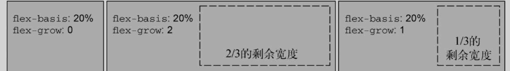

`column-sidebar` 和 `column-main` 都没有配置`flex-basis` 也没有给`width` 其值等于0，出过配置的`1.5em` 的间距，剩下安装`2:1` 均分。

###### **flex-shrink**

`flex-basis`值计算出来之后，在加上元素直接的外边距，加起来的宽度可能会超过容器的宽度。

超过的部分会按照`flex-shrink`的比例，缩小元素，直到不在溢出

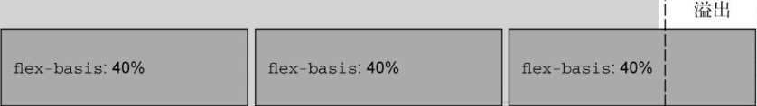

```css
.column-main {
  flex: 1 1 66.67%;
}

.column-sidebar {
  flex: 1 1 33.33%;
}
```

它们的宽度之和加上1.5em的间隔就会比容器宽度多出1.5em。然后将两列的flex-shrink设置为1，这样就会从每列的宽度减掉0.75em，这样就会从每列的宽度减掉0.75em，于是容器就能容纳两列了。

Flexbox实现的几种布局

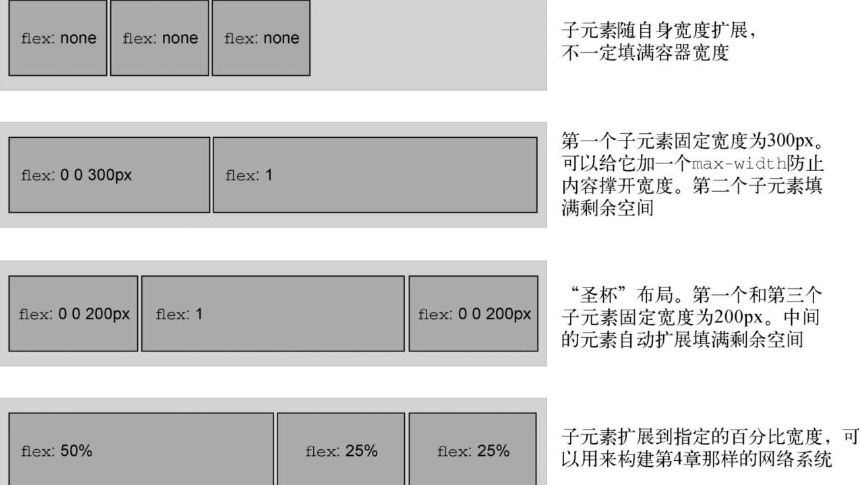

###### **弹性方向**

主副轴方向可以切换，`flex-direction`属性控制，初始值（row）控制子元素按从左到右的方向排列，可以指定为`column`控制弹性子元素沿从上到下。

`row-reverse`让元素从右到左排列，`column-reverse`让元素从下到上排列.

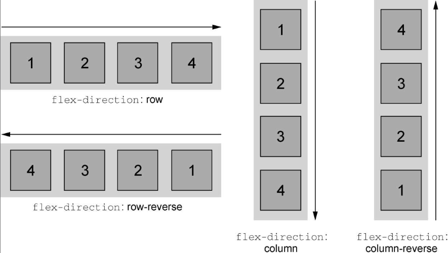

普通的块级元素本来就会这样垂直排列，使用`column`似乎是多次一举，但是却并不是，如下：

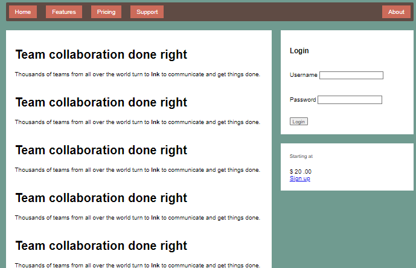

当左侧的内容过高，那么右侧显示就会和左侧不一致。实际上左右二者是登高的，但是`Div` 块结果是向上对其的，当内容不够时候，下面就空出来了。

使用`flex-direction: column` 就可以将右侧扩充。

```css
.column-sidebar {
  flex: 1;
  /* 对外而言，是弹性子元素，对内部的元素而言，是弹性容器 */
  display: flex;
  /* 内部的弹性盒子的弹性方向从上到下，*/
  flex-direction: column;
}
.column-sidebar > .tile {
  /* flex-grow=1 */
  flex: 1;
}
```

弹性容器的高度由弹性子元素决定，它们会正好填满容器，子元素的flex-grow和flex-shrink不会起作用，除非有“外力”强行改变弹性容器的高度

```css
.login-form h3 {
      margin: 0;
      font-size: .9em;
      font-weight: bold;
      text-align: right;
      /* 让文字全大写 */
      text-transform: uppercase;
    }


    /* 
      给重文本类型的输入框(不包含复选框和单选按钮)添加样式 */
    .login-form input:not([type=checkbox]):not([type=radio]) {
      /* 
          独占一行，且完全占所有宽度，一般情况下block会自动填满宽度，
          但是，input 框特殊，其宽度有size 属性决定
       */
      display: block;
      /* width: 100%; */
      margin-top: 0;
    }

    .login-form button {
      margin-top: 1em;
      border: 1px solid #cc6b5a;
      background-color: white;
      padding: .5em 1em;
      cursor: pointer;
    }
```


主要是因为<input>元素很特殊。<input>元素可以是文本和密码输入框以及很多类似的HTML5输入框，比如数字、邮箱、日期输入框。它还可以是看起来完全不一样的输入元素，即单选按钮和复选框。

not()伪类和属性选择器[type=checkbox]以及[type=radio]（参见附录A），可以选中除了复选框和单选按钮以外的所有<input>元素

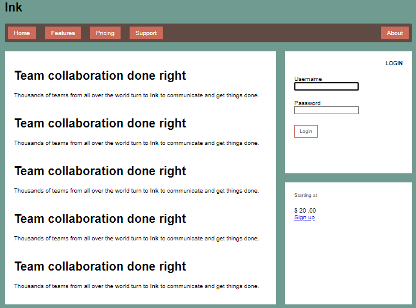


###### 弹性容器的属性

`flex-wrap:nowrap` 默认不折行，是不省略的，整体会进行弹性缩小，使得所有的内容都可以放下，并显示。除非当弹性调整到最小宽度也显示不下的时候，就会溢出，但是不会折行。

当弹性的子元素没有宽度的时候，会以内容宽度显示。

当没有指定高度的时候，就会全部完全填充容器的高度(容器设置的高度)。

但是如果容器也没有高度，那么就会安装内容填充高度

> flex 最适合去做一行一列的布局，不大适合做多行的操作，也就是它适合做一维的布局，而多行的布局(二维)使用网格最合适的。
>
> flex 最适合去做一行一列的布局，不大适合做多行的操作，也就是它适合做一维的布局(它本身是一维的)，而多行的布局(二维)使用网格最合适的
>
> 尽量不要使用flew 的折行操作去做行列的二维布局
>
> `justify-content` 还有 `space-evenly `
>
> `flex-direction: column; justify-content:center`  就可以实现垂直居中

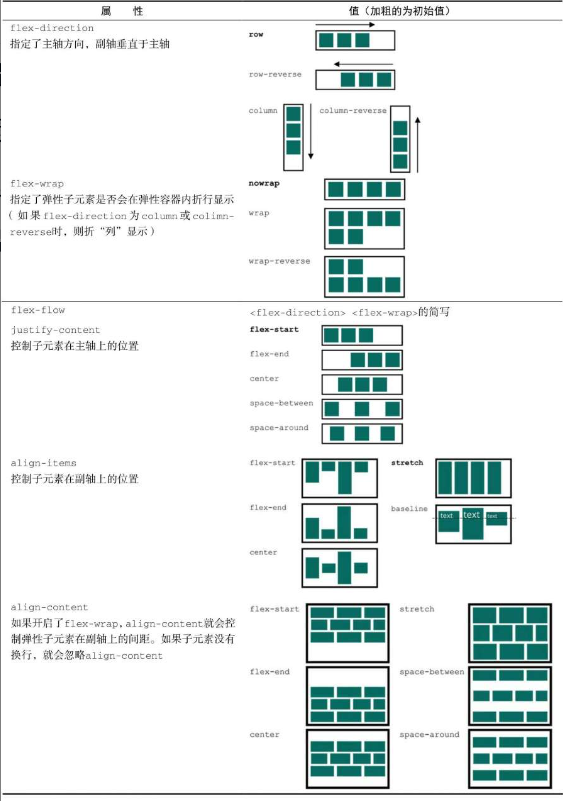

注意`align-content` 和`align-item` 的区别，前者一行就可以生效，后者需要折行后才有效果, 也就是`flex-wrap: wrap;align-content: center;`

**例子**

* 内联于块的上下左右居中布局

``align-content: center; align-item:center` 实现水平垂直居中

* 不定项居中

弹性项可能是1个可能是2个，也可能是n个，让着几个均居中对其

```css
display: flex;
justify-content: center;
align-items: flex-end;
```

* 列均分布局

一行中的元素平均占据位置

```css
display: flex;
justify-content: space-between;
align-items: flex-end;
padding:0 20px;// 左右腾出一定空间
```

* 子项分组布局

就是n个元素为一组，一组显示在右边，另外一组显示在左边或者中间什么地方

```css
.main{
  height:200px;
  background: skyblue;
  display: flex;
  /* 居中 */
  justify-content: flex-start;
  align-items: center;
}
.main div{
  width:50px;
  height:100px;
  background:pink;
  margin-right:10px;
}
.main div:nth-of-type(3){
  /* 
  右边的外边距自适应,有多少空隙就会去适应多少
  3前面是一组
  */
  margin-left: auto;
}
.main div:nth-of-type(6){
  /* 6后面是一组 */
  margin-right: auto;
}
```

---

###### 弹性子元素的属性

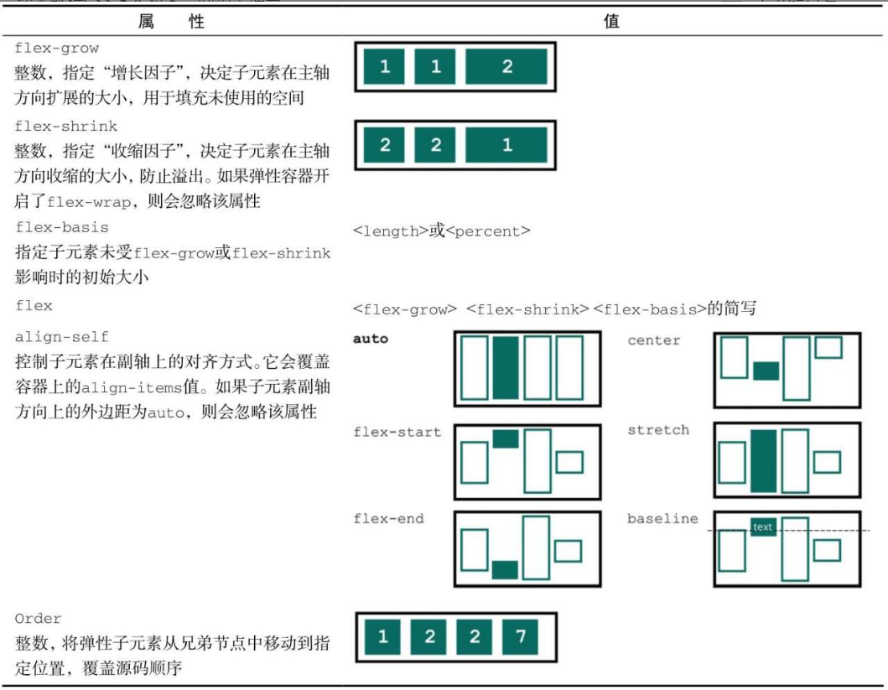

```css
// 登高样式
.main{
            width:500px;
            background:skyblue;
            display: flex;
            justify-content: space-between;
            /* 设置登高，这也是默认值，不需要设置 */
            align-items: stretch;
}

// 固定列宽 + 自适应多列布局
.main{
  height:100vh;
  background:skyblue;
  display: flex;
}
.col1{
  width:200px;
  /* flex-grow: 0.5; */
  background:pink;
}
.col2{
  flex-grow: 0.2;
  background:springgreen;
}
.col3{
  /* width:100px; */
  flex-grow: 0.8;
  background: tomato;
}

// stiky Footer 布局，粘性页脚，footer 始终在最下面，内容填充出header 和footer 剩余的部分
.main{
  min-height:100vh;
  display: flex;
  flex-direction: column;
}
.main .header{  // header 固定
  height:100px;
  background:pink;
}
.main .content{
  flex-grow: 1; // 内容填充除footer 和 header 之外的全部地方
}
.main .footer{  // footer 固定
  height:100px;
  background:skyblue;
}

// 溢出项，菜单比较常，显示不全，当进行操作的时候，显示不全的内容才会显示出来
// 例如 视频app header 中的选项[纪录片、电视剧、电影...] 显示不全，手指往后拉的时候才会将后面的内容，进入可视区
.main{
  height:100px;
  background:skyblue;
  display: flex;
  align-items: center;
}
.main div{
  width:100px;
  height:80px;
  background:pink;
  margin-right:10px;
  // 不收缩就可以实现
  flex-shrink: 0;
}
```


flex-wrap属性允许弹性子元素换到新的一行或多行显示，启用换行后，子元素不再根据flex-shrink值收缩，任何超过弹性容器的子元素都会换行显示。

如果弹性方向是column或column-reverse，那么flex-wrap会允许弹性子元素换到新的一列显示。

justify-content属性控制子元素沿主轴方向的间距

```css
.cost {
      display: flex;
      /* 控制子元素在主轴位置，均居中 */
      justify-content: center;
      /* 控制子元素在付轴位置，均居中 */
      align-items: center;
      line-height: .7em;
    }

    .cost > span {
      margin-top: 0;
    }

    .cost-currency {
      font-size: 2rem;
    }
    .cost-dollars {
      font-size: 4rem;
    }
    .cost-cents {
      font-size: 1.5em;
    }
    .cta-button {
      display: block;
      /* 背景颜色 */
      background-color: #cc6b5a;
      /* 内容颜色 */
      color: white;
      padding: .5em 1em;
      text-decoration: none;
    }
```

调整最后

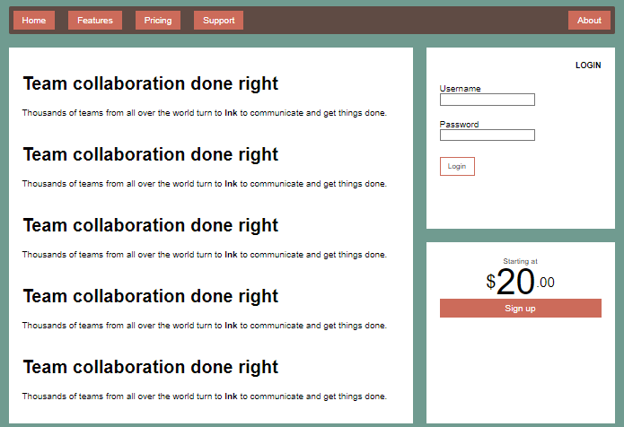

**建议**

因为如果网页很大，或者加载很慢时可能会产生奇怪的行为，对整页布局的时候使用网格布局

##### 网格

> Flex 用于一维的布局。grid 用于二维的布局

`flex` 和 网格两个规范提供了一种前所未有的全功能布局引擎。网格既可以实现基础布局，也提供了强大的功能用于实现复杂布局。

CSS**网格可以定义由行和列组成的二维布局**，然后将元素放置到网格中。有些元素可能只占据网格的一个单元，另一些元素则可能占据多行或多列。网格的大小既可以精确定义，也可以根据自身内容自动计算。

可以经过精确的计算将元素防止到网格某个位置，也可以让其在网格内自动定位，填充划分好的区域。

跟Flexbox类似，网格布局也是作用于两级的DOM结构(容器 + 容器子项)。设置为display: grid的元素成为一个网格容器（grid container）。它的子元素则变成网格元素（grid items）

```css
.main{
  width:300px;
  height:300px;
  background:skyblue;
  display: grid;
  /* grid-template-columns: 50px 50px 50px;
  grid-template-rows: 50px 50px 50px; */

  /* 20% 是说 300px 的20%, auto 自适应剩余的空间 */
  grid-template-columns: 50px 20% auto;
  grid-template-rows: 50px 50px;

  /* 去掉100px 后,剩余的空间进行等比划分 */
  /* grid-template-columns: 100px 1fr 1fr;
  grid-template-rows: 0.3fr 0.3fr 0.4fr; */
}
```


```css
<body>
  <div class="grid">
    <div class="a">a</div>
    <div class="b">b</div>
    <div class="c">c</div>
    <div class="d">d</div>
    <div class="e">e</div>
    <div class="f">f</div>
  </div>
</body>

.grid {
    /* 
      定义网格容器，容器表现的像一个块级元素，100%填充可用宽度，默认靠左上对其
      也可以定义为 inline-grid(很少使用)，元素就会在行内流动，宽度只能包含子元素
     */
    display: grid;
    /*  
      定义每列大小，fr: fraction unit
      下面定义了三列等宽
     */
    grid-template-columns: 1fr 2fr 1fr;
    /* 定义两行等高 */
    grid-template-rows: 1fr 1fr;
    grid-gap: 0.5em;
  }
```

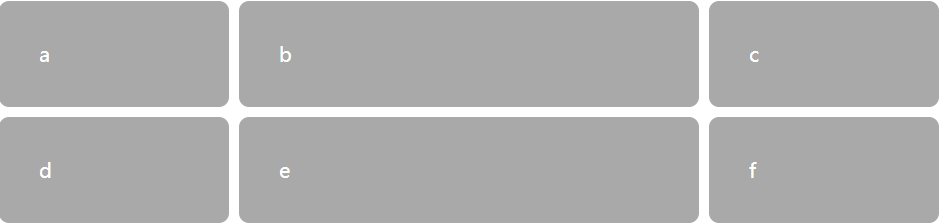

```css
grid-template-rows: 1fr 2fr;
```

第二行比第一行高2倍

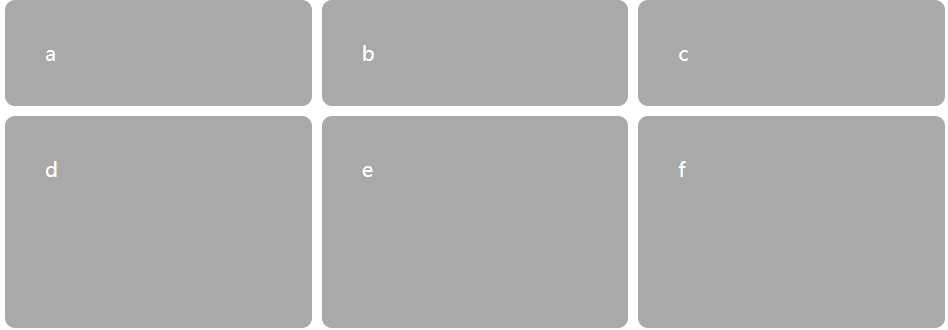

###### 网格间的距离

grid-gap属性定义了每个网格单元之间的间距。

```css
grid-row-gap: 20px;
grid-column-gap: 30px;
// 上面2个等同于下面一个
grid-gap: 20px 30px;

// row-gap=grid-row-gap
row-gap: 20px;
// column-gap = grid-column-gap
column-gap: 30px;

// row-gap column-gap 的缩写
gap:20px 30px;
```


还是之前的列子，使用网格对其进行布局。

```css
:root {
  box-sizing: border-box;
}

*,
::before,
::after {
  box-sizing: inherit;
}

body {
  background-color: #709b90;
  font-family: Helvetica, Arial, sans-serif;
}

.container {
  display: grid;
  /* 两个垂直的轨道 */
  grid-template-columns: 2fr 1fr;
  /* 4个水平轨道, 大小为 auto */
  grid-template-rows: repeat(4, auto);  
  grid-gap: 1.5em;
  max-width: 1080px;
  margin: 0 auto;
}

header,
nav {
  /* 从1号垂直网格线跨越到3号垂直网格线 */
  grid-column: 1 / 3;
  /* 刚好占据一条网格轨道 */
  grid-row: span 1;
}

.main {
  /* 从1号垂直网格线跨越到2号垂直网格线 */
  grid-column: 1 / 2;
  /* 从3号水平网格线跨越到5号垂直网格线 */
  grid-row: 3 / 5;
}

.sidebar-top {
  /* 从2号垂直网格线跨越到3号垂直网格线 */
  grid-column: 2 / 3;
  /* 从3号水平网格线跨越到4号垂直网格线 */
  grid-row: 3 / 4;
}

.sidebar-bottom {
  grid-column: 2 / 3;
  grid-row: 4 / 5;
}

.tile {
  padding: 1.5em;
  background-color: #fff;
}

.tile > :first-child {
  margin-top: 0;
}

.tile * + * {
  margin-top: 1.5em;
}
```

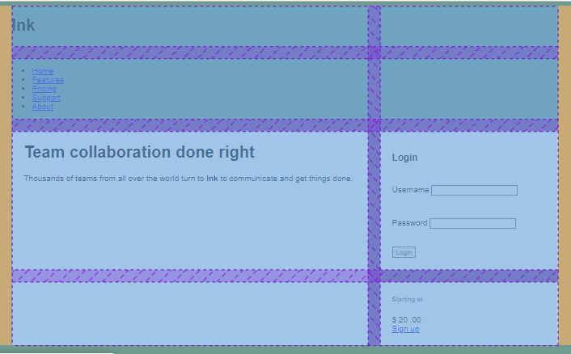

`grid-template-columns,grid-template-rows`定义了网格轨道。列的分数单位分别是2fr和1fr，所以第一列的宽度是第二列的两倍.。

定义行的时候用到了`repeat(4, auto)`函数，等价于`grid-template-rows: auto auto auto auto`，设置为auto，轨道会根据自身内容扩展，还可以这么使用

`grid-template-columns: 1fr repeat(3，3fr) 1fr`

定义好轨道之后，浏览器给网格里的每个网格线都赋予了编号，CSS用这些编号指出每个元素应该摆放的位置

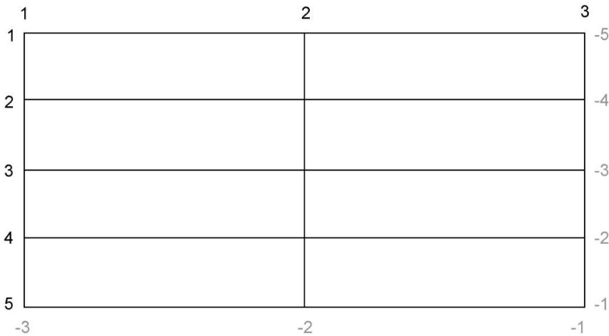

要一个网格元素在垂直方向上跨越1号网格线到3号网格线，给元素设置grid-column: 1 / 3。或者 grid-row: 3 / 5 让元素在水平方向上跨越3号网格线到5号网格线。

> grid-column是grid-column-start和grid-column-end的简写；grid-row是grid-row-start和grid-row-end的简写。斜线只在简写属性里用于区分两个值，斜线前后的空格不作要求。

span来指定grid-row和grid-column的值。这个关键字告诉浏览器元素需要占据一个网格轨道

###### **flex 和 grid 它们是互补的**

* Flexbox本质上是一维的，而网格是二维的。
* Flexbox是以内容为切入点由内向外工作的，而网格是以布局为切入点从外向内工作的

Flexbox在一个方向上对齐元素，而网格在两个方向上对齐元素，

当要求元素在两个维度上都对齐时，使用网格。当只关心一维的元素排列时，使用Flexbox。在实践中，这通常意味着**网格更适合用于整体的网页布局，而Flexbox更适合对网格区域内的特定元素布局**

在本例中，整体布局如上面代码完成，剩下的每一部分内的样式由`Flex` 完成，和上面的代码一样。

###### 网格的名称

```html
.main {
      width: 300px;
      height: 300px;
      background: skyblue;
      display: grid;
      grid-template-columns: 1fr 1fr 1fr;
      grid-template-rows: 1fr 1fr 1fr;
      grid-template-areas:
        "a1 a1 a2"
        "a1 a1 a2"
        "a3 a3 a3";
    }

    .main div {
      background: pink;
      border: 1px black solid;
      box-sizing: border-box;
    }

    .main div:nth-of-type(1) {
      grid-area: a1;
    }

    .main div:nth-of-type(2) {
      grid-area: a2;
    }

    .main div:nth-of-type(3) {
      grid-area: a3;
    }

<body>
  <div class="main">
    <div>1</div>
    <div>2</div>
    <div>3</div>
  </div>
</body>
```

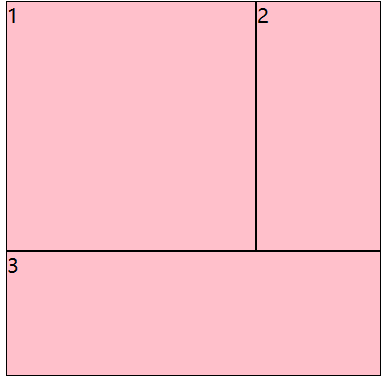

```css
.main div:nth-of-type(1){
      grid-area: a3;
}
```

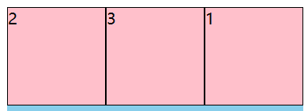

当第一个块放到第三个区域，其他两个块都会自动往前填充

###### **网格线的名称**

**替代语法**命名的网格线和命名的网格区域

声明网格轨道时，可以在中括号内写上**网格线的名称**

```css
.container {
  display: grid;
  /*  也可以多个命名
  将网格线命名为left-start和left-end，就定义了一个叫作left的区域
  */
  grid-template-columns: [left-start]2fr [left-end right-start] 1fr [right-end];
  /* 水平线命名为 row */
  grid-template-rows: repeat(4, [row]auto);
  grid-gap: 1.5em;
  max-width: 1080px;
  margin: 0 auto;
}

header,
nav {
  /* 从1号垂直网格线跨越到3号垂直网格线 */
  grid-column: left-start / right-end;
  grid-row: span 1;
}

.main {
  /* left-start 到 left-right区域 */
  grid-column: left;
  /* 从第3水平网格线，跨越2个轨道 */
  grid-row: row 3 / span 2;
}

.sidebar-top {
  grid-column: right;
  grid-row: 3 / 4;
}

.sidebar-bottom {
  grid-column: right;
  grid-row: 4 / 5;
}
```

每两个网格列为一组，在每组的两个网格轨道之前命名一条网格线

`grid-template-columns: repeat(3, [col] 1fr 1fr)`

然后就可以借助命名的网格线将一个元素定位到第二组网格列上

`grid-column: col 2 /span 2`

还可以**命名网格区域**，直接用命名的网格区域将元素定位到网格中。

```css
.container {
  display: grid;
  /* 每一个字符串代表网格的一行，字符串内用空格区分每一列 */
  grid-template-areas: "title title" "nav nav" "main aside1" "main aside2";
  grid-template-columns: 2fr 1fr;
  /* 水平线命名为 row */
  grid-template-rows: repeat(4,auto);
  grid-gap: 1.5em;
  max-width: 1080px;
  margin: 0 auto;
}

header {
  grid-area: title;
}

nav {
  grid-area: nav;
}

.main {
  grid-area: main;
}

.sidebar-top {
  grid-area: aside1;
}

.sidebar-bottom {
  grid-area: aside2;
}
```

###### 网格以及其中元素的对其方式

网格中有2中 对其的方式   

1. 网格整体在网格容器中的对其方式，是统一在网格上的配置

   使用该方式的前提是网格没有占据网格所有的空间，如果占据了网格容器所有的空间，那么是不生效的

   ```css
   /* 水平方向: center,start,end space-around,space-evenly, space-between */
   justify-content: space-evenly;
   /* 垂直方向: center,start,end space-around,space-evenly, space-between */
   align-content: end;
   /* place-content 上面两个的缩写 */
   /* place-content: space-evenly end; */
   ```

2. 网格元素在所在的网格中的对其方式，是统一在网格上的配置

   ```css
   /* 网格中子项的水平对其方式可选有 end、start center */
   justify-items: center;
   /* 网格中子项的垂直对其方式可选有 end、start center */
   align-items: center;
   /* place-items 上面连个的简写*/
   ```

3. 单独控制一个子项在一个网格中的位置。是单独配置在子项中的

   ```css
   /* 水平 */ 
   justify-self: end;
   /* 垂直 */ 
   align-self: end;
   ```

   

```html
<div class="main">
        <div>1</div>
        <div>2</div>
        <div>3</div>
        <div>4</div>
        <div>5</div>
        <div>6</div>
        <div>7</div>
        <div>8</div>
        <div>9</div>
</div>

.main{
  width:300px;
  height:300px;
  background:skyblue;
  display: grid;
  grid-template-columns: 100px 100px 100px;
  grid-template-rows: 100px 100px 100px;
}
.main div{
  //  不写尺寸大小
	background:pink;
}
```

默认会将网格填充满是因为，网格中的子项自适应填充全部可用空间

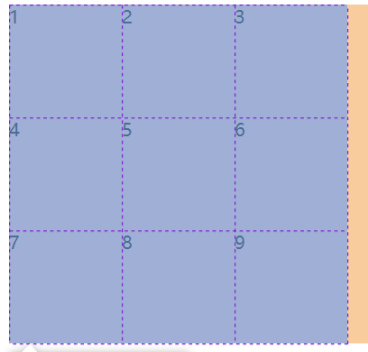

当设置子项的大小

```css
.main div{
  width:50px;
  height:50px;
  background:pink;
}
```

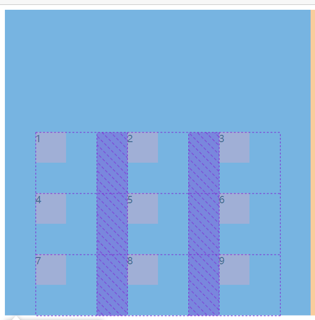

网格的大小使不会发生改变，子项默认网左上角，此时可以改变子项在网格中的对其方式

```css
.main{
  width:300px;
  height:300px;
  background:skyblue;
  display: grid;
  /* 三条垂直水平网格线，刚好平分main容器(容器大小使300*300，每个网格块100) */
  grid-template-columns: 100px 100px 100px;
  grid-template-rows: 100px 100px 100px;
  /* 网格中子项的水平对其方式可选有 end、start center */
  justify-items: center;
  /* 网格中子项的垂直对其方式可选有 end、start center */
  align-items: center;
  /* place-items 上面连个的简写*/
}

/* 和上面一样的效果*/
.main{
            width:300px;
            height:300px;
            background:skyblue;
            display: grid;
            grid-template-columns: 100px 100px 100px;
            grid-template-rows: 100px 100px 100px;
            /* justify-items 和 align-items的缩小*/
            place-items: center center;
}
```

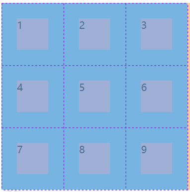


网格整体在容器中的对其方式

```css
.main {
  width: 500px;
  height: 500px;
  background: skyblue;
  display: grid;
  /*网格整体没有完全占据容器，所以可以设置网格在容器中的整体位置*/
  grid-template-columns: 100px 100px 100px;
  grid-template-rows: 100px 100px 100px;
  /* 水平方向: center,start,end space-around,space-evenly, space-between */
  justify-content: space-evenly;
  /* 垂直方向: center,start,end space-around,space-evenly, space-between */
  align-content: end;
  /* place-content 上面两个的缩写 */
  /* place-content: space-evenly end; */
}
```


###### 基于网格线的元素放置

```css
.main{
            width:300px;
            height:300px;
            background:skyblue;
            display: grid;
            grid-template-columns: 1fr 1fr 1fr;
            grid-template-rows: 1fr 1fr 1fr;
        }
/* 第一个粉色的元素,放在中间的网格位置 */
.main div:nth-of-type(1){
            background:pink;
            /* 水平方向起始网格线 */
            grid-column-start: 2;
            /* 水平方向终止网格线 */
            grid-column-end: 3;
            /* 
              默认值是：auto ,接下来的元素会根在后面, 也就是第二个元素视会更在这个元素后面你的
              但是如果设置了值,接下来的元素会自适应找可用网格,如果在这个元素之前能找到可用网格
              那么就会填充在前面,而不是后面
            */
            /* 垂直方向起始网格线 */
            grid-row-start: 2;
            /* 垂直方向终止网格线,垂直方向占3个网格位置  */
            grid-row-end: 4;
        }
        .main div:nth-of-type(2){
            background:slategray;
}

<div class="main">
        <div>1</div>
        <div>2</div>
</div>
```

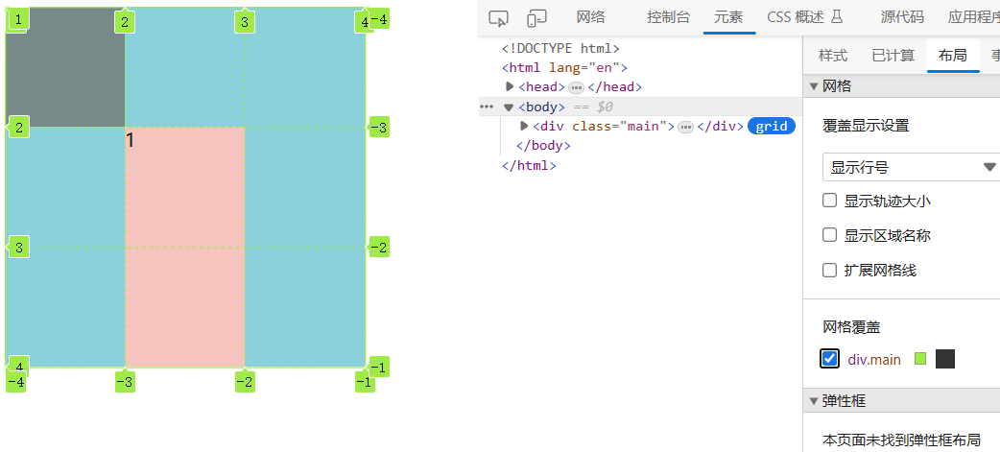

如下，设置浏览器，可以看到网格线的编号

```css
.main{
            width:300px;
            height:300px;
            background:skyblue;
            display: grid;
            grid-template-columns: 1fr 1fr 1fr;
            grid-template-rows: 1fr 1fr 1fr;
        }
        
        .main div:nth-of-type(1){
            background:pink;
            /* 从第二列开始，跨越2列 */
            grid-column-start: 2;
            /* 不在表示位置*/                                                                      
            grid-column-end: span 2; 
        }
        .main div:nth-of-type(2){
            background:slategray;
}

<div class="main">
        <div>1</div>
        <div>2</div>
</div>
```

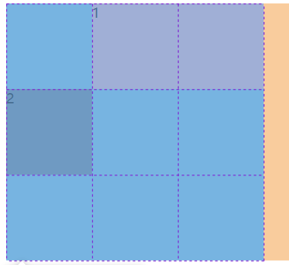

 网格线默认有数字命名，可以自定义命名

```css
.main{
            width:300px;
            height:300px;
            background:skyblue;
            display: grid;
            grid-template-columns:[col1] 1fr [col2] 1fr [col3] 1fr [col4];
            grid-template-rows:[row1] 1fr [row2] 1fr [row3] 1fr [row4];
        }
        .main div:nth-of-type(1){
            width:50px;
            height:50px;
            background:pink;
            grid-column-start: col2;
            grid-column-end: col4;
}
// 这里没有扩充到col4，是因为设置了宽和高，去掉这俩个配置，就获扩到col4

 /* grid-column-start 和 grid-column-end 的简写 */
grid-column: 2 / 3;
 /* grid-row-start 和 grid-row-end 的简写 */
grid-row: 2 / 4;

/* 
 grid-area 是一种对于 grid-row-start、grid-column-start、grid-row-end 和 grid-column-end
*/
grid-area: 2 / 2 / 3 / 3;
```

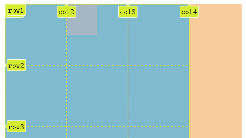


子项的对其方式

###### 其他方法

* `repeat ` 方法

```css
.main{
            height:400px;
            background:skyblue;
            display: grid;
            /* grid-template-columns: 100px 100px 100px; */
            /* grid-template-columns: repeat(3, 100px); */
            /* grid-template-columns: 150px 100px 100px; */
            /* grid-template-columns: 150px repeat(2, 100px); */
            /* 自动的,根据容器大小, 网格宽度,计算产生多少个网格 */
            grid-template-columns: repeat(auto-fill, 100px);
            grid-template-rows: 100px;
}
```

* `minmax `

```css
.main{
            height:400px;
            background:skyblue;
            display: grid;
  /* 中间的网格，填充所有的剩余空间*/
            /* grid-template-columns: 100px 1fr 100px; */
  /* 中间的网格，填充所有的剩余空间，但是不能小于100px， 最大值自适应调整*/
            grid-template-columns: 100px minmax(100px, 1fr) 100px;
            grid-template-rows: 100px;
}
```

###### 布局

* 替换定位实现叠加布局

```css
.main{
  width: 530px;
  height: 300px;
  background:skyblue;
  display: grid;
}
/*网格默认宽度全部自适应拉升到网格容器*/
.main img{
  /*一个网格占据全部空间，显示在这个网格中*/
  grid-area: 1/1/1/1;
}
.main span{
  /*一个网格占据全部空间，显示在这个网格中*/
  grid-area: 1/1/1/1;
  justify-self: end;
  align-self: end;
  margin:5px;
}
.main p{
  /*一个网格占据全部空间，显示在这个网格中*/
  grid-area: 1/1/1/1;
  align-self: center;
  margin:0;
  padding:0;
  background:rgba(0,0,0,0.5);
  height:30px;
  line-height: 30px;
  color:white;
}
```

* 多种组合排列布局

有得元素会占据多行多列

```css
.main{
  width:300px;
  height:300px;
  background:skyblue;
  display: grid;
  grid-template-columns: repeat(3,1fr);
  grid-template-rows: repeat(3,1fr);
  gap:5px;
}
.main div{
  background:pink;
}
.main div:nth-of-type(1){
  grid-area: 3/1/4/3;
  /* 
  下面的内容等于
  grid-row: 1 span 2
  grid-column: 1 span 2
  第一个和第三个是一组，第二个和第4个是一组
  */
  grid-area: 1/1/span 2/span 2;
}
```

* 栅格布局

```html
<div class="row">
  <div class="col-6">1</div>
  <div class="col-3">2</div>
  <div class="col-4">3</div>
  <div class="col-5">4</div>
</div>

.row{
background:skyblue;
display: grid;
grid-template-columns: repeat(12, 1fr);
grid-template-rows: 50px;
/* 隐式网格也设置 */
grid-auto-rows: 50px;
}
.row div{
background:pink;
border:1px black solid;
}
.row .col-1{
/* 这里不写死值，是因为如果写死，那么后面的子项会按照空隙去方
例如 col-1前面有足够的空隙，那么col-1后面的内容会方到 col-1前面去
而在分12个列栅栏的时候，我们是希望每个栅栏之前都是顺序依次往后的
*/
grid-area: auto/auto/auto/span 1;
}
.row .col-2{
grid-area: auto/auto/auto/span 2;
}
.row .col-3{
grid-area: auto/auto/auto/span 3;
}
.row .col-4{
grid-area: auto/auto/auto/span 4;
}
.row .col-5{
grid-area: auto/auto/auto/span 5;
}
.row .col-6{
grid-area: auto/auto/auto/span 6;
}
.row .col-7{
grid-area: auto/auto/auto/span 7;
}
.row .col-8{
grid-area: auto/auto/auto/span 8;
}
.row .col-9{
grid-area: auto/auto/auto/span 9;
}
.row .col-10{
grid-area: auto/auto/auto/span 10;
}
.row .col-11{
grid-area: auto/auto/auto/span 11;
}
.row .col-12{
grid-area: auto/auto/auto/span 12;
}
```

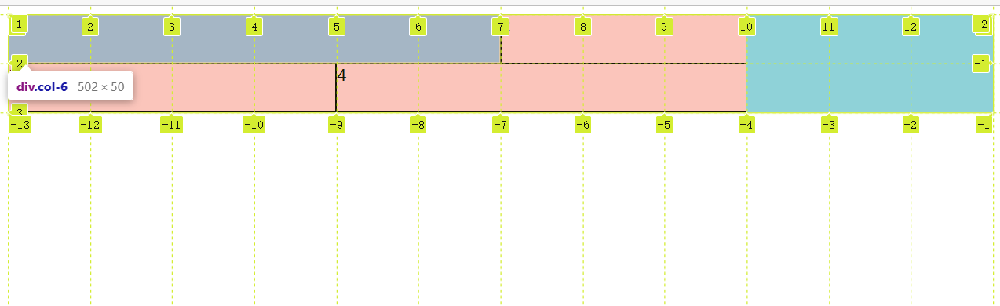

* 容器自适应行列


一般一个网页会划分为 12 个列格子，上部分分为24列格子

在元素之上在显示内容

###### **布局算法来放置网格元素**

使用grid-template-＊属性定义网格轨道时，创建的是显式网格。还有隐式网格（implicit grid），会会自动创建隐式轨道以扩展网格，解决处理大量的网格元素时，不清楚该把元素放在网格的哪个位置上。

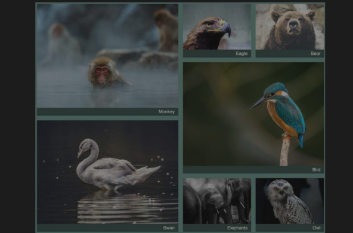

r如山图，使用`flex` 是很难实现的。使用隐式格子来实现

```css
/* 网格容器 */
.portfolio {
  display: grid;
  /* auto-fill 只要网格放得下，浏览器就会尽可能多地生成轨道，并且不会跟指定最大最小冲突
  minmax(minVal, maxVal) 确保网格轨道的大小介于这两者之间
  auto-fill和minmax(200px, 1fr)加在一起，就会让网格在可用的空间内尽可能多地产生网格列，并且每个列的宽度不会小于200px
  */
  grid-template-columns: repeat(auto-fill, minmax(200px, 1fr));
  /* 隐式网格行指定一个1fr大小,每行拥有相同的高度 */
  grid-auto-rows: 1fr;
  grid-gap: 1em;
}
```

网格元素不够填满所有网格轨道，`auto-fill`就会导致一些空的网格轨道。如果不希望出现空的网格轨道，可以使用`auto-fit`关键字代替`auto-fill`。它会让非空的网格轨道扩展，填满可用空间

现在每个网格元素都占据了1×1的区域，将特定图片的尺寸增加到2×2的网格区域

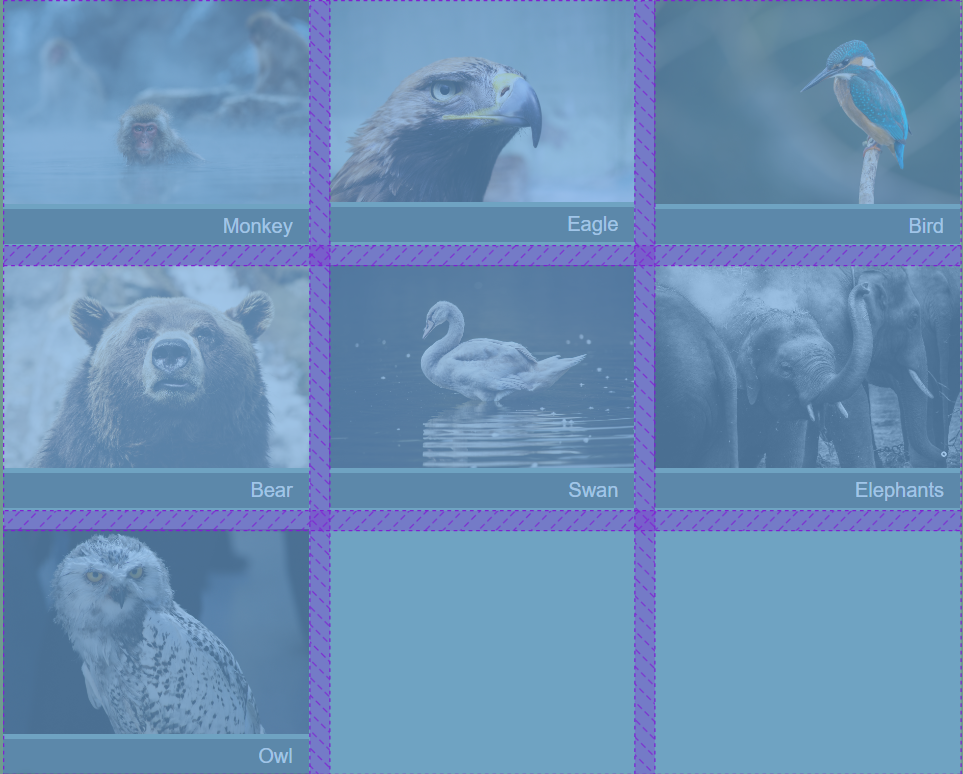

```css
.portfolio .featured {
  /* 特定图片放大，水平和垂直方向各占据两个网格轨道 */
  grid-row: span 2;
  grid-column: span 2;
}
```

默认情况下，布局算法会按元素在标记中的顺序将其逐列逐行摆放。当一个元素无法在某一行容纳（也就是说该元素占据了太多网格轨道）时，算法会将它移动到下一行，寻找足够大的空间容纳它

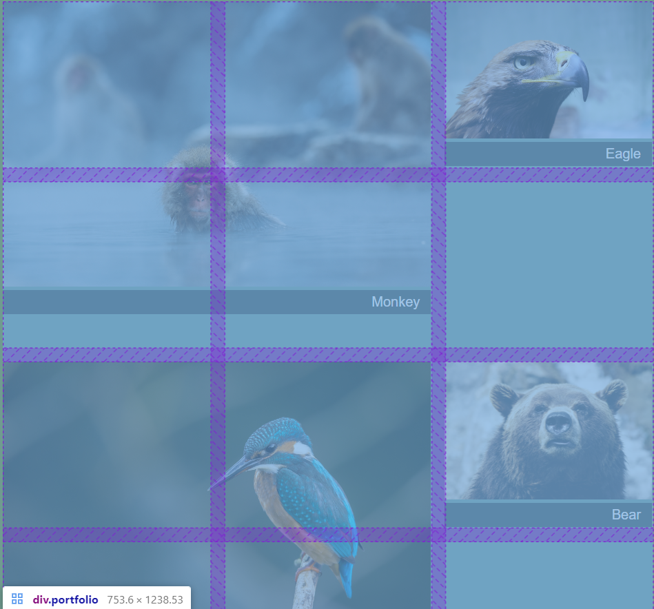

鸟被挪到了第二行.

另一个属性grid-auto-flow，它可以控制布局算法的行为。它的初始值是row，上一段描述的就是这个值的行为。如果值为column，它就会将元素优先放在网格列中，只有当一列填满了，才会移动到下一行.

还可以额外加一个关键字dense（比如，grid-auto-flow: column dense）。它让算法紧凑地填满网格里的空白(小网格元素会填满大的元素造成的空白区域)

每个网格元素都会扩展并填满整个网格区域，但是子元素不会，因此网格区域出现了多余的高度。一个简单的解决办法是用Flexbox

object-fit。默认情况下，一个的object-fit属性值为fill，也就是说整个图片会缩放，以填满元素，其属性的值还可以：

❑ cover：扩展图片，让它填满盒子（导致图片一部分被裁剪）。

❑ contain：缩放图片，让它完整地填充盒子（导致盒子里出现空白）

```css
/* 网格元素 */
    .portfolio > figure {
      display: flex;
      /* 每个网格元素都垂直的 flexbox */
      flex-direction: column;
      margin: 0;
      
    }

    .portfolio img {
      /* 弹性拉伸，让图片填充弹性容器可用空间 */
      flex: 1;
      /* 渲染图片填充盒子并且不拉伸，而是裁掉边缘 */
      object-fit: cover;
      max-width: 100%;
    }
```

**其他属性**

三个对齐属性：align-content、align-items、align-self。这些属性控制网格元素在垂直方向上的位置

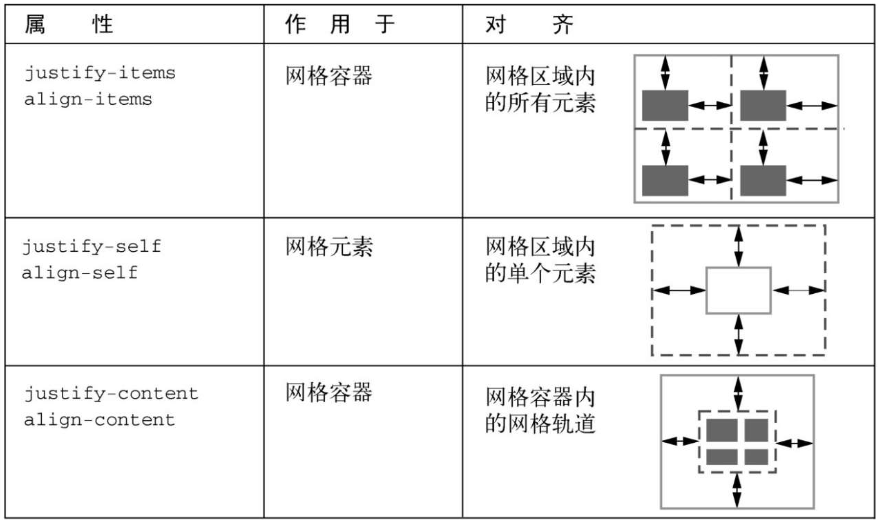

justify-content和align-content设置网格容器内的网格轨道在水平方向和垂直方向上的位置

[Grid by Example]([Grid by Example](https://gridbyexample.com/) )

> 网格布局的内容非常多，所以我所介绍的都是网格里面必须掌握的核心概念。建议你对网格做更多试验。网格有很多种组合方式


##### 定位

