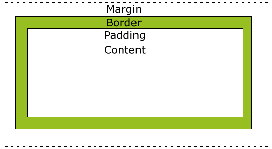
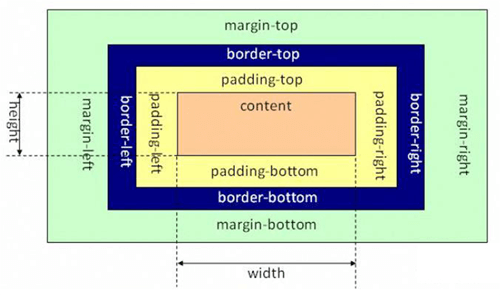
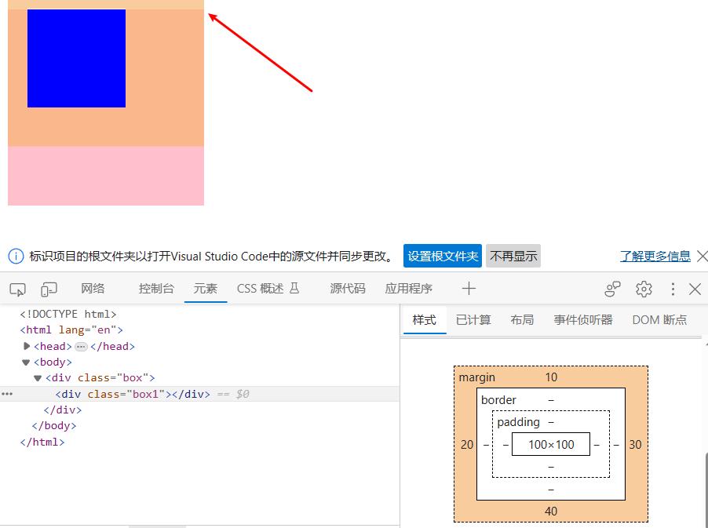
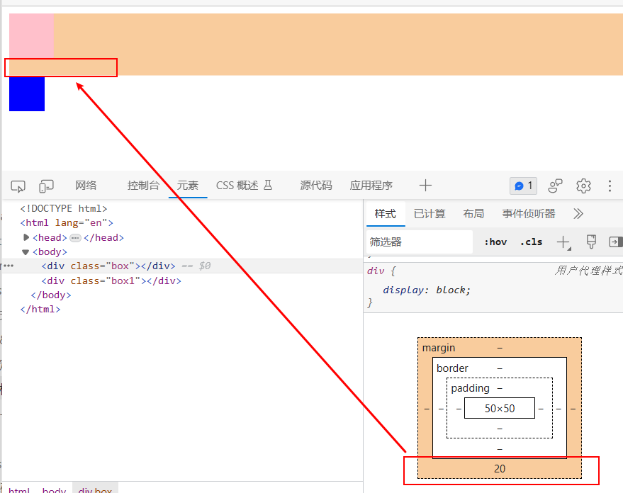

所有`HTML`元素可以看作盒子，在`CSS`中，`box model`这一术语是用来设计和布局时使用。

`CSS`盒模型本质上是一个盒子，封装周围的`HTML`元素，它包括：边距，边框，填充，和实际内容。

盒模型允许我们在其它元素和周围元素边框之间的空间放置元素。

- **Margin(外边距)** - 清除边框外的区域，**外边距是透明的。**
- **Border(边框)** - 围绕在内边距和内容外的边框。**盒子**
- **Padding(内边距)** - 清除内容周围的区域，内边距是透明的。**内容和盒子的距离**
- **Content(内容)** - 盒子的内容，显示文本和图像。**内容**

---



##### 内容区content

> 内容区是CSS盒子模型的中心，它呈现了盒子的**主要信息内容**，这些内容可以是文本、图片等多种类型。内容区是盒子模型必备的组成部分，其他的3部分都是可选的。

内容区有3个属性：**width**、**height**和**overflow**。使用width和height属性可以指定盒子内容区的高度和宽度。在这里注意一点，width和height这两个属性是针对内容区而言，并不包括padding部分。

##### 内边距padding

> 内边距，指的是内容区和边框之间的空间，可以被看做是内容区的背景区域。

关于内边距的属性有5种，即**padding-top、padding-bottom、padding-left、padding-righ**t以及综合了以上4个方向的简洁内边距属性padding。使用这5种属性可以指定内容区域各方向边框之间的距离

* padding的简洁写法有3种，分别如下：

1. padding:像素值;

> 表示四个方向的内边距都是20px；

1.  padding:像素值1 像素值2; 

> 表示padding-top和padding-bottom为20px，padding-right和padding-left为40px。

1. padding:像素值1 像素值2 像素值3 像素值4;

> padding-top为20px，padding-right为40px，padding-bottom为60px，padding-left为80px。(可按照顺时针方向记忆)

**padding值不能为负值**

##### 边框border

在CSS盒子模型中，边框跟我们之前学过的边框是一样的。

边框属性有**border-width、border-style、border-color**以及综合了3类属性的快捷边框属性border。

其中**border-width**指定边框的宽度，border-style指定边框类型，**border-color**指定边框的颜色。

> border-width:1px;
>
> border-style:solid;
>
> border-color:gray;
>
> border-radius: 50%; // 图像加圆圈

等同于

> border:1px solid gray;

#####  外边距margin

外边距，指的是两个盒子之间的距离，它可能是子元素与父元素之间的距离，也可能是兄弟元素之间的距离。

外边距的属性也有5种，即**margin-top、margin-bottom、margin-left、margin-right**以及综合了以上4个方向的简洁内边距属性margin。

同时，`CSS`允许给外边距属性指定负数值，当指定负外边距值时，整个盒子将向指定负值的相反方向移动，以此可以产生盒子的重叠效果。

与`padding`类似，`margin`简洁写法有3种，分别如下：

> margin:像素值;
>
> margin:像素值1 像素值2;
>
> margin:像素值1 像素值2 像素值3 像素值4;

例子

> `margin:20px;`表示四个方向的外边距都是20px；
>
> `margin:20px 40px;`表示margin-top和margin-bottom为20px，margin-right和margin-left为40px。
>
> `margin:20px 40px 60px 80px;`表示margin-top为20px，margin-right为40px，margin-bottom为60px，margin-left为80px。

padding是在元素内部，而margin是在元素外部。margin看起来不属于div元素的一部分，实际上div元素的盒子模型是包含margin的

**margin值可以为负值，为负值的时候会和周围的盒子发生重叠**，如marging-top：-10px，等于说盒子向上平移10px

##### 问题

**margin-top 的穿透现象**

```html 
<div class="box">
     <div class="box1"></div>
</div>

<style>
     .box {
       height: 200px;
       width: 200px;
       background: pink;
     }

     .box1 {
       height: 100px;
       width: 100px;
       background: blue;
       margin-top: 10px;
       margin-left: 20px;
       margin-right: 30px;
       margin-bottom: 40px;  
     }
</style>
```



如图，box1的`margin-top=10px` 同时会将父盒子box也向下拉了10px，其他三个margin值没有这个问题。

解决：

1. 不用margin 使用 padding
2. 不用margin 使用边框(加粗并变透明)
3. 使用BFC 格式化上下文
4. 弹性和网格布局没有这个问题


**marging-top 和 bottom叠加问题**



```css
<style>
     .box {
       height: 50px;
       width: 50px;
       background: pink;
       margin-bottom: 20px;
     }

     .box1 {
       height: 40px;
       width: 40px;
       background: blue;
       margin-top: 10px;       
     }
</style>

<body>
   <div class="box"></div>
   <div class="box1"></div>
 </body>
```

如上，box marging-botton=20px，box1 marging-top=10px，理论上二者外边距应该距离30px，但是并没有，而是叠加了，以最大值为准。

左右是没有这个问题的，会累加

解决

1. BFC 处理
2. 使用弹性和网格解决

##### block 块和inline-box行内(内联)盒子

* 块盒子：`dvi、p、h1`.

独占一行，后面的盒子换行，

* 内联：`span、a、strong`

盒子不会换行，width 和 heigh属性不支持，marging 以及 pading 也无作用。宽高由内容支持。所占的区域也不一定是矩形，内容超过浏览器的宽度后会换行到第二行。**一般作为语义修饰标签**

**所以在布局的时候基本都会使用块元素布局。**

display：'block/inline' 表明是块还是内联盒子


##### 自适应盒模型特性

当盒子不设置宽度的时候，对各种属性的处理方式，当子盒子宽度不写的时候，子盒子的内容+padding+marging 完全填充父宽度，其中内容会进行自适应跳转，例如padding 变大，那么内容就会变小。


##### 怪异盒模型

正常盒模型

```html
<div class="box1">内容内容</div>

.box1 {
       width: 100px;
       height: 100px;
       background: blue;   
       padding: 10px;
       border: 10px solid black;
       margin: 10px;
}
```

如上，那么盒子的大小就是 `(100px + 10px+10px+10px) * (100px + 10px+10px+10px)`

```css
.box1 {
     ...
     box-sizing: border-box;
}
```

增加如上样式，就变为了一个异常盒模型，对外的整体表现就是 100px * 100px

增加padding 以及 border 会挤压content 的大小。

box-sizing 可以取值：

* `content-box`: width 和 height 只由`content` 决定
* `border-box`: width 和 height 只由`content+padding+border` 决定（用的比较多）


