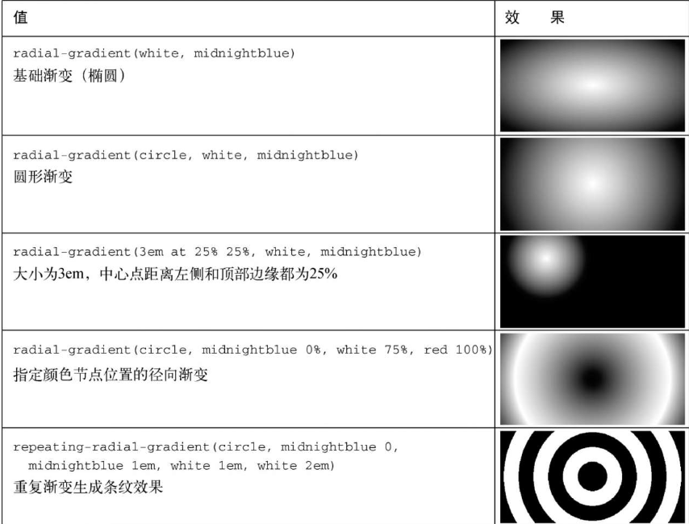

对细节的处理

#### 背景、阴影、混合

background属性依然还有很多的功能等待我们去探索。实际上，它是以下八个属性的简写。

1. background-image——指定一个文件或者生成的颜色渐变作为背景图片
2. background-position——设置背景图片的初始位置
3. background-size——指定元素内背景图片的渲染尺寸
4. background-repeat——决定在需要填充整个元素时，是否平铺图片
5. background-origin——决定背景相对于元素的边框盒、内边距框盒（初始值）或内容盒子来定位
6. background-clip——指定背景是否应该填充边框盒（初始值）、内边距框盒或内容盒子
7. background-color——指定纯色背景，渲染到背景图片下方
8. background-attachment——指定背景图片是随着元素上下滚动（初始值），还是固定在视口区域

##### 渐变

```css
background-image: linear-gradient(to right, white, blue);
```

to right，从左向右，右白色变为蓝色。当然也可以使用to top或者to bottom。甚至可以指定某个对角，比如to bottom right。

还可以写角度`90deg `,

```css
background-image: linear-gradient(90deg, red, white, blue);
```

最左侧（0%）从红色开始，过渡到中间（50%）的白色，到最右侧的蓝色（100%）。

##### 条纹

渐变会直接从一个颜色变换到另一个，而不是平滑过渡。

```css
background-image: linear-gradient(90deg, red 40%, white 40%, white 60%, blue 60%);
```

因为第一个颜色节点是红色，在40%的位置，所以渐变从左侧边缘一直到40%是纯红色；因为第二个颜色节点是白色，也是在40%的位置，所以渐变在这里直接变成了白色；接下来因为在60%的位置，还有一个白色的颜色节点，所以40%到60%之间的渐变是纯白色；最后一个颜色节点是蓝色，也是在60%的位置。

##### 重复渐变

repeating-linear-gradient()。此函数和函数linear-gradient的效果基本相同，唯一的区别就是前者会重复(类似于理发店门口的旋转招牌)

##### 径向渐变

外到内变色

```css
background-image: radial-gradient(white, blue);
```

渐变从中心开始，平滑到边缘，中心白色过渡到边缘的蓝色



##### 阴影

可以为网页增加立体感的特效，`box-shadow`可以为元素盒子生成阴影，`text-shadow`可以为渲染后的文字生成阴影

```css
box-shadow: 1em 1em black;
```

表示元素的阴影会先水平偏移`1em， 然后垂直偏移`1em`, 阴影的颜色是黑色，默认情况阴影和元素的尺寸是一样的。

元素设置了border-radius，那么阴影相应地也会有圆角

完整全部值

```css
box-shadow: 0.1em 0.1em    0.5em     0.5em    #124;
/*          水平+垂直偏移   模糊半径   扩展半径  模糊颜色*/
```

：active伪类来创建另一种阴影效果

```css
<style type="text/css">
.button {
  padding: 1em;
  border: 0;
  font-size: 0.8rem;
  color: white;
  border-radius: 0.5em;
  background-image: linear-gradient(to bottom, #57b, #148);
  box-shadow: 0.1em 0.1em 0.5em 0.5em #124;
}

.button:active {
  box-shadow: inset 0 0 0.5em #124, 
              inset 0 0.5em 1em rgba(0, 0, 0, 0.4);
}
</style>
<button class="button">Sign up now</button>
```

`inset`关键字，用来替换之前的盒阴影。这样就可以使阴影出现在元素边框的内部，而非之前的外部。

增加多个缩影，第一个内阴影偏移量为0，轻微模糊。这在元素的边缘内添加了一个阴影环。第二个内阴影在垂直方向有一点偏移。

**扁平化设计讲究色彩明快统一、外观简洁明了，这就意味着尽量少使用渐变、阴影和圆角。**

##### 混合模式

混合模式就是在使用多个背景图片时，第二张图片也可以透视显示。

```html
  <style type="text/css">
.blend {
    min-height: 400px;
    background-image: url(images/bear.jpg), 
                                          url(images/bear.jpg);
    background-size: cover;
    background-repeat: no-repeat;
    background-position: -30vw, 30vw; // 图片不同的初始位置
    background-blend-mode: multiply; // 混合模式
}
</style>
</head>
<body>
  <div class="blend"></div>
</body>
```

`background-blend-mode`不仅仅合并多个背景图片，还会合并`background-color`。所有这些叠放的图层，最终都会被混合模式拼合在一起，因此我们可以把背景颜色设置为想要的色相。CSS支持15种混合模式，也就是`background-blend-mode` 可以取到15个值。

可以为图片添加纹理。这种类型的效果可以通过对比混合模式overlay、hard-light或soft-light来实现

```css
.blend {
  background-image: url("images/bear.jpg");
  background-size: cover;
  background-position: center;
  padding: 15em 0 1em;
}

.blend > h1 {
  margin: 0;
  font-family: Helvetica, Arial, sans-serif;
  font-size: 6rem;
  text-align: center;
  mix-blend-mode: hard-light;
  background-color: #c33;
  color: #808080;
  border: 0.1em solid #ccc;
  border-width: 0.1em 0;
}
  </style>
</head>
<body>
  <div class="blend">
    <h1>Ursa Major</h1> // 字体加到图片中
  </div>
</body>


.blend {
  min-height: 400px;
  background-image: url("images/scratches.png"), url("images/bear.jpg");
  background-size: 200px, cover;
  background-repeat: repeat, no-repeat;
  background-position: center center;
  background-blend-mode: soft-light;
}
  </style>
</head>
<body>
  <div class="blend"></div>
</body>
```

##### 过渡

元素可以淡出、菜单可以滑入、颜色可以从一种变为另一种，实现这些效果最简单的方式是过渡（transitions）。

过渡是通过一系列transition-＊属性来实现的

