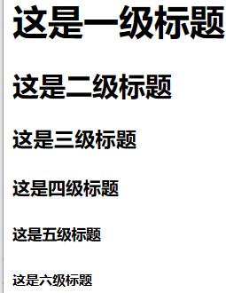
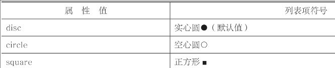

前端开发来说，最核心的三个技术分别是：HTML、CSS和JavaScript，也叫“新三剑客”：

* HTML，全称Hyper Text Markup Language（超文本标记语言）
* CSS，全称Cascading Style Sheet（层叠样式表）
* JavaScript(JS)，是一种嵌入到HTML页面中的脚本语言，由浏览器一边解释一边执行

> JavaScript，就是我们通常所说的JS，是一种嵌入到HTML页面中的脚本语言，由浏览器一边解释一边执行


### 基本标签

#### HTML结构

```html
<!DOCTYPE html>
<html lang="en">
<head>
  <meta charset="UTF-8">
  <meta http-equiv="X-UA-Compatible" content="IE=edge">
  <meta name="viewport" content="width=device-width, initial-scale=1.0">
  <title>Document</title>
</head>
<body>
</body>
</html>
```


一个文档声明：`<!DOCTYPE html>`，表示这是一个 `html` 页面

一个html标签对：`<html></html>`

一个head标签对：`<head></head>`网页的“头部”，用于定义一些特殊的内容，如页面标题、定时刷新、外部文件等

一个body标签对：`<body></body>` 网页的“身体”。对于一个网页来说，大部分代码都是在这个标签对内部编写的


##### `<p></p>`

段落标签，用于定义一段文字

##### `<head></head>`

只有一些特殊的标签才能放在head标签内，其他大部分标签都是放在body标签内的，一般来说，只有6个标签能放在head标签内。title标签meta标签link标签style标签script标签base标签

* `<title></title>`

标签内定义的内容是页面的标题。这个标题不是文章的标题，而是在浏览器栏目中显示的那个标题

* `<meta> `

用于定义页面的特殊信息，例如页面关键字、页面描述等。这些信息不是提供给人看的，而是提供给搜索引擎看的，HTML中，meta标签有两个重要的属性：name和http-equiv

name

```html
<!DOCTYPE html>
<html>
<head>
    <!--网页关键字-->
    <meta name="keywords" content="绿叶学习网,前端开发,后端开发"/>
    <!--网页描述-->
    <meta name="description" content="绿叶学习网是一个最富有活力的Web技术学习网站"/>
    <!--本页作者-->
    <meta name="author" content="helicopter">
    <!--版权声明-->
    <meta name="copyright" content="本站所有教程均为原创，版权所有，禁止转载。否则必将追究法律责任。"/>
</head>
<body>
</body>
</html>
```

http-equiv

定义网页所使用的编码；定义网页自动刷新跳

```html
<meta http-equiv="Content-Type" content="text/html; charset=utf-8"/>

html5中新写法
<meta charset="utf-8"/>

表示当前页面在6秒后会自动跳转到http://www.baidu.com这个页面
<meta http-equiv="refresh" content="6;url=http://www.baidu.com"/>
```

##### `style`

style标签用于定义元素的CSS样式

```html
<!DOCTYPE html>
<html >
<head>
    <style type="text/css">
        /*这里写CSS样式*/
    </style>
</head>
<body>
</body>
</html>
```

##### `script`

script标签用于定义页面的JavaScript代码

```html
<!DOCTYPE html>
<html >
<head>
    <script>
        /*这里写JavaScript代码*/
    </script>
</head>
<body>
</body>
</html>
```

##### `link`

link标签用于引入外部样式文件（CSS文件），也是属于CSS部分的内容

```html
<!DOCTYPE html>
<html >
<head>
    <link type="text/css" rel="stylesheet" href="css/index.css">
</head>
<body>
</body>
```

##### `base`

这个标签一点意义都没有，可以直接忽略。知道有这么一个标签就行了，看到了直接忽略处理

##### `body`

body标签表示页面的“身体”，后面的章节中，我们学习的所有标签都是位于body标签内部的

#### `body`内元素

##### 文本

一个静态页面绝大部分由以下四种元素组成，文字、图片、超链接、音频、和视频；使用这些标签，制作一个静态页面(不与服务器交互的页面)。

* 标签h

六个级别的标题标签：`h1、h2、h3、h4、h5、h6`，h是header的缩写。这六个标题标签在页面的重要性是有区别的，其中h1标签的重要性最高，h6标签的重要性最低，一般只能有一个h1标签，而h2～h6标签可以有多个。其中，h1表示的是这个页面的大标题



* 段落P

使用`<p></p>`来显示一段文字，段落标签会自动换行，并且段落与段落之间有一定的间距。

* 换行 br

```html
<body>
  <h3>静夜思</h3>
  <p>&nbsp&nbsp&nbsp&nbsp床前明月光，疑是地上霜。<br />举头望明月，低头思故乡。</p>
  <p>床前明月光，疑是地上霜。举头望明月，低头思故乡。</p>
</body>
```

`&nbsp` 空格


> br标签是用来给文字“换行”的，而p标签是用来给文字“分段”的

* 文字修饰

> 粗体标签：**strong、b**
>
> 斜体标签：**i、em、cite**
>
> 上标标签：**sup**：（superscripted（上标））
>
> 下标标签：**sub**：subscripted（下标）
>
> 中划线标签：**s**(删除线效果，一般用CSS来实现，几乎不会用s标签来实现)
>
> 下划线标签：**u**
>
> 大字号标签：**big**
>
> 小字号标签：**small**
>
> 实际开发中，几乎不会用big标签和small标签来实现字体大小，而是使用CSS来实现
>
> **hr**，是“horizon（水平线）

```html
<body>
  <p>这是普通文本</p>
  <strong>这是粗体文本</strong><br />
  <b>这是粗体文本</b>
  <br/>
  <i>斜体文本</i>
  <em>斜体文本</em>
  <cite>斜体文本</cite>
  <br/>
  <p>(a+b)<sup>2</sup>=a<sup>2</sup>+b<sup>2</sup>+2ab</p>
  <p>H<sub>2</sub>SO<sub>4</sub>硫化酸分子</p>
  <p><s>中划线</s></p>
  <p><strong>现价：20</strong></p>
  <p><u>下划线</u></p>
  <p>普通字体</p>
  <small>小字号</small>
  <hr>
</body>
```

##### div

division（分区）划分HTML结构，从而配合CSS来“整体”控制某一块的样式，用来划分一个区域。div标签内部可以放入所有其他标签。

```html
<!--这是第一首诗-->
  <div>
    <h3>静夜思</h3>
    <p>床前明月光，疑是地上霜。</p>
    <p>举头望明月，低头思故乡。</p>
  </div>
  <hr />
  <!--这是第二首诗-->
  <div>
    <h3>春晓</h3>
    <p>春眠不觉晓，处处闻啼鸟。</p>
    <p>夜来风雨声，花落知多少。</p>
  </div>
```

div标签最重要的用途是划分区域，然后结合CSS针对该区域进行样式控制

#### 自闭合标签

一般标签：有开始符号和结束符号，因此可以在内部插入其他标签或文字

自闭合标签，只有开始符号而没有结束符号，因此不可以在内部插入标签或文字。有`<br/>、<hr/>、<link/>、、<imput/>`

#### 块元素和行内元素

根据元素的表现形式，块元素（block）。行内元素（inline）

块元素和行内元素，是HTML中极其重要的概念，同时也是CSS的重要基础。

有些元素是独占一行的，其他元素不能跟这个元素位于同一行，如p、div、hr，ol，ul，h1-h6等。

```html
  <div>
    <h3>绿叶学习网</h3>
    <p>"绿叶，给你初恋般的感觉。"</p>
    <strong>绿叶学习网</strong>
    <em>"绿叶，给你初恋般的感觉。"</em>
  </div>
```

而有些元素不是独占一行的，其他元素可以跟这个元素位于同一行，如strong、em、a、span等。

这里的独占一行是说肚胀浏览器显示的一行。


> **块元素内部可以容纳其他块元素和行内元素，行内元素内部可以容纳其他行内元素，但不可以容纳块元素**

#### 特殊符号

容易通过输入法输入的，不必使用代码实现


难以通过输入法输入的，需要使用代码实现


#### 列表

最常用的一种数据排列方式，列表共分为三种：

* 有序列表：表项之间有先后顺序之分；
* 无序列表：表项之间无先后顺序之分
* 定义列表：是一组带有特殊含义的列表，一个列表项中包含“条件”和“列表”两部分

##### 有序ol

有序列表从<ol>开始，到</ol>结束，有序列表一般采用数字或字母作为顺序，*默认是采用数字顺序*

ol，即ordered list（有序列表）。li，即list（列表项），一个有序列表可以包含多个列表项

```html
<ol>
    <li>列表项</li>
    <li>列表项</li>
    <li>列表项</li>
</ol>
```


**ol标签和li标签是配合一起使用的，不可以单独使用，而且<ol>标签的子标签只能是li标签，不能是其他标签**

可以使用type属性来改变列表项符号。默认情况下，有序列表使用数字作为列表项符号


```html
<ol type="A">
    <li>HTML</li>
    <li>CSS</li>
    <li>JavaScript</li>
    <li>jQuery</li>
    <li>Vue.js</li>
</ol>
```


##### 无序ul

默认情况下，无序列表的列表项符号是●，不过可以通过type属性来改变。

ul，即unordered list（无序列表）。li，即list（列表项）

**ul标签和li标签也是配合一起使用，不可以单独使用，而且ul标签的子标签也只能是li标签，不能是其他标签。这一点与有序列表是一样的**

```html
<ul>
    <li>列表项</li>
    <li>列表项</li>
    <li>列表项</li>
</ul>
```


属性



对于无序列表的列表项符号，等学了CSS之后，我们可以放弃type属性，而使用list-style-type属性来取代。

在开发过程中，一般会使用无序列表，几乎不会使用到有序列表，凡是需要显示列表数据的地方一般都会使用它。

```html
  <ul>
    <div>前端最核心 3 个技术：</div>
    <li>HTML</li>
    <li>CSS</li>
    <li>JavaScript</li>
  </ul>
```

上面的代码是错误的，因为ul元素的子元素只能是li元素，不能是其他元素，下面的方式也是不对的

```html
  <ul>
    前端最核心 3 个技术
    <li>HTML</li>
    <li>CSS</li>
    <li>JavaScript</li>
  </ul>
```

文本不能直接放在ul元素内

正确的应该是：

```html
<div>前端最核心 3 个技术：</div>  
<ul>
   <li>HTML</li>
   <li>CSS</li>
   <li>JavaScript</li>
</ul>
```

##### 自定义

```html
<dl>
    <dt>名词</dt>
    <dd>描述</dd>
    ……
</dl>
```

dl即definition list（定义列表），dt即definition term（定义名词），而dd即definition description（定义描述）

是一个包含术语定义以及描述的列表，通常用于展示词汇表或者元数据 (键 - 值对列表)。 

#### HTML语义化

常常用某一个标签来代替另一个标签，从而实现相同的效果。举个很简单的例子，如果想要实现有序列表的效果

```html
<body>
      <div>1.HTML</div>
      <div>2.CSS</div>
      <div>3.JavaScript</div>
      <div>4.jQuery</div>
      <div>5.Vue.js</div>
</body>
```

乍一看，代码不同，但是与使用ul和li实现的效果差不多咧，正是这种错误的思想，导致很多人在学习HTML时，没有认真地把每一个标签的语义理解清楚。

**“对于大多数标签实现的效果，使用div和span这两个就可以做到了，干嘛那么费心费力去学习那么多标签呢？”**

说得一点都没错，你可以用div来代替p，也可以使用p来代替h1。但是这样你就违背了HTML这门语言的初衷。

> HTML的精髓就在于标签的语义。在HTML中，大部分标签都有它自身的语义。例如p标签，表示的是paragraph，标记的是一个段落；h1标签，表示header1，标记的是一个最高级标题……**而div和span是无语义的标签，我们应该优先使用其他有语义的标签**

在整站开发中，代码量往往都是成千上万行，这是你现在的几行代码无法相提并论的。如果全部使用div和span来实现，我相信你看得头都晕。


#### 表格

过去的Web 1.0时代，表格常用于网页布局。但是在Web 2.0中，这种方式已经被抛弃了，网页布局都是使用CSS来实现的。

表格在实际开发中是用得非常多的，因为使用表格可以更清晰地排列数据。

一个表格一般会由以下三个部分组成：

* 表格：table标签行：
* tr标签单元格：table row（表格行）
* td标签：table data cell（表格单元格）

```html
<table> <!-- 表格开始 -->
  <caption>表格头</caption>
  <tr>
    <th>表头单元格1</th>
    <th>表头单元格2</th>
  </tr>
  <tr> <!-- 表格中的一行开始 -->
      <td>单元格 1</td>
      <td>单元格 2</td>
  </tr> <!-- 表格中的一行结束 -->
  <tr> <!-- 表格中的第二行开始 -->
      <td>单元格 3</td>
      <td>单元格 4</td>
  </tr> <!-- 表格中的第二行结束 -->
</table> <!-- 表格结束 -->
```


出了以上三个标签，还包括caption、th等

一个表格只能有一个标题，也就是只能有一个caption标签。在默认情况下，标题都是位于整个表格内的第一行。

单元格其实有两种：表头单元格，使用th标签table header cell（表头单元格）；表行单元格，使用td标签。

##### 语义化

为了更深入地对表格进行语义化，HTML引入了thead、tbody和tfoot这三个标签。thead、tbody和tfoot把表格划分为三部分：表头、表身、表脚。有了这三个标签，表格语义更加良好，结构更清晰，也更具有可读性和可维护性。

```html
<table>
  <caption>表格标题</caption>
  <thead> <!--表头-->
      <tr>
          <th>表头单元格 1</th>
          <th>表头单元格 2</th>
      </tr>
  </thead>
  <tbody> <!--表身-->
      <tr>
          <td>表行单元格 1</td>
          <td>表行单元格 2</td>
      </tr>
      <tr>
          <td>表行单元格 3</td>
          <td>表行单元格 4</td>
      </tr>
  </tbody>
  <tfoot><!--表脚-->
      <tr>
          <td>标准单元格 5</td>
          <td>标准单元格 6</td>
      </tr>
  </tfoot>
</table>

<!---->
<table>
  <caption>考试成绩表</caption>
  <thead>
    <tr>
      <th>姓名</th>
      <th>语文</th>
      <th>英语</th>
      <th>数学</th>
    <tr>
  </thead>
  <tbody>
    <tr>
      <td>小明</td>
      <td>80</td>
      <td>80</td>
      <td>80</td>
    </tr>
    <tr>
      <td>小红</td>
      <td>90</td>
      <td>90</td>
      <td>90</td>
    </tr>
    <tr>
      <td>小杰</td>
      <td>100</td>
      <td>100</td>
      <td>100</td>
    </tr>
  </tbody>
  <tfoot>
    <tr>
      <td>平均</td>
      <td>90</td>
      <td>90</td>
      <td>90</td>
    </tr>
  </tfoot>
</table>
```

表脚（tfoot）往往用于统计数据。对于thead、tbody和tfoot这三个标签，不一定全部都用上，例如tfoot就很少用。

单纯从显示效果来说，使用或者没有使用显示没有差别，但是加了之后，会让你的代码更具有逻辑性，并且还可以很好地结合CSS来分块控制样式。

##### 合并行列

有时我们需要将“横向的N个单元格”或者“纵向的N个单元格”合并成一个单元格。

* rowspan 属性来合并行

```html
<table>
  <tr>
    <td>姓名:</td>
    <td>小明</td>
  </tr>
  <tr>
    <td rowspan="2">喜欢水果:</td>
    <td>苹果</td>
  </tr>
  <tr>
    <td>香蕉</td>
  </tr>
</table>
```


不带rowspan=2，效果


* colspan 属性来合并列

```html
<table>
  <tr>
    <td colspan="2">前端开发技术</td>
  </tr>
  <tr>
    <td>HTML</td>
    <td>CSS</td>
  </tr>
  <tr>
    <td>JavaScript</td>
    <td>jQuery</td>
  </tr>
</table>
```


`dl, dt, dd`是组合标签，使用了dt dd最外层就必须使用dl包裹 ,组合标签我们也又叫表格标签，与table表格类似组合标签，故名我们也叫dl表格 .

- dl：定义列表（Definition List）
- dt：定义术语（Definition Term）
- dd：定义描述（Definition Description）

```html

<div class="container">
    <dl>
        <dt>标题1</dt>
        <dd>列表1</dd>
    </dl>
    <dl>
        <dt>标题1</dt>
        <dd>列表1</dd>
        <dt>标题2</dt>
        <dd>列表1</dd>
        <dd>列表2</dd>
    </dl>
```

dd标签会跟dt标签的内容的最后对齐。 


#### 图片

##### 三个属性

img标签来显示一张图片。对于img标签，我们只需要掌握它的三个属性：src、alt和title

* src

  用于指定图片所在的路径，可以是相对路径，也可以是绝对路径

  ```html
  
  ```

* alt 和 title

> 都是用于指定图片的提示文字。一般情况下，alt和title属性的值是相同的。不过两者也有很大的不同。
>
> alt属性用于描述图片，这个**描述文字是给搜索引擎**看的，并且当图片无法显示时，页面会显示alt中的文字。
>
> title属性也用于描述图片，不过这个描述文字是**给用户看的**，并且当鼠标指针移到图片上时，会显示title中的文字

```html

```

实际开发中，对于img标签，src和alt这两个是必选属性，一定要添加；而title是可选属性，可加可不加。

##### 图片格式

位图又叫“像素图”，它是由**像素组成的图片**，将位图放大、缩小后，位图会失真。使用的最多，.jpg（或.jpeg）、.png和.gif。理解这三种图片适合在哪种情况下使用，是非常重要的；

jpg格式可以很好地处理大面积色调的图片，适合**存储颜色丰富**的复杂图片，如照片、高清图片等。此外，.jpg体积较大，并且不支持透明

png是一种无损格式，可以无损压缩以保证页面打开速度。此外，.png体积较小，并且支持透明，不过**不适合存储颜色丰富的图片**

gif图片效果最差，不过它**适合制作动画**

如果想要展示色彩丰富而高品质图片，可以使用.jpg格式；如果是一般图片，为了减少体积或者想要透明效果，可以使用.png格式；如果是动画图片，可以使用.gif格式

矢量图，又叫“向量图”，它是用**计算机图形学中点、直线或多边形等表示出来的几何图像**，是以一种数学描述的方式来记录内容的图片格式

矢量图最大的优点是：图片无论放大、缩小或旋转等都**不会失真**。最大的缺点是：**难以表现色彩丰富的图片效果**

在网页中，很少用到矢量图，除非是一些字体图标

位图适用于展示色彩丰富的图片，而矢量图不适用于展示色彩丰富的图片。位图的组成单位是“像素”，而矢量图组成单位是“数学向量”。位图受分辨率影响，当图片放大时会失真；而矢量图不受分辨率影响，当图片放大时不会失真。

**网页中的图片绝大多数都是位图，而不是矢量图。**

#### 超链接

##### a标签

实现超链接。

```html
<body>
  <a href="http://www.lvyestudy.com">
    
  </a>
</body>
```

点击图片就会发生跳转

* target属性

来定义超链接打开窗口的方式，默认是在当前浏览器窗口打开新页面的


我们只会用到_blank这一个值

##### 内部链接

- 外部链接
- 内部链接

* 锚点链接

> 是内部链接的一种，它链接地址（也就是href）指向的是当前页面的某个部分。所谓的锚点链接，简单来说，就是点击某一个超链接，然后它就会跳到“当前页面”的某一部分


```html
<body>
  <div>
    <a href="#article">推荐文章</a><br />
    <a href="#music">推荐音乐</a><br />
    <a href="#movie">推荐电影</a><br />
  </div>
  ……<br />
  ……<br />
  ……<br />
  ……<br />
  ……<br />
  ……<br />
  ……<br />
  ……<br />
  <div id="article">
    <h3>推荐文章</h3>
    <ul>
      <li>朱自清-荷塘月色</li>
      <li>余光中-乡愁</li>
      <li>鲁迅-阿Q正传</li>
    </ul>
  </div>
  ……<br />
  ……<br />
  ……<br />
  ……<br />
  ……<br />
  ……<br />
  ……<br />
  ……<br />
  <div id="music">
    <h3>推荐音乐</h3>
    <ul>
      <li>林俊杰-被风吹过的夏天</li>
      <li>曲婉婷-在我的歌声里</li>
      <li>许嵩-灰色头像</li>
    </ul>
  </div>
  ……<br />
  ……<br />
  ……<br />
  ……<br />
  ……<br />
  ……<br />
  ……<br />
  ……<br />
  <div id="movie">
    <h3>推荐电影</h3>
    <ul>
      <li>蜘蛛侠系列</li>
      <li>钢铁侠系统</li>
      <li>复仇者联盟</li>
    </ul>
  </div>
</body>
```

a标签的href属性指向该id，当点击“推荐文章”“推荐音乐”“推荐电影”这三个超链接后，滚动条就会自动滚动到相应的部分。

#### 表单

其中文本框、按钮、下拉菜单等就是我们常见的表单元素。

表单是我们接触动态页面的第一步。其中表单最重要的作用就是：在浏览器端收集用户的信息，然后将数据提交给服务器来处理。

表单标签有五种：**form、input、textarea、select和option**

##### `form`

其实创建一个表单，我们也必须要把所有表单标签放在form标签内部。

我们常说的表单，指的是文本框、按钮、单选框、复选框、下拉列表等的统称。

orm属性常用属性


表单的名字，在一个页面中会存在多个表单，表单名字可以用于区分这些表单。

method区分使用哪一种http提交方式，method可以取值get 和 post，post安全性较好，一般均使用它。

action 指定表单数据提交到哪一个地址进行处理。

target 属性和 a 标签中的target 属性一样，都是指定你窗口打开的方式，一般使用_blank 属性

##### `input`

大多数表单都是使用input标签来实现的，它使用自闭和标签，没有结束符号，有一个type属性，其属性取值有：


* 实现单行文本框

其中type属性取值为text

```html
<form method="post">
  姓名：<input type="text" size="10" maxlength="5"/><br>
  年龄：<input type="text" value="10" size="5" maxlength="2"/>
</form>
```


size： 设置单行文本框的长度，实际开发中一般使用CSS控制

maxlength：控制输入内容长度

value：默认显示内容

* 密码文本

密码文本框仅仅使周围的人看不见你输入的内容是什么，实际上它并不能保证数据的安全

* 单选框

对于这一组单选按钮，只能选中其中一项，而不能同时选中两项

```html
<form method="post">
  性别:
  <input type="radio" name="gender" value="男" checked/>男
  <input type="radio" name="gender" value="女" />女
</form>
```

checked 默认选中。

实际开发中，对于“同一组”的单选框，必须要设置一个相同的name，这样才会把这些选项归为同一个组上面。如上如果两个input 的name值不一样，那么就都可以选中的。

为了得到更好的语义化，表单元素与后面的文本一般都需要借助label标签关联起来

```html
<form method="post">
  性别:
  <label><input type="radio" name="gender" value="男" />男</label>
  <label><input type="radio" name="gender" value="女" />女</label>
</form>
```

* 复选框

复选框中的name也是用来设置“组名”的，表示该选项位于哪一组中。

```html
<form method="post">
  你喜欢的水果：<br />
  <input type="checkbox" name="fruit" value="苹果" checked/>苹果
  <input type="checkbox" name="fruit" value="香蕉" />香蕉
  <input type="checkbox" name="fruit" value="西瓜" />西瓜
  <input type="checkbox" name="fruit" value="李子" checked/>李子
</form>
```

* 按钮

普通按钮button、提交按钮submit和重置按钮reset

```html
<script>
    window.onload = function () {
      var oBtn = document.getElementsByTagName("input");
      oBtn[0].onclick = function () {
        alert("I ❤ HTML ！");
      };
    }
</script>

<form method="post">
  <input type="button" value="表白" />
</form>
```

普通按钮配合JavaScript来进行各种操作的

提交按钮一般用来给服务器提交数据

重置按钮一般用来清除用户在表单中输入的内容


##### textarea

多行文本框

```html
<form method="post">
  <textarea rows="行数" cols="列数" value="取值">默认内容</textarea>
</form>
```


##### 下拉列表

下拉列表由select和option这两个标签配合使用来表示的。这一点与无序列表很像

```html
<form method="post">
  <select size="3">
    <option>HTML</option>
    <option>CSS</option>
    <option>jQuery</option>
    <option>JavaScript</option>
    <option>Vue.js</option>
  </select>
</form>
```

select的属性 multiple 表示下拉选项可以选中多个，multiple属性设置下拉列表可以选择多项。想要选取多项，可以使用“Ctrl+鼠标左键”来选取；

 size 设置下拉列表显示几个；

option标签的常用属性有两个

1. value属性，这个属性是配合JavaScript以及服务器进行操作的；
2. selected属性表示列表项是否被选中


#### 框架Iframe

可以使用iframe标签来实现一个内嵌框架。内嵌框架，**就是在当前页面再嵌入另外一个网页**

src是必选的，用于定义链接页面的地址。width和height这两个属性是可选的，分别用于定义框架的宽度和高度.

```html
<iframe src="http://www.lvyestudy.com" width="200" height="150"> </iframe>
```


也可以同时嵌入多个页面


---

#### 常见的行内元素

```html
* a - 锚点
* abbr - 缩写
* acronym - 首字
* b - 粗体 ( 不推荐 )
* bdo - bidi override
* big - 大字体
* br - 换行
* cite - 引用
* code - 计算机代码 ( 在引用源码的时候需要 )
* dfn - 定义字段
* em - 强调
* font - 字体设定 ( 不推荐 )
* i - 斜体
* img - 图片
* input - 输入框
* kbd - 定义键盘文本
* label - 表格标签
* q - 短引用
* s - 中划线 ( 不推荐 )
* samp - 定义范例计算机代码
* select - 项目选择
* small - 小字体文本
* span - 常用内联容器，定义文本内区块
* strike - 中划线
* strong - 粗体强调
* sub - 下标
* sup - 上标
* textarea - 多行文本输入框
* tt - 电传文本
* u - 下划线
* var - 定义变量
```


