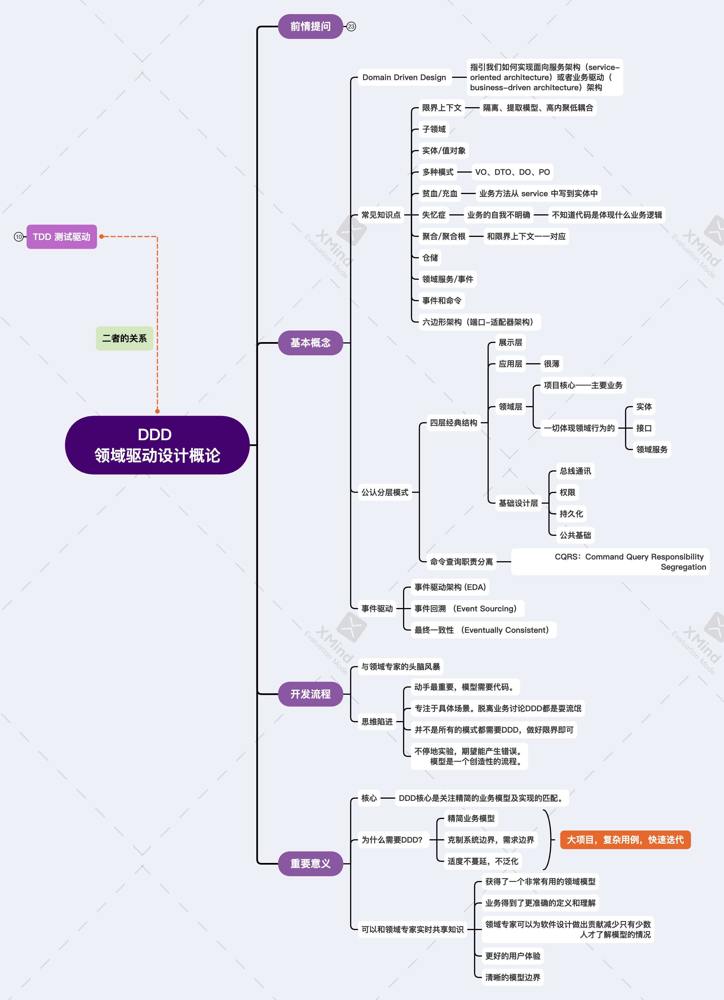
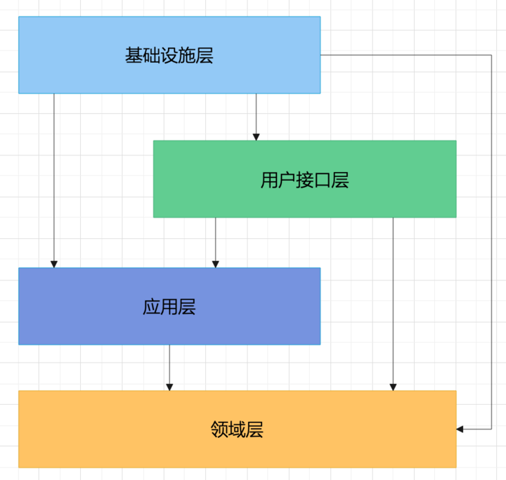
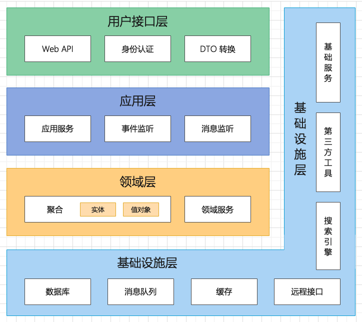
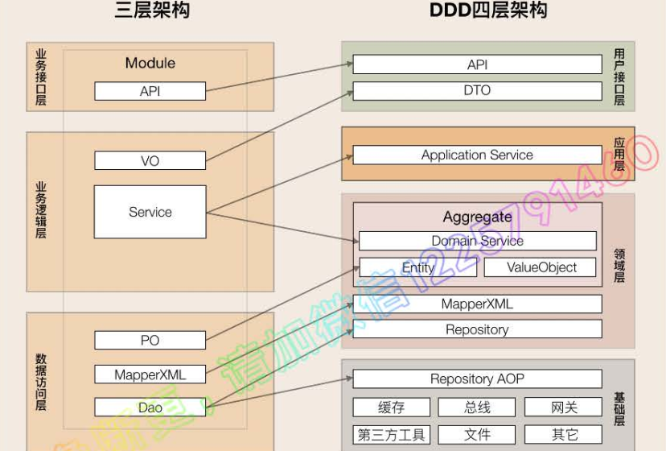
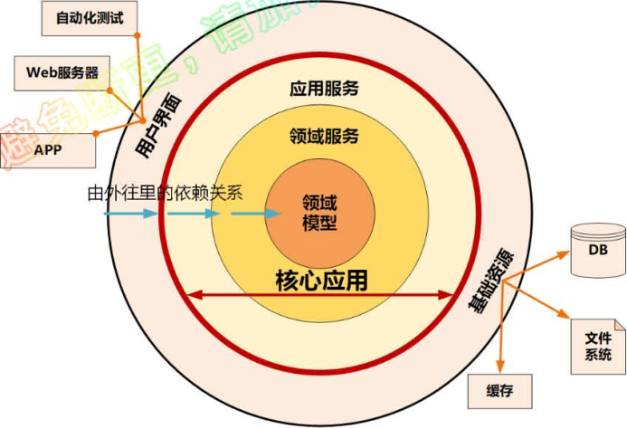
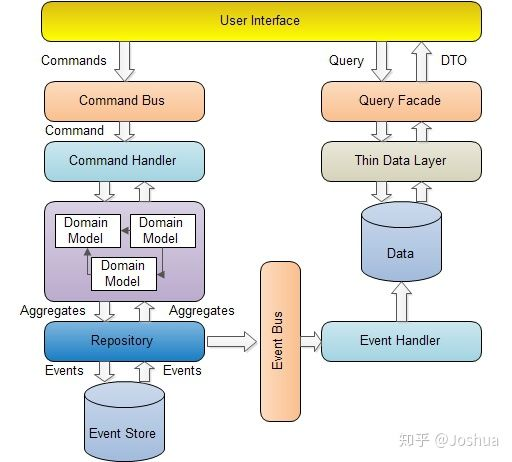

> 指导微服务的拆分、中台的建设。
>
> DDD知识点多且抽象，体系庞大，刚接触会存在很多的困惑。

至少要弄懂下面几个东西：

* DDD的10大核心概念，深入设计思想，理清楚各知识域之间的关系
* DDD分层架构，各层之间的关系，完成微服务分层和代码模型设计

#### DDD 微服务 中台

`DDD`是一种设计思想、中台本质是业务模型、微服务是业务模型的系统落地，DDD的思想是可以指导中台业务建模和微服务设计。DDD强调领域模型和微服务设计的一致性，现有领域模型然后才有微服务，而不是脱离领域模型来谈微服务设计。

`DDD` 是伴随着微服务的出现而再次流行起来的，它不是几种架构/技术，而是一种架构设计方法论(微服务是一种架构风格)处理高度复杂领域的设计思想，它视图分离技术实现的复杂性，并围绕业务概念构建领域模型来控制业务的复杂性

`DDD`主要关注:

> 业务领域视角划分领域边界，构建通用语言进行高效沟通，业务抽象，建立领域模型，维持业务和代码的一致性

微服务主要关注：

> 运行时的进程之通信、容错、故障隔离，去中心化的服务治理，服务的独立开发、测试、部署

通过边界划分，将复杂业务领域简单化，设计出清洗的领域和应用边界，并达到架构容易的演进。

战略设计部分，建立领域模型，划分微服务边界

> 通过事件风暴，用例分析、用户旅程分析为开始的发散过程，最后收敛并产出很多实体、命令、事件等领域对象，并对这些对象进行聚合，限定上下文，边界

战术设计部分，领域模型转向微服务设计的落地，完成软件的开发和落地

#### 抽象概念

这些抽象概念并不一定全部都用的上，理解它们可以更好的理解`DDD` 的核心设计思想和理念，这些理念在其他地方也都是可以借鉴的。

##### 领域

> 从事专门活动的范围，是用来确定**范围**的，范围即边界

领域是用来限定业务边界范围的，那么它就会有大小之分，它进一步分为子领域，每个子领域对应一个更小的问题或者业务范围。这里也可以窥见**DDD是如何解决复杂问题的**，它和自然科学研究方法是类似的，将复杂问题一步一步的细分，然后对细分出来的问题卓个研究解决

当划分出来领域后，一个领域就可以映射为一个微服务

* 子域

子域是领域的一个细化，子域根据根据重要性和功能属性分为三类子域，核心域、通用域、支持域

* 核心域

决定业务成功的核心竞争力

* 通用域

同时被多个子域使用的通用功能子域，是必须的，但是并不能决定产品和公司的核心竞争力，例如认证、权限等，这些东西很容易买到，没有企业特点限制，不需要做太多定制化

* 支持域

不具备上述的子域，它具备有企业特点，但是不具有通用性，例如数据代码类的数据字典等系统

为什么要划分出来这些子域呢？主要是在IT系统建设的过程中，由于预算和资源的有限，对于不同类型的子域有着不同的关注度和资源投入，**好钢要用到刀刃上**

领域的核心思想就是将问题逐级细分，降低业务理解和系统实现的复杂度

##### 限定上下文

通用语言和限界上下文，用来解决不同的角色，产品经理、架构师、开发经理、测试经理等对于同一个领域的有这不同的理解，解决交流障碍。

通用语言，也就是团队统一的语言，对于所有人员，在特定的上下文中都只有一个含义，指向一个业务名词或者动作。

限界上下文，语言都有它的语义环境，避免同样的概念在不同的上下文中产生歧义，这里的限界就是领域边界(一个边界里面会有多个领域)，多个领域对象组成一个上下文环境，在这个上下文中的通用语言。

所以**限界上下文就是封装通用语言和领域对象，保证领域内的术语有一个确切的含义**，这个边界也定义了模型的使用范围，使得团队中的所有成员能够明确的知道什么应该在模型中出现，什么不应该出现在模型中。

例如在电商环境中，商品在不同的阶段有不同的术语，销售时候是商品，运输时候是货物。同样的东西在不同业务领域，赋予这些术语不同的含义和职责边界。

理论上一个限界上下文就可以映射为一个微服务，限界上下文中的领域模型就是微服务中的各个实体

##### 实体和值对象

在战术阶段将领域模型映射到代码中

* 实体

它有一个唯一的id

是领域模型的一个重要对象，有多个属性、操作或者行为的载体，通过这些方式实现自身业务逻辑，这些实体也成为是**充血模型**，和这个实体相关的所有业务逻辑都在这个实体类的方法中实现，夸多个领域的逻辑在领域服务中实现。

一个实体可能对应0个或多个数据库持久化对象，大多数情况实体和持久层对象是1对1，也有部分情况实体知识暂存在静态内存中的一个运行态实体，不需要持久化。

有些复杂情况下，实体和持久化数据是1对多或者多对1的关系，如user对象和role持久化对象生成权限实体

它实例化后就称为是领域对象**DO**

* 值对象

描述领域中的一个东西，它是不可变的，将不同的属性组合成的，是一个集，没有唯一标识符的，不包含业务逻辑，是属于实体，描述实体的特征。

通俗理解，值对象就是将实体中的一些属性在抽出来为一个类，它可以对应数据库中一个表，也可以不对应，在设计数据库表的时候还是安装实体中的属性去设计，但是在数据库存储向代码类序列化的时候，将其值对象化。

实体和值对象在某些场景下是互换的，也不好判断到底是实体还是值对象

实体和值对象是微服务底层最基础的对象，一起实现实体最基本的核心领域逻辑。

##### 聚合和聚合根

聚合就是一部分相互关联的实体/值对象，复合高内聚，低耦合原则，一个微服务会有多个聚合，聚合直接有边界

聚合根，它也是一个实体，有唯一标识，有独立生命周期，一个聚合中有一个聚合根，聚合根在聚合内对实体和值对象有直接引用的方式进行组织和协调

##### 领域事件

在事件风暴中，出了命令和操作等业务行为外，还有一些事件，表示领域中发送的事件，一个事件导致进一步的业务操作，是业务流程的一个步骤，例如在投保业务缴费完成后触发投保单转保单的动作，可能是定时批量处理，或者是一个事件发生后触发的后续动作，如连续输入三次错误密码，会冻结账号。

一般一下语言描述的均是领域事件

> 如果发送，，，则，，，；当做完，，的时候，请通知，，，；发生，，时，则，，等。

#### DDD 四层架构

上面的层次是按照开发角度，并是不软件架构，也就是在开发角度时候，将领域层作为最首先考虑的，就好比在`TDD` 中首先考虑测试案例，然后再实现。

##### 领域层

> 首先我们抛开数据库的困扰，**先从业务逻辑入手开始**，设计时不再考虑数据库的实现。将以前的业务逻辑层（BLL）拆分成了`领域层`和`应用层`。
>
> 领域层聚焦业务对象的业务逻辑实现，体现现实世界业务的逻辑变化。它用来表达业务概念、业务状态和业务规则

#####  应用层

> 应用层是领域层的上层，依赖领域层，是各聚合的协调和编排，原则上是不包括任何业务逻辑。它以较粗粒度的封闭为前端接口提供支持。除了提供上层调用外，还可以包括事件和消息的订阅。
>
> 好比交通路上的交警的角色

##### 用户接口层

> 用户接口层面向用户访问的数据入向接口，可按不同场景提供不一样的用户接口实现。面向Web的可使用http restful的方式提供服务，**可增加安全认证、权限校验，日志记录等功能；面向微服务的可使用RPC方式提供服务，可增加限流、熔断等功能**

##### 基础设施层

> 基础设施层是数据的出向接口，封装数据调用的技术细节。可为其它任意层提供服务，但为了解决耦合的问题采用了依赖倒置原则。其它层只依赖基础设施的接口，于具体实现进行分离。

#####  代码实现架构

原则：每层只能和位于它下方的层发生耦合

#####  领域层

> 是业务策略和业务规则所在的地方，也是项目的核心

#####  **领域实体**

> 我们的软件系统就是对现实世界的真实模拟。
>
> * 现实世界中的事物在软件世界中可以被模拟成一个对象：
>
> * 该事物在现实世界中被赋予什么职责，在软件世界中就被赋予什么职责；
>
> * 在现实世界中拥有什么特性，在软件世界中就拥有什么属性；
>
> * 在现实世界中拥有什么行为，在软件世界中就拥有什么函数；
>
> * 在现实世界中与哪些事物存在怎样的关系，在软件世界中就应当与它们发生怎样的关联。
>
>   **这正是面向对象编程的核心思想，也是DDD中寻找领域实体的核心思想。**

**聚合根**

> 聚合根（Aggregate Root）是DDD中的一个概念，是一种更大范围的封装，会把一组有相同生命周期、在业务上不可分割的实体和值对象放在一起，只有根实体可以对外暴露引用，这也是一种内聚性的表现。

**领域服务**

> 有些领域中的动作是一些动词，看上去并不属于任何对象。它们代表了领域中的一个重要的行为，所以不能忽略它们或者简单地把它们合并到某个实体或者值对象中。**当这样的行为从领域中被识别出来时，推荐的实践方式是将它声明成一个服务。**
>
> 需要处理多个领域才能完成的业务动作

#####  应用层

> 只有薄薄的一层，负责资源的调节，聚合等。

#### MVC三层到4层的映射

三层架构解决程序内代码间调用复杂，代码职责不清的问题

> C: 负责和前端交互
>
> M：负责和数据库交互
>
> V：后端业务逻辑

DDD的分层和这样的分层也类似，只是这些要素被重写归类，确定层和层直接的交互规则和职责边界

三层到DDD分层主要发生在业务逻辑和数据访问层。

改善了业务逻辑层，进行更加清晰的划分，改善三层架构核心业务逻辑混乱，代码改动相互影响大的情况。

和数据库的交互，采用`Repository` 的仓储设计模式。通过依赖导致实现各层对基础资源的解耦，仓储接口放在领域层，仓储实现放在基础层。包括一些第三方工具包、配置等都放到基础层

#### 微服务架构模型

##### 整洁/洋葱架构

依赖原则，越往里依赖越低，代码级别越高，越是核心能力，外圆代码依赖只能依赖内圆，内圆代码不需要知道外圆的任何情况

#### 平台和中台

#####  CQRS(Command Query Responsibility Segregation)

故名思义是将 `command` 与 `query` 分离的一种模式。`query`很好理解，就是我们之前提到的「查询」，那么 `command` 即命令又是什么呢？

`CQRS` 将系统中的操作分为两类，即「命令」(`Command`) 与「查询」(`Query`)。

* 命令则是对会引起数据发生变化操作的总称，即我们常说的新增，更新，删除这些操作，都是命令。
* 查询则和字面意思一样，即不会对数据产生变化的操作，只是按照某些条件查找数据。

`CQRS` 的核心思想是将这两类不同的操作进行分离，然后在两个独立的「服务」中实现。这里的「服务」一般是指两个独立部署的应用。在某些特殊情况下，也可以部署在同一个应用内的不同接口上。

`Command` 与 `Query` 对应的数据源也应该是互相独立的，即更新操作在一个数据源，而查询操作在另一个数据源上。看到这里，你可能想到一个问题，既然数据源进行了分离，如何做到数据之间的同步呢？让我们接着往下看。

从图上可以看到，当 `command` 系统完成数据更新的操作后，会通过「领域事件」的方式通知 `query` 系统。`query `系统在接受到事件之后更新自己的数据源。所有的查询操作都通过 `query` 系统暴露的接口完成。

从架构图上来看，`CQRS` 的实现似乎并不难，许多开发者觉得无非是「增删改」一套系统一个数据库，「查询」一个系统一个数据库而已，有点类似「读写分离」，并没有什么特别的地方。

**但是真正要使用 `CQRS` 是有许多问题与细节要解决的。**

### **事务**

> 其实仔细的思考一下，你应该很快会发现 `CQRS` 需要面临的一个最大的问题: 事务。在原本单一进程，单一数据源的系统中，依靠关系型数据库的事务特性能够很好的保证数据的完整性。但是在 `CQRS` 中这一切都发生了变化。
>
> 当 `command` 端完成数据更新后，需要通过事件的形式通知 `query` 端系统，这就存在着一定的时间差，如果你的业务对于数据完整的实时性非常高，那么可能 `CQRS` 不一定适合你。
>
> 其次一个 `command` 触发的事件在 `query` 端可能需要更新数个数据模型，而这也是有可能失败的。一旦更新失败那么数据就会长时间的处于不一致状态，需要外部的介入。这也是在使用 `CQRS` 之前就需要考虑的。
>
> 从事务的角度来看 `CQRS`，你需要面对的是问题从根本来说是个最终一致性的问题，所以如果你的团队在这块没有太多经验的话，那么需要提前学习并积累一定的经验。

### **基础设施与技术能力的挑战**

> 一个成熟可靠的 CQRS 系统对于基础设施有一定的要求，例如为了实现领域事件，一个可靠的消息中间件是不可或缺的。不然频繁丢失事件造成数据不一致的情况会让运维人员焦头烂额。

### **不同类型的数据存储引擎**

> 这一点其实不能算是问题，更多的是一项挑战或是优势。由于分离了领域模型与数据模型，因此意味着我们可以在 Query 端使用与查询需求更为贴近的数据存储引擎

---

