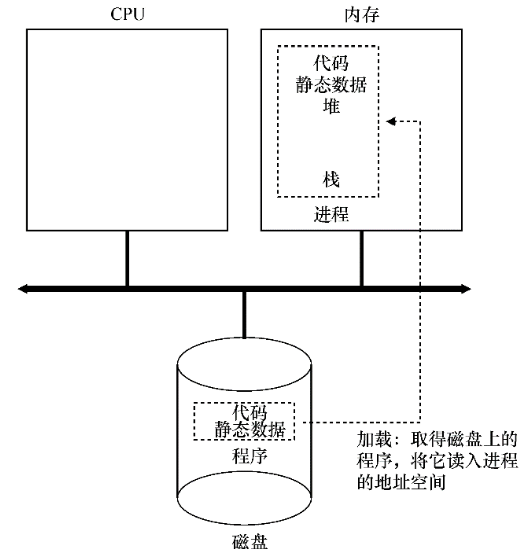
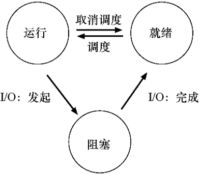
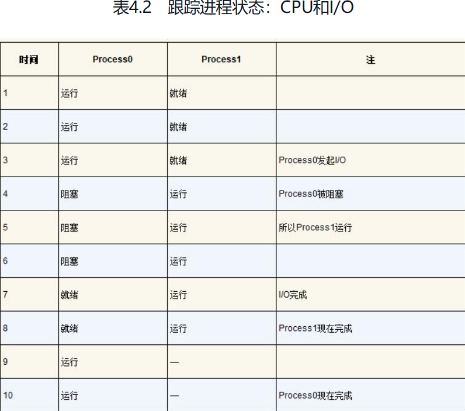

### 第一课 什么是操作系统

是应用程序和计算机硬件之间的一个**管理软件**，使得编写程序更加容易，允许程序可以**分享计算机的内容，以及允许程序和计算机硬件之间的交互**。


#### 操作系统历史

* 计算机(硬件)
* 程序(软件)
* 操作系统(管理软件的系统)

##### 1940s 的计算机

计算机系统=状态机

逻辑门：真空电子管、存储器：延迟线、输入/输出：打孔纸带/指示灯

没有操作系统，程序直接使用指令操作硬件

##### 1950s 的计算机

更快更小的逻辑门(晶体管)、更大的内容(磁芯)、丰富的I/0设备(其速度严重低于处理器速度，中断机制出现)

**Fortran** 出现，启动调用API，而不是直接访问设备。

操作系统的概念产生：

* 操作(operate)任务(jobs)的系统
  * 批处理系统：程序的自动切换 + 库函数
  * DOS：开始出现，设备、文件、任务等对象和API

##### 1960 的计算机

集成电路、总线出现

更快的处理器、更快/大的内存，虚拟存储出现，可以同时载入多个程序、更丰富的I/O设备，完善的终端/异常机制。

出现**COBOL/APL/BASIC**语言 以及编译器出现。

有了进程概念、进行在执行I/O时候，将CPU让给其他程序的执行，程序直接切换

基于中断（时钟）机制，

时钟中断：程序在执行时候，异步插入函数调用

由操作系统(调度策略)决定是否切换到另外程序

**Multics: 现代操作系统出现**

##### 1970s 的计算机

集成电路空前发展、个人电脑兴起(Apple II)，计算机和现在的无大异，包括出现超级计算机。

出现PASCAL语言、UNIX诞生并衍生出其他系统

####  操作系统三个根本问题

操作体系为谁服务

* 程序=状态机

操作系统为程序提供什么服务

* 操作系统 = 对象 + API

如何实现操作系统提供的服务

* 操作系统 = C 程序

#### 操作系统

程序视角：对象 + API

硬件视角：一个C程序

### 第二课 操作系统上的程序

#### 程序

##### 状态机

* 状态：寄存器保存的值(flip-flop值，0/1)
* 初始状态：RESET后的值
* 迁移：组合逻辑电路寄存器下一个周期的值

C程序的状态机模型

* 状态 = 堆 + 栈(栈帧stack frame：栈里面的代码，所谓函数返回/执行结束，就是将栈最上面的帧删除掉，最上面的栈帧也是当前执行的代码，最上面的帧是当前运行的代码)
* 初始状态 = main 的第一条语句
* 状态迁移 = 执行一条语句
  * 任何C都可以写成，非复合语句
  * 真的有这种工具和解释器

##### 一条特殊的指令

调用操作系统的 *syscall*

> 将进程中的所有的状态都交给操作系统

程序 = 计算 + syscall

计算：程序需要做的事情

syscall: 操作系统将计算的结果，某种方式展示出来


#### 编译器

源代码(状态机) -> 二进制代码(状态机)的翻译

---

#### 操作系统中的一般程序

操作系统收编了所有的硬件和软件资源

* 只能用操作系统允许的方式访问操作系统中的对象

* 从而实现操作系统的**霸主**地位

  

---

### 虚拟化

> 将单个CPU转换为看似无线数量的CPU，从而让程序看似同时运行。

最基本的计算机资源CPU为例，假设一个计算机只有一个CPU（尽管现代计算机一般拥有2个、4个或者更多CPU），虚拟化要做的就是将这个CPU虚拟成多个虚拟CPU并分给每一个进程使用，因此，每个应用都以为自己在独占CPU，但实际上只有一个CPU。这样操作系统就创造了美丽的假象——它虚拟化了CPU

#### 抽象：进程

##### 时分共享（time sharing）

操作系统通过虚拟化（virtualizing）CPU来提供这种假象。通过让一个进程只运行一个时间片，然后切换到其他进程，操作系统提供了存在多个虚拟CPU的假象。

潜在的开销就是性能损失，因为如果CPU必须共享，每个进程的运行就会慢一点

通过允许资源由一个实体使用一小段时间，然后由另一个实体使用一小段时间，如此下去，所谓的资源（例如，CPU或网络链接）可以被许多人共享

##### 进程

操作系统为正在运行的程序提供的抽象，也就是操作系统将**一个正在运行的程序抽象称为一个进程**

###### 机器状态

> 程序在运行时可以读取或更新的内容

* 内存：程序在运行时可以读取或更新的内容

> 指令存在内存中。正在运行的程序读取和写入的数据也在内存中。因此进程可以访问的内存（称为地址空间，address space）是该进程的一部分

* 寄存器

> 许多指令明确地读取或更新寄存器

###### 进程API

> 操作系统的所有接口必须包含哪些内容

* 创建

> 程序如何转化为进程
>
> 第一件事是将代码和所有静态数据（例如初始化变量）从磁盘中读取这些字节加载（load）到内存中，加载到进程的地址空间中
>
> 
>
> 现代操作系统惰性（lazily）执行该过程，即仅在程序执行期间需要加载的代码或数据片段，才会加载.
>
> 操作系统在运行此进程之前还需要执行其他一些操作，分片运行时内存(堆、栈)

* 销毁
* 等待
* 其他控制
* 状态

###### 进程状态

* 运行

> 进程正在处理器上运行

* 就绪

> 进程已准备好运行，但由于某种原因，操作系统选择不在此时运行

* 阻塞

> 在阻塞状态下，一个进程执行了某种操作，直到发生其他事件时才会准备运行
>
> 



Process0发起I/O并被阻塞，等待I/O完成。例如，当从磁盘读取数据或等待网络数据包时，进程会被阻塞。OS发现Process0不使用CPU并开始运行Process1。当Process1运行时，I/O完成，将Process0移回就绪状态。最后，Process1结束，Process0运行，然后完成

### 多进程

##### 进程API

* fork()

> 系统调用fork()用于创建新进程，函数通过系统调用创建一个与原来进程几乎完全相同的进程，也就是两个进程可以做完全相同的事，但如果初始参数或者传入的变量不同，两个进程也可以做不同的事 。
>
> 一个进程调用fork（）函数后，系统先给新的进程分配资源，**例如存储数据和代码的空间。然后把原来的进程的所有值都复制到新的新进程中，只有少数值与原来的进程的值不同**。相当于克隆了一个自己 .
>
> 但是它从fork()返回的值是不同的。父进程获得的返回值是新创建子进程的PID，而子进程获得的返回值是0,“其实就相当于链表，进程形成了链表，父进程的fpid(p 意味point)指向子进程的进程id, 因为子进程没有子进程，所以其fpid为0 .
>
> *不是从#include处开始复制代码的，这是因为fork是把进程当前的情况拷贝一份*
>
>  ```c
> 1    #include <stdio.h>
> 2    #include <stdlib.h>
> 3    #include <unistd.h>
> 4
> 5    int
> 6    main(int argc, char *argv[])
> 7    {
> 8        printf("hello world (pid:%d)\n", (int) getpid());
> 9        int rc = fork();
> 10       if (rc < 0) {        // fork failed; exit
> 11           fprintf(stderr, "fork failed\n");
> 12           exit(1);
> 13       } else if (rc == 0) { // child (new process)
> 14           printf("hello, I am child (pid:%d)\n", (int) getpid());
> 15       } else {             // parent goes down this path (main)
> 16           printf("hello, I am parent of %d (pid:%d)\n",
> 17                   rc, (int) getpid());
> 18       }
> 19       return 0;
> 20   }
> 
> // prompt> ./p1
> // hello world (pid:29146)
> // hello, I am parent of 29147 (pid:29146) 
> // hello, I am child (pid:29147)
>  ```
>
> ----
>
> ```c
> #include <unistd.h>  
> #include <stdio.h>  
> int main(void)  
> {  
>    int i=0;  
>    printf("i son/pa ppid pid  fpid/n");  
>    //ppid指当前进程的父进程pid  
>    //pid指当前进程的pid,  
>    //fpid指fork返回给当前进程的值  
>    for(i=0;i<2;i++){  
>        pid_t fpid=fork();  
>        if(fpid==0)  
>            printf("%d child  %4d %4d %4d/n",i,getppid(),getpid(),fpid);  
>        else  
>            printf("%d parent %4d %4d %4d/n",i,getppid(),getpid(),fpid);  
>    }  
>    return 0;  
> }  
> 
> // 运行结果是：
> // 　i son/pa ppid pid fpid
> // 　0 parent 2043 3224 3225
> // 　0 child 3224 3225 0
> // 　1 parent 2043 3224 3226
> // 　1 parent 3224 3225 3227
> // 　1 child 1 3227 0
> // 　1 child 1 3226 0
> ```
>
> 第一步：在父进程中，指令执行到for循环中，i=0，接着执行fork，fork执行完后，系统中出现两个进程，分别是p3224和p3225（后面我都用pxxxx表示进程id为xxxx的进程）。可以看到父进程p3224的父进程是p2043，子进程p3225的父进程正好是p3224。我们用一个链表来表示这个关系：
>  　　p2043->p3224->p3225
>  　　第一次fork后，p3224（父进程）的变量为i=0，fpid=3225（fork函数在父进程中返向子进程id）
>
> p3225（子进程）的变量为i=0，fpid=0（fork函数在子进程中返回0） 
>
> 所以打印出结果： 　0 parent 2043 3224 3225 　0 child 3224 3225 0 
>
>  第二步：假设父进程p3224先执行，当进入下一个循环时，i=1，接着执行fork，系统中又新增一个进程p3226，对于此时的父进程，p2043->p3224（当前进程）->p3226（被创建的子进程）。
>  　　对于子进程p3225，执行完第一次循环后，i=1，接着执行fork，系统中新增一个进程p3227，对于此进程，p3224->p3225（当前进程）->p3227（被创建的子进程）。从输出可以看到p3225原来是p3224的子进程，现在变成p3227的父进程。父子是相对的，这个大家应该容易理解。只要当前进程执行了fork，该进程就变成了父进程了，就打印出了parent。
>
>  第三步：第二步创建了两个进程p3226，p3227，这两个进程执行完printf函数后就结束了，因为这两个进程无法进入第三次循环，无法fork，该执行return 0;了，其他进程也是如此。
>  　　以下是p3226，p3227打印出的结果：
>  　1 child     1 3227    0
>  　1 child     1 3226    0
>
> 可能注意到p3226，p3227的父进程难道不该是p3224和p3225吗，怎么会是1呢？这里得讲到进程的创建和死亡的过程，在p3224和p3225执行完第二个循环后，main函数就该退出了，也即进程该死亡了，因为它已经做完所有事情了。p3224和p3225死亡后，p3226，p3227就没有父进程了，这在操作系统是不被允许的，所以p3226，p3227的父进程就被置为p1了，p1是永远不会死亡的

* exec()

> **在进程中启动另一个程序的方法**
>
> 进程内部启动一个外部程序，由内核将这个外部程序读入内存，使其执行起来成为一个进程呢 .
>
> exec 函数族的作用是根据指定的文件名或目录名找到可执行文件，并用它来取代调用进程的内容，**换句话说**，就是在调用进程内部执行一个可执行文件 

* wait()

> 父进程需要等待子进程执行完毕
>
> ```c
> 1 #include <stdio.h>
> 2 #include <stdlib.h>
> 3 #include <unistd.h>
> 4 #include <sys/wait.h>
> 5
> 6    int
> 7    main(int argc, char *argv[])
> 8    {
> 9        printf("hello world (pid:%d)\n", (int) getpid());
> 10       int rc = fork();
> 11       if (rc < 0) {        // fork failed; exit
> 12           fprintf(stderr, "fork failed\n");
> 13           exit(1);
> 14       } else if (rc == 0) { // child (new process)
> 15           printf("hello, I am child (pid:%d)\n", (int) getpid());
> 16       } else {    // parent goes down this path (main)
> 17           int wc = wait(NULL);
> 18           printf("hello, I am parent of %d (wc:%d) (pid:%d)\n",
> 19                   rc, wc, (int) getpid());
> 20       }
> 21       return 0;
> 22   }
> 
> // prompt> ./p2
> // hello world (pid:29266) 
> // hello, I am child (pid:29267)
> // hello, I am parent of 29267 (wc:29267) (pid:29266) 
> prompt>
> ```
>
> 


### 持久化

操作系统中管理磁盘的软件是**文件系统**，它负责管理持久的数据

### 操作系统

它获取CPU、内存、或者磁盘等物理资源，对他进行**虚拟化**，它处理**并发**有关的复杂问题、持久存储文件，使得文件长期保存

### 抽象的重要

让系统方便和易于使用。抽象对我们在计算机科学中做的每件事都很有帮助。抽象使得编写一个大型程序成为可能，将其划分为小而且容易理解的部分，用C这样的高级语言编写这样的程序不用考虑汇编，用汇编写代码不用考虑逻辑门，用逻辑门来构建处理器不用太多考虑晶体管。


