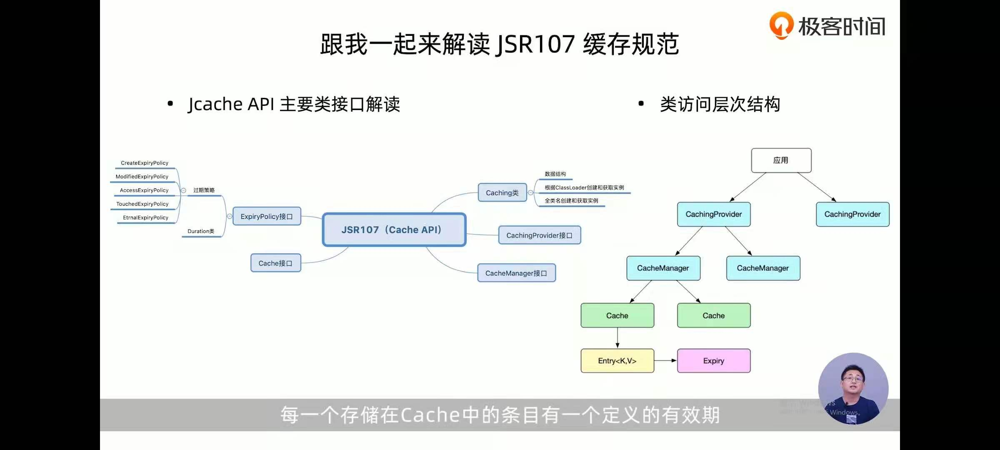

Java Caching API定义了五个核心接口： `CachingProvider` ， `CacheManager` ， `Cache` ， `Entry` 和 `ExpiryPolicy` 。

`CachingProvider` 用于创建，配置，获取，管理和控制零个或多个 `CacheManager` 。应用程序可以在运行时访问和使用零个或多个 `CachingProvider` 。

`CacheManager` 用于创建，配置，获取，管理和控制零个或更多个唯一命名的 `Cache` 。 `CacheManager` 由单个 `CachingProvider` 拥有。

`Cache` 是一种类似于 `Map` 的数据结构，它允许临时存储基于键的值。 `Cache` 由单个 `CacheManager` 拥有。

`Entry` 是由 `Cache` 存储的单个键值对。

`Cache` 中的每个 `Entry` 都有一个有效时间，在此期间可以进行访问，更新和删除操作。一旦超过此持续时间，就称该条目已过期。一旦过期，条目将不再可用于访问，更新或删除，就好像它们从未存在于缓存中一样。使用 `ExpiryPolicy` 设置到期时间。

---

#### Ehcache

EhCache 是一个`纯Java`的进程内`缓存框架`，具有快速、精干等特点，是Hibernate中默认CacheProvider。Ehcache是一种广泛使用的开源Java分布式缓存。主要面向通用缓存,Java EE和轻量级容器。它具有`内存`和`磁盘`存储，缓存加载器,缓存扩展,缓存异常处理程序,一个gzip缓存servlet过滤器,支持REST和SOAP api等特点。

## 特性

- 快速、简单
- 多种`缓存策略`
- 缓存数据有两级：`内存和磁盘`，因此无需担心`容量问题`
- 缓存数据会在虚拟机`重启`的过程中`写入磁盘`
- 可以通过`RMI`、可插入API等方式进行`分布式缓存`
- 具有缓存和缓存管理器的侦听接口
- 支持`多`缓存管理器`实例`，以及一个实例的`多个缓存区域`
- 提供`Hibernate`的缓存实现

可以单独使用，一般在第三方库中被用到的比较多（如mybatis、shiro等）ehcache 对`分布式支持不够好`，多个节点`不能同步`，通常和redis一块使用

ehcache具备对象`api接口`和`可序列化api接口`
 `不能序列化的对象`可以使用出磁盘存储外`ehcache`的所有功能
 支持基于Cache和基于Element的过期策略，每个Cache的存活时间都是可以设置和控制的。
 提供了LRU、LFU和FIFO缓存淘汰算法，Ehcache 1.2引入了最少使用和先进先出缓存淘汰算法，构成了完整的缓存淘汰算法。
 提供内存和磁盘存储，Ehcache和大多数缓存解决方案一样，提供高性能的内存和磁盘存储。
 动态、运行时缓存配置，存活时间、空闲时间、内存和磁盘存放缓存的最大数目都是可以在运行时修改的。

**LRU（Least Recently Used）缓存机制**

> 从数据集中，挑选最近最少使用的数据淘汰。

**LFU（Least Frequently Used）缓存机制**

> 从数据集中，挑选最不经常使用的数据淘汰

