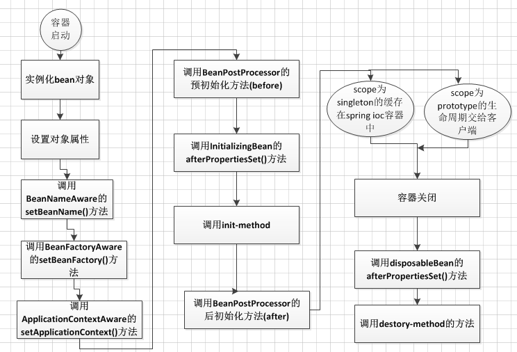

###*主要知识点：*

* spring 相关概念
* 事务
* AOP
* IOC/DI
* Spring 涉及到的设计模式
* Bean
* 读数据库相关的

---

#### *`Spring` 相关概念*

#####*什么是`Spring`*

> 一个开源的`Java EE` 开发框架，其目标是是的`JAVA EE` 应用程序开发更加简捷(开发过程开发者只关注业务逻辑)。

##### *`spring` 优点*

> * 轻量
> * 控制反转IOC，实现松耦合，依赖被注入到对象，而不是创建或者寻找对象
> * 面向切面编程AOP：将业务逻辑和系统服务分离
> * MVC 框架
> * 事务管理：提供统一的事务管理接口
> * 异常处理：方便的全部异处理了

#### *Bean*

##### 配置 `Bean` 的方式

> * XML 文件的配置
> * 基于注解的配置

##### Bean 是如何被 Spring 管理的

> 一旦一个`bean` 纳入带 `Spring Ioc`容器之中，这个`bean`的生命周期就会交给容器进行管理，一般担当管理者角色是的是 `BeanFactory` 和 `ApplicationContext`，认识`Bean` 的生命周期活动，对更好的利用它有很大的帮助

大致的流程如下：

概括来说主要有四个阶段：实例化，初始化，使用，销毁。

> 1. 容器启动后，会对 `scope` 为`singleton`且非懒加载的`bean` 进行**实例化**
> 2. 按照 `bean` 定义信息配置信息，注入所有属性(**初始化过程**)
> 3. 如果`bean` 实现了 `beanNameAware` 接口，会调用该接口的 `setBeanName` 方法，传入`Bean` id， 这样`Bean` 就获得了自己在配置文件中的 `id`
> 4. 如果 `Bean` 实现了`BeanFactoryAware` 会调用接口的 `setBeanFactory`, `Bean` 就获得了自己所在的`BeanFactory`
> 5. 如果`Bean` 实现了 `ApplicationContextAware` 接口，那么还会去调用 `setApplicationContext` 方法，传入该 `Bean` 的 `ApplicationContext`
> 6. 如果还实现了 `BeanPostProcessor`, 这个时候还会去调用 `postProcessBeforeInitialzation`
> 7. 如果还实现了接口 `InitializingBean`，调用 `afterPropertiesSet` 方法
> 8. 如果`Bean` 配置了 `init-method` 方法，则还会去执行 `init-method` 配置的方法
> 9. 如果还实现了 `BeanPostProcessor`, 这个时候还会去调用 `postProcessAfterInitialization`
> 10. 以上的9步骤，完成了`Bean`的实例化，就可以正式使用 `Bean` 了，针对`Bean` 的 `scope` 不同，如`singleton` 容器中会缓存一份`Bean` 的实例，而对于`prototype` 每次调用都会`new` 一个新的对象，其生命周期交给调用方管理， 不是`Spring` 容器管理的
> 11. 容器关闭，如果`Bean` 实现了 `DisposableBean` 接口，则会调用该接口的 `destroy` 方法
> 12. 如果 `Bean` 配置了 `destroy-method` 方法，则会调用`destroy-method` 中的方法，至此生命周期结束。

这里简要说哈实例化和初始化

* 实例化： 是对象创建的过程。比如使用构造方法new对象，为对象在内存中分配空间。
* 初始化：是为对象中的属性赋值的过程。

##### `Bean` 的作用域有哪些

* `singleton`

> 模型行为，`spring` 的`ApplicationContext` 容器在启动时候，自动实例化所有`singleton` 的`Bean` 并缓存到容器中，虽然启动的时候回话费一些一些时间，但是会能带来一些好处
>
> 1. 实例化的时候能够提早发现一些潜在的配置问题
> 2. 程序中在用这个`Bean` 的时候直接拿来用，加快的使用时候的效率

* `prototype`

> 容器在启动的时候不实例化该`Bean`，此外容器将该`Bean` 交给调用者之后，就不在管理它的生命周期了。

* `request` 

> 每次HTTP请求都会创建一个新的Bean,HTTP请求处理完毕后,销毁这个Bean.该作用域仅适用于webApplicationContext环境.

* `session`

> 同一个HTTP session共享一个Bean,不同HTTP session使用不同的Bean,当HTTP Session结束后,实例才被销毁.该作用域仅适用于webApplicationContext环境

* `globalSession`

> 同一个全局session共享一个Bean,一般用于portlet应用环境,该作用域仅适用于webApplicationContext环境.