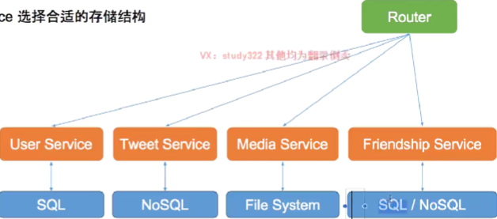
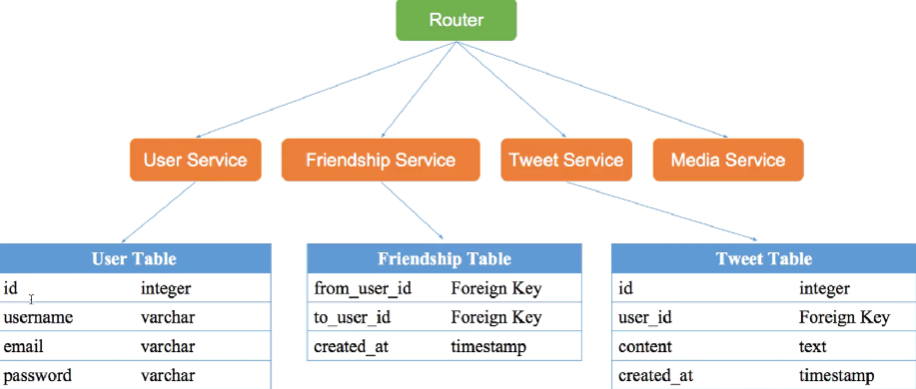
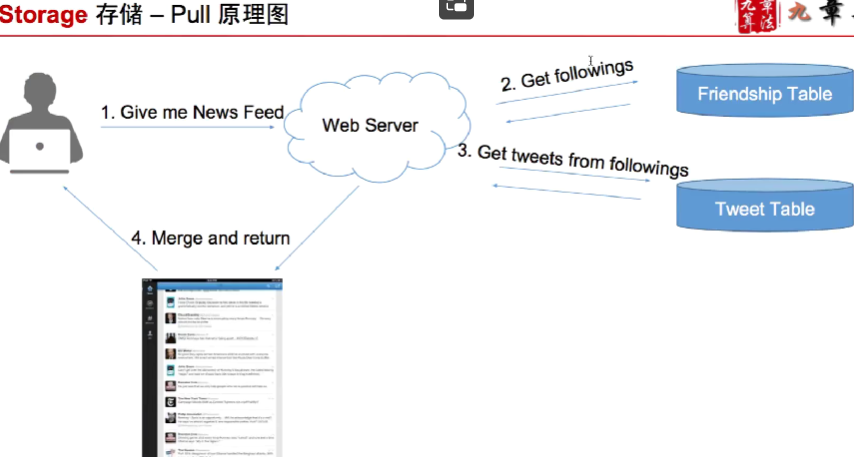
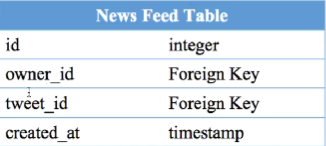
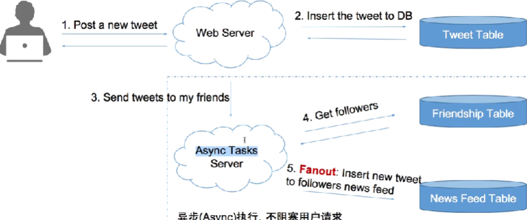
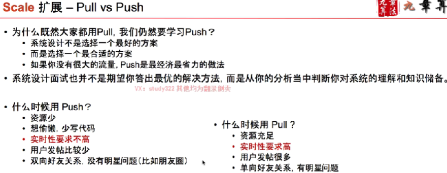
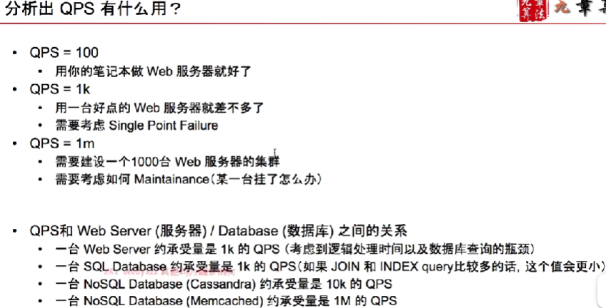
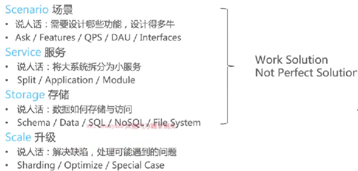

#### 系统设计 VS 面向对象设计

面向对象设计：手把手Coding，设计代码中类-实体直接的关系，微观设计，主要考察对于代码的考察，类、接口、方法等

系统设计：高屋建瓴的“扯淡”，宏观设计，例如使用哪种数据库、缓存、分布式、负载均衡、消息队列、QPS、高并发等。

系统设计的时候主要注意

* 可行性
* 特定问题的解决
* 分析能力
* 各个技术栈使用的权衡
* 知识储备

4S分析法(当不知道该怎么做的时候，在这4个方向上分析，分析套路)

* Scenario：需要设计那些功能、设计到多牛逼(多少QPS、支持多少人在线)
* Service：拆服务，如何拆分
* Storage：数据如何存储访问，什么样的数据结构选择什么样的数据库
* Scale：分库分表、优化、水平/垂直扩展、设计容错性，提前想到未来可能遇到的问题，并解决

#### 存储 Storage

1. 数据如何存储和访问
2. 为每个Service 选择存储结构
3. 表结构细化

##### 数据如何存储和访问

* 数据库系统
  * 关系型数据库SQL：例如存储用户信息
  * 非关系型数据库 NoSQL：存储推文、社交图谱
* 文件系统 File System
  * 图片、视频 Media Files
* 缓存系统
  * 不支持数据持久化
  * 效率高、内存级别访问

##### 文件系统和数据库系统之间的关系

数据库系统是文件系统的一层包装，文件系统仅仅是提供存放文件的功能，而数据库系统是在文件系统之上，增加丰富的操作，更加细粒度的信息，例如数据的元信息。

数据库中存储的数据，最终都是落盘到文件系统了。

例如在设计Tweet 设计的时候会有以下的数据库设计

1. 为每个服务选择合适的存储结构
2. 设计表结构

程序 = 算法 + 数据结构

系统 = 服务 + 数据存储

新鲜事系统设计：例如当看朋友圈，并上下滑动时候看到的信息流，它的核心因素有，关注的朋友不同、每个人的朋友圈看到的新鲜事都是不一样的。

Pull 模式产生信息流，主动去获取

在用户查看信息流的时候，获取每个好友的前100条消息，然后合并出100天消息，采用K路归并算法 Merge K sort Arrays。

因为是在用户发起的主动计算，如果用户太多，合并过程会比较慢。

Push 模式，当关注的人发帖后，我关注了这些帖子，那么帖子主动就推给了我，那么就需要一个地方去保存这些发的帖子

为每个用户建一个List，存储池，存储他的信息流。

当他关注的用户发一个消息后，将该推文卓哥推送到每个关注的用户的 List中

当用户查看信息流的时候，值需要从 List 中读取最小的100条就可以。

webServer 可以是一个MQ。

问题：当关注的比较多的时候，例如1千万粉丝，那么在Fanout 就需要插入1亿条数据。

Scale 扩展：系统的维护和优化

解决设计缺陷、更多功能设计、特殊情况兼容

> 例如对于上面的信息流 Push 模式慢的问题，如何优化
>
> 增加缓存
>
> 缓存用户所有发的帖子、在缓存所有和缓存前N条需要有一个trade off。
>
> 缓存用户的信息流的集合：
>
> 1. 集合中的帖子没有更新，直接归并最近的100条，
> 2. 有更新，归并存量的以及更新之后的
>
> Push 模式 需要写表 不活跃的用户，对粉丝进行排序，也不能解决(会有机器人一直登录，退出)。
>
> 在Push 和 Pull 中间一种 Push一种trade off。对僵尸粉不写表。

系统鲁棒性、扩展能力(流量扩展，如何处理)

Ask Before design

> 问清楚在动手设计、不要一上来就冲着巨牛逼的方案去设计、切记不要做关键字大师

No More no less

> 不要总想着最牛逼的系统，设计够用的系统

Work solution first

> 先设计一个基本可以工作的系统，然后再逐步优化

Analysis is import than solution

> 系统设计没有表中答案，记住所有答案是没用的，通过分析过程展示知识储备，权衡各种设计方式的利弊

---

#### Scenario 场景

需要设计那些功能，设计得多牛

1. Ask 
2. Analysis

主动沟通，询问，需要那些功能，主要的是那些，次要的是那些，QPS(query per second)多少(峰值：一般去平均的3倍)，潜在用户多少，月/日活跃用户多少

读写频率

#### Service

大系统拆分为小服务

---

#### 为什么学习系统设计

架构师必备。

---

#### 系统设计的模板 4S 分析法

前三个完成功能的完成，最后一个做系统的打磨、升级、扩展。

---

* 场景
* 业务流程具体分析，画流程图
  * 更加具体业务流程，划分模块，根据复杂性是否需要做 Service
  * 根据具体业务流程，划分的模块，细化每个模块中涉及的实体数据，设计表
* 得到了模块/Service、表，决定每个模块/表的Storage，以及具体每个Storage表的schema
* 最后升级系统，打磨

