#### Scenario

1. 具体有哪些场景？
2. 实际需求有什么
3. 详细流程怎么样 ？

> 2020年6月18日0点开始，京东自营限量100台，以4000元架构抢购Iphone11，先到先得，一人只限购一台，售完为止

提取出关键字：

> 0点开始、限量100台、一人只限购一台

QPS 分析

> 衡量网页访问量的指标
>
> 每日每秒1000人访问该页面
>
> 秒杀的时候每秒10万人访问页面
>
> QPS增加100倍

流程

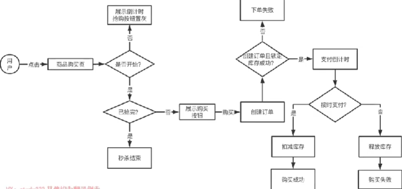

需要解决的问题：

1. 瞬时大流量高并发

   服务器、数据库等承载的QPS有限

2. 有限库存，不能超卖，有N个商品，不能卖出去N+m个

3. 黄牛恶意请求，使用脚本模拟用户购买，模拟出十几万请求去抢购

4. 固定时间开启，时间到了才能购买，提前一秒都不可以

5. 解决限购，一个人只能买一个或者N个

需求拆解：

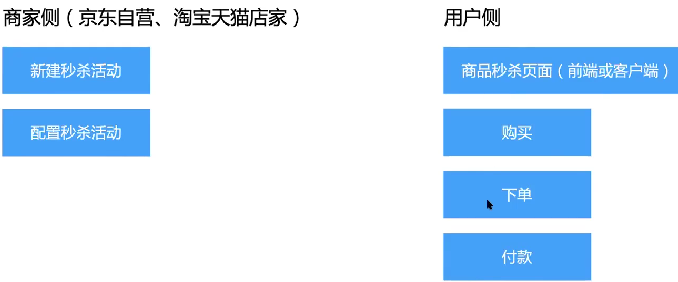

#### Service

是否需要拆微服务

单体架构：前后端耦合、功能耦合，系统复杂，扩展性差，开发协作困难、会导致级联故障(一个模块导致整个系统宕机)

简单、开发时间断、访问量小的情况下适合。

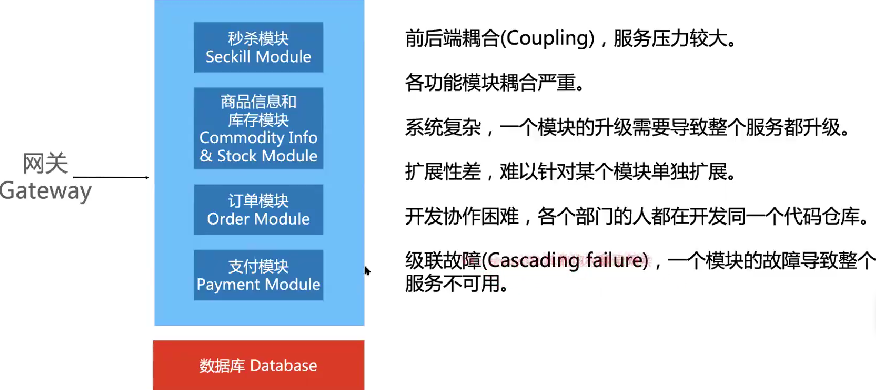

微服务架构：单一职责、系统简单、扩展性强、协作清晰、故障隔离、不同服务使用不同的语言和架构

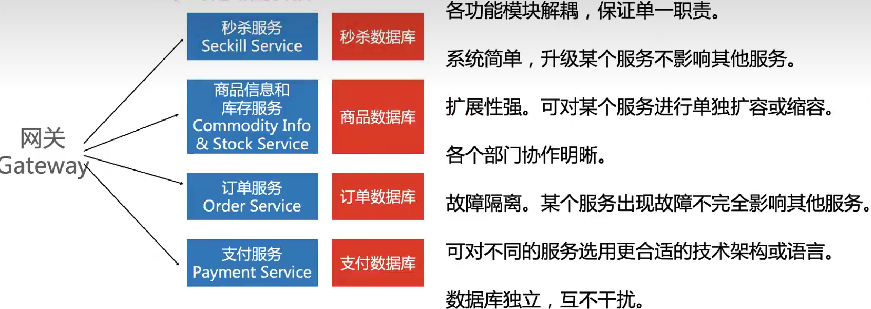


#### Storage 存储

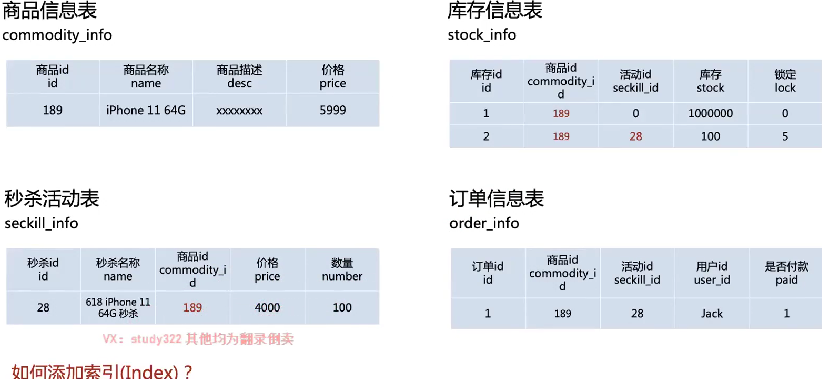


#### 画图数据流

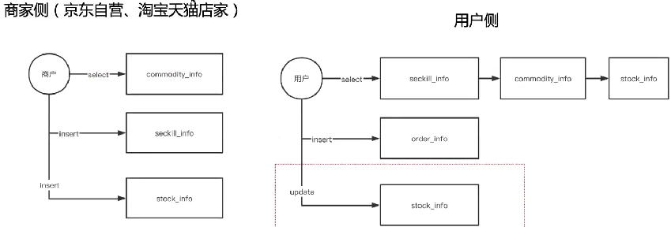

##### 超卖问题

也就是要解决操作原子性问题，扣减库存使用事务解决超卖：

`for update` 加行锁

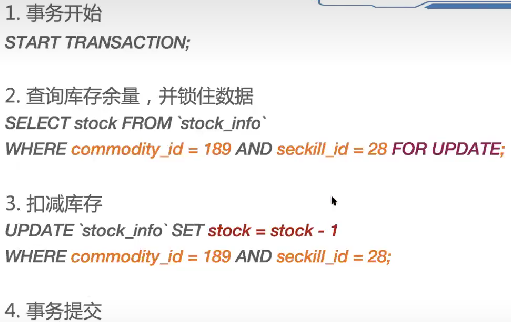

使用事务比较耗时，会降低吞吐

采用业务逻辑解决：

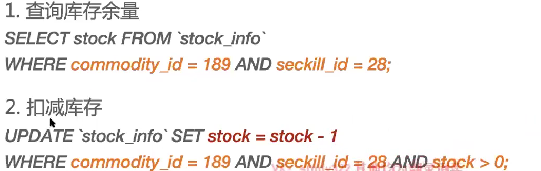

如果是拆分了服务，支付、下订单等多个操作，那么这多个操作需要加分布式事务，且每一个操作，例如减库存，又需要分布式锁+本地事务的方式保证资源互斥

> 分布式事务的主要目标是保证**多个操作的一致性，即要么所有操作都成功提交，要么全部失败回滚，多进程的事务管理，解决的是跨进程会话数据的一致性问题 
>
> 分布式锁的主要目标是保证在分布式环境下的资源互斥访问，即同一时间只有一个客户端能够获取到锁并执行相关操作，多进程的并发问题  

会有超卖问题的情况

```java
@Override
	@Transactional(rollbackFor = Exception.class)
	public Result startSeckil(long seckillId,long userId) {
		//校验库存
		String nativeSql = "SELECT number FROM seckill WHERE seckill_id=?";
		Object object =  dynamicQuery.nativeQueryObject(nativeSql, new Object[]{seckillId});
		Long number =  ((Number) object).longValue();
		if(number>0){
			//扣库存
			nativeSql = "UPDATE seckill  SET number=number-1 WHERE seckill_id=?";
			dynamicQuery.nativeExecuteUpdate(nativeSql, new Object[]{seckillId});
			//创建订单
			SuccessKilled killed = new SuccessKilled();
			killed.setSeckillId(seckillId);
			killed.setUserId(userId);
			killed.setState((short)0);
			killed.setCreateTime(new Timestamp(System.currentTimeMillis()));
			dynamicQuery.save(killed);
      String table = "success_killed_"+userId%8;
      nativeSql = "INSERT INTO "+table+" (seckill_id, user_id,state,create_time)VALUES(?,?,?,?)";
      Object[] params = new Object[]{seckillId,userId,(short)0,new Timestamp(System.currentTimeMillis())};
            dynamicQuery.nativeExecuteUpdate(nativeSql,params);
			//支付
			return Result.ok(SeckillStatEnum.SUCCESS);
		}else{
			return Result.error(SeckillStatEnum.END);
		}
	}
```

一下有多种方案：

* 程序锁-单机下(一个进程)多线程没有问题

```java
private Lock lock = new ReentrantLock(true);

@Override
	@Transactional(rollbackFor = Exception.class)
	public Result  startSeckilLock(long seckillId, long userId) {
		lock.lock();
		try {
			/**
			 * 1)这里、不清楚为啥、总是会被超卖101、难道锁不起作用、lock是同一个对象
			 * 2)来自热心网友 zoain 的细心测试思考、然后自己总结了一下,事物未提交之前，锁已经释放(事物提交是在整个方法执行完)，导致另一个事物读取到了这个事物未提交的数据，也就是传说中的脏读。建议锁上移
			 * 3)给自己留个坑思考：为什么分布式锁(zk和redis)没有问题？(事实是有问题的，由于redis释放锁需要远程通信，不那么明显而已)
			 * 4)2018年12月35日，更正一下,之前的解释（脏读）可能给大家一些误导,数据库默认的事务隔离级别为 可重复读(repeatable-read)，也就不可能出现脏读
			 * 哪个这个级别是只能是幻读了？分析一下：幻读侧重于新增或删除，这里显然不是，那这里到底是什么，给各位大婶留个坑~~~~
			 * 解决：将lock提前
			 * 	将这个方法中的锁全部去掉，然后再方法外面上锁。
			 * 	public Result SeckilLock(long seckillId, long userId){
			 * 			 Result result=Result.error("执行失败");
			 * 			 lock.lock();
			 * 			 result= startSeckilLock(seckillId,userId);
			 * 			 lock.unlock();
			 * 		return  result;
			 *  }
			 **/
			String nativeSql = "SELECT number FROM seckill WHERE seckill_id=?";
			Object object =  dynamicQuery.nativeQueryObject(nativeSql, new Object[]{seckillId});
			Long number =  ((Number) object).longValue();
			if(number>0){
				nativeSql = "UPDATE seckill  SET number=number-1 WHERE seckill_id=?";
				dynamicQuery.nativeExecuteUpdate(nativeSql, new Object[]{seckillId});
				SuccessKilled killed = new SuccessKilled();
				killed.setSeckillId(seckillId);
				killed.setUserId(userId);
				killed.setState(Short.parseShort(number+""));
				killed.setCreateTime(new Timestamp(System.currentTimeMillis()));
				dynamicQuery.save(killed);
			}else{
				return Result.error(SeckillStatEnum.END);
			}
		} catch (Exception e) {
			throw new RrException("异常了个乖乖");
         }finally {
			lock.unlock();
		}
		return Result.ok(SeckillStatEnum.SUCCESS);
}
```

* AOP程序锁-单机下(一个进程)多线程没有问题

```java
@Target({ElementType.PARAMETER, ElementType.METHOD})    
@Retention(RetentionPolicy.RUNTIME)    
@Documented    
public  @interface Servicelock { 
	 String description()  default "";
}

@Component
@Scope
@Aspect
@Order(1)
//order越小越是最先执行，但更重要的是最先执行的最后结束。order默认值是2147483647
public class LockAspect {
	/**
     * 思考：为什么不用synchronized
     * service 默认是单例的，并发下lock只有一个实例
     */
	private static  Lock lock = new ReentrantLock(true);//互斥锁 参数默认false，不公平锁  
	
	//Service层切点     用于记录错误日志
	@Pointcut("@annotation(com.itstyle.seckill.common.aop.Servicelock)")  
	public void lockAspect() {
		
	}
	
    @Around("lockAspect()")
    public  Object around(ProceedingJoinPoint joinPoint) { 
    	lock.lock();
    	Object obj = null;
		try {
			obj = joinPoint.proceed();
		} catch (Throwable e) {
			e.printStackTrace();
			throw new RuntimeException();       
		} finally{
			lock.unlock();
		}
    	return obj;
    } 
}

@Override
	@Servicelock
	@Transactional(rollbackFor = Exception.class)
	public Result startSeckilAopLock(long seckillId, long userId) {
		//来自码云码友<马丁的早晨>的建议 使用AOP + 锁实现
		String nativeSql = "SELECT number FROM seckill WHERE seckill_id=?";
		Object object =  dynamicQuery.nativeQueryObject(nativeSql, new Object[]{seckillId});
		Long number =  ((Number) object).longValue();
		if(number>0){
			nativeSql = "UPDATE seckill  SET number=number-1 WHERE seckill_id=?";
			dynamicQuery.nativeExecuteUpdate(nativeSql, new Object[]{seckillId});
			SuccessKilled killed = new SuccessKilled();
			killed.setSeckillId(seckillId);
			killed.setUserId(userId);
			killed.setState(Short.parseShort(number+""));
			killed.setCreateTime(new Timestamp(System.currentTimeMillis()));
			dynamicQuery.save(killed);
		}else{
			return Result.error(SeckillStatEnum.END);
		}
		return Result.ok(SeckillStatEnum.SUCCESS);
	}
```

* 数据库悲观锁-单机下(一个进程)多线程没有问题

```java
@Override
	@Transactional(rollbackFor = Exception.class)
	public Result startSeckilDBPCC_ONE(long seckillId, long userId) {
		//单用户抢购一件商品或者多件都没有问题 FOR UPDATE 数据库行锁
		// For Update只能应用于SELECT语句中, 只有当事务提交或回滚时，所加的锁才会被释放
		String nativeSql = "SELECT number FROM seckill WHERE seckill_id=? FOR UPDATE";
		Object object =  dynamicQuery.nativeQueryObject(nativeSql, new Object[]{seckillId});
		Long number =  ((Number) object).longValue();
		if(number>0){
			nativeSql = "UPDATE seckill  SET number=number-1 WHERE seckill_id=?";
			dynamicQuery.nativeExecuteUpdate(nativeSql, new Object[]{seckillId});
			SuccessKilled killed = new SuccessKilled();
			killed.setSeckillId(seckillId);
			killed.setUserId(userId);
			killed.setState((short)0);
			killed.setCreateTime(new Timestamp(System.currentTimeMillis()));
			dynamicQuery.save(killed);
			return Result.ok(SeckillStatEnum.SUCCESS);
		}else{
			return Result.error(SeckillStatEnum.END);
		}
	}
```

* 数据库乐观锁

```java
@Override
	@Transactional(rollbackFor = Exception.class)
	public Result startSeckilDBOCC(long seckillId, long userId, long number) {
		Seckill kill = seckillRepository.findOne(seckillId);
		/**
		 * 剩余的数量应该要大于等于秒杀的数量
		 */
		if(kill.getNumber()>=number){
			//乐观锁, 保证在开始下单，和减库存的时候没有其他订单
			String nativeSql = "UPDATE seckill  SET number=number-?,version=version+1 WHERE seckill_id=? AND version = ?";
			int count = dynamicQuery.nativeExecuteUpdate(nativeSql, new Object[]{number,seckillId,kill.getVersion()});
			if(count>0){
				SuccessKilled killed = new SuccessKilled();
				killed.setSeckillId(seckillId);
				killed.setUserId(userId);
				killed.setState((short)0);
				killed.setCreateTime(new Timestamp(System.currentTimeMillis()));
				dynamicQuery.save(killed);
				return Result.ok(SeckillStatEnum.SUCCESS);
			}else{
				return Result.error(SeckillStatEnum.END);
			}
		}else{
			return Result.error(SeckillStatEnum.END);
		}
	}
```

* 分布式锁-Redission 实现

> 注意注释中的关于分布式锁，和本地程序锁的使用，不恰当的使用会引起问题

```java
@Override
	@Transactional
	public Result startSeckilRedisLock(long seckillId,long userId) {
		boolean res=false;
		try {
			/**
			 * 尝试获取锁，最多等待3秒，上锁以后20秒自动解锁（实际项目中推荐这种，以防出现死锁）、这里根据预估秒杀人数，设定自动释放锁时间.
			 * 看过博客的朋友可能会知道(Lcok锁与事物冲突的问题)：https://blog.52itstyle.com/archives/2952/
			 * 分布式锁的使用和Lock锁的实现方式是一样的，但是测试了多次分布式锁就是没有问题，当时就留了个坑
			 * 闲来咨询了《静儿1986》，推荐下博客：https://www.cnblogs.com/xiexj/p/9119017.html
			 * 先说明下之前的配置情况：Mysql在本地，而Redis是在外网。
			 * 回复是这样的：
			 * 这是因为分布式锁的开销是很大的。要和锁的服务器进行通信，它虽然是先发起了锁释放命令，涉及网络IO，延时肯定会远远大于方法结束后的事务提交。
			 * ==========================================================================================
			 * 分布式锁内部都是Runtime.exe命令调用外部，肯定是异步的。分布式锁的释放只是发了一个锁释放命令就算完活了。真正其作用的是下次获取锁的时候，要确保上次是释放了的。
			 * 就是说获取锁的时候耗时比较长，那时候事务肯定提交了就是说获取锁的时候耗时比较长，那时候事务肯定提交了。
			 * ==========================================================================================
			 * 周末测试了一下，把redis配置在了本地，果然出现了超卖的情况；或者还是使用外网并发数增加在10000+也是会有问题的，之前自己没有细测，我的锅。
			 * 所以这钟实现也是错误的，事物和锁会有冲突，建议AOP实现。
			 * =======
			 * 收到的另外一篇 https://blog.csdn.net/Adoucequan/article/details/123844506#:~:text=%E8%A7%A3%E5%86%B3%E6%96%B9%E6%A1%88%EF%BC%9A,1.%E5%88%86%E5%B8%83%E5%BC%8F%E9%94%81%E5%8A%A0%E4%BA%8B%E5%8A%A1%E7%9A%84%E5%9C%BA%E6%99%AF%E4%B8%8B%EF%BC%8C%E5%B0%86%E5%88%86%E5%B8%83%E5%BC%8F%E9%94%81%E6%94%BE%E5%9C%A8%E4%BA%8B%E5%8A%A1%E5%A4%96%E9%9D%A2%EF%BC%8C%E5%BD%93%E4%BA%8B%E5%8A%A1%E6%8F%90%E4%BA%A4%E5%AE%8C%E6%88%90%E4%B9%8B%E5%90%8E%EF%BC%8C%E6%89%8D%E8%BF%9B%E8%A1%8C%E9%94%81%E7%9A%84%E9%87%8A%E6%94%BE%E3%80%82%202.%E6%95%B0%E6%8D%AE%E5%BA%93%E5%B1%82%E9%9D%A2%E5%8A%A0%E5%94%AF%E4%B8%80%E7%B4%A2%E5%BC%95%EF%BC%8C%E9%98%B2%E6%AD%A2%E9%87%8D%E5%A4%8D%E7%9A%84%E8%AE%A2%E5%8D%95%E5%8F%B7%E5%85%A5%E5%BA%93%E3%80%82
			 * 看到的解释：
			 *  @Transactional(rollbackFor = Exception.class)
			 * 	public void createOrder(String orderId) {
			 * 		// 使用redission获取分布式锁，获取不到锁时进行等待
			 * 		lock.lock();
			 * 		try {
			 * 			// 获取到锁之后，先查询订单有没有入库，如果入库则忽略
			 * 			OrderDO existOrder = orderMapper.get(orderId);
			 * 			if (existOrder != null) {
			 * 				return;
			 *            }
			 * 			// 以下落order表和orderService表
			 * 			OrderDO newOrder = new OrderDO();
			 * 			newOrder.setOrderId(orderId);
			 * 			orderMapper.insert(newOrder);
			 * 			OrderServiceDO orderService = new OrderServiceDO();
			 * 			orderServiceMapper.insert(orderService);
			 *        } finally {
			 * 			lock.unLock();
			 *        }
			 *    }
			 * 分布式锁是在事务里面，假如有多个服务同时执行到了获取锁这一步，只会有一个服务能获取到锁，
			 * 其他服务会等待锁的释放（redission是使用订阅的方式，由redis-server通知client锁的释放事件）。
			 * 待方法业务逻辑执行完成之后，锁就进行了释放，但是事务还没有提交。其他服务这时获取到了锁，
			 * 虽然在执行前有进行重复检查，但是因为前一个服务的事务还没有提交，这里是获取不到结果的（数据库隔离级别为可重复读），
			 * 还是能正常执行下去。这就导致了重复数据入库。
			 * 解决方案：
			 * 1.分布式锁加事务的场景下，将分布式锁放在事务外面，当事务提交完成之后，才进行锁的释放。
			 * 2.数据库层面加唯一索引，防止重复的订单号入库。
			 */
			res = RedissLockUtil.tryLock(seckillId+"", TimeUnit.SECONDS, 3, 20);
			if(res){
				String nativeSql = "SELECT number FROM seckill WHERE seckill_id=?";
				Object object =  dynamicQuery.nativeQueryObject(nativeSql, new Object[]{seckillId});
				Long number =  ((Number) object).longValue();
				if(number>0){
					SuccessKilled killed = new SuccessKilled();
					killed.setSeckillId(seckillId);
					killed.setUserId(userId);
					killed.setState((short)0);
					killed.setCreateTime(new Timestamp(new Date().getTime()));
					dynamicQuery.save(killed);
					nativeSql = "UPDATE seckill  SET number=number-1 WHERE seckill_id=? AND number>0";
					dynamicQuery.nativeExecuteUpdate(nativeSql, new Object[]{seckillId});
				}else{
					return Result.error(SeckillStatEnum.END);
				}
			}else{
			    return Result.error(SeckillStatEnum.MUCH);
			}
		} catch (Exception e) {
            throw new RrException("异常了个乖乖");
		} finally{
			if(res){//释放锁
				RedissLockUtil.unlock(seckillId+"");
			}
		}
		return Result.ok(SeckillStatEnum.SUCCESS);
	}
```

以上多种方式解决**超卖**的问题。

##### 数据库崩溃

大量请求到达数据库，会导致数据库崩溃

对于抢购活动而言，可能几十万抢购100个商品，实际上大部分请求都是无效的，不需要将这些无效的请求下沉到数据库。

库存预热：**解决数据库的大访问量**

> 秒杀的本质，是对库存的抢夺。每个秒杀的用户都去数据库查询校验库存，然后减库存，导致数据库崩溃。

Mysql 数据库单点能够支持1000QPS，但是Redis 单点能够支持10万QPS，考虑将库存信息加载到REDIS中，直接通过Redis 来判断并扣减库存。

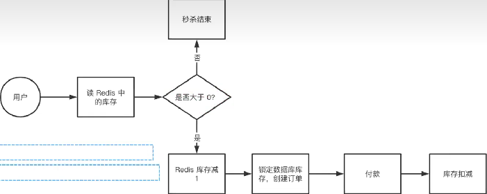

注意这里有先占用库存，然后付款，最后在减去库存，防止出现在付款的时候商品被别人买走。

还有就是在Redis 中查询库存，和库存大于0的判断，如果有并发过来回出现超卖。可以这么解决

1. 在Mysql锁定库存的时候在检查一次Redis 是否大于0

2. 两步操作变为一个原子性操作(使用lua录脚本操作)

   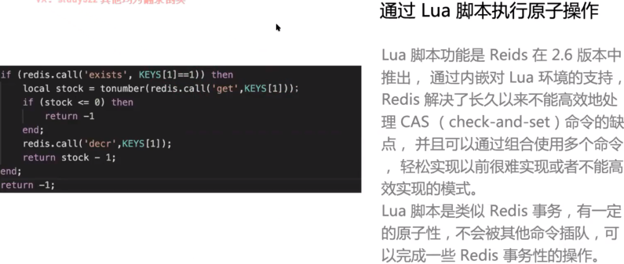

   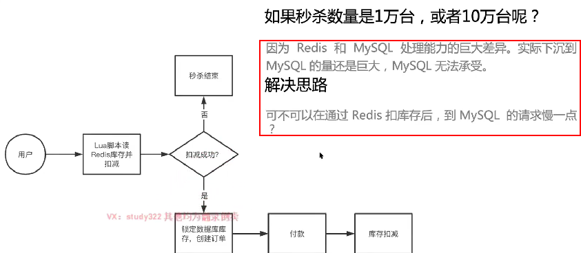

   使用消息队列，将redis 和 mysql 隔离开，协调二者的处理能力的差异。

   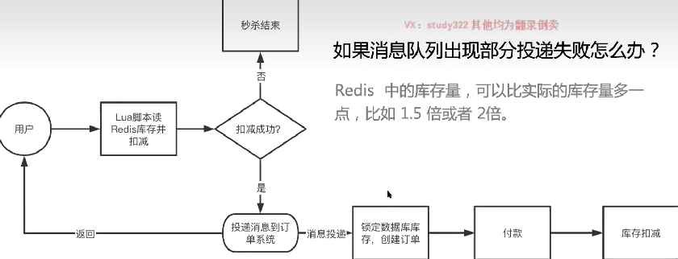

##### 库存扣减时机

* 下单时候立刻就减

  用户体验最好，恶意下单，下好多单，但是不付钱，占用库存，导致其他人无法下单购买

* 先下单，支付完成后减去库存

  体验不好，如下单了，但是在付款的时候发现被其他人买走了

* 下单后锁定库存，支付成功后减库存

  最常用的使用，付款有一定时间限制，限制时间内没有付款，订单会关闭，不会减库存。

##### 购买时数据校验

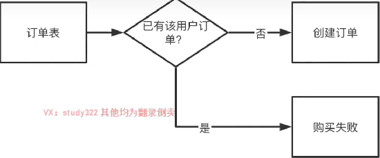

如上流程会增加数据库的访问压力，不建议直接访问数据库的方式去对用户是否已经下了订单进行校验。

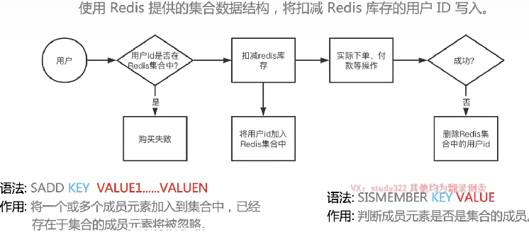

秒杀的时候判断用户是否在redis 中，如果存在那么说明用户以及购买了，不允许再次购买。

分布式事务保证付款和减库存的数据一致性：

其中跨越支付、减库存、支付记录的一致性。

#### Scale

##### 防止页面刷爆

CDN

##### 高可用

##### 验证码机制

##### 限流机制


