#### Service 用户系统

实现注册、登录、用户查询、好友关系存储

#### Scenario & Service

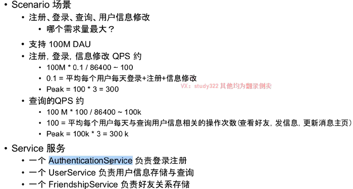

通过分析QPS，可以估计出来数据量的产生以及数据库的QPS，对数据库的选型会有影响。

#### Storage

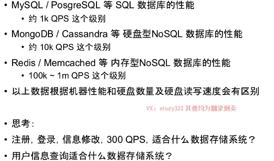

##### 读非常多，写非常少优化

用户的查询在巅峰的时候达到300k，所以单机mysql以及不能满足。用户系统的特定就是读非常多，写非常少，可以使用Cache 进行优化。

缓存不会出现内存爆掉的问题，它会有自动删除缓存内容的机制，会将那些不常用的内容删除掉。也可以在set 值的时候设置ttl，在ttl时间内set的值是可以使用的，否则会自动删掉

在每次读取的时候，先去缓存中读，能从缓存中拿到直接返回，否则才去数据库去拿，拿到后塞缓存，然后返回

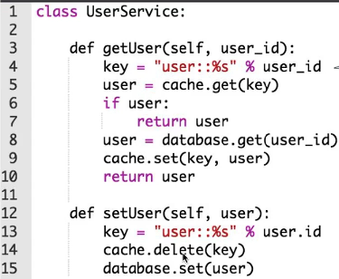

一下几种操作中会出现数据库和缓存不一致的问题：脏数据问题

`database.set(user);cache.set(key, user);`

`database.set(user);cache.delete(key, user);`

`cache.set(key, user);database.set(user);`

当第一个操作成功，第二个失败就会出现。

上面的代码在多线程情况下会存在数据不一致问题

1. 线程1执行完14行，马上执行15行的时候，此时来了运行更快的线程二执行`getUser`
2. 由于线程1已经将缓存中的user删除，所以线程2会去数据库中读旧的user，并将旧的user重新放入到缓存中然后返回，此时线程2读的是旧数据
3. 线程1执行完第15行数据，也就是此时**数据库是新数据，缓存中是旧数据**

注意场景：这里设计的前提是此时的系统是一个读多写少的情况，采用上面的代码，也就是在执行`setUser` 的时候会有很多的线程在执行`getUser` 发送上面数据不一致的情况会概率会很高

如何解决

数据库和缓存是2套系统，不支持加锁，如果一定要加锁，那么需要使用分布式锁，使用分布式锁降低存储效率

业界最佳实践：

采用这种方式也会出现数据不一致的情况，如在线程1执行到第9行的时候，突然有一个很快的线程2执行完了`setUser` 然后线程1执行完第10行并返回。返回旧的数据，缓存中也是旧数据，数据库中是新数据。

但是在读多写少的背景下，这种问题发生的概率会比较少。

注意一直说的数据不一致**是说数据库和缓存的不一致，不是说返回的数据和数据库/缓存不一致**

设置ttl，允许数据库和缓存存在不一致，但是最终会一致性。

##### 写多读少的优化

每次数据修改的时候，都会在cache 中删除这个数据，如果写很多很多，那么cache 是没有任何优化优势的。

#### Service 登录系统

主要做好 Session  和 Cookie 的管理

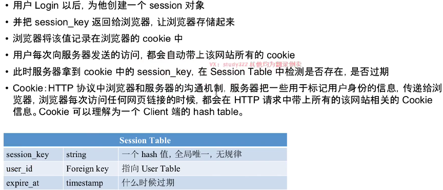

session 可以存在cache 中(小网站)、数据库中

#### Service 好友关系

单向关系

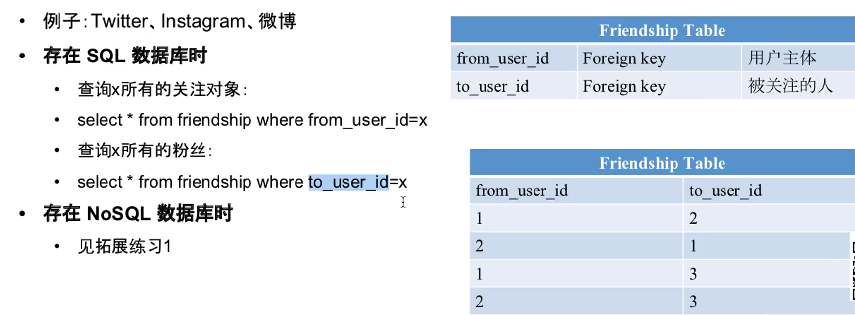

双向好友关系

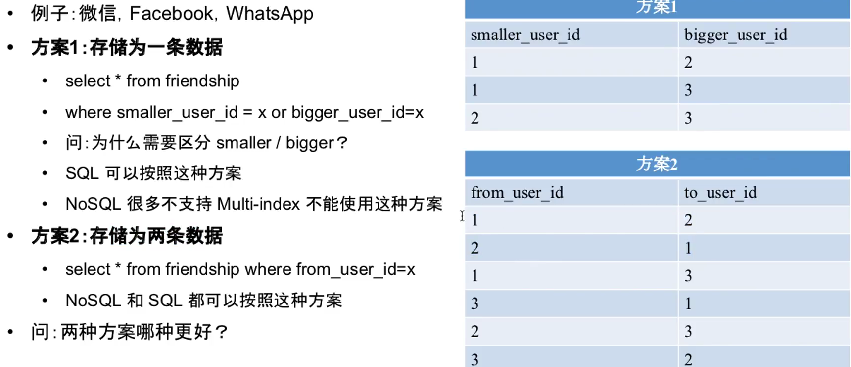

方案1 中使用大id和小id，防止数据重复存储。

方案1好处：

1. 节约存储，存在or查询，查询效率低

方案2好处:

1. 查询效率更高

一般使用方案2.

典型的NoSQL 数据库，如Cassandra 和 HBase，有三层结构

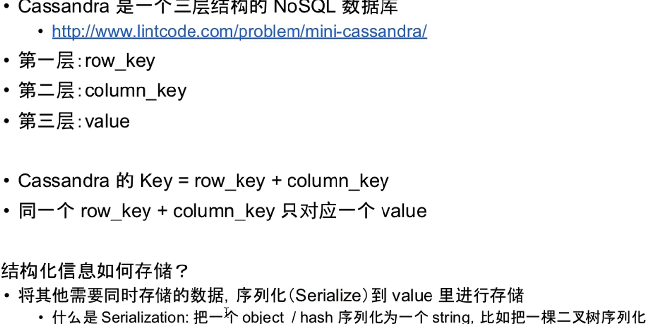

其中column 是一个范围，在查询的时候可以是`query(row_key, column_start, column_end)`

用户关系可以这么存储

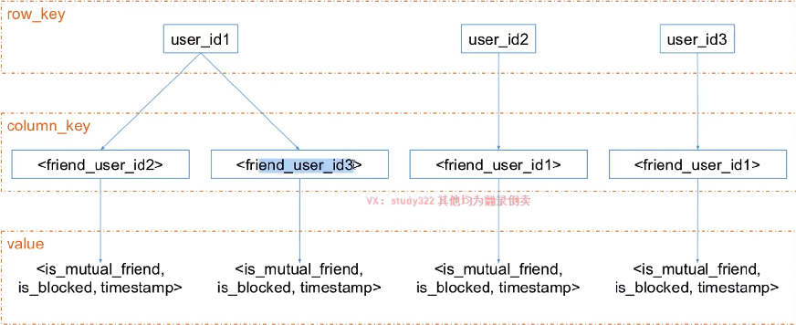

如果在column_key 中加入时间属性，那么就可以查询出最近x天关注的好友。

数据库选择原则：

1. 大部分情况下，用SQL或者NoSQL 都是可以的
2. 需要支持事务的话，不能选择NoSQL(大部分都不支持)
3. SQL结构化数据，自由创建索引，NoSQL 分布式、副本、扩展
4. 一般会使用多种数据库，不同表单数据放在不同的数据库中

大部分公司都使用SQL，历史原因。

friend ship 采用NoSQL，查询效率更高。

---

#### 拓展案例

##### NoSQL 存储单向好友关系

1. 查询某个人的关注列表
2. 查询某个人的粉丝列表
3. 查询A是否关注了B

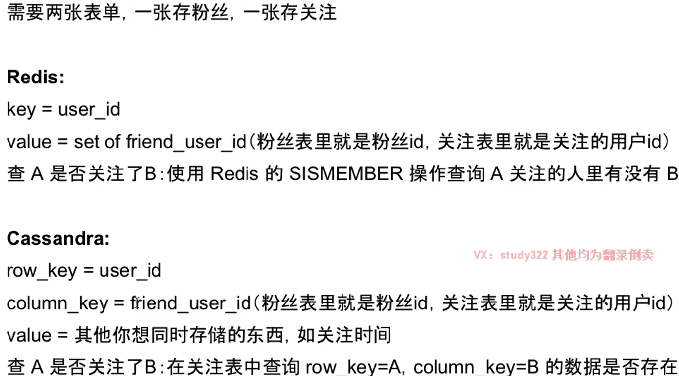

##### 使用NoSQL 存储 User

可以能够使用email、username、phone id 来检索用户

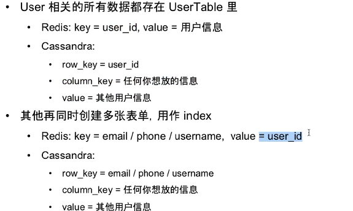

##### 共同好友

列出A和B之间的共同好友

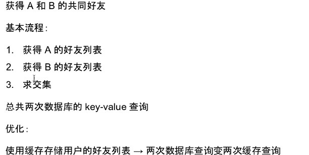

##### 6度关系

> 世界上的2个人，总可以通过6个人的关系而相互认识。

BFS 算法实现

