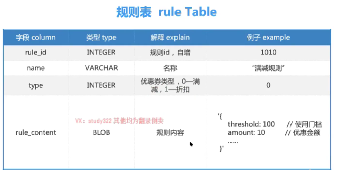

#### 场景

有哪些种类 

* 满减券：满20块钱，减10块钱
* 直减券：购买价格上直接减去10块钱
* 折扣券：购买价格上直接打5折

会限制使用此时，例如只能使用1次

核心流程

* 发券(商家创建并发送)
  * 同步发送：用户量少
  * 异步发送：用户量大
* 领券(用户侧)
  * 所用用户/部分用户/指定用户主动点击领取
  * 领取张数，一个人能够领几张
  * 自动将优惠券发给用户，用户一登录就能拿到
* 用券(用户侧)
  * 作用范围内才能使用，例如只能在01商店使用，只能在购买茅台酒的时候才能使用
  * 使用券的时候计算方式，判断券能不能使用，计算的时候券和券是否同时使用

#### 服务

触达服务，给用户通知发送优惠券，如给发送短信“xxx你有满20减10块的优惠券，快去使用啊”

#### 难点

分布式事务问题

控制发券，例如我要发送100张券，结果发了1000张

如何大批量的给用户发券

限制券的使用

防止重复领券

#### 存储

商家侧建券

商家给用户发券-简单同步方式

触达系统，通过第三方例如邮件服务、短信发送服务发送到达用户。

发券-大量复杂异步

商户超发，例如给用户发送一张券后，用户券表中插入一条数据，以及券批次表中券数量也要计算，这就存在事务，以及券超发，这时候就需要使用到分布式事务/事务

领券-主要控制用户有限次数的领取，校验优惠券余量、扣除余量。

##### 大流量问题

使用缓存

##### 消息队列大量异步处理：

特别大的请求量，先不要立马想着将这些请求处理掉，先把这些请求存储下来，然后在从存储下来的流程中，安装能够处理的速度一点点镜像处理。

