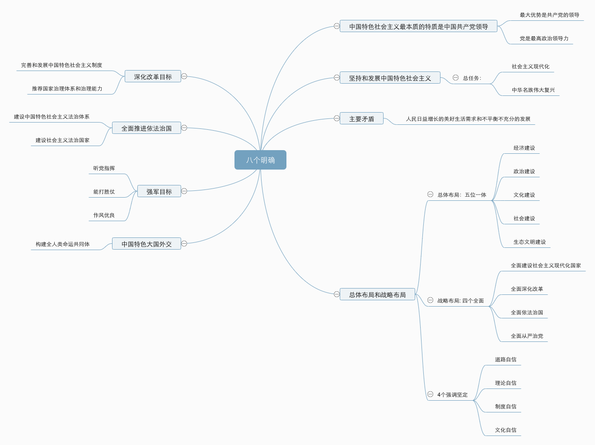

##### [问答题](https://www.hunanhr.cn/zhutijiaoyu/2019/0929/600308.html)

* 习近平新时代中国特色社会主义思想的**历史地位**是什么？

> 答：习近平新时代中国特色社会主义思想是对马克思列宁主义、毛泽东思想、邓小平理论、“三个代表”重要思想、科学发展观的继承和发展，是马克思主义中国化最新成果，
>
> 是党和人民实践经验和集体智慧的结晶，
>
> 是中国特色社会主义理论体系的重要组成部分，
>
> 是全党全国人民为实现中华民族伟大复兴而奋斗的行动指南。

* 习近平新时代中国特色社会主义思想的 “八个明确” 的内容是什么(**主要内容**)

是指导思想层面的表述，重点表述怎么看，回答新时代坚持和发展什么样的中国特色社会主义的问题

> 明确**中国特色社会主义最本质的特征是中国共产党领导**，中国特色社会主义制度的最大优势是中国共产党领导，党是最高政治领导力量，提出新时代党的建设总要求，突出政治建设在党的建设中的重要地位。
>
> 明确坚持和发展中国特色社会主义，**总任务**是实现社会主义现代化和中华民族伟大复兴，在全面建成小康社会的基础上，**分两步走**在本世纪中叶建成富强民主文明和谐美丽的社会主义现代化强国；
>
> 明确新时代我国社会**主要矛盾**是人民日益增长的美好生活需要和**不平衡不充分**的发展之间的矛盾，必须坚持以人民为中心的发展思想，不断促进人的全面发展、全体人民共同富裕；
>
> 明确中国特色社会主义事业**总体布局**是“五位一体、战略布局是 “四个全面，强调坚定道路自信、理论自信、制度自信、文化自信；
>
> 明确**全面深化改革总目标**是完善和发展中国特色社会主义制度、推进国家治理体系和治理能力现代化；
>
> 明确**全面推进依法治国总目标**是建设中国特色社会主义法治体系、建设社会主义法治国家；
>
> 明确党在新时代的**强军目标**是建设一支听党指挥、能打胜仗、作风优良的人民军队，把人民军队建设成为世界一流军队；
>
> 明确**中国特色大国外交要推动构建新型国际关系**，推动构建人类命运共同体；
>
> 
>
> 

* 新时代坚持和发展中国特色社会主义的**十四条的基本方略**是什么？(**14个坚持**)

> 坚持党对一切工作的领导
>
> 坚持以人名为中心
>
> 坚持全面深化改革
>
> 坚持新发展理念
>
> 坚持人名当家做主
>
> 坚持全面依法治国
>
> 坚持社会主义核心价值体系
>
> 坚持在发展中保障和改善民生
>
> 坚持人和自然和谐共生
>
> 坚持总体国家安全观
>
> 坚持党对人名军队的绝对领导
>
> 坚持一国两制和推动祖国统一
>
> 坚持推动构建人类命名共同体
>
> 坚持全面从严治党

* 中国特色社会主义进入新时代意味着什么

> 意味着近代以来久经磨难的中华名族迎来了**从站起来，富起来到强起来的伟大飞跃**，迎来了实现中华名族伟大复兴的光明前景，
>
> 意味着科学社会主义在21世纪的中国焕发出强大升级活力，在世纪上高高举起中国特色社会主义伟大旗帜，
>
> 意味着中国特色社会主义**道路、理论、制度、文化**不断发展，拓展了发展中国走向现代化途径，给世纪上那些既希望加快发展又希望保持自身独立性的国家和名族提供了全新选择，为解决人类问题贡献了中国智慧和中国方案。

* 五个更加自觉的主要内容是？

> 更加自觉的坚持**党的领导和我国社会主义制度**，坚决反对一切削弱、歪曲、否定党的领导和我国社会主义制度的言行。
>
> 更加自觉维护**人民利益**，坚决反对一切损害人民利益，脱离人名群众的行为
>
> 更加自觉投身**改革创新**时代潮流，坚决破除一切损害人民利益，脱离群众的行为
>
> 更加自觉**维护我国主权**、安全、安全、发展利益，坚决反对一切分裂祖国、破坏名族团结和社会和谐稳定的行为，
>
> 更加自觉第**防范各种风险**，坚决战胜一切在政治、经济、文化、社会等领域和自然界出现的困难和挑战

* 2个维护的主要内容

> 维护习近平总书记党中央的核心，全党的核心地位。
>
> 坚决维护党中央权威和集中统一领导。

---

#### 全面从严治党的知识要点

* 四个意识

> 政治、大局、核心、看齐

* 四个自信

> 道路、理论、制度、文化

* 四大考验

> 执政、改革开放、市场经济、外部环境

* 四自能力

> 自我净化、自我完善、自我革新、自我提高能力

* 俩学一做

> 学党章党规、学系列讲话、做合格党员

* 民主集中制“十六字” 方针

> 集体领导、明主集中、个别酝酿、会议决定

* 三会一课

> 支部党员大会、支部委员会、党小组会、党课

* 四个 “铁一般”

> 铁一般信仰、铁一般信念、铁一般纪律、铁一般担当

* 三严三实

> 严以修身、严以用权、演绎律己、谋事要实、创业要实、做人要实

* 四讲四有

> 讲政治、有信念、讲规矩、有纪律、讲道德、有品行、讲奉献、有作为

* 四个合格

> 政治合格、执行纪律合格、品德合格、发挥作用合格

* 党风廉洁建设 “两个责任”

> 党委**主体责任**和**纪委监督责任**

---

[一套习题](https://www.qqaiqin.com/article/120506.html)

1【单选题】习近平新时代中国特色社会主义思想被明确写入党章的日期是(2017-10-24)。

4【判断题】可以说,中共十九大最大的成就就是形成了习近平新时代中国特色社会主义思想。(对)

1【单选题】由基本矛盾派生的主要矛盾的特点是()。

A、居于主导地位

B、起核心作用

C、能支配其他矛盾发展的矛盾

D、以上都是

答案:D

4【判断题】中国社会的主要矛盾已经转化为人民日益增长的美好生活需要和不平衡不充分的发展之间的矛盾。(√)

5【判断题】中国社会主要矛盾的改变,也导致了中国社会主义所处历史阶段的判断。(×)

2【单选题】中共十九大的主题要回答的第一个问题是(旗帜)问题。

1【单选题】开启中国政治体制改革先声的是(邓小平)。

2【单选题】中国梦的第一要义是实现 (综合国力) 进一步跃升。

5【判断题】习近平总书记在2012年就第一次全面、深刻、系统地阐述了中国梦。(答案:x)

2【单选题】中国梦充满了 (和解共生) 的理念。

1【单选题】习近平指出,时代精神的核心是 (改革创新)。

A爱国主义

B自尊自强

C改革创新

D团结奋进

答案:C

1【单选题】以下关于中共十九大的说法中错误的是()。

A统揽三个伟大

B增强四个意识

C坚定四个自信

D推进五位一体

答案:A

3【单选题】中共十九大的两步走战略,对发展目标做出了( 原则性 )展望和要求。

A具体性

B数字性

C原则性

D硬性

答案:C

1【多选题】以下哪些选项属于习近平总书记提出的改革的几大关系。()

A解放思想和实事求是的关系

B整体推进和重点突破的关系

C顶层设计和摸着石头过河的关系

D胆子要大和步子要稳的关系

E改革发展稳定的关系

答案:ABCDE

2【判断题】改革为当代中国社会生产力发展无条件扫除了体制性障碍。(x)

1【单选题】中共十八届三中全会首次把 (国防和军队) 的改革作为全面深化改革的重要组成部分。

2【单选题】中国共产党推进全面**深化改革的根本目的**,就是要推进社会 (公平正义)。

3【判断题】人民立场体现了马克思主义辩证史观。(x)

4【判断题】发展的根本问题是,为谁发展,靠谁发展和发展成果有谁享有的问题。(√)

1【单选题】“新常态”一词是习总书记考察( 河南 )时指出而首次出现在公众视野。

2【多选题】习近平对“经济发展新常态”基本内涵的提炼,体现在(速度、结构。动力)几个关键词。

A速度

B结构

C创新

D动力

答案:ABD

1【单选题】十八届五中全会提出了新的坚持以人民为中心的发展理念,其中不包括()。

A创新 B开放 C绿色 D互利

答案:D

3【判断题】目前,我国要力图从需求方着手进行政策实施。(x)

4【判断题】习近平指出科学发展是解决我国一切问题的基础和关键。(√)

1【单选题】我国发展不协调的主要表现是()。

A城乡二元结构和城市内部二元结构的矛盾突出

 B区域发展不平衡 

C社会文明程度和国民素质与经济社会发展的水平不匹配

 D以上都是

答案:D

1【单选题】建设现代化经济体系,需要建设 (多元平衡、安全高效) 的全面开放体系。

A多元平衡、安全高效

B多元平衡、协调联动

C协调互补、安全高效

D多元平等、竞争有序

答案:A

1【单选题】中国共产党的本质属性是先进性和纯洁性。

2【单选题】立法权高于行政权和司法权,“议行合一”的是()。

A人民代表大会制度

B总统制

C议会制

D君主制

答案:A

1【单选题】社会主义核心价值观中,最深层、最根本的是( 爱国主义 )。

2【单选题】社会主义荣辱观是社会主义核心价值体系的( 基础 )。

3【多选题】践行社会主义核心价值观,要坚持以人为本,与群众的思想做到()。

A贴近性

B对象化

C日常化

D接地气

答案:ABD

4【判断题】社会主义核心价值观的践行,需把教育引导作为其基础性的工作。(√）

3【单选题】习近平强调,我们必须把意识形态工作的( 领导权、管理权、话语权 )牢牢掌握在手中。

1【单选题】习近平指出目前国内文艺创作方面存在的问题,不包括( 有“高峰”缺“高原” )。

A有数量缺质量的现象

B有“高峰”缺“高原”

C抄袭模仿的问题

D“快餐式”消费的问题

答案:B

答案:D2【单选题】繁荣发展社会主义文艺,必须将中国精神作为社会主义文艺的( 灵魂 )。

3【单选题】推进新时代社会主义文化强国建设,要把弘扬中华优秀传统文化作为文化建设的( 基础 )。

1【多选题】中共十八大以来,党中央把( 民生工作,社会治理  )作为社会建设的两大根本任务。

3【判断题】推动社会发展的根本目的是保障和改善民生。(√)

3【多选题】我国教育发展的指导方针——“四个服务”,分别是()。

A为人民服务

B为中国共产党治国理政服务

C为巩固和发展中国特色社会主义政党地位服务

D为改革开放和社会主义现代化建设服务

答案:ABD

2【单选题】( 就业 )是最大的民生。

1【单选题】习近平指出,对人民内部矛盾,要善于运用( 法治 )、民主和协商的办法进行处理。

5【判断题】社会和谐是中国特色社会主义的本质属性。()

答案:√

**战略重点—坚决打赢脱贫攻坚战**

2【单选题】习近平强调,坚持总体国家安全观,必须坚持国家利益至上,以人民安全为( 宗旨 )。

1【单选题】我国生态环境保护中存在的突出问题,大都与()有关。

A体制不完善

B机制不健全

C法制不完备

D以上都是

答案:D

3【多选题】推进“一带一路”建设的基本原则是(共商 共建 共享

3【判断题】党外监督在党和国家各种监督形式中是最基本的。(x

习近平首次提出 “中国方案” 是在2014年3越在德国柏林发表的演讲中指出的。

2016年1越29 十八届中央政治局第三十次集体学习强调指出 “创新、协调、绿色、开发、共享的理念”

我国的政体是：**人民代表大会制度**

依法治国是党领导人名治理国家的**基本方式**

2018 年 十九大报告指出，从2020年到2035年，在全面建成小康社会的基础上，在奋斗5年，基本实现社会主义现代化。

十九大将习近平新时代中国特色社会主义思想写入党章

完善和落实民主集中制的各项制度，坚持 **明主基础上的集中** 和 **集中指导下的名主** 向结合，即重复发杨名主，又善于集中统一。

我国的国体是工人阶级领导的，以工农联盟为基础的人民名主专政的社会主义国家

中国特色社会主义法治道路的核心要义，就是要坚持（ 党的领导），坚持（中国特色社会主义制度 ），贯彻中国特色社会主义法治理论。

解决全球 “和平赤子、发展赤子、治理赤子” 的中国方案是推动构建新型国际经济政治新秩序的形成，推动构建人类命运共同体。

**邓小平** 为坚持和发展中国特色社会主义确定了基本思路和基本原则

习近平新时代特色社会主义思想以全新的事业深化了对人类社会发展规律/共产党执政规律/社会主义建设规律 的认识，开辟了发马克主义中国话的新境界。

