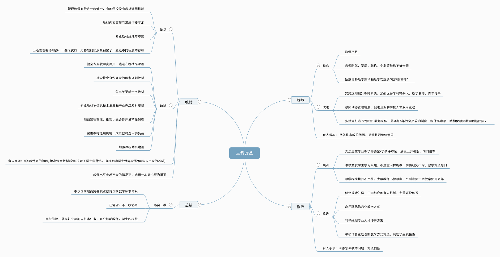
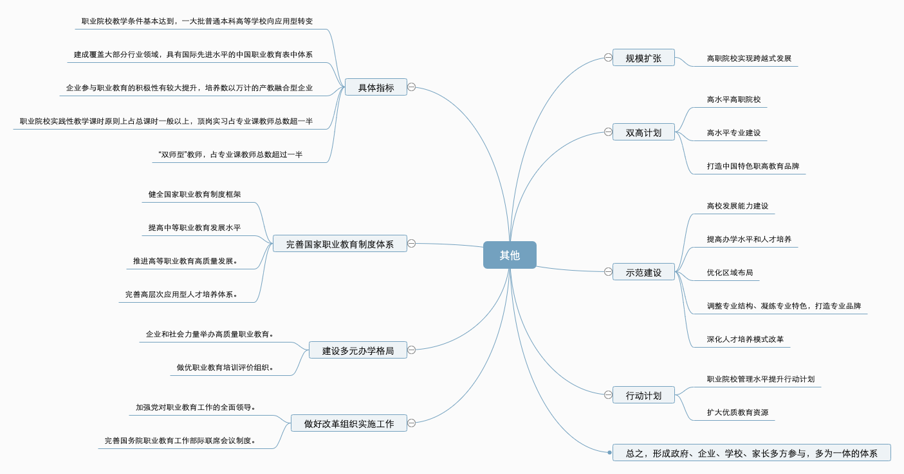

[文章来源](http://www.gov.cn/zhengce/content/2019-02/13/content_5365341.htm#)

​		**随着我国进入新的发展阶段，产业升级和经济结构调整不断加快**，各行各业对技术技能人才的需求越来越急迫，职业教育的重要地位和作用越来越凸显，和建设现代化经济体系，而现在国职业教育还存在**体系建设不够完善、职业技能实训基地建设尚待完善(三教中的教法，设施不够齐全)，办学和人才培养质量水平参差不齐(三教中的教师)**等问题，已经到了必须下大力气抓好的时候。

##### 总体要求

​		**将职业教育摆在教育改革创新和经济社会发展中更加突出的位置**，牢固树立新发展理念，对接科技发展趋势和市场需求，完善职业教育和培训体系，优化学校、专业布局，以促进就业和适应产业发展需求为导向，鼓励和支持社会各界特别是企业积极支持职业教育，培养高质量技术技能人才，**经过 5- 10年，职业教育基本完成由举办为主向政府统筹管理、社会多元办学的格局转变，专业特色鲜明的类型教育转变，为促进经济社会发展和提高国家竞争力提高优质人才资源支撑。**

##### 具体指标

1. 职业院校教学条件基本达到，一大批普通本科高等学校向应用型转变
2. 建成覆盖大部分行业领域，具有国际先进水平的中国职业教育表中体系
3. 企业参与职业教育的积极性有较大提升，培养数以万计的产教融合型企业
4. 打造一批优秀职业教育培训评价组织，以及高水平专业化产教融合实训基地
5. 职业院校实践性教学课时原则上占总课时一般以上，顶岗实习占专业课教师总数超一半
6. “双师型”教师（同时具备理论教学和实践教学能力的教师）占专业课教师总数超过一半
7. 从2019年开始，在职业院校、应用型本科高校启动“学历证书+若干职业技能等级证书”制度试点（以下称1+X证书制度试点）工作。

##### 完善国家职业教育制度体系

* 健全国家职业教育制度框架
* 提高中等职业教育发展水平
* 推进高等职业教育高质量发展。
* 完善高层次应用型人才培养体系。

##### **构建职业教育国家标准**

* 完善教育教学相关标准。
* 启动1+X证书制度试点工作。
* 开展高质量职业培训。
* 实现学习成果的认定、积累和转换。

##### **促进产教融合校企“双元”育人**

* 坚持知行合一、工学结合。
* 推动校企全面加强深度合作。
* 打造一批高水平实训基地。
* 多措并举打造“双师型”教师队伍。

##### 建设多元办学格局

* 推动企业和社会力量举办高质量职业教育。
* 做优职业教育培训评价组织。

##### **完善技术技能人才保障政策**

* 提高技术技能人才待遇水平。
* 健全经费投入机制。

##### **加强职业教育办学质量督导评价**

* 建立健全职业教育质量评价和督导评估制度。
* 支持组建国家职业教育指导咨询委员会。

##### **做好改革组织实施工作**

* 加强党对职业教育工作的全面领导。
* 完善国务院职业教育工作部际联席会议制度。

