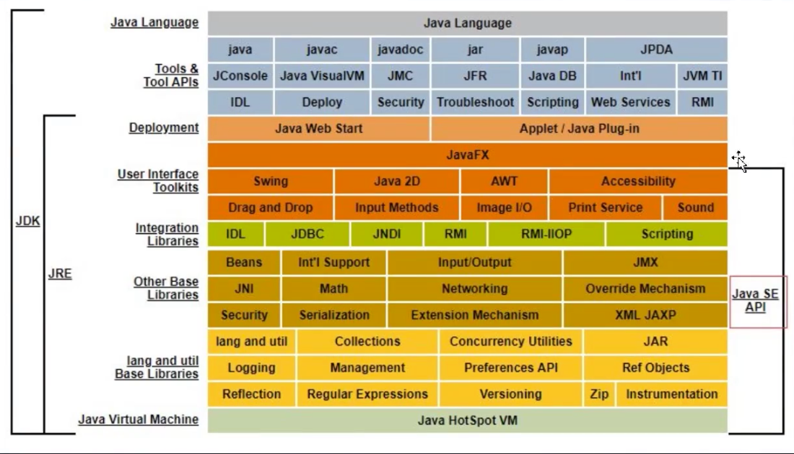

JRE:  Java Runtime Env Java 运行时环境，就是Java 运行时候所需要的类库IO、网络等

JVM: java 虚拟机

---

Java  实现跨平台使用

> JVM 虚拟机，屏蔽了操作系统直接的差异，不同 版本的版本的JVM将Java  代码生成对应的操作系统的机器码

---

当执行Java代码，就是将java 代码扔到Java 虚拟机中去运行。经过几个过程

1. 运行代码
2. 类装载子系统： 将字节码文件加载到JVM 的内存区域(运行时数据区)
3. 字节码执行引擎，执行代码

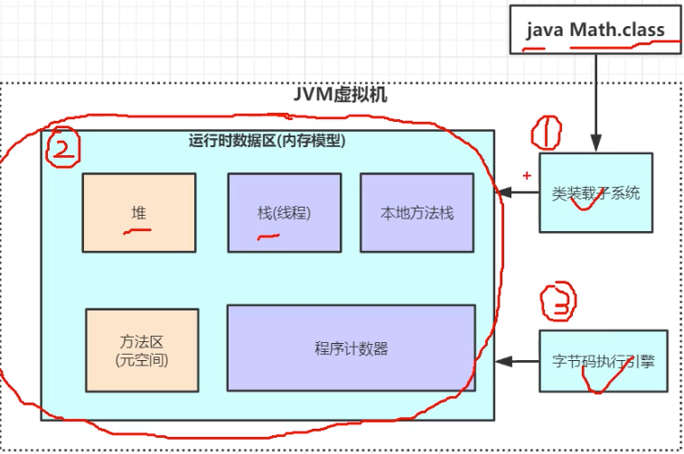

---

#### JVM 内存区域

---

##### 栈

> 存放临时变量，是线程栈，Jvm 给 每个执行的线程从总的栈中分配出来一个内存区域，存放该线程的局部变量

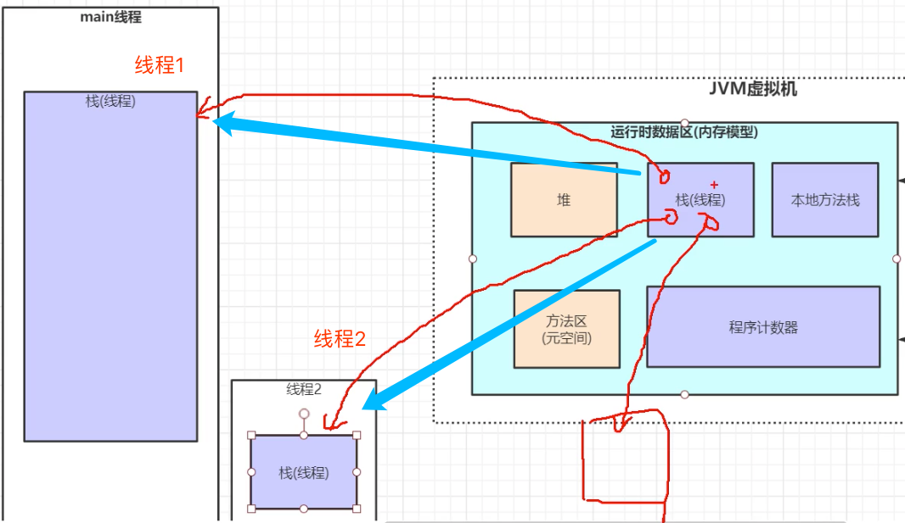

##### 栈帧

在调用每一个方法的时候，在线程栈内存中在开辟一个栈帧的内存，用来存放当前调用的方法以及和方法相关的局部变量等信息

```java
public class aa {

    public static final int initData  = 666;
    public static User user = new User();

    public int compute() {
        int a = 1;
        int b = 2;
        int c = (a + b) * 10;
        return c;
    }
}
```

如这里在执行main 方法的时候，首先在线程栈开辟一个栈帧用来存放main 方法，以及其中的局部变量 aa 等,还有其他的东西，然后在调用 `aa.compute()` 方法的时候，然后在开辟一个栈帧存放 `compute()` 方法以及其中的局部变量，其中整体的数据结构是栈结构的其实FILO的。

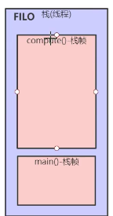

将上述的代码进行 javap 反编译 `javap -c aa.class >> aa.txt` 文件内容

```java
Compiled from "aa.java"
public class aa {
  public static final int initData;

  public aa();
    Code:
       0: aload_0
       1: invokespecial #1                  // Method java/lang/Object."<init>":()V
       4: return

  public int compute();
    Code:
       0: iconst_1 // 操作1， 产生一个操作数1，将其压到操作数栈中
       1: istore_1 // 将 1 存储到局部变量 1，这里两步骤完成代码中的 int a = 1;
       2: iconst_2
       3: istore_2 // 和 上面的一样
       4: iload_1  // 局部变量1 load 到操作数栈
       5: iload_2  // 局部变量2 load 到操作数栈
       6: iadd     // 依次从 操作数栈 中pop2个元素，完成相加
       7: bipush        10 // 10 压入到操作数栈
       9: imul      // 依次将操作数栈中的2个元素弹出，完成乘法
      10: istore_3  // 然后结算结构存储在 局部变量 c
      11: iload_3   // 
      12: ireturn

  public static void main(java.lang.String[]);
    Code:
       0: new           #2                  // class aa
       3: dup
       4: invokespecial #3                  // Method "<init>":()V
       7: astore_1
       8: aload_1
       9: invokevirtual #4                  // Method compute:()I
      12: pop
      13: return
}
```


先给局部变量中分配一块空间：

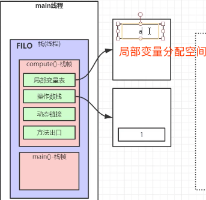

然后将操作数栈中的值放到局部变量

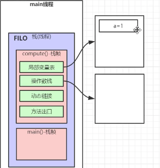

然后b 的操作和上述 a 的操作是一样的

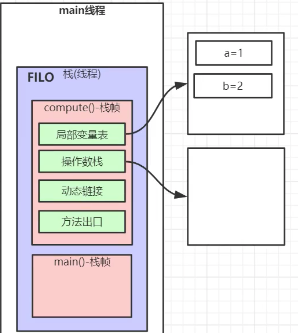

这里使用到程序计数器，程序计数器就是记录指向当前正在运行的程序的位置(这里的位置就是在上面反编译代码中的最左侧的行号)

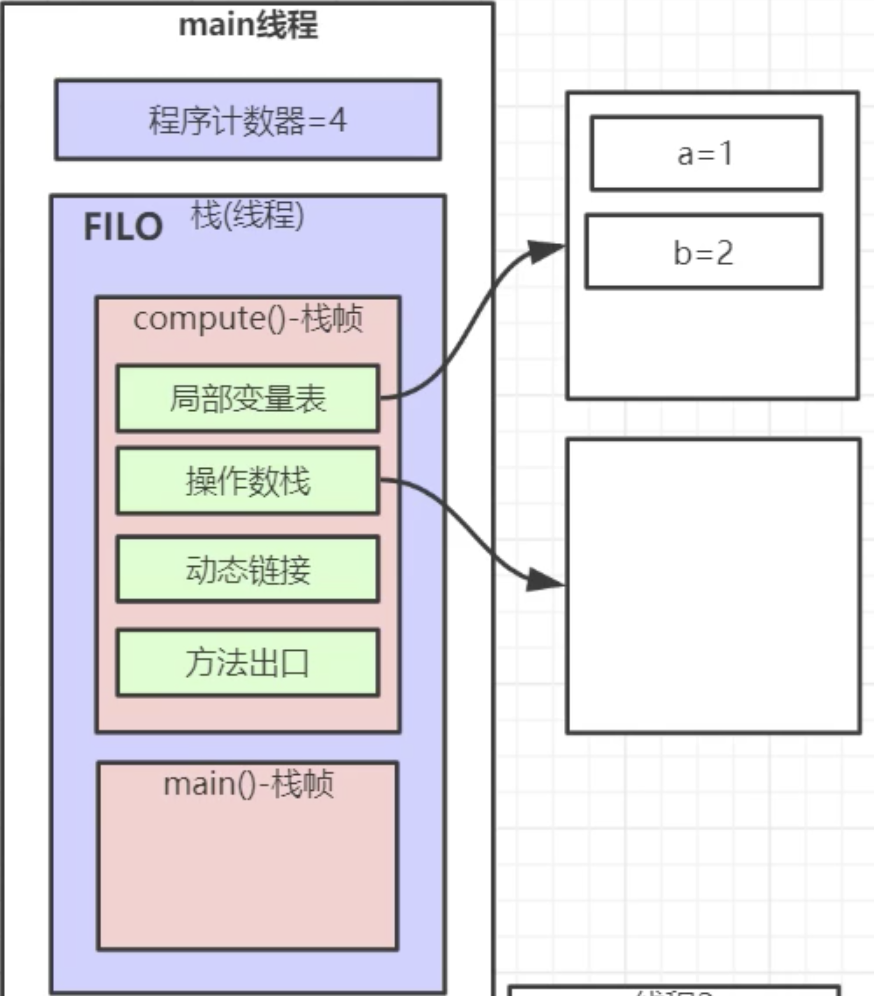

设计程序计数器存放当前代码运行的位置，是为了处理多线程，假如说当前的程序执行到4这个位置，然后执行资源被另外一个线程抢走了，当另外一个线程执行完之后，在去执行当前线程，那么当前线程因为有程序计数器，当前线程是知道从哪里继续执行下去。

字节码执行引擎负责执行代码，在字节码执行引擎中会动态的修改程序计数器

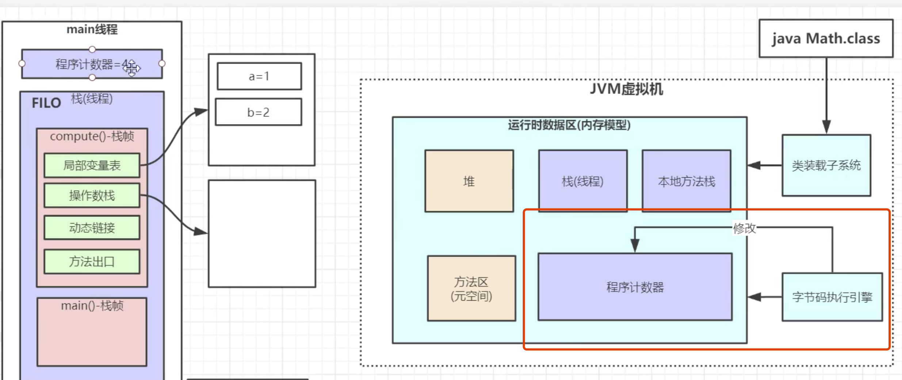

程序接下来完成的事情： `6: iadd     // 依次从 操作数栈 中pop2个元素，完成相加, 然后将运算结构在压回操作数栈`

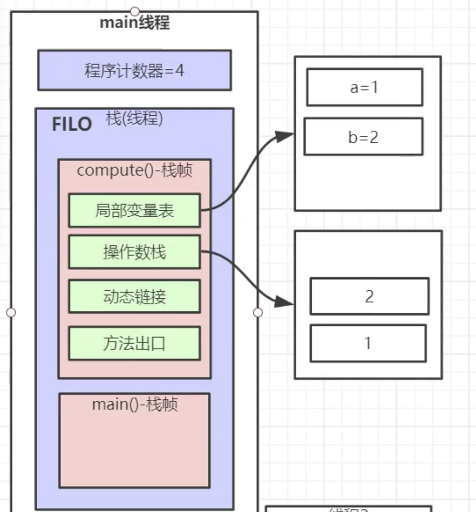

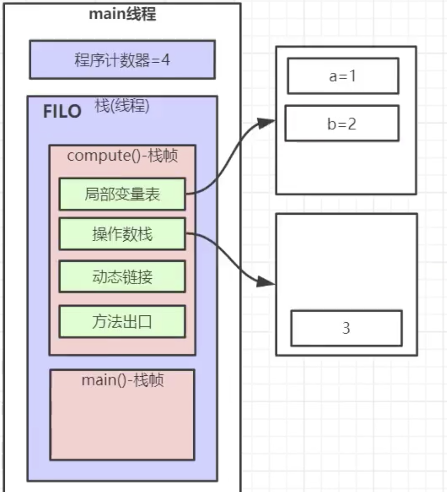

**操作数栈**:

> 就是程序在执行过程中，存放临时值的区域，其数据结构也是栈

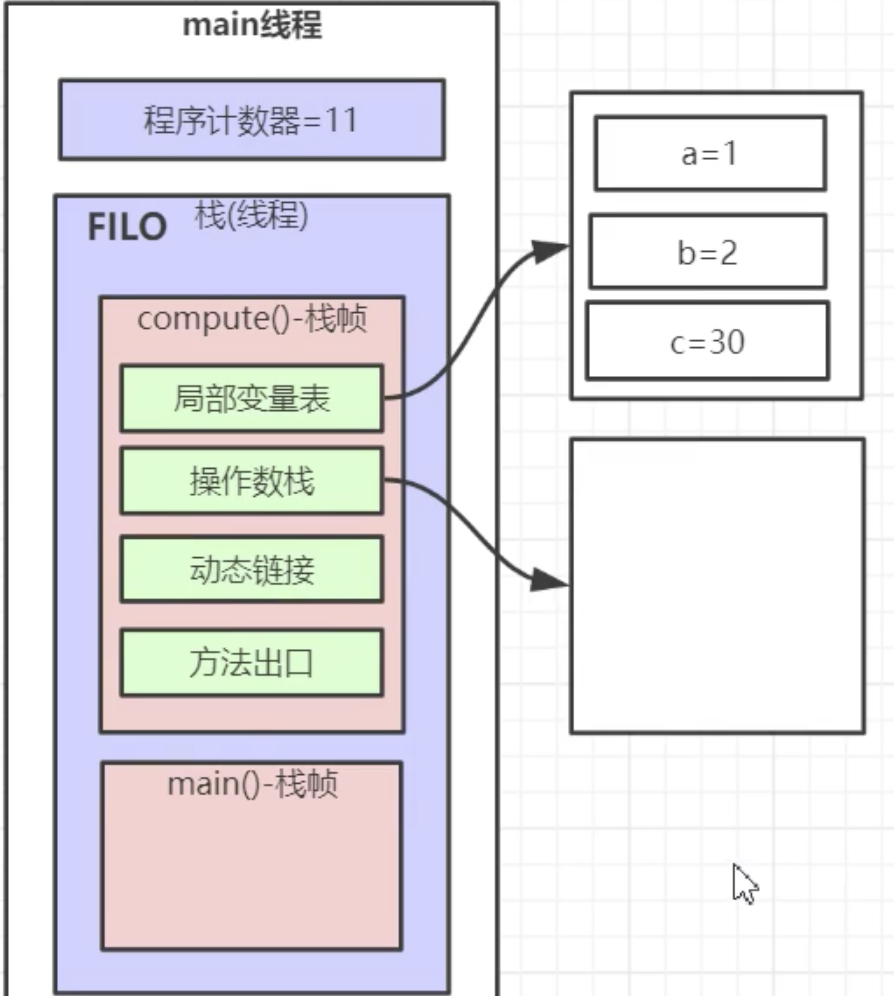

方法出口：

> ```java
>     public static void main(String[] args) {
>         aa aa = new aa();
>         aa.compute();
>         System.out.println();
>     }
> ```
>
> 记录的是当前栈帧结束之后，返回到第3行代码，这个时候到了main 栈帧，这个时候是应该指向第4行代码，而不是第2行代码，方法出口就是记录这个东西的

在main 方法栈帧中，new 出了一个对象，这个对象存放在了堆中，然后在栈中就有一个指针指向了这个堆中的对象

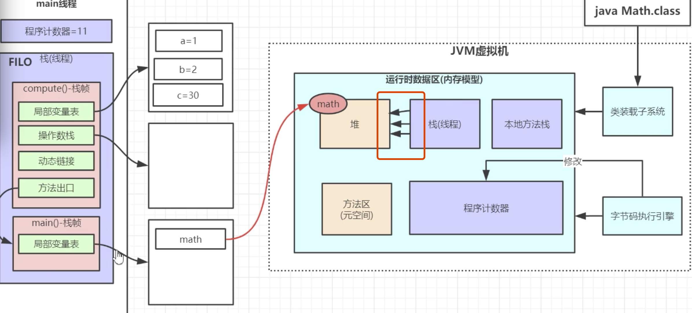

方法去在jdk1.8之后移除到jvm了，它是使用了直接内存，也就是电脑的物理内存,课程中将方法去放置到jvm中纯粹是为了好看。

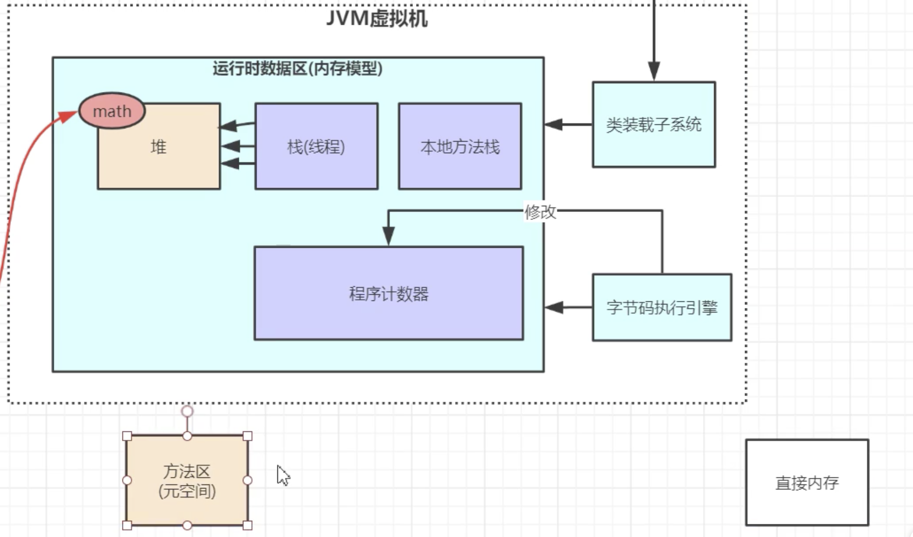

存放的东西是一些常量池、静态变量、类元信息(类信息)，栈中也有指针指向了元空间

```java
    public static final int initData  = 666;
    public static User user = new User();
```

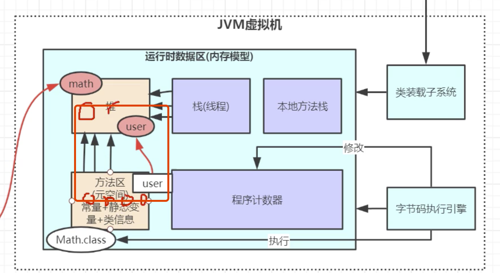

**本地方法栈**：java 去操作系统找C 原因函数库中掉函数，这些调用系统函数的Java 函数是有 `native` 修饰词修饰

**以上蓝色的部分是每个线程独有的，黄色是所有线程共享的**

---

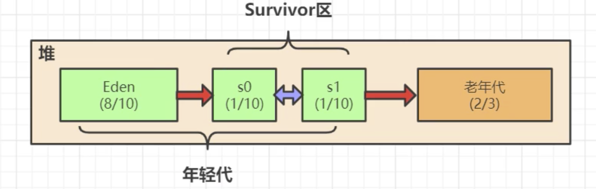

堆又分为是**年轻代(1/3堆内存)**和**老年代(2/3堆内存)**

在年轻代中将内存按照 8:1:1分为Eden，和S0，S1 区域，程序中new 出来的对象，会先全部都在Eden，然后后续会触发垃圾回收器，然后对象会被回收，或者进入老年带。整个过程会是这样的。

**GC**

> **可达性分析算法**会从 **GC root**开始，从这些起点搜索引用的对戏，找到的对戏都标记为**非垃圾对象**，其未标记的对象都是垃圾对象。
>
> **GC root**: 的根节点就是**线程栈的本地变量，静态变量，本地方法栈的变量**

如下图，从本地方法栈中的对象开始，按照引用一直找下一个引用的对象，直到没有在被引用的变量位置，就这一连串的对象都会标记为非垃圾对象，而没有在这些本地方法栈中对象的引用链上的对象都会被标记为垃圾对象，

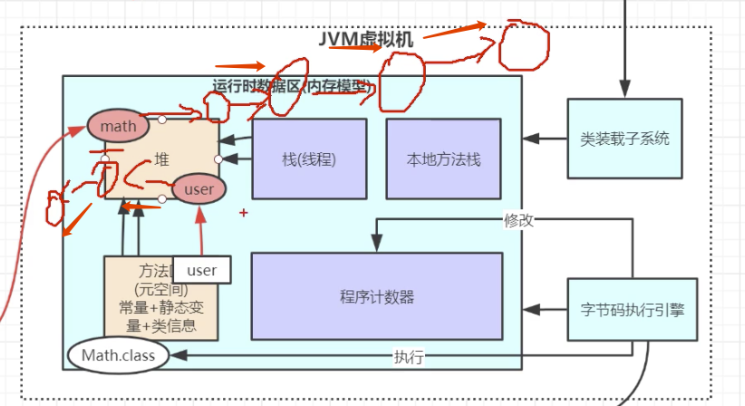

一次性将这些非垃圾对象移走到 s0区域，然后将Eden 区域中标记了垃圾对象的对象一次性全部删除

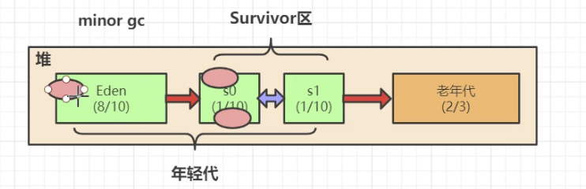

并不是说多久会清理一次，而是当被放慢了的时候就触发清理。

然后在s0区域也会触发和上面一样的垃圾回收过程。一些对象被清理掉或者移到了s1区域

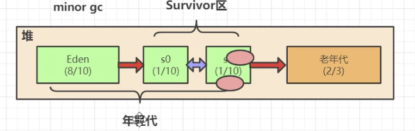

这里有一个感念**分代年龄**，当一个对象在一次的GC过程没有被干掉，那么它的分代年龄就 +1，

那些怎么杀都杀不死，一直存活的对象，最终会防止到老年代中去。

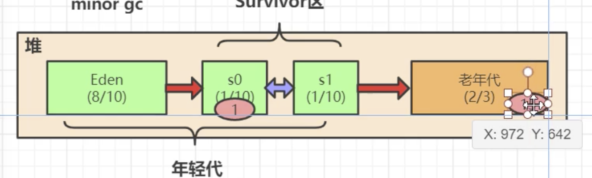

```java
import java.util.ArrayList;
public class aa1 {
    byte[] a = new byte[1024 * 10]; // 100kb
    public static void main(String[] args) throws InterruptedException {
        ArrayList<aa1> list = new ArrayList<>(); // RC root 变量
        
        while (true) {
            list.add(new aa1()); // GC root 变量引用链中的对象，这些对象是一直回收不了的
            Thread.sleep(10);
        }
    }
}
// 程序运行最终会内存溢出
```

执行该程序，然后使用 jvisualvm


代码初始阶段，继续运行

当伊甸园区内存将下来的时候，是对象全部都移到了s0区域，而s0区域降下了了，对象全部移到了s1区域，而s1区域降下来，对象都移到了老年代去了。

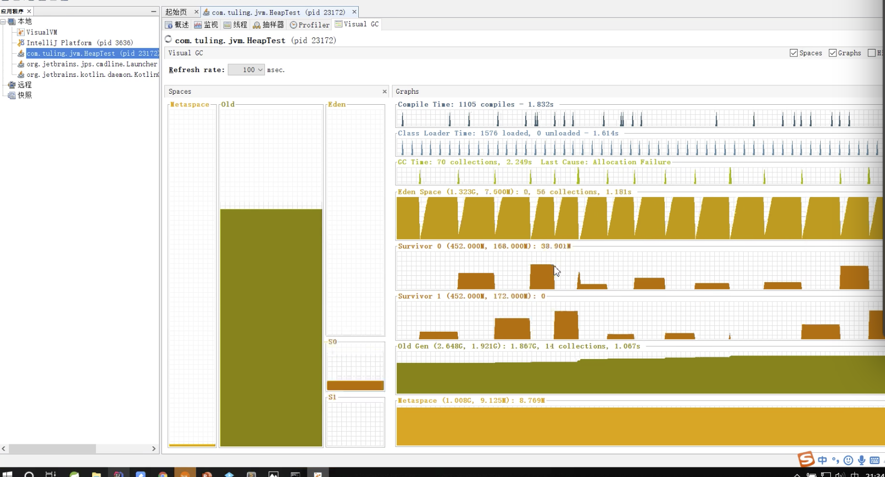

当老年的内存全部都慢了的时候，就会触发 full GC

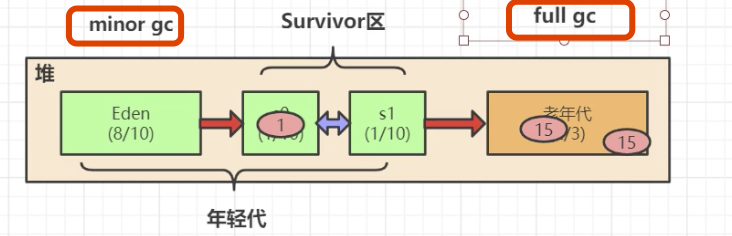

当老年代的数据回收不了，但是还会往进去放对象，那么最后就会 **outOfMemoryError**

---

JVM 调优的目的

> **减少STW，减少GC 次数**
>
> Java 虚拟机在进行 GC 的是会使得用户线程的工作全部停止。

**为什么需要STW(Stop the world)**

> 看看如果没有使用 stw 会发生什么
>
> 假设现在使用可达性分析分析出一个应用链，红色箭头所示，
>
> 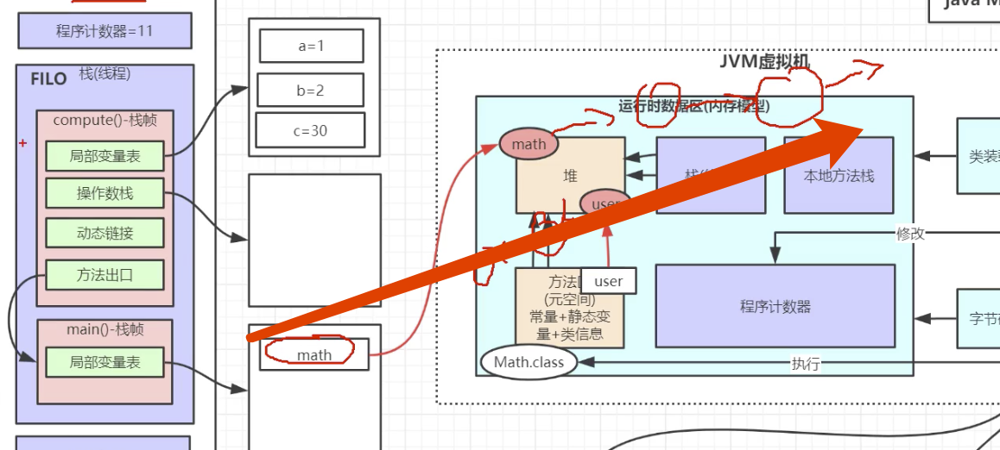
>
> 这个时候还没有触发GC，由于没有STW，这个时候如果发生了程序停止了，也就是 math 的指针断了，但是GC 还并不知到，之前判断的这条链上的镀锡并不是垃圾的对象，现在由于程序停止，指针断了，这条链上的所有对象都变成了垃圾，这就给程序的垃圾回收带来了很大的混乱，而如果要将这些垃圾回收，那么需要在进行一次可达性分析，一个JVM中会有成千上万的GC root，里面的场景就变的异常的复杂。之前收集的非垃圾对象，变成了垃圾对象，如果要收集这些垃圾，那么又要去进行可达性分析这个过程，而这个过程中又不知道会发生什么事情。
>
> 基于此出现了STW，STW的出现，会将上述的场景边的非常的简单。

---


